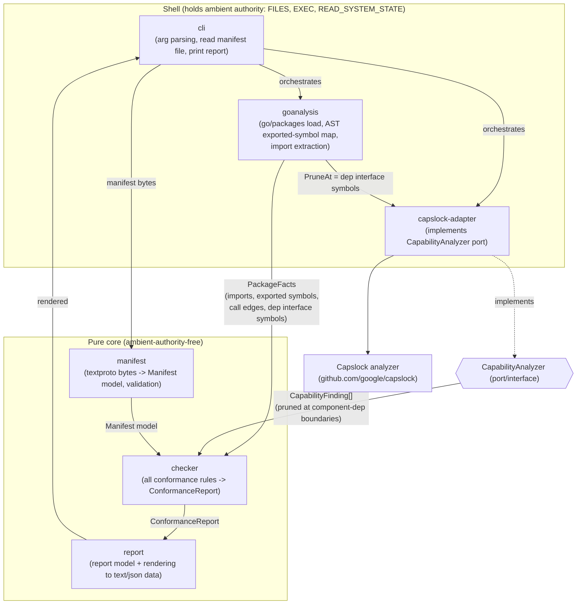
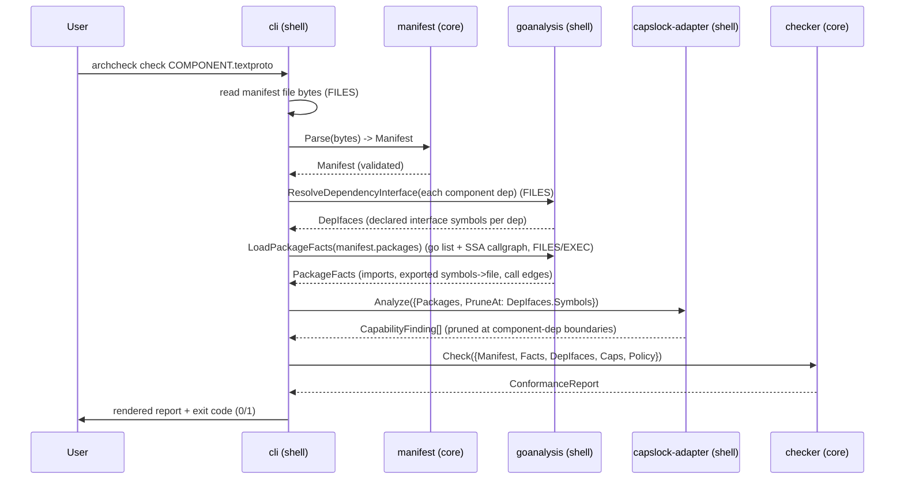

# Detailed Design — Architectural Contracts MVP (Go)

> **Status: finalized for review.** All major requirements decisions are
> user-confirmed: Capslock-as-library (Q1), component = package-pattern set (Q2),
> **strict capability policy by default, parameterized** (Q3), **textproto**
> manifests (Q4), and **`./go` as its own Go module** (Q5). Component→component
> boundary enforcement and capability pruning (FR5/FR5b) are designed in per the
> Round-3 directive. Remaining open items are minor and non-blocking (Appendix D).
> This document is standalone; it does not require reading the other project files.

## 1. Overview

This project prototypes the "architecture as code" idea from
`rationale-and-concepts.md`: a component's **structure** (its interface, its
private implementation, and its dependencies) and its **ambient authority** are
recorded in a small, machine-readable **manifest**, and a **conformance checker**
mechanically verifies that the Go code matches the manifest. When the structure
of the code changes in a way that violates the manifest, the check fails — forcing
the architectural change to surface as an explicit edit to the manifest.

The MVP implements **Pillar 1 (Architecture as code)** and **Pillar 3 (Ambient
authority)** for **Go**, with authority constrained to the strongest case:
**ambient-authority-free** components (they declare — and provably use — no ambient
authority). Contracts (Pillar 2) are informal prose in interface-file comments and
are *not* mechanically checked. Data-flow (Pillar 4) is out of scope.

The deliverable is a **CLI** you run against a component manifest; it reports
whether the code conforms. The tool is itself decomposed into components with
manifests (self-hosting), and ships with example Go projects that demonstrate both
conforming and non-conforming components.

## 2. Detailed Requirements

Consolidated from `idea-honing.md` and the rough idea.

### 2.1 Functional requirements

- **FR1 — Manifest.** A component is described by a machine-readable manifest that
  declares: the component's **name**, the **Go packages** that constitute it (by
  import-path pattern/list), the **interface files** (the `.go` files that hold its
  public surface), its **component dependencies** and **absorbed (impl-detail)
  dependencies**, and its **declared ambient authority** (MVP: empty).
- **FR2 — Conformance CLI.** A CLI takes a manifest and reports pass/fail with
  actionable violations. Exit code `0` = conforms, `1` = violations found, `2` =
  tool error. Human-readable output by default; `--format=json` for machine use.
- **FR3 — Pillar 1: dependency conformance.** Every non-stdlib import of the
  component's packages must be permitted by the manifest, i.e. belong to a declared
  component dependency's interface packages or a declared absorbed dependency.
  Undeclared imports fail conformance. (Stdlib imports are governed by Pillar 3,
  not this check — see §5.2.)
- **FR4 — Declared interface = interface-file exports.** A component's **declared
  interface** is the set of exported top-level symbols (funcs, exported methods on
  exported types, types, vars, consts) declared in files listed as `interface_files`.
  A symbol that is Go-exported but declared *outside* the interface files is
  **architecture-private**: it may be used for cross-package composition *within*
  the component, but it is not part of the component's contract.
- **FR5 — Cross-component interface boundary (Pillar 1, strong form).** No code
  **outside** a component may call that component's architecture-private symbols;
  equivalently, when component A depends on component B, every call edge from A into
  B must land on one of **B's declared interface symbols** — never on a symbol that
  is merely language-level public. This one graph property, seen from B's side, is
  "private-implementation protection"; seen from A's side, it is "only call declared
  interfaces." (Within a single package, Go visibility already enforces the
  unexported part for free; this FR adds the exported-but-not-declared part and the
  cross-package/cross-component part.)
- **FR5b — Pillar 3: capability-attribution pruning at component boundaries.** When
  analyzing component A's ambient authority, the call-graph traversal is **pruned at
  each direct component dependency's declared interface symbols**. Authority
  exercised *inside* a dependency's implementation is attributed to the
  **dependency** (and governed by *its* manifest), not to A. This is what makes a
  **component dependency** differ from an **absorbed dependency**: component deps are
  pruned (authority not absorbed); absorbed deps are not pruned (authority absorbed
  and surfaced by A). Soundness is **compositional**: pruning trusts each
  dependency's declared contract, and the whole graph is sound iff every component
  independently conforms.
- **FR6 — Pillar 3: ambient-authority-free enforcement.** Using Capslock's
  transitive call-graph capability analysis, the component's packages must exercise
  no ambient authority beyond what a **capability policy** allows. The checker is
  parameterized by that policy (`allowed` + `warn` capability sets); the policy's
  `allowed` set is sourced from the manifest's `declared_authority`. **MVP default
  is strict:** `declared_authority` is empty and `warn` is empty, so **any**
  capability finding — true-authority *or* analysis-defeating — fails conformance.
  Non-default policies (e.g. "true fails, analysis-defeating warns", or a per-
  manifest allow/warn list) are expressible through the same parameter and are the
  extension path to configurable-per-manifest.
- **FR7 — Absorption.** A third-party/internal package used purely as an
  implementation detail is declared as an **absorbed dependency**: it needs no
  manifest, and its transitive use of ambient authority is **absorbed into and
  surfaced by** the absorbing component (this is automatic — Capslock attributes a
  dependency's capabilities to the caller). A **component dependency**, by
  contrast, is a first-class architecture edge to another manifested component that
  accounts for its own authority behind its contract.
- **FR8 — Self-hosting.** The tool's own Go code is decomposed into components,
  each with a manifest, and the checker can be run on itself. At least the pure
  checking core is ambient-authority-free.
- **FR9 — Examples.** A small multi-component example Go project (a CSV "top row by
  column" tool) demonstrates a passing ambient-authority-free component and a
  failing (undeclared-authority or undeclared-dependency) component.

### 2.2 Non-functional / structural requirements

- **NFR1 — Multi-language-ready layout.** Go-specific tooling lives under `./go`;
  the manifest schema and shared assets live in a shared location so a future Rust
  toolchain can reuse them.
- **NFR2 — Protobuf.** The manifest schema is defined in Protocol Buffers.
  Manifests are authored as `.textproto` files (Q4).
- **NFR3 — Bazel-ready.** The manifest's dependency and interface-file fields must
  be plain lists a future `go_architectural_component` Bazel rule can populate
  mechanically. (Bazel integration itself is out of scope for the MVP.)
- **NFR4 — Capslock as a library.** Capslock is consumed as a Go library behind a
  small internal `CapabilityAnalyzer` port (Q1), keeping the checker core
  decoupled and testable.

### 2.3 Out of scope (MVP)

Verified/formal contracts (Pillar 2); data-flow & privacy (Pillar 4); the Bazel
rule; non-empty declared authority and the capability box (§5.4(b) of the concept
doc); cross-package private-impl enforcement; languages other than Go.

## 3. Architecture Overview

The tool is split into a **pure core** (ambient-authority-free) and an
authority-holding **shell**. The shell loads all facts from the world (files,
`go list`, Capslock) and hands plain data to the core, which decides conformance.
This split is both good design and the centerpiece of the self-hosting demo.



Data flows one way into the core; the core calls nothing that touches the world.
The `CapabilityAnalyzer` port is defined in the core; its Capslock-backed adapter
lives in the shell.

### 3.1 End-to-end sequence



## 4. Components and Interfaces

Each of the tool's own components gets a manifest (self-hosting). Working import
root: `github.com/xtofian/architectural-contracts/go` (adjust to the real module
path). Component boundaries and their authority:

| Component | Package(s) | Role | Ambient authority |
|---|---|---|---|
| `manifest` | `.../internal/manifest` | Parse+validate manifest bytes → model | none (pure) |
| `checker` | `.../internal/checker` | All conformance rules → report | none (pure) |
| `report` | `.../internal/report` | Report model + render-to-string data | none (pure) |
| `capanalyzer` (port) | `.../internal/capanalyzer` | `CapabilityAnalyzer` interface + finding types | none (pure) |
| `goanalysis` | `.../internal/goanalysis` | `go/packages` load; AST/imports extraction; SSA call-graph → cross-component call edges; resolve component-dependency manifests → declared-interface symbol sets | FILES, EXEC, READ_SYSTEM_STATE |
| `capslockadapter` | `.../internal/capslockadapter` | Capslock-backed `CapabilityAnalyzer` | FILES, EXEC, READ_SYSTEM_STATE |
| `cli` | `.../cmd/archcheck` + `.../internal/app` | Orchestration, I/O, exit codes | FILES (read manifest, stdout) |

Core components (`manifest`, `checker`, `report`, `capanalyzer`) are
**ambient-authority-free** and depend only on each other and stdlib-that-is-safe.
They are the self-hosting showcase.

### 4.1 Key interfaces (Go signatures, illustrative)

```go
// package capanalyzer  (pure port; defined in the core)

// CapabilityFinding is one capability reached transitively by a component's code.
type CapabilityFinding struct {
    Package    string      // import path where the capability is incurred
    Capability string      // e.g. "FILES", "NETWORK", "REFLECT"
    Class      Class       // TrueAuthority | AnalysisDefeating
    CallPath   []Frame     // example path: caller -> ... -> privileged callee
}
type Frame struct{ Func, File string; Line int }

// InterfaceSymbol identifies one declared-interface symbol of a component, in the
// key form Capslock/go-types use, e.g. "example.com/store.Read" or
// "(*example.com/store.DB).Get".  It is the shared primitive behind both the
// boundary check (Pillar 1) and capability pruning (Pillar 3).
type InterfaceSymbol string

// AnalyzeRequest asks the analyzer for the capabilities of a component's packages,
// with the call-graph traversal PRUNED at the given symbols (the declared
// interface symbols of the component's direct *component* dependencies). Authority
// reached only *through* a pruned symbol is attributed to the dependency, not to
// the analyzed component. Absorbed deps are simply absent from PruneAt.
type AnalyzeRequest struct {
    Packages []string
    PruneAt  []InterfaceSymbol
}

// CapabilityAnalyzer is the port the checker depends on; the Capslock adapter
// (in the shell) implements it. Injecting it keeps the checker pure & testable.
// The Capslock adapter implements PruneAt by emitting a custom capability map that
// marks each pruned symbol CAPABILITY_SAFE (which terminates traversal).
type CapabilityAnalyzer interface {
    Analyze(req AnalyzeRequest) ([]CapabilityFinding, error)
}

// CapabilityPolicy decides, per capability, whether a finding is allowed (no
// report entry), a warning, or a violation. A capability in neither set is a
// violation. The MVP default (StrictPolicy) has both sets empty, so ANY
// capability fails.  Allowed is normally sourced from the manifest's
// declared_authority, which is the seam to configurable-per-manifest policy.
type CapabilityPolicy struct {
    Allowed map[string]bool // permitted capabilities (e.g. from declared_authority)
    Warn    map[string]bool // capabilities downgraded to a non-fatal warning
}

func StrictPolicy() CapabilityPolicy { return CapabilityPolicy{} } // MVP default
```

```go
// package goanalysis  (shell) — produces the facts the checker needs.
type PackageFacts struct {
    Packages   []PackageFact
    CallEdges  []CallEdge          // inter-package call edges (from SSA call graph)
}
type PackageFact struct {
    ImportPath      string
    IsStdlib        bool
    Imports         []string             // direct imports of this package
    ExportedSymbols []ExportedSymbol     // top-level exported decls
}
type ExportedSymbol struct {
    Name string           // Capslock/go-types key form (see InterfaceSymbol)
    File string           // file (relative to component root) where declared
    Kind string           // func | type | var | const | method
}
// CallEdge is one static call edge; used for the FR5 cross-component boundary check.
type CallEdge struct {
    Caller InterfaceSymbol   // calling function/method (in some package)
    Callee InterfaceSymbol   // called function/method
}
func LoadPackageFacts(pkgPatterns []string) (PackageFacts, error) // FILES/EXEC

// DependencyInterface resolves a *component* dependency's manifest + its interface
// files into that dependency's declared-interface symbol set. Used to (a) build
// the FR5b PruneAt set and (b) validate FR5 boundary calls.
type DependencyInterface struct {
    Component string
    Packages  []string
    Symbols   []capanalyzer.InterfaceSymbol
}
func ResolveDependencyInterface(dep manifest.ComponentDependency) (DependencyInterface, error) // FILES
```

```go
// package checker  (pure) — the heart of the tool.
type Inputs struct {
    Manifest    manifest.Manifest
    Facts       goanalysis.PackageFacts
    DepIfaces   []goanalysis.DependencyInterface   // resolved direct component deps
    Caps        []capanalyzer.CapabilityFinding    // ALREADY pruned at DepIfaces (FR5b)
    Policy      capanalyzer.CapabilityPolicy       // default StrictPolicy()
}
func Check(in Inputs) report.ConformanceReport
```
Everything the checker needs is injected data — no I/O, no globals. `Caps` arrive
**already pruned** at the component-dependency boundaries (the analyzer applied
`PruneAt`), so the authority rule simply checks what's left. `DepIfaces` also feed
the FR5 boundary check over `Facts.CallEdges`.

The `checker.Check` function is a **pure function of its inputs** — no I/O, no
globals — which is exactly what makes the `checker` component ambient-authority-
free and trivially unit-testable with hand-built inputs.

## 5. Conformance rules (the checker)

Given `Manifest`, `PackageFacts`, and `[]CapabilityFinding`, the checker emits a
`ConformanceReport` of violations + warnings.

### 5.1 Dependency rule (FR3)
Build the **allowed import set** = union of:
- every component dependency's declared **interface package** import paths, and
- every absorbed dependency's import path(s) (pattern-expanded).

For each package in the component, for each of its **non-stdlib** direct imports
that is **not itself part of the component**: if the import ∉ allowed set →
`UNDECLARED_DEPENDENCY` violation (with the importing package + the import path).

### 5.2 Why stdlib imports are auto-allowed at Pillar 1
"Dependencies are declared at the granularity of *components*" (concept §3.1); the
Go standard library is not a component. The *risk* stdlib carries is **ambient
authority**, which Pillar 3 (Capslock) governs directly and transitively. So a
component may import `os` without a Pillar-1 violation, but importing `os` in a way
that reaches a privileged call will fail the **Pillar-3** check. This keeps the two
pillars cleanly separated: Pillar 1 governs *edges to other code units*, Pillar 3
governs *system powers reached*.

### 5.3 Declared interface (FR4)
From `PackageFacts`, the component's **declared interface** = every
`ExportedSymbol` whose `File` ∈ `interface_files`. Exported symbols declared
outside the interface files are **architecture-private** (usable for intra-
component composition, not part of the contract). Unlike the earlier draft, an
exported-but-non-interface symbol is *not itself* a violation of the component's
own manifest — it is governed by the boundary rule below, which forbids *outside*
code from calling it. (We may still emit an informational note when such symbols
exist, to help authors notice unintended public surface.)

### 5.3b Cross-component interface boundary (FR5 + FR5b linkage)
Using `Facts.CallEdges` and the resolved `DepIfaces`:
- For each call edge whose **callee** belongs to a direct component dependency
  `B`'s packages: if the callee ∉ `B`'s declared interface symbol set →
  `CALLS_UNDECLARED_INTERFACE` violation (with caller, callee, and `B`). This is
  the "don't call B's language-public-but-not-declared symbols" rule.
- The **same** `DepIfaces` symbol sets are handed to the analyzer as `PruneAt`
  (FR5b), so the capability findings the checker receives are already pruned at
  those boundaries — authority behind `B`'s interface is attributed to `B`.

Note the consistency between the two pillars: if A calls a *non-declared* public
symbol of B, that symbol is (correctly) **not** in `PruneAt`, so any authority
behind it leaks into A's capability findings — but A has already failed the
boundary check, so the outcome (A is non-conformant) is the same either way.

### 5.4 Authority rule (FR6)
Derive the effective policy: `policy.Allowed ⊇ manifest.declared_authority`
(empty in MVP). For each `CapabilityFinding`:
- capability ∈ `policy.Allowed` → no report entry.
- capability ∈ `policy.Warn` → `ANALYSIS_LIMITATION`/`ALLOWED_WITH_WARNING`
  **warning** (non-fatal).
- otherwise → `UNDECLARED_AUTHORITY` **violation**, carrying the Capslock example
  call path as evidence.

Under the **MVP default (`StrictPolicy`)** both sets are empty, so every finding —
true-authority or analysis-defeating — is a violation. The `Class` field on a
finding is retained so a non-strict policy (e.g. "warn on analysis-defeating") can
be expressed without re-running analysis. Because findings are **already pruned**
at component-dependency boundaries (§5.3b / FR5b), authority owned by a dependency
does not appear here — only authority the analyzed component reaches on its own or
through its **absorbed** dependencies.

### 5.5 Component-dependency integrity
For each declared component dependency: verify its manifest path resolves and
loads, and that the imports/edges into it target only its declared interface
packages/symbols (§5.3b). This is now a *first-class* MVP check, not a deferred
one — it is the load-bearing mechanism for compositional soundness.

## 6. Data Models

### 6.1 Manifest schema (proto; logical fields) `[PROVISIONAL Q4 = textproto on disk]`

```proto
// component.proto  (shared, language-neutral where possible)
syntax = "proto3";
package archcontracts.v1;

message Component {
  string name = 1;                          // logical component name
  repeated string packages = 2;             // import-path patterns/list defining membership
  repeated string interface_files = 3;      // .go files (relative to component root) holding public surface
  repeated ComponentDependency component_dependencies = 4;
  repeated AbsorbedDependency  absorbed_dependencies  = 5;
  repeated string declared_authority = 6;   // capability names; MVP: empty (ambient-authority-free)
  string contract_note = 7;                 // optional free-text pointer; real contract is prose in interface files
}

message ComponentDependency {
  string name = 1;                          // referenced component's name
  string manifest = 2;                      // path to that component's manifest (source of truth
                                            // for the dependency's declared interface symbols)
  repeated string interface_packages = 3;   // OPTIONAL cross-check; the dependency's interface is
                                            // resolved from its own manifest's interface_files
}

message AbsorbedDependency {
  string import_path = 1;                   // third-party/internal impl-detail package (may be a pattern)
  string reason = 2;                        // optional human note (why it's an impl detail)
}
```

Example (`examples/csvtool/toprow/COMPONENT.textproto`):
```textproto
name: "toprow"
packages: "example.com/csvtool/toprow"
interface_files: "toprow.go"
absorbed_dependencies { import_path: "example.com/csvtool/internal/parsecsv" reason: "CSV parsing impl detail" }
# declared_authority intentionally empty -> ambient-authority-free
```

### 6.2 Report model

```go
type ConformanceReport struct {
    Component  string
    Violations []Finding
    Warnings   []Finding
}
type Finding struct {
    Kind     Kind        // UNDECLARED_DEPENDENCY | CALLS_UNDECLARED_INTERFACE |
                         // UNDECLARED_AUTHORITY | ANALYSIS_LIMITATION | ...
    Message  string
    Location Location    // file:line where relevant
    Evidence []string    // e.g. Capslock example call path frames
}
```

## 7. Error Handling

Three-way outcome, mapped to exit codes (mirrors Capslock's own convention):
- **Conforms** → report with no violations, exit `0`.
- **Non-conformance** → report lists violations (and any warnings), exit `1`.
- **Tool error** (manifest parse failure, package load failure, Capslock error,
  interface file not found on disk) → error to stderr, exit `2`. Tool errors are
  distinct from conformance failures and never masquerade as a "pass."

Specifics:
- **Manifest validation** (pure, in `manifest.Parse`): empty `name`, empty
  `packages`, interface file that isn't under a component package's directory,
  duplicate declarations → parse error (exit 2).
- **Package load**: `go/packages` load errors (e.g. package not found, build
  errors) are surfaced verbatim and abort with exit 2 (we do not analyze a broken
  build).
- **Capslock**: analysis-defeating findings are *warnings* not errors; an actual
  Capslock failure is a tool error (exit 2).

## 8. Testing Strategy

- **Checker (pure core) — table-driven unit tests.** Because `checker.Check` is a
  pure function of `(Manifest, PackageFacts, []CapabilityFinding)`, we test every
  rule with hand-constructed inputs and golden `ConformanceReport`s — no Go build,
  no Capslock, fully deterministic. This is the bulk of the test suite.
- **manifest.Parse — unit tests** for valid/invalid textproto, including each
  validation error.
- **goanalysis — integration tests** against small fixture packages under
  `testdata/`: assert extracted imports and exported-symbol→file mappings.
- **capslockadapter — integration tests** against fixture packages with known
  capabilities (e.g. a package that reads a file → expect a FILES finding; a pure
  arithmetic package → expect none). Guards our mapping of Capslock's proto onto
  `CapabilityFinding`/`Class`.
- **End-to-end golden tests** on the `examples/` projects: run the CLI, assert exit
  code + rendered report. Includes at least one **conforming** and one
  **intentionally non-conforming** example (undeclared dep, leaked symbol,
  undeclared authority).
- **Self-hosting test.** Run `archcheck` on the tool's own core-component manifests
  in CI; the pure core must verify as ambient-authority-free.

## 9. Repository layout

```
architectural-contracts/
├── proto/                         # shared, language-neutral schema
│   └── archcontracts/v1/component.proto
├── go/                            # Go toolchain (this MVP)
│   ├── go.mod
│   ├── cmd/archcheck/             # CLI entry (shell)
│   ├── internal/
│   │   ├── manifest/              # pure: parse+validate  (+ generated proto or gen/)
│   │   ├── checker/               # pure: conformance rules
│   │   ├── report/                # pure: report model + rendering
│   │   ├── capanalyzer/           # pure: CapabilityAnalyzer port + finding types
│   │   ├── goanalysis/            # shell: go/packages + AST facts
│   │   ├── capslockadapter/       # shell: Capslock-backed adapter
│   │   └── app/                   # shell: orchestration used by cmd/archcheck
│   ├── components/                # this tool's OWN manifests (self-hosting)
│   │   ├── checker.COMPONENT.textproto
│   │   ├── manifest.COMPONENT.textproto
│   │   └── ...
│   └── examples/
│       └── csvtool/               # demo multi-component Go project
│           ├── toprow/            # ambient-authority-free logic component
│           ├── internal/parsecsv/ # absorbed impl-detail dependency
│           ├── shell/             # component that holds file I/O (declares FILES) or fails if it claims none
│           └── *.COMPONENT.textproto
└── (rust/ later)
```

Note (Q5, confirmed): **`./go` is its own Go module** (`go/go.mod`). The `proto/`
dir is deliberately outside `go/` so a future Rust toolchain can share it (NFR1);
Go accesses the generated code either via a committed `go/internal/manifest/gen/`
or a module-local generation step (TBD in implementation). Examples under
`go/examples/` are either a nested module or `testdata`-style packages so they
don't pollute the tool's own dependency graph.

## 10. The CSV example (FR9) — what it demonstrates

A tiny "print the top row of a CSV sorted by column N" tool, split to make **all
the concepts** — including the two dependency kinds and boundary pruning — visible:

- **`toprow`** — pure logic: given already-parsed rows, sort and pick. Imports only
  an absorbed CSV-parsing helper + stdlib-safe (`sort`, `strconv`). Its manifest
  declares **no authority**; `archcheck` confirms it is **ambient-authority-free**.
- **`internal/parsecsv`** — **absorbed** impl-detail dependency (wraps
  `encoding/csv`; no manifest). Declared as an `absorbed_dependency` of `toprow`;
  its behavior — and any authority it used — is **absorbed** into `toprow`'s
  contract. (In this example it touches no FS, so `toprow` stays authority-free.)
- **`csvfile`** — a **component** dependency *with its own manifest* that legitimately
  declares `declared_authority: "FILES"` and exposes `Read(path) ([][]string, err)`.
  Checked on its own, it conforms (FILES is declared).
- **`app`** — the composition root. It depends on `csvfile` as a **component
  dependency** and on `toprow`. **This is the pruning showcase:** because the
  traversal is pruned at `csvfile`'s declared interface, `app` is **not** attributed
  `FILES` even though it composes a file-reading component — so `app` can itself be
  **ambient-authority-free** while orchestrating authority it never holds. That is
  the capability model working as intended.

Failing variants (golden non-conformance tests):
- `app` **absorbs** `csvfile` instead of depending on it as a component (or calls
  `os.Open` directly) while claiming no authority → `UNDECLARED_AUTHORITY` (evidence:
  Capslock path to `os.Open`), showing absorb-vs-prune is what differs.
- `app` calls a `csvfile` symbol that is Go-exported but **not** in `csvfile`'s
  interface files → `CALLS_UNDECLARED_INTERFACE`.
- `toprow` omits the `parsecsv` `absorbed_dependency` it imports →
  `UNDECLARED_DEPENDENCY`.

## 11. Known limitations / caveats (MVP)

Now *designed in* (were deferred in the earlier draft): the cross-component
interface boundary check (FR5), "no call edge into a dependency's non-interface
symbols" (concept Appendix A.1), and component-dependency authority pruning /
non-re-absorption (FR5b). See §5.3b, §5.4, §5.5.

Remaining caveats:
- **Call-graph precision (the main one).** FR5 and FR5b rely on a static SSA call
  graph. Dynamic dispatch through Go interfaces (and reflection) makes edges
  **over-approximate**: the analyzer may see call edges that can't happen at
  runtime, yielding false-positive boundary violations, and — more importantly for
  soundness — the *pruning* must be conservative so it never *hides* real authority.
  Choice of call-graph algorithm (CHA vs RTA vs VTA, or reuse of Capslock's) trades
  precision vs cost; to be settled in implementation. Documented, not eliminated.
- **Compositional trust.** FR5b pruning trusts each dependency's *declared* contract;
  the guarantee holds only if **every** component in the graph is itself checked and
  conformant. A partial check (some components unchecked) weakens the guarantee.
- **Use beyond calls.** The boundary check targets *call* edges. Using a
  dependency's types/fields/vars without a call is not yet covered; a possible
  extension. (Concept §3.1: "calls into, uses types from, or otherwise communicates
  with".)
- **Interface strictness (resolved):** exported symbols outside interface files are
  *architecture-private*, not errors (§5.3) — the boundary rule, not a blanket
  "everything exported must be in an interface file," is what bites.
- **Analysis soundness** is otherwise bounded by Capslock (reflection/unsafe/cgo),
  which under `StrictPolicy` fail conformance rather than pass silently.

## 12. Appendices

### Appendix A — Key design decisions & rationale

- **Pure-core / authority-shell split.** Chosen so the checker is (a) trivially
  testable as a pure function and (b) a genuine ambient-authority-free component we
  can dogfood. It also cleanly resolves the "Capslock needs authority, so how can
  the tool be authority-free?" tension: only the shell touches the world.
- **Capslock as a library behind a port (Q1).** Gives structured protos + the
  future call-graph hook, while the port keeps the core decoupled and swappable
  (future `cargo-geiger`-style Rust adapter).
- **Two dependency kinds = pruned vs not pruned (FR7 + FR5b).** The distinction is
  made *mechanically precise* by call-graph pruning: a **component dependency** is
  pruned at its declared interface (its authority is *its own*, behind its
  contract); an **absorbed dependency** is not pruned (its authority is absorbed and
  surfaced by the absorber, which Capslock's transitivity does for free). This is
  the resolution of the rough idea's central open question.
- **One boundary property, two views (FR5).** "A only calls B's declared interface"
  (dependent's view) and "nothing outside B calls B's architecture-private symbols"
  (dependency's view) are the *same* call-graph property. Interface files define the
  declared set; the same set drives the FR5 check and the FR5b prune set — one
  primitive, both pillars.
- **Pruning mechanism = Capslock `CAPABILITY_SAFE`.** We generate a per-analysis
  custom capability map marking each pruned symbol `CAPABILITY_SAFE`, which
  "terminates further analysis" — no fork of Capslock needed. Feasibility and the
  `func <path>.<Name>` / `func (*<path>.<Type>).<Method>` key format were verified
  against `interesting/interesting.cm`.
- **Stdlib auto-allowed at Pillar 1 (§5.2).** Keeps Pillar 1 = "edges between code
  units" and Pillar 3 = "system powers," avoiding a redundant per-stdlib-package
  declaration burden.

### Appendix B — Technology choices (pros/cons)

| Choice | Pros | Cons |
|---|---|---|
| Capslock as **library** | structured protos; call-graph hook; single shared `packages.Load` | tighter coupling to a pre-1.0 API |
| Capslock as **subprocess** (rejected) | loose coupling; API-churn-proof | no call-graph hook; JSON parsing; still shells out |
| **textproto** manifests `[PROVISIONAL]` | matches protobuf constraint; diff-friendly; Bazel-generatable | less familiar than YAML to some authors |
| Component = **package-pattern set** | flexible; matches "module or packages" | needs care mapping patterns→membership |

### Appendix C — Research findings (summary)

From `research/capslock.md` and `research/go-component-model.md`:
- Capslock exposes `analyzer.GetCapabilityInfo(pkgs, queried, config) →
  CapabilityInfoList`; **empty list ⇒ ambient-authority-free.** 14 capabilities; 8
  true-authority, 5 analysis-defeating, 1 explicit-safe.
- Capslock's transitivity **implements authority absorption for free** (for
  absorbed deps), and its **custom capability map** with `CAPABILITY_SAFE` (which
  "terminates further analysis") gives us **boundary pruning for component deps** —
  verified against `interesting/interesting.cm`; key format
  `func <path>.<Name>` / `func (*<path>.<Type>).<Method>`.
- Capslock **itself requires ambient authority** (`go list` via `os/exec`) → drives
  the pure-core/shell split.
- Pillar 1 is **not** Capslock's job; it comes from `go/packages` imports +
  `go/ast` exported-symbol→file mapping. **One `packages.Load` feeds both pillars.**

### Appendix D — Remaining open items (minor)
Resolved: Q1 (Capslock as library), Q2 (package-pattern component), Q3 (strict
parameterized policy), Q4 (textproto), Q5 (`./go` own module).

Still open, but non-blocking — can be settled during planning/implementation:
1. **`CapabilityAnalyzer` port** — confirm wrapping Capslock behind our own port
   (vs the checker importing the library directly). Design assumes the port.
2. **CLI name** — working name `archcheck`; confirm or replace.
3. **Call-graph algorithm** (CHA / RTA / VTA, or reuse Capslock's) for FR5/FR5b —
   precision vs cost; settle when implementing `goanalysis`.
4. **Whole-graph vs single-component invocation.** Because FR5b's guarantee is
   compositional (§11), do we check one manifest at a time (trusting dependency
   manifests) or offer a "check the whole graph" mode that verifies every reachable
   component? MVP can do single-component + resolve-direct-deps; whole-graph is a
   natural extension.
5. **Interface-file strictness (resolved)** — exported-but-non-interface symbols are
   architecture-private, not errors (§5.3); confirm this reading matches intent.
```
