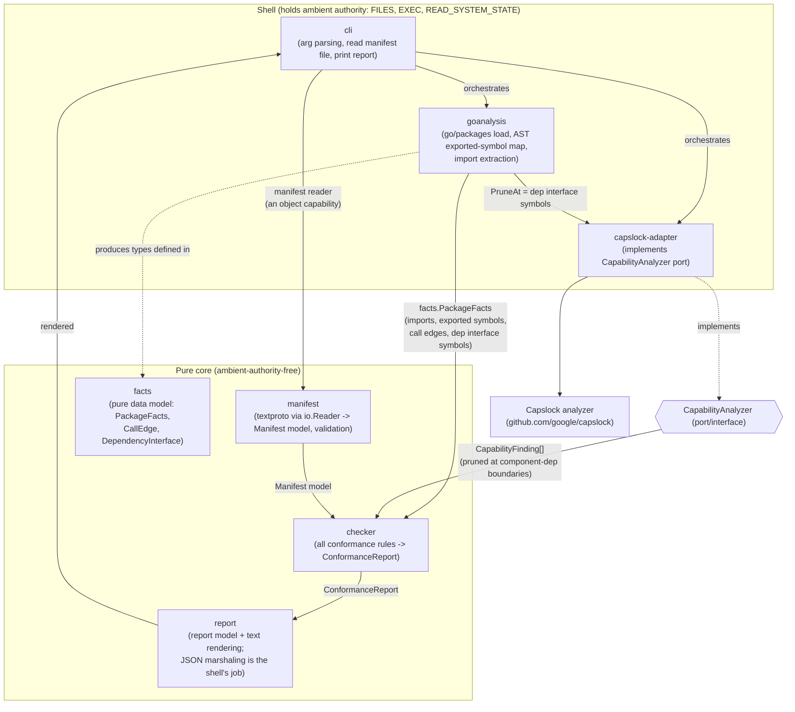
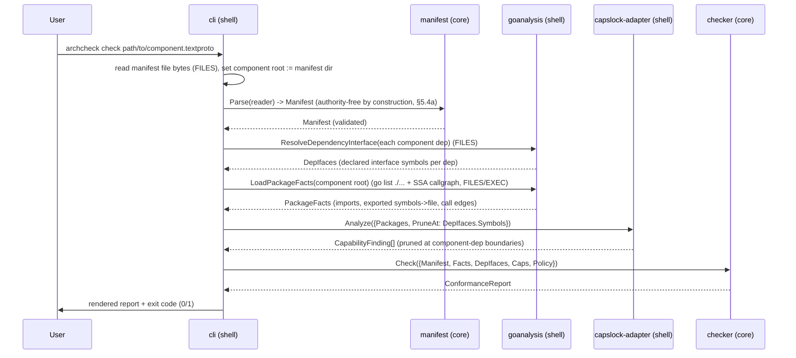

# Detailed Design — Architectural Contracts MVP (Go)

> **Status: revised after design review + PR #1 review round.** All major
> requirements decisions are user-confirmed: Capslock-as-library (Q1),
> **strict capability policy by default, parameterized** (Q3), **textproto**
> manifests (Q4), and **`./go` as its own Go module** (Q5). Component→component
> boundary enforcement and capability pruning (FR5/FR5b) are designed in per the
> Round-3 directive. A senior design review (see `../design-review.md`) was
> verified against the Capslock source and its resolutions are folded in:
> **init pruning + explicit-init rule** (A2), the **higher-order boundary
> warning** (A3), key **normalization** (A4), **VTA for both graphs** (A5), the
> pure **`facts`** component (B7), JSON rendering moved to the shell (B6), and
> assorted spec-gap fixes (C9–C14). A second review round (PR #1, xtofian)
> supersedes two earlier decisions and adds several rules: **component
> membership is directory-based** — the manifest sits at the component root and
> the component is everything beneath it (replaces the Q2 package-pattern list);
> the review-A1 "closure" is replaced by an **interface well-formedness rule**
> (every interface-surface method must be *declared* in an interface file, so
> interface changes always touch interface files — presubmit-visible);
> capability analysis covers **every function in the component's packages**
> (an "interface-rooted" alternative was considered and rejected — Appendix A);
> `declared_authority` is **wired into the policy in the
> MVP**; `manifest.Parse` takes an **`io.Reader`** (an object-capability
> illustration); every component carries an **informal contract** as doc
> comments in its interface files (Pillar 2 proof of concept); manifests live
> **at their component's root**; and the schema drops `packages` and
> `contract_note` and makes `reason` optional.
>
> **Step-0 Capslock spike folded in** (`../research/spike-capslock.md`, executed
> against the pinned Capslock checkout): the capability classifier is configured
> **exclude-UNANALYZED** and **"ambient authority = capability *minting*, not
> *use*"** (the `(*os.File)` handle methods are reclassified `SAFE`, §5.4a). A
> consequence: `manifest.Parse(io.Reader)` is ambient-authority-free **by
> construction**, so the earlier "shell must wrap the manifest in a
> `bytes.Reader`" rule is **dropped**. The spike also retired the review-B8
> `sort.Slice` prohibition (Capslock rewrites `sort.Sort`/`sort.Slice` call sites,
> so both are clean).
> This document is standalone; it does not require reading the other project files.

## 1. Overview

This project prototypes the "architecture as code" idea from
[`rationale-and-concepts.md`](../../../../docs/rationale-and-concepts.md)
(the concept doc, copied into this repo under `docs/`): a component's
**structure** (its interface, its
private implementation, and its dependencies) and its **ambient authority** are
recorded in a small, machine-readable **manifest**, and a **conformance checker**
mechanically verifies that the Go code matches the manifest. When the structure
of the code changes in a way that violates the manifest, the check fails — forcing
the architectural change to surface as an explicit edit to the manifest.

The MVP implements **Pillar 1 (Architecture as code)** and **Pillar 3 (Ambient
authority)** for **Go**. Authority declarations are enforced against the code:
a component whose manifest declares no authority must be provably
**ambient-authority-free**, and a component may declare the authority it
legitimately holds (e.g. `FILES`), which the policy then permits. Contracts
(Pillar 2) are **informal**: every component's interface files carry doc
comments stating its contract (FR10) — present as a proof of concept, *not*
mechanically checked. Data-flow (Pillar 4) is out of scope.

The deliverable is a **CLI** you run against a component manifest; it reports
whether the code conforms. The tool is itself decomposed into components with
manifests (self-hosting), and ships with example Go projects that demonstrate both
conforming and non-conforming components.

## 2. Detailed Requirements

Consolidated from `idea-honing.md` and the rough idea.

### 2.1 Functional requirements

- **FR1 — Manifest.** A component is described by a machine-readable manifest
  (`component.textproto`) that sits at the **component root**: the component
  consists of **all Go packages under the manifest file's directory** (PR-review;
  there is no explicit package list). All paths in the manifest are relative to
  that directory. The manifest declares: the component's **name**, the
  **interface files** (the `.go` files that hold its public surface), its
  **component dependencies** and **absorbed (impl-detail) dependencies**, and its
  **declared ambient authority** (empty for an ambient-authority-free component;
  e.g. `FILES` for a component that legitimately reads files). Component roots
  must be **disjoint** — one component's root may not lie inside another's
  (checked, §5.5).
- **FR2 — Conformance CLI.** A CLI takes a manifest and reports pass/fail with
  actionable violations. Exit code `0` = conforms, `1` = violations found, `2` =
  tool error. Human-readable output by default; `--format=json` for machine use.
- **FR3 — Pillar 1: dependency conformance.** Every non-stdlib import of the
  component's packages must be permitted by the manifest, i.e. belong to a declared
  component dependency's interface packages or a declared absorbed dependency.
  Undeclared imports fail conformance. (Stdlib imports are governed by Pillar 3,
  not this check — see §5.2.)
- **FR4 — Declared interface = interface-file declarations, kept honest by a
  well-formedness rule.** A component's **declared interface** is every exported
  top-level symbol (funcs, types, vars, consts) and every exported method
  **declared in files listed as `interface_files`**. So that *any* change to the
  exposed interface necessarily touches a declared interface file — making
  interface changes trivially visible to, e.g., a presubmit that watches those
  files — a **well-formedness rule** closes the loopholes where Go lets
  interface-relevant declarations live elsewhere (PR-review, replacing the
  earlier A1 "silent closure" rule):
  - **(a) Methods.** Every exported method of an exported non-interface type
    declared in an interface file must itself be **declared in an interface
    file** — not necessarily the same one: Go allows methods in a different file
    than their receiver type, so a `types.go` + `api.go` split (both listed as
    interface files) is fine. A method of an interface-file type declared in a
    non-interface file → `METHOD_OUTSIDE_INTERFACE` violation. (To keep
    implementation details out of interface files, an interface-file method may
    delegate to an architecture-private function — slightly awkward, but the
    best Go allows.)
  - **(b) Interface types are the exception.** For an exported **interface**
    type declared in an interface file, in-component concrete implementations
    are bound by the interface's contract, so their methods need **not** appear
    in interface files. They **do** enter the boundary/prune **symbol set**,
    because the call graph (VTA) resolves dynamic dispatch to concrete methods
    (review A1).
  - **(c) Inits.** Package **`init` functions are implicitly part of the
    interface** (importing a package runs its init). Any explicit `func init()`
    in a component's packages must be declared in an interface file; otherwise →
    `INIT_OUTSIDE_INTERFACE` violation (review A2). Rule (a) is the
    method-shaped mirror of this rule.

  A symbol that is Go-exported but not declared in an interface file is
  **architecture-private**: it may be used for cross-package composition *within*
  the component (or exposed for component-internal testing), but it is not part
  of the component's contract. **Invariant (the point of well-formedness):** for
  a well-formed component, every change to the exposed interface is a change to
  some declared interface file.
- **FR5 — Cross-component interface boundary (Pillar 1, strong form).** No code
  **outside** a component may call that component's architecture-private symbols;
  equivalently, when component A depends on component B, every call edge from A into
  B must land on one of **B's declared interface symbols** — never on a symbol that
  is merely language-level public. This one graph property, seen from B's side, is
  "private-implementation protection"; seen from A's side, it is "only call declared
  interfaces." (Within a single package, Go visibility already enforces the
  unexported part for free; this FR adds the exported-but-not-declared part and the
  cross-package/cross-component part.)
- **FR5b — Pillar 3: capability-attribution pruning at component boundaries.** When
  analyzing component A's ambient authority, the call-graph traversal is **pruned at
  each direct component dependency's declared interface symbols** (the FR4 symbol
  set: interface-file declarations plus concrete implementations of interface-file
  interface types) **and at each dependency package's `init` function** (`func <pkg>.init` —
  the synthetic root init, which covers explicit `init#N` funcs and package-level
  var initializers; without this, a dependency's import-time authority would
  re-absorb into A with no prune point — review A2). Authority exercised *inside*
  a dependency's implementation is attributed to the **dependency** (and governed
  by *its* manifest), not to A. This is what makes a **component dependency**
  differ from an **absorbed dependency**: component deps are pruned (authority not
  absorbed); absorbed deps are not pruned (authority absorbed and surfaced by A).
  Soundness is **compositional**: pruning trusts each dependency's declared
  contract, and the whole graph is sound iff every component independently
  conforms. (One known exception — function values passed across the pruned
  boundary — is documented in §11 and warned on, review A3.)
- **FR6 — Pillar 3: ambient-authority enforcement.** Using Capslock's
  transitive call-graph capability analysis, **every function in the component's
  packages** — exported or not, reachable from the declared interface or not —
  must exercise no ambient authority beyond what a **capability policy** allows
  (whole-package scope; `_test.go` files are excluded by construction — §5.4 and
  Appendix A on the rejected interface-rooted alternative). The checker is
  parameterized by that policy (`allowed` + `warn` capability sets), and **the
  manifest's `declared_authority` populates the policy's `allowed` set — this
  wiring is part of the MVP** (PR-review: the CSV example's `csvfile` component
  legitimately declares `FILES`; that only works if the manifest field actually
  feeds the policy). The `warn` set is empty by default, so any capability
  finding beyond `declared_authority` — true-authority *or* analysis-defeating —
  fails conformance; a component with empty `declared_authority` must therefore
  be provably **ambient-authority-free**. Non-default policies (e.g. "true
  fails, analysis-defeating warns") remain expressible through the same
  parameter. The underlying capability findings come from a **spike-configured
  classifier** (§5.4a): `UNANALYZED` is excluded (so ubiquitous stream/callback
  helpers like `io.ReadAll` don't generate spurious findings — the remaining
  analysis-defeating signals `REFLECT`/`UNSAFE_POINTER`/`CGO` still surface), and
  authority is attributed at the **capability-minting** site rather than at every
  point of capability *use*.
- **FR7 — Absorption.** A third-party/internal package used purely as an
  implementation detail is declared as an **absorbed dependency**: it needs no
  manifest, and its transitive use of ambient authority is **absorbed into and
  surfaced by** the absorbing component (this is automatic — Capslock attributes a
  dependency's capabilities to the caller). A **component dependency**, by
  contrast, is a first-class architecture edge to another manifested component that
  accounts for its own authority behind its contract.
- **FR8 — Self-hosting.** The tool's own Go code is decomposed into components,
  each with a manifest, and the checker can be run on itself. At least the pure
  checking core is ambient-authority-free.
- **FR9 — Examples.** A small multi-component example Go project (a CSV "top row by
  column" tool) demonstrates a passing ambient-authority-free component and a
  failing (undeclared-authority or undeclared-dependency) component.
- **FR10 — Informal contracts (Pillar 2, proof of concept).** Every component —
  the tool's own and the examples' — carries an **informal contract** as doc
  comments in its interface files: all the information the rest of the program
  needs about what the component **does**, what it **requires**, and what it
  **provides** (including the authority it holds and any obligations on
  callers). The manifest + interface files + contract prose together are the
  component's complete outside view; the prose is *not* mechanically checked in
  the MVP (PR-review).

### 2.2 Non-functional / structural requirements

- **NFR1 — Multi-language-ready layout.** Go-specific tooling lives under `./go`;
  the manifest schema and shared assets live in a shared location so a future Rust
  toolchain can reuse them.
- **NFR2 — Protobuf.** The manifest schema is defined in Protocol Buffers.
  Manifests are authored as `.textproto` files (Q4).
- **NFR3 — Bazel-ready.** The manifest's dependency and interface-file fields must
  be plain lists a future `go_architectural_component` Bazel rule can populate
  mechanically. (Bazel integration itself is out of scope for the MVP.)
- **NFR4 — Capslock as a library.** Capslock is consumed as a Go library behind a
  small internal `CapabilityAnalyzer` port (Q1), keeping the checker core
  decoupled and testable.

### 2.3 Out of scope (MVP)

Verified/formal contracts (Pillar 2 beyond FR10's informal prose); data-flow &
privacy (Pillar 4); the Bazel rule; the capability box (§5.4(b) of the concept
doc — note that non-empty `declared_authority` itself *is* in scope, FR6);
cross-package private-impl enforcement; languages other than Go.

## 3. Architecture Overview

The tool is split into a **pure core** (ambient-authority-free) and an
authority-holding **shell**. The shell loads all facts from the world (files,
`go list`, Capslock) and hands plain data to the core, which decides conformance.
This split is both good design and the centerpiece of the self-hosting demo.



Data flows one way into the core; the core calls nothing that touches the world.
The `CapabilityAnalyzer` port is defined in the core; its Capslock-backed adapter
lives in the shell. Likewise, the **fact data model lives in the pure core**
(`facts`), and the shell's `goanalysis` produces values of those core-defined
types — dependencies point inward, never core→shell (review B7).

### 3.1 End-to-end sequence



## 4. Components and Interfaces

Each of the tool's own components gets a manifest (self-hosting), located **at
the component's root directory** (FR1) — e.g.
`internal/checker/component.textproto` — and each component's interface files
carry its **informal contract** as doc comments (FR10): what it does, what it
requires (inputs, invariants, authority), and what it provides. Working import
root: `github.com/xtofian/architectural-contracts/go` (adjust to the real module
path). Component boundaries and their authority:

| Component | Package(s) | Role | Ambient authority |
|---|---|---|---|
| `manifest` | `.../internal/manifest` | Parse+validate manifest from an `io.Reader` → model | none (pure)* |
| `facts` | `.../internal/facts` | Pure data model: `PackageFacts`, `CallEdge`, `DependencyInterface` (produced by the shell, consumed by the checker) | none (pure) |
| `checker` | `.../internal/checker` | All conformance rules → report | none (pure) |
| `report` | `.../internal/report` | Report model + text rendering (JSON marshaling is the shell's) | none (pure) |
| `capanalyzer` (port) | `.../internal/capanalyzer` | `CapabilityAnalyzer` interface + finding types | none (pure) |
| `goanalysis` | `.../internal/goanalysis` | `go/packages` load; AST/imports extraction; VTA call-graph → cross-component call edges; resolve component-dependency manifests → declared-interface symbol sets (all as `facts.*` values) | FILES, EXEC, READ_SYSTEM_STATE |
| `capslockadapter` | `.../internal/capslockadapter` | Capslock-backed `CapabilityAnalyzer` | FILES, EXEC, READ_SYSTEM_STATE |
| `cli` | `.../cmd/archcheck` (+ its `app` orchestration subpackage — one subtree, since membership is directory-based) | Orchestration, I/O, exit codes, JSON marshaling of the report | FILES (read manifest, stdout), REFLECT (encoding/json) |

Core components (`manifest`, `facts`, `checker`, `report`, `capanalyzer`) are
**ambient-authority-free** and depend only on each other and stdlib-that-is-safe.
They are the self-hosting showcase. (*`manifest` carries a known reflection
caveat from `prototext` — see the plan's Step 2 risk note; the guaranteed
showcase is `facts`/`checker`/`report`/`capanalyzer`.)

### 4.1 Key interfaces (Go signatures, illustrative)

```go
// package capanalyzer  (pure port; defined in the core)

// CapabilityFinding is one capability reached transitively by a component's code.
type CapabilityFinding struct {
    Package    string      // import path where the capability is incurred
    Capability string      // e.g. "FILES", "NETWORK", "REFLECT"
    Class      Class       // TrueAuthority | AnalysisDefeating
    CallPath   []Frame     // example path: caller -> ... -> privileged callee
}
type Frame struct{ Func, File string; Line int }

// InterfaceSymbol identifies one declared-interface symbol of a component, in the
// key form Capslock/go-types use, e.g. "example.com/store.Read" or
// "(*example.com/store.DB).Get".  It is the shared primitive behind both the
// boundary check (Pillar 1) and capability pruning (Pillar 3).
//
// Matching is NORMALIZED (review A4): generic type-argument brackets are
// stripped from SSA names before comparison, and methods are emitted in BOTH
// pointer- and value-receiver key forms. Symbol sets are the FR4 symbol set
// (interface-file decls, plus concrete implementations of interface-file
// interface types — §5.3).
type InterfaceSymbol string

// AnalyzeRequest asks the analyzer for the capabilities of a component's packages.
// Scope is EVERY function in Packages (Capslock's native behavior: a backwards
// search from capability sites reports each queried-package function on a path
// to a capability — exported or not, dead or live; _test.go files are excluded
// by construction). The traversal is PRUNED at PruneAt (the declared
// interface symbols of the component's direct *component* dependencies, plus
// "func <pkg>.init" for each dependency package — review A2). Authority
// reached only *through* a pruned symbol is attributed to the dependency, not
// to the analyzed component. Absorbed deps are simply absent from PruneAt.
type AnalyzeRequest struct {
    Packages []string
    PruneAt  []InterfaceSymbol
}

// CapabilityAnalyzer is the port the checker depends on; the Capslock adapter
// (in the shell) implements it. Injecting it keeps the checker pure & testable.
// The Capslock adapter implements PruneAt by emitting a custom capability map that
// marks each pruned symbol CAPABILITY_SAFE (which terminates traversal).
type CapabilityAnalyzer interface {
    Analyze(req AnalyzeRequest) ([]CapabilityFinding, error)
}

// CapabilityPolicy decides, per capability, whether a finding is allowed (no
// report entry), a warning, or a violation. A capability in neither set is a
// violation. The MVP default (StrictPolicy) has both sets empty, so ANY
// capability fails.  Allowed is normally sourced from the manifest's
// declared_authority, which is the seam to configurable-per-manifest policy.
type CapabilityPolicy struct {
    Allowed map[string]bool // permitted capabilities (e.g. from declared_authority)
    Warn    map[string]bool // capabilities downgraded to a non-fatal warning
}

func StrictPolicy() CapabilityPolicy { return CapabilityPolicy{} } // MVP default
```

```go
// package facts  (PURE core) — the data model for facts about loaded code.
// Defined in the core so the checker never imports the shell (review B7);
// the shell's goanalysis produces values of these types.
type PackageFacts struct {
    Packages   []PackageFact
    CallEdges  []CallEdge          // inter-package call edges (from VTA call graph)
}
type PackageFact struct {
    ImportPath      string
    IsStdlib        bool
    Imports         []string             // direct imports of this package
    ExportedSymbols []ExportedSymbol     // top-level exported decls (+ init decls)
}
type ExportedSymbol struct {
    Name     string       // Capslock/go-types key form (see InterfaceSymbol)
    File     string       // file (relative to component root) where declared
    Kind     string       // func | type | var | const | method | init
    Receiver string       // for methods: the declaring type's key (drives the
                          // FR4 well-formedness rule: methods of interface-file
                          // types must themselves be declared in interface files)
}
// CallEdge is one static call edge; used for the FR5 cross-component boundary check.
type CallEdge struct {
    Caller InterfaceSymbol   // calling function/method (in some package)
    Callee InterfaceSymbol   // called function/method
    PassesFuncValue bool     // call site passes function-typed value(s) —
                             // drives the HIGHER_ORDER_BOUNDARY_CALL warning (A3)
}

// DependencyInterface is a *component* dependency's manifest + interface files
// resolved into its declared-interface symbol set (the FR4 symbol set, incl.
// concrete methods of interface-file interface types, plus per-package init
// keys). Used to (a) build the FR5b PruneAt set and (b) validate FR5 boundary
// calls.
type DependencyInterface struct {
    Component string
    Packages  []string    // all packages under the dependency's component root (derived, not declared)
    Symbols   []capanalyzer.InterfaceSymbol
}
```

```go
// package manifest  (pure core) — parses a manifest from an io.Reader. The
// Reader is an OBJECT CAPABILITY handed in by the shell — a deliberate
// illustration of deprivileging (PR-review): the component can read exactly
// what it was handed and holds no ambient authority to open anything itself.
// Parse is ambient-authority-free BY CONSTRUCTION regardless of the concrete
// reader passed in: the classifier attributes filesystem authority at the
// os.Open MINTING site (the shell), not at the point of capability *use* — so
// reading the handed-in reader never counts against `manifest` (§5.4a). The
// shell may hand Parse any reader; no bytes.Reader wrapping is required.
func Parse(r io.Reader) (Manifest, error)
```

```go
// package goanalysis  (shell) — produces the facts the checker needs, as
// values of the core-defined facts types. componentRoot is the manifest file's
// directory; membership = all Go packages under it (FR1).
func LoadPackageFacts(componentRoot string) (facts.PackageFacts, error) // FILES/EXEC
func ResolveDependencyInterface(dep manifest.ComponentDependency) (facts.DependencyInterface, error) // FILES
```

```go
// package checker  (pure) — the heart of the tool.
type Inputs struct {
    Manifest    manifest.Manifest
    Facts       facts.PackageFacts
    DepIfaces   []facts.DependencyInterface        // resolved direct component deps
    Caps        []capanalyzer.CapabilityFinding    // ALREADY pruned at DepIfaces (FR5b)
    Policy      capanalyzer.CapabilityPolicy       // default StrictPolicy()
}
func Check(in Inputs) report.ConformanceReport
```
Everything the checker needs is injected data — no I/O, no globals. `Caps` arrive
**already pruned** at the component-dependency boundaries (the analyzer applied
`PruneAt`), so the authority rule simply checks what's left. `DepIfaces` also feed
the FR5 boundary check over `Facts.CallEdges`.

The `checker.Check` function is a **pure function of its inputs** — no I/O, no
globals — which is exactly what makes the `checker` component ambient-authority-
free and trivially unit-testable with hand-built inputs.

## 5. Conformance rules (the checker)

Given `Manifest`, `PackageFacts`, and `[]CapabilityFinding`, the checker emits a
`ConformanceReport` of violations + warnings.

### 5.1 Dependency rule (FR3)
Build the **allowed import set** = union of:
- every component dependency's **interface packages** — defined as *the packages
  of the dependency that contain at least one of its interface files*, derived
  from the dependency's own manifest (review C10), and
- every absorbed dependency's import path(s) (pattern-matched: the checker
  glob-matches literal import strings against the declared patterns — pure).

For each package in the component, for each of its **non-stdlib** direct imports
that is **not itself part of the component** (membership = the packages under the
component root, i.e. the import paths present in `Facts.Packages` — FR1): if the
import ∉ allowed set →
`UNDECLARED_DEPENDENCY` violation (with the importing package + the import path).
Types-only imports follow the same allowlist (type *use* across the boundary is
governed by FR5's call-edge scope; see the §11 "use beyond calls" caveat).

Additionally, a declared component or absorbed dependency that matches **no**
import of the component's packages → `UNUSED_DEPENDENCY` **warning** (review
C13 — keeps manifests from accumulating stale grants, in the least-privilege
spirit).

### 5.2 Why stdlib imports are auto-allowed at Pillar 1
"Dependencies are declared at the granularity of *components*" (concept §3.1); the
Go standard library is not a component. The *risk* stdlib carries is **ambient
authority**, which Pillar 3 (Capslock) governs directly and transitively. So a
component may import `os` without a Pillar-1 violation, but importing `os` in a way
that reaches a privileged call will fail the **Pillar-3** check. This keeps the two
pillars cleanly separated: Pillar 1 governs *edges to other code units*, Pillar 3
governs *system powers reached*.

### 5.3 Declared interface & well-formedness (FR4)
From `PackageFacts`, the component's **declared interface** is every
`ExportedSymbol` whose `File` ∈ `interface_files`. Two **well-formedness rules**
guarantee the interface is *fully visible in the interface files* (FR4 —
PR-review, replacing the earlier silent-closure computation):

- **Method rule:** an exported method whose `Receiver` type is an exported
  non-interface type declared in an interface file, but whose own declaration is
  **not** in an interface file → `METHOD_OUTSIDE_INTERFACE` violation. Any
  declared interface file will do — e.g. a `types.go` holding the receiver type
  and an `api.go` holding its method declarations (Go allows methods in a
  different file than their type). Keeping implementation detail out of
  interface files then means interface-file methods delegate to
  architecture-private functions — a little awkward, but the best Go allows.
- **Explicit `init` rule (review A2):** an explicit `func init()` declared in a
  non-interface file → `INIT_OUTSIDE_INTERFACE` violation. Importing a package
  runs its inits, so init behavior is *de facto* part of the component's exposed
  interface; the manifest should make that visible rather than implicit.
  (Synthetic inits from package-level var initializers are governed by the
  component's own capability check.)

For the **boundary/prune symbol set** used by FR5/FR5b (§5.3b), the declared
interface is augmented with the in-component concrete implementations' method
keys for every exported **interface type** declared in an interface file
(computed via `go/types` method-set/satisfaction analysis in `goanalysis`) —
VTA edges land on concrete methods, not abstract ones (review A1). These
implementation methods are **exempt from the method rule**: the implementation
is bound by the interface's contract, so only the interface type needs to
appear in the interface files (PR-review).

Exported symbols not declared in interface files are **architecture-private**
(usable for intra-component composition and component-internal testing, not
part of the contract). Such a symbol is *not itself* a violation of the
component's own manifest — it is governed by the boundary rule below, which
forbids *outside* code from calling it. (We may still emit an informational
note when such symbols exist, to help authors notice unintended public
surface.)

**Invariant (why well-formedness matters):** for a well-formed component, any
change to the exposed interface necessarily modifies a declared interface file,
so tooling (e.g. a presubmit) can flag interface-affecting changes purely by
watching the interface file set.

**Known corner case (settle in the Step-0 spike):** methods *promoted* into an
interface-file type from an embedded type are declared wherever the embedded
type's methods are declared — possibly outside the interface files. MVP stance:
the method rule fires (the exposure is real); authors avoid embedding in
interface-file types or wrap the promoted methods explicitly.

### 5.3b Cross-component interface boundary (FR5 + FR5b linkage)
Using `Facts.CallEdges` and the resolved `DepIfaces` (symbol sets per §5.3 —
interface-file declarations plus interface-type implementation methods;
matching uses the A4 normalization — generic brackets stripped, both
receiver forms):
- For each call edge whose **callee** belongs to a direct component dependency
  `B`'s packages: if the callee ∉ `B`'s declared interface symbol set →
  `CALLS_UNDECLARED_INTERFACE` violation (with caller, callee, and `B`). This is
  the "don't call B's language-public-but-not-declared symbols" rule.
- For each call edge **into** a declared interface symbol of `B` whose call site
  passes function-typed values (`CallEdge.PassesFuncValue`) →
  `HIGHER_ORDER_BOUNDARY_CALL` **warning** (review A3): authority exercised by
  the passed function when `B` invokes it may escape pruned attribution — see
  §11.
- The **same** `DepIfaces` symbol sets (plus per-package `init` keys, FR5b) are
  handed to the analyzer as `PruneAt`, so the capability findings the checker
  receives are already pruned at those boundaries — authority behind `B`'s
  interface is attributed to `B`.

Note the consistency between the two pillars: if A calls a *non-declared* public
symbol of B, that symbol is (correctly) **not** in `PruneAt`, so any authority
behind it leaks into A's capability findings — but A has already failed the
boundary check, so the outcome (A is non-conformant) is the same either way.

**Scope honesty (review D18):** seen from B's side, "nothing outside B calls
B's architecture-private symbols" is enforced only over the set of components
that are actually *checked*. An unchecked consumer can call anything Go lets
it call; the guarantee accrues as coverage does (see §11 compositional trust
and Appendix D whole-graph mode).

### 5.4 Authority rule (FR6)
**Analysis scope (PR-review discussion; Appendix A).** Capability findings
cover **every function in the component's packages** — Capslock's native
behavior: it searches backwards from capability call sites and reports each
queried-package function on a path to a capability, whether or not that
function is exported or reachable from the declared interface. So "conforms
with empty `declared_authority`" means *no code in the component whatsoever*
can exercise ambient authority — latent authority in architecture-private or
dead code fails too. Note that `_test.go` files (including external `_test`
packages) are **excluded by construction**: the analyzed build does not contain
them, so ordinary test helpers and fixture readers never count against a
component. Test-support code in regular `.go` files that needs authority must
live **outside the component root** or be its own authority-declaring component
(§11).

Derive the effective policy: `policy.Allowed ⊇ manifest.declared_authority`
(empty for an authority-free component; e.g. `FILES` for the example's
`csvfile` — the manifest→policy wiring is MVP scope, FR6). For each
`CapabilityFinding`:
- capability ∈ `policy.Allowed` → no report entry.
- capability ∈ `policy.Warn` → `ANALYSIS_LIMITATION`/`ALLOWED_WITH_WARNING`
  **warning** (non-fatal).
- otherwise → `UNDECLARED_AUTHORITY` **violation**, carrying the Capslock example
  call path as evidence.

Under the **MVP default (`StrictPolicy`)** both sets are empty, so every finding —
true-authority or analysis-defeating — is a violation. The `Class` field on a
finding is retained so a non-strict policy (e.g. "warn on analysis-defeating") can
be expressed without re-running analysis. Because findings are **already pruned**
at component-dependency boundaries (§5.3b / FR5b), authority owned by a dependency
does not appear here — only authority the analyzed component reaches on its own or
through its **absorbed** dependencies.

### 5.4a Capability classifier configuration (Step-0 spike, validated)

The MVP `StrictPolicy` capability findings are produced by Capslock's builtin
classifier with **two configured deviations**, each executed against the pinned
Capslock checkout in the Step-0 spike (`../research/spike-capslock.md`). The
`capslockadapter` builds one merged classifier per run from these plus the FR5b
prune map.

**(1) Exclude `UNANALYZED` (`GetClassifier(excludeUnanalyzed=true)`).** Capslock
marks a set of callback/stream-consuming stdlib helpers — `io.ReadAll`,
`io.Copy*`, `errors.Is/As/Unwrap`, the `bufio` readers, `(*sync.Once).Do`, … —
as `UNANALYZED` *leaves*, so it won't assume "any callback flows to any call
site." Keeping them visible floods every real component (including the pure core:
`manifest` uses `io.ReadAll`, everything uses `errors.Is`) with spurious
`UNANALYZED` findings, **and** masks real authority that flows *through* them.
Excluding `UNANALYZED` makes Capslock descend through these helpers instead:
genuinely-clean code yields the empty set the design equates with
ambient-authority-free, and real authority is still traced to its true leaf.
(The other analysis-defeating signals — `REFLECT`, `UNSAFE_POINTER`, `CGO`,
`ARBITRARY_EXECUTION` — are detected by Capslock's source analysis, *not* the
`UNANALYZED` map, so they still surface and still fail strict.) A post-MVP policy
could re-raise `UNANALYZED` as a `warn`-set `ANALYSIS_LIMITATION` without failing.

**(2) Ambient authority = capability *minting*, not capability *use*.** The
Step-0 spike surfaced a modular-reasoning hazard in Capslock's default behavior:
a component may or may not carry a capability finding **based purely on how it is
called**. `manifest.Parse(io.Reader)` is attributed `FILES` when a caller hands
it an `*os.File`, yet stays clean when handed an in-memory reader — even though
`Parse`'s own code is byte-for-byte identical in both cases. That makes a
component's authority a property of its callers rather than of its own code,
which makes compositional reasoning cumbersome. The root cause is that Capslock's
builtin map classifies two distinct object-capability notions identically as
`FILES`:
- **minting** — turning an *ambient designator* into a capability: `os.Open`,
  `os.OpenFile`, `os.Create`, `os.ReadFile`, `os.WriteFile`, `os.NewFile`,
  `os.Remove*`, `os.Mkdir*`, `os.Stat`, … all take a *path* (or raw fd);
- **use** — exercising a capability you were *granted*: the `(*os.File)` methods
  `.Read/.Write/.Close/.Seek/.Stat/…` operate on a handle you already hold.

**In this design we take an object-capability point of view: minting a
capability exercises ambient authority; using a capability you were granted does
not** (the authority was already spent by whoever minted the handle). The MVP
classifier therefore
**reclassifies the `(*os.File)` handle *use* methods `CAPABILITY_SAFE`** (a
per-run capability-map override; a function-level entry wins over the
`package os` fallback) while leaving the minting functions `FILES`. Authority is
then attributed to the component **closest to where ambient authority is
exercised** — the `os.Open` call site — rather than to every downstream consumer
of the handle. Deliberately **excluded** from the SAFE override:
`(*os.File).Chdir` (Capslock: `MODIFY_SYSTEM_STATE` — it mutates process-global
cwd, genuine ambient authority).

This is what makes `manifest.Parse(io.Reader)` ambient-authority-free **by
construction**, independent of whichever concrete reader a caller passes — the
robust replacement for the withdrawn §11 "wrap in `bytes.Reader`" rule, and a
restoration of modular reasoning (a component's authority no longer depends on
its callers). It composes with FR5b pruning and with (1): all three are merged
into the single classifier the adapter loads per analysis.

*Caveats (see §11):* the symmetric minting-vs-use split for **network**
(`net.Dial`/`Listen` mint; `(net.Conn).Read/Write` use) and **exec/env** is
curated when those capabilities first appear (MVP touches only files); and with
handle methods `SAFE`, reads of the process-global ambient handles
`os.Stdin/Stdout/Stderr` become invisible — a knowingly accepted MVP loosening.

### 5.5 Component-dependency integrity
For each declared component dependency (review C12):
- its `manifest` path (relative to the **declaring manifest's directory**)
  resolves and loads — failure is a tool error (exit 2);
- the resolved manifest's `name` matches `ComponentDependency.name` — mismatch
  is a tool error;
- the dependency's **component root is disjoint** from the analyzed component's
  root — with directory-based membership (FR1), overlap means one root lies
  inside the other's subtree; nesting → conformance violation
  (`PACKAGE_OVERLAP`) — overlapping membership breaks attribution;
- imports/edges into it target only its declared interface packages/symbols
  (§5.3b).

This is a *first-class* MVP check, not a deferred one — it is the load-bearing
mechanism for compositional soundness. (Overlap among components not on the
current check's dependency path is caught only by whole-graph mode, Appendix D.)

## 6. Data Models

### 6.1 Manifest schema (proto; logical fields) `[PROVISIONAL Q4 = textproto on disk]`

```proto
// component.proto  (shared, language-neutral where possible)
syntax = "proto3";
package archcontracts.v1;

// A component's manifest, stored as component.textproto at the COMPONENT ROOT.
// The component consists of all Go packages under the manifest file's
// directory (FR1 — no explicit package list); all paths below are relative to
// that directory (C9). There is no contract field: the component's informal
// contract is doc-comment prose in its interface files (FR10).
message Component {
  string name = 1;                          // logical component name
  repeated string interface_files = 2;      // .go files holding the public surface, relative to the
                                            // component root; multi-package components use subdir
                                            // paths (store/api.go)
  repeated ComponentDependency component_dependencies = 3;
  repeated AbsorbedDependency  absorbed_dependencies  = 4;
  repeated string declared_authority = 5;   // capability names, validated at parse time against the
                                            // known capability set (C11); empty = ambient-authority-free
}

message ComponentDependency {
  string name = 1;                          // referenced component's name; must match the `name`
                                            // in the resolved manifest (C12)
  string manifest = 2;                      // path to that component's manifest, relative to the
                                            // DECLARING manifest's directory; the resolved manifest's
                                            // own directory is the dependency's component root and the
                                            // source of truth for its declared interface symbols
                                            // (interface packages are DERIVED — packages containing
                                            // interface files, C10)
}

message AbsorbedDependency {
  string import_path = 1;                   // third-party/internal impl-detail package (may be a pattern)
  optional string reason = 2;               // human note (why it's an impl detail)
}
```

Example (`examples/csvtool/toprow/component.textproto` — membership is implicit:
everything under `examples/csvtool/toprow/`):
```textproto
name: "toprow"
interface_files: "toprow.go"
absorbed_dependencies { import_path: "example.com/csvtool/internal/parsecsv" reason: "CSV parsing impl detail" }
# declared_authority intentionally empty -> ambient-authority-free
```

### 6.2 Report model

```go
type ConformanceReport struct {
    Component  string
    Violations []Finding
    Warnings   []Finding
}
type Finding struct {
    Kind     Kind        // violations: UNDECLARED_DEPENDENCY | CALLS_UNDECLARED_INTERFACE |
                         //   UNDECLARED_AUTHORITY | METHOD_OUTSIDE_INTERFACE |
                         //   INIT_OUTSIDE_INTERFACE | PACKAGE_OVERLAP
                         // warnings:   ANALYSIS_LIMITATION | ALLOWED_WITH_WARNING |
                         //   HIGHER_ORDER_BOUNDARY_CALL | UNUSED_DEPENDENCY
    Message  string
    Location Location    // file:line where relevant
    Evidence []string    // e.g. Capslock example call path frames
}
```

`report` renders **text** purely (returns strings; the shell prints). For
`--format=json`, the shell (`cli`) marshals the `ConformanceReport` struct with
`encoding/json` — kept out of the pure core because `encoding/json` reaches
`reflect` and would break the core's own authority-free claim (review B6);
`cli`'s manifest declares `REFLECT` accordingly.

## 7. Error Handling

Three-way outcome, mapped to exit codes (mirrors Capslock's own convention):
- **Conforms** → report with no violations, exit `0`. **Warnings alone do not
  change the exit code** — a warnings-only report exits `0` (review C14).
- **Non-conformance** → report lists violations (and any warnings), exit `1`.
- **Tool error** (manifest parse failure, package load failure, Capslock error,
  interface file not found on disk, dependency-manifest resolution/name-mismatch
  failure) → error to stderr, exit `2`. Tool errors are distinct from
  conformance failures and never masquerade as a "pass."

Specifics (validation is split — review C9 — because pure `Parse` sees only the
manifest's contents, not the filesystem around it):
- **Syntactic manifest validation** (pure, in `manifest.Parse`): empty `name`,
  empty `interface_files`, duplicate declarations, unknown capability name in
  `declared_authority` (C11) → parse error (exit 2).
- **Resolved validation** (shell, after package load): interface file missing
  on disk or not belonging to any package under the component root; dependency
  manifest unresolvable or name-mismatched (§5.5) → tool error (exit 2).
- **Package load**: `go/packages` load errors (e.g. package not found, build
  errors) are surfaced verbatim and abort with exit 2 (we do not analyze a broken
  build).
- **Capslock**: analysis-defeating findings are *warnings* not errors under a
  non-strict policy (violations under strict); an actual Capslock failure is a
  tool error (exit 2).

## 8. Testing Strategy

- **Checker (pure core) — table-driven unit tests.** Because `checker.Check` is a
  pure function of `(Manifest, PackageFacts, []CapabilityFinding)`, we test every
  rule with hand-constructed inputs and golden `ConformanceReport`s — no Go build,
  no Capslock, fully deterministic. This is the bulk of the test suite.
- **manifest.Parse — unit tests** for valid/invalid textproto (fed via a
  `bytes.Reader` — the Reader-as-capability seam), including each validation
  error.
- **goanalysis — integration tests** against small fixture packages under
  `testdata/`: assert extracted imports and exported-symbol→file mappings.
  Fixtures must cover the FR4 well-formedness corner cases (review A1/A4,
  PR-review): a type declared in an interface file with an exported method
  declared in a non-interface file (→ `METHOD_OUTSIDE_INTERFACE`); a
  `types.go` + `api.go` split across two interface files (clean); an exported
  interface type + concrete implementation (impl methods exempt but in the
  boundary/prune symbol set); a generic function/method (normalization);
  pointer- vs value-receiver keys; promoted methods from embedding; an explicit
  `func init()`.
- **capslockadapter — integration tests** against fixture packages with known
  capabilities (e.g. a package that reads a file → expect a FILES finding; a pure
  arithmetic package → expect none). Guards our mapping of Capslock's proto onto
  `CapabilityFinding`/`Class`. Includes **scope** tests (§5.4): authority in an
  architecture-private exported helper (unreachable from the declared interface)
  **is** reported — whole-package scope; the same authority in a `_test.go`
  helper is **not** (test files are outside the analyzed build).
- **End-to-end golden tests** on the `examples/` projects: run the CLI, assert exit
  code + rendered report. Includes at least one **conforming** and one
  **intentionally non-conforming** example (undeclared dep, leaked symbol,
  undeclared authority).
- **Self-hosting test.** Run `archcheck` on the tool's own core-component manifests
  in CI; the pure core must verify as ambient-authority-free.

## 9. Repository layout

```
architectural-contracts/
├── docs/
│   └── rationale-and-concepts.md  # the concept doc (copied into this repo; linked from §1)
├── proto/                         # shared, language-neutral schema
│   └── archcontracts/v1/component.proto
├── go/                            # Go toolchain (this MVP)
│   ├── go.mod
│   ├── cmd/archcheck/             # CLI entry (shell) — component root of `cli`
│   │   ├── component.textproto
│   │   ├── main.go
│   │   └── app/                   # orchestration subpackage (+ JSON marshal) — same subtree ⇒ same component
│   ├── internal/                  # each component's manifest sits AT ITS ROOT (PR-review)
│   │   ├── manifest/              # pure: parse+validate  (+ generated proto or gen/)  + component.textproto
│   │   ├── facts/                 # pure: fact data model                              + component.textproto
│   │   ├── checker/               # pure: conformance rules                            + component.textproto
│   │   ├── report/                # pure: report model + text rendering (JSON = shell) + component.textproto
│   │   ├── capanalyzer/           # pure: CapabilityAnalyzer port + finding types      + component.textproto
│   │   ├── goanalysis/            # shell: go/packages + AST facts                     + component.textproto
│   │   └── capslockadapter/       # shell: Capslock-backed adapter                     + component.textproto
│   └── examples/
│       └── csvtool/               # demo multi-component Go project
│           ├── toprow/            # authority-free logic component     + component.textproto
│           ├── internal/parsecsv/ # absorbed impl-detail dependency (no manifest)
│           ├── csvfile/           # FILES-declaring component          + component.textproto
│           └── app/               # composition root (pruning showcase)+ component.textproto
└── (rust/ later)
```

Manifests live **at each component's root** — the manifest's directory *defines*
the component (FR1), so there is no central `go/components/` directory
(PR-review). A consequence of directory-based membership: the former
`internal/app` orchestration package moves **under `cmd/archcheck/`**, so the
`cli` component is a single subtree.

Note (Q5, confirmed): **`./go` is its own Go module** (`go/go.mod`). The `proto/`
dir is deliberately outside `go/` so a future Rust toolchain can share it (NFR1);
Go accesses the generated code either via a committed `go/internal/manifest/gen/`
or a module-local generation step (TBD in implementation). Examples under
`go/examples/` are either a nested module or `testdata`-style packages so they
don't pollute the tool's own dependency graph.

## 10. The CSV example (FR9) — what it demonstrates

A tiny "print the top row of a CSV sorted by column N" tool, split to make **all
the concepts** — including the two dependency kinds and boundary pruning — visible:

- **`toprow`** — pure logic: given already-parsed rows, sort and pick. Imports only
  an absorbed CSV-parsing helper + stdlib-safe (`sort`, `strconv`). Its manifest
  declares **no authority**; `archcheck` confirms it is **ambient-authority-free**.
  **B8 correction (Step-0 spike):** the earlier draft required `sort.Sort` with a
  concrete `sort.Interface` and forbade `sort.Slice`. In fact **both are clean** —
  Capslock's `buildGraph` rewrites `sort.Sort`/`sort.Slice`/`(*sync.Once).Do` call
  sites to invoke the caller's comparator/closure directly, so neither reaches
  reflect. The example keeps the concrete `sort.Interface` purely as a readable
  pattern, not a requirement. The spike's `../research/spike-capslock.md`
  documents the full strict-safe stdlib envelope (with `UNANALYZED` excluded, §5.4a).
- **`internal/parsecsv`** — **absorbed** impl-detail dependency (wraps
  `encoding/csv`; no manifest). Declared as an `absorbed_dependency` of `toprow`;
  its behavior — and any authority it used — is **absorbed** into `toprow`'s
  contract. (In this example it touches no FS, so `toprow` stays authority-free.)
- **`csvfile`** — a **component** dependency *with its own manifest* that legitimately
  declares `declared_authority: "FILES"` and exposes `Read(path) ([][]string, err)`.
  Checked on its own, it conforms (FILES is declared).
- **`app`** — the composition root. It depends on `csvfile` as a **component
  dependency** and on `toprow`. **This is the pruning showcase:** because the
  traversal is pruned at `csvfile`'s declared interface, `app` is **not** attributed
  `FILES` even though it composes a file-reading component — so `app` can itself be
  **ambient-authority-free** while orchestrating authority it never holds. That is
  the capability model working as intended.

Per FR10, each example component's interface files carry its **informal
contract** as doc comments — e.g. `csvfile.Read` documents that it reads the
named file from the real filesystem (hence `FILES`), and `toprow` documents
that it operates only on rows it is handed. Together with the manifest, that
prose is everything a consumer needs to know.

Failing variants (golden non-conformance tests):
- `app` **absorbs** `csvfile` instead of depending on it as a component (or calls
  `os.Open` directly) while claiming no authority → `UNDECLARED_AUTHORITY` (evidence:
  Capslock path to `os.Open`), showing absorb-vs-prune is what differs.
- `app` calls a `csvfile` symbol that is Go-exported but **not** in `csvfile`'s
  interface files → `CALLS_UNDECLARED_INTERFACE`.
- `toprow` omits the `parsecsv` `absorbed_dependency` it imports →
  `UNDECLARED_DEPENDENCY`.

## 11. Known limitations / caveats (MVP)

Now *designed in* (were deferred in the earlier draft): the cross-component
interface boundary check (FR5), "no call edge into a dependency's non-interface
symbols" (concept Appendix A.1), and component-dependency authority pruning /
non-re-absorption (FR5b). See §5.3b, §5.4, §5.5.

Remaining caveats:
- **Call-graph precision.** FR5 and FR5b rely on a static call graph — **VTA**,
  matching Capslock exactly (review A5; two graph constructions per run is an
  accepted MVP cost, since Capslock's internal graph is not injectable). Dynamic
  dispatch (and reflection) makes edges **over-approximate**: the analyzer may
  see call edges that can't happen at runtime, yielding false-positive boundary
  violations. Documented, not eliminated.
- **Higher-order boundary leak (review A3) — the one known way pruning can hide
  authority.** Pruning cuts every path segment through a SAFE frame. If A passes
  a function value into B's pruned interface and that function comes from A's
  *absorbed dependency*, authority it exercises when B invokes it is attributed
  to nobody (A's path is pruned at B; B's own check never sees A's absorbed
  dep). Authority in **A's own functions** invoked via callback *is* still
  caught — a consequence of the whole-package analysis scope (§5.4): Capslock
  reports every queried-package function with its own path to a capability,
  reachable from A's interface or not. (Under the rejected interface-rooted
  alternative this would have been a hole — Appendix A.) Mitigation:
  `HIGHER_ORDER_BOUNDARY_CALL` warning on func-valued arguments crossing a
  pruned boundary (§5.3b). A principled treatment — functions passed to
  higher-order functions are themselves capabilities whose authority should
  attribute to the supplier — is future work (Appendix D).
- **Generic symbols (review A4).** MVP matching strips generic type-argument
  brackets from SSA names and emits both receiver key forms; this is believed
  conservative (a missed match fails *open*: authority leaks in and surfaces as
  a violation rather than being hidden). Robust handling is an open question
  (Appendix D).
- **Compositional trust.** FR5b pruning trusts each dependency's *declared* contract;
  the guarantee holds only if **every** component in the graph is itself checked and
  conformant. A partial check (some components unchecked) weakens the guarantee —
  and the FR5 "two views" equivalence likewise only covers checked consumers
  (§5.3b scope note).
- **Use beyond calls.** The boundary check targets *call* edges. Using a
  dependency's types, struct fields, or exported **vars** (a mutable-state channel
  invisible to both FR5 and FR5b) without a call is not covered; an extension.
  (Concept §3.1: "calls into, uses types from, or otherwise communicates with".)
- **Whole-package authority scope & test-support code (PR-review, §5.4).**
  Because every function in the component's packages counts, an
  authority-using helper in a regular (non-`_test.go`) file fails the
  component's check even if it exists only to support tests. This is treated as
  a feature, not a carve-out: authority that ships in the package is real.
  Placement guidance — per-test helpers and fixture readers go in `_test.go`
  files (excluded from the analyzed build by construction); *shared*
  test-support packages that need authority live outside the component root
  (directory-based membership makes this a directory choice) or become their
  own small component declaring, e.g., `FILES`.
- **Granted capabilities vs Capslock attribution (PR-review; resolved for the
  filesystem in the Step-0 spike, §5.4a).** `manifest.Parse(io.Reader)` holds no
  ambient authority — the Reader is an *object capability* handed in by its
  caller. Capslock's builtin map, however, classifies the `(*os.File)` *use*
  methods `FILES` alongside the `os.Open` *minting* functions, so under the raw
  classifier VTA would resolve `r.Read` to `(*os.File).Read` and attribute
  `FILES` to `manifest` whenever a caller passed a file-backed reader — making a
  deprivileged component's authority depend on its *callers*, which breaks
  modular reasoning. The MVP fixes this at the classifier (§5.4a): the handle
  *use* methods are `SAFE`, so authority attributes at the `os.Open` minting
  site. **`manifest.Parse` is therefore authority-free by construction and the
  shell may hand it any reader** — the earlier "wrap in `bytes.Reader`" rule is
  withdrawn. Two residuals remain: (i) the same minting-vs-use reclassification
  for **network/exec/env** capabilities is curated when those first appear; and
  (ii) the general case — an arbitrary object capability (not just an `*os.File`)
  passed as a grant, and function-valued grants (callbacks) — is still beyond
  Capslock's view, and is future work in the same family as
  callbacks-as-capabilities (Appendix D).
- **Stdio globals (accepted MVP loosening, §5.4a).** Because the `(*os.File)`
  handle methods are `SAFE`, reads/writes of the process-global ambient handles
  `os.Stdin`/`os.Stdout`/`os.Stderr` (package *variables*, never minted by the
  component) no longer count as `FILES`, where Capslock's default would flag
  them. Defensible — those fds are granted to the process by its parent, i.e.
  capability use — but a genuine policy choice; a post-MVP strict mode could
  re-flag references to those three variables specifically.
- **Directory-based membership (PR-review).** A component is its manifest's
  directory subtree: components cannot span non-contiguous directories,
  component roots must be pairwise disjoint (no nesting, §5.5), and any package
  placed under a component's root silently joins the component. Accepted for
  the MVP.
- **Interface strictness (resolved):** exported symbols not declared in
  interface files are *architecture-private*, not errors (§5.3) — the boundary
  rule plus the FR4 well-formedness rules, not a blanket "everything exported
  must be in an interface file," are what bite.
- **Analysis soundness** is otherwise bounded by Capslock (reflection/unsafe/cgo),
  which under `StrictPolicy` fail conformance rather than pass silently.

## 12. Appendices

### Appendix A — Key design decisions & rationale

- **Pure-core / authority-shell split.** Chosen so the checker is (a) trivially
  testable as a pure function and (b) a genuine ambient-authority-free component we
  can dogfood. It also cleanly resolves the "Capslock needs authority, so how can
  the tool be authority-free?" tension: only the shell touches the world.
- **Capslock as a library behind a port (Q1).** Gives structured protos + the
  future call-graph hook, while the port keeps the core decoupled and swappable
  (future `cargo-geiger`-style Rust adapter).
- **Two dependency kinds = pruned vs not pruned (FR7 + FR5b).** The distinction is
  made *mechanically precise* by call-graph pruning: a **component dependency** is
  pruned at its declared interface (its authority is *its own*, behind its
  contract); an **absorbed dependency** is not pruned (its authority is absorbed and
  surfaced by the absorber, which Capslock's transitivity does for free). This is
  the resolution of the rough idea's central open question.
- **One boundary property, two views (FR5).** "A only calls B's declared interface"
  (dependent's view) and "nothing outside B calls B's architecture-private symbols"
  (dependency's view) are the *same* call-graph property. Interface files define the
  declared set; the same set drives the FR5 check and the FR5b prune set — one
  primitive, both pillars.
- **Pruning mechanism = Capslock `CAPABILITY_SAFE`.** We generate a per-analysis
  custom capability map marking each pruned symbol `CAPABILITY_SAFE`, which
  "terminates further analysis" — no fork of Capslock needed. Feasibility and the
  `func <path>.<Name>` / `func (*<path>.<Type>).<Method>` key format were verified
  against `interesting/interesting.cm`; the prune-skipping behavior was verified
  in `analyzer.searchBackwardsFromCapabilities` (review). The prune set also
  includes `func <pkg>.init` per dependency package (review A2 — precedent:
  `func encoding/json.init CAPABILITY_SAFE` in the builtin map).
- **Ambient authority = capability *minting*, not *use* (Step-0 spike; §5.4a).**
  Capslock's builtin map conflates minting a capability from an ambient
  designator (`os.Open(path)`) with merely *using* a granted one
  (`(*os.File).Read`), classifying both `FILES`. Under an object-capability
  model only minting is ambient authority. We therefore reclassify the
  `(*os.File)` use-methods `CAPABILITY_SAFE` (via the same per-run capability-map
  mechanism as pruning), attributing authority at the minting site. This is the
  principled fix that lets `manifest.Parse(io.Reader)` — and any deprivileged
  consumer of a handed-in capability — be authority-free regardless of its
  callers, and it retires the fragile "wrap in `bytes.Reader`" workaround. The
  classifier also excludes `UNANALYZED` (§5.4a) so ubiquitous stream/callback
  helpers don't spuriously fail. The spike executed both against the pinned
  Capslock (`../research/spike-capslock.md`).
- **Interface = interface files + well-formedness, not a silent closure
  (PR-review, revising A1).** Review A1 observed that VTA resolves dynamic
  dispatch to *concrete* methods and that Go idiom puts a type and its methods
  in different files; the earlier draft answered by silently *including* such
  methods in the interface (a closure). That undermined a key goal: interface
  changes should always be visible as edits to the declared interface files
  (e.g. for a presubmit). Revised: methods of interface-file types declared
  outside interface files are a **violation** (`METHOD_OUTSIDE_INTERFACE`),
  mirroring the explicit-init rule — multiple interface files (`types.go` +
  `api.go`) keep this idiomatic. A1's VTA concern survives only where it must:
  concrete implementations of interface-file *interface types* are exempt
  (contract-bound by their interface) and are added to the boundary/prune
  symbol set so FR5/FR5b match real edges.
- **Directory-based membership (PR-review, revising Q2).** The manifest sits at
  the component root and the component is every package beneath it: no
  `packages` field to keep in sync, membership is unambiguous, and the manifest
  location itself documents the boundary. Cost: components are contiguous,
  disjoint subtrees (§11).
- **Authority-analysis scope = every function in the component's packages
  (PR-review discussion; "interface-rooted" alternative rejected).** Capslock
  has no notion of entry points: it searches *backwards* from capability call
  sites through the VTA graph and reports every queried-package function on a
  path to a capability — exported or unexported, live or dead. We keep that
  native whole-package scope, so an empty finding list means *no code in the
  component at all* can exercise undeclared authority.

  **The rejected alternative — root the traversal at the declared interface.**
  Motivated by the observation that a component's public-but-undeclared symbols
  may exist only for component-internal testing: analysis would start at the
  FR4 symbol set + package inits (symmetric with pruning: start at your own
  interface, stop at your dependencies'), and the authority footprint would be
  exactly "what a consumer of the contract can trigger." Rejected because the
  costs outweigh that precision:
  1. it *hides latent authority* in architecture-private code — safe against
     checked consumers (the FR5 boundary rule forbids calling such symbols) but
     not against unchecked ones, weakening the compositional story;
  2. it would have re-opened a **callback hole**: one of A's own functions,
     reachable only via a pruned dependency invoking it, escapes attribution —
     under whole-package scope it is always reported (§11 higher-order caveat);
  3. the natural implementation (keep findings whose example path starts at a
     root) silently depends on Capslock's per-(function, capability) reporting
     granularity — an assumption that would need spike validation and could
     regress with Capslock releases;
  4. it adds `Roots` plumbing through the port, adapter, and CLI.

  **The test-helper concern is handled architecturally instead** (§5.4, §11):
  `_test.go` files never enter the analyzed build (go/packages default), so
  ordinary test helpers and fixture readers are already invisible; *shared*
  authority-using test-support code belongs outside the component root or in
  its own authority-declaring component — visible authority instead of an
  analysis carve-out. The knowingly accepted consequence: an exported-for-
  testing symbol in a shipped non-test file that touches ambient authority
  fails the component's check — deliberately, since that authority genuinely
  ships in the package.
- **`Parse(io.Reader)` as an object-capability demo (PR-review).** The manifest
  parser cannot open anything; it reads exactly the Reader it is handed — a
  small, concrete illustration of deprivileging a component. With the §5.4a
  minting-not-use classifier this is now *enforced faithfully*: `Parse` is
  authority-free by construction, whatever reader flows in (no `bytes.Reader`
  discipline needed).
- **Fact model in the core (review B7).** `facts` is a pure core component so the
  checker never imports the shell; `goanalysis` produces core-defined types.
  Same inward-pointing pattern as the `capanalyzer` port.
- **Stdlib auto-allowed at Pillar 1 (§5.2).** Keeps Pillar 1 = "edges between code
  units" and Pillar 3 = "system powers," avoiding a redundant per-stdlib-package
  declaration burden.

### Appendix B — Technology choices (pros/cons)

| Choice | Pros | Cons |
|---|---|---|
| Capslock as **library** | structured protos; call-graph hook; single shared `packages.Load` | tighter coupling to a pre-1.0 API |
| Capslock as **subprocess** (rejected) | loose coupling; API-churn-proof | no call-graph hook; JSON parsing; still shells out |
| **textproto** manifests `[PROVISIONAL]` | matches protobuf constraint; diff-friendly; Bazel-generatable | less familiar than YAML to some authors |
| Component = **manifest-directory subtree** (PR-review; replaced package-pattern set) | zero config — manifest location *is* the membership; nothing to keep in sync | components must be contiguous, disjoint dirs; stray packages under a root silently join |

### Appendix C — Research findings (summary)

From `research/capslock.md` and `research/go-component-model.md`:
- Capslock exposes `analyzer.GetCapabilityInfo(pkgs, queried, config) →
  CapabilityInfoList`; **empty list ⇒ ambient-authority-free.** 14 capabilities; 8
  true-authority, 5 analysis-defeating, 1 explicit-safe.
- Capslock's transitivity **implements authority absorption for free** (for
  absorbed deps), and its **custom capability map** with `CAPABILITY_SAFE` (which
  "terminates further analysis") gives us **boundary pruning for component deps** —
  verified against `interesting/interesting.cm`; key format
  `func <path>.<Name>` / `func (*<path>.<Type>).<Method>`.
- Capslock's scope is **every function in the queried packages** (backwards
  search from capability sites; no entry-point notion), and its `go/packages`
  load **excludes `_test.go` files** — so test code is outside the analysis by
  construction (spike-verify both — Step 0).
- Capslock **itself requires ambient authority** (`go list` via `os/exec`) → drives
  the pure-core/shell split.
- Pillar 1 is **not** Capslock's job; it comes from `go/packages` imports +
  `go/ast` exported-symbol→file mapping. **One `packages.Load` feeds both pillars.**

From `research/spike-capslock.md` (Step-0 spike, executed against the pinned
Capslock checkout — all six load-bearing assumptions validated):
- Classifier config settled: **exclude `UNANALYZED`** and reclassify the
  `(*os.File)` handle *use* methods `SAFE` (**minting, not use**, §5.4a).
- Key forms (review A4) confirmed: methods emit both `(pkg.T).M` and
  `(*pkg.T).M`; generic instantiations categorize via the **bracket-free** origin;
  init appears as `<pkg>.init` (+ a `<pkg>.init#N` body wrapper).
- `func <pkg>.init CAPABILITY_SAFE` prunes a dependency's import-time authority
  (review A2), and whole-package scope + `_test.go` exclusion behave as designed.
- `sort.Slice` is **not** a hazard: Capslock rewrites `sort.*`/`Once.Do` call
  sites, so the comparator (not the sort internals) is analyzed (retires B8).

### Appendix D — Remaining open items
Resolved: Q1 (Capslock as library), Q2 (component membership — revised by the
PR review to manifest-directory subtree), Q3 (strict parameterized policy), Q4
(textproto), Q5 (`./go` own module), call-graph algorithm (**VTA**, matching
Capslock — review A5), interface-file strictness (exported-but-non-interface
symbols are architecture-private, not errors, plus the FR4 well-formedness
rules, §5.3).

Still open, non-blocking for the MVP:
1. **`CapabilityAnalyzer` port** — confirm wrapping Capslock behind our own port
   (vs the checker importing the library directly). Design assumes the port.
2. **CLI name** — working name `archcheck`; confirm or replace.
3. **Whole-graph vs single-component invocation.** Because FR5b's guarantee is
   compositional (§11), do we check one manifest at a time (trusting dependency
   manifests) or offer a "check the whole graph" mode that verifies every reachable
   component (which would also catch package-membership overlap globally, §5.5)?
   MVP does single-component + resolve-direct-deps; whole-graph is a natural
   extension. A useful property enables such a mode cheaply: because ambient
   authority *use* is attributed to the component where it happens (including its
   absorbed deps, §5.4a), a top-level component's authority can be **"buried"** in
   a transitive sub-dependency — but that fact can be reasoned about purely at the
   level of the **component graph**, without the code-level call graph. This opens
   the door to high-level component-graph conformance checks, e.g. constraining
   the use of a given ambient authority across an entire transitive sub-graph.

Post-MVP research questions (from the design review):
4. **Callbacks as capabilities (review A3).** A function value passed across a
   component boundary is itself a capability grant (analogous to a file handle);
   a principled model would attribute the authority such a function exercises —
   when invoked by the callee — back to the *supplier*. The MVP's
   `HIGHER_ORDER_BOUNDARY_CALL` warning is a stopgap. (Capslock sidesteps the
   related `sort.*` case by rewriting those call sites — Step-0 spike — so it is
   not a live hazard for the examples; the general higher-order case remains.)
5. **Robust generic-symbol matching (review A4)** beyond the MVP's
   bracket-stripping normalization (instantiation-aware matching, synthetic
   wrapper functions for promoted methods).
6. **Granted capabilities vs ambient authority (PR-review — partially resolved).**
   The **filesystem** case is handled in the MVP: reclassifying the `(*os.File)`
   use-methods `SAFE` attributes authority at the minting site, so a handed-in
   file-backed `io.Reader` is correctly treated as a grant, not ambient authority
   (§5.4a). The general case remains open: the same minting-vs-use split for
   network/exec/env, and truly type-agnostic grant tracking (any object
   capability, and function-valued grants) — same family as
   callbacks-as-capabilities (item 4).
7. **Verified-safe abstractions.** A component may provide a capability-oriented
   abstraction over an ambient resource — e.g. a
   [`cap-std`](https://docs.rs/cap-std)-style filesystem that only *derives*
   smaller capabilities from ones it was already granted (obtaining a file handle
   from a [directory capability](https://docs.rs/cap-std/latest/cap_std/fs/struct.Dir.html#method.open))
   rather than *minting* new ones. Semantically such a component exercises **no**
   ambient authority, but its implementation bottoms out in a low-level call like
   `openat`, which Capslock attributes as `FILES`. In these cases we want to mark
   the component **verified-safe** so that it presents as ambient-authority-free in
   cross-component graph analysis, despite the raw Capslock finding — a
   manual-audit escape hatch complementing the automated minting-vs-use classifier
   (§5.4a). This is the semantic counterpart, at the component level, of the
   handle-method SAFE reclassification the MVP already does at the stdlib level.
```
