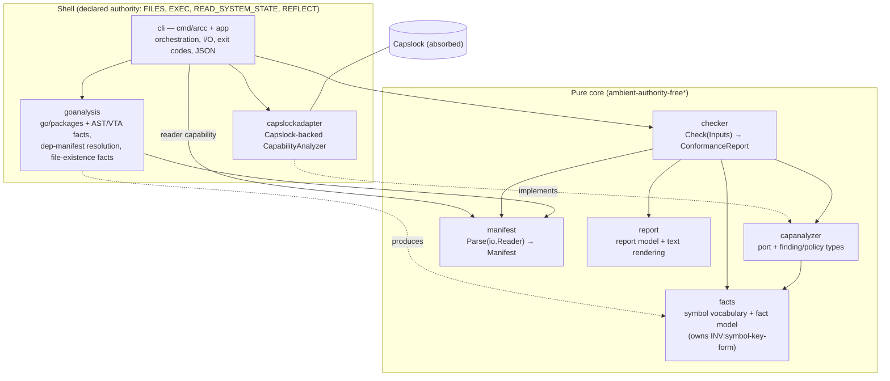
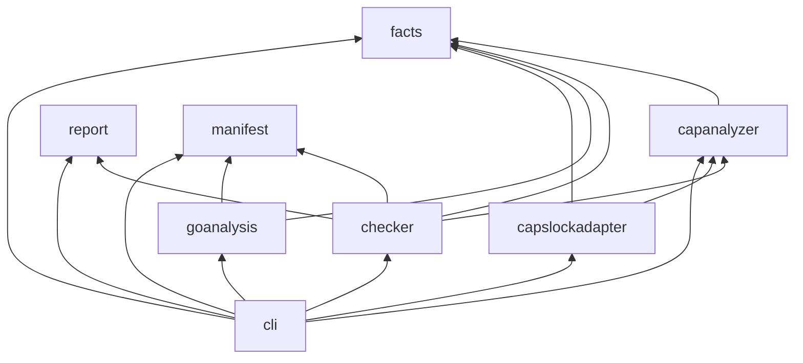

# Detailed Design — arcc MVP, coco-first variant

> **Status: for user review** (produced autonomously per the Round-1 Q&A in
> `../idea-honing.md`; self-review findings F1–F9 from `../design-review.md`
> are folded in — the pre-review draft is the previous jj change).
>
> This is a **variant of the 2026-07-06 go-mvp design**
> (`../../2026-07-06-arch-contracts-go-mvp/design/detailed-design.md`) that
> redesigns the same tool under the **coco component-contract discipline**
> (`.claude/skills/coco-references/concepts.md`). The functional scope —
> Pillars 1 & 3 for Go, Capslock-based authority enforcement, the CSV example,
> self-hosting — carries over; what changes is that every component now has a
> **two-tier contract with labeled clauses and an explicit rely-set**, the
> manifest becomes **contract-aware (designation-only)**, and testing is
> **contract-driven** (clause→test maps, a verified fake for the analyzer
> port). Deep Capslock mechanics validated by the Step-0 spike carry over
> unchanged and are summarized, not re-derived, here.

## 1. Overview

`arcc` is a CLI conformance checker: given a component **manifest**
(`component.textproto` at the component root), it verifies that the Go code
under that root matches the declared architecture — interface files,
dependencies (component vs absorbed), and ambient authority — and reports
pass/fail with actionable findings.

The coco variant adds one enforcement increment and one discipline increment:

- **Enforcement (small):** the manifest can now **designate the component's
  Tier-2 contract file(s)** (`contract_files`). arcc verifies each designated
  file **exists** — nothing more. arcc deliberately imposes **no structure on
  contract content**; structure is a per-project convention (see §3), not tool
  policy.
- **Discipline (large):** arcc's own eight components — and the example
  components — are designed with full coco rigor: Tier-1 contracts as labeled
  clauses in interface doc comments, Tier-2 `component-contract.md` files with
  clause elaborations, **rely-sets**, authority rationale, and clause→test
  maps. The design's implicit inter-component assumptions (which the go-mvp
  design left in field comments) are promoted to named PRE/POST/INV clauses
  and checked for compositional soundness in §7.

## 2. Detailed Requirements

Numbering is kept aligned with the go-mvp design; **Δ** marks a change.

### 2.1 Functional requirements

- **FR1 — Manifest. (Δ)** A component is described by `component.textproto` at
  its **component root**; the component is all Go packages under that
  directory; paths are relative to it; component roots are disjoint. The
  manifest declares: `name`, `interface_files`, `component_dependencies`,
  `absorbed_dependencies`, `declared_authority`, **and (new) `contract_files`
  — zero or more files (any format) holding the component's Tier-2 contract.**
- **FR2 — Conformance CLI.** `arcc check <manifest>`; exit `0` conforms, `1`
  violations, `2` tool error; human-readable output, `--format=json`.
  Warnings alone leave exit code `0`.
- **FR3 — Dependency conformance (Pillar 1).** Every non-stdlib import of the
  component's packages must belong to a declared component dependency's
  interface packages or a declared absorbed dependency. Stdlib is auto-allowed
  at Pillar 1 (its risk is authority, governed by Pillar 3). Unused declared
  dependencies → warning.
- **FR4 — Declared interface & well-formedness.** The declared interface is
  every exported top-level symbol and exported method declared in
  `interface_files`, kept honest by well-formedness rules:
  methods of interface-file non-interface types must be declared in interface
  files (`METHOD_OUTSIDE_INTERFACE`); explicit `func init()` must be in an
  interface file (`INIT_OUTSIDE_INTERFACE`); concrete implementations of
  interface-file **interface types** are exempt but enter the boundary/prune
  symbol set. Exported-but-undeclared symbols are *architecture-private*.
- **FR5 — Cross-component call boundary (MVP: call edges).** Every call edge
  from A into component dependency B must land on B's declared-interface
  symbol set (`CALLS_UNDECLARED_INTERFACE` otherwise). Function-typed values
  crossing a pruned boundary → `HIGHER_ORDER_BOUNDARY_CALL` warning.
- **FR5b — Capability-attribution pruning.** Capability traversal is pruned at
  each direct component dependency's declared-interface symbols + per-package
  `init` keys; a dependency's authority is attributed to the dependency.
  Component deps are pruned; absorbed deps are not (absorbed and surfaced).
- **FR6 — Ambient-authority enforcement (Pillar 3).** Capslock-based analysis
  over **every function in the component's packages** (`_test.go` excluded by
  construction); findings beyond the policy's allow-set fail
  (`UNDECLARED_AUTHORITY`); `declared_authority` populates the allow-set;
  strict default (empty policy ⇒ any finding fails ⇒ empty findings =
  provably ambient-authority-free). Classifier config carried from the spike:
  exclude `UNANALYZED`; **minting-not-use** (`(*os.File)` handle-use methods
  reclassified SAFE; authority attributes at the `os.Open`-style minting
  site).
- **FR7 — Absorption.** Absorbed dependencies need no manifest; their
  transitive authority is absorbed into the absorber.
- **FR8 — Self-hosting. (Δ)** arcc's own code is decomposed into manifested
  components and checked by itself in CI. **Additionally: every arcc component
  designates its Tier-2 contract file(s) via `contract_files`, and the
  designated files exist** — the coco discipline is visible in the tool's own
  manifests, not just its docs.
- **FR9 — Examples. (Δ)** The CSV example (`toprow`, `internal/parsecsv`,
  `csvfile`, `app`) demonstrates passing and failing components, **each
  example component carrying two-tier contracts and a designated
  `component-contract.md`**, plus failing variants including a
  missing-contract-file variant.
- **FR10 — Two-tier contracts (Δ, replaces "informal contracts").** Every
  component (arcc's own and the examples') carries:
  - **Tier 1** — labeled contract clauses (`PRE:`/`POST:`/`INV:`/`HIST:` +
    slug) in interface-file doc comments: the caller's need-to-know.
  - **Tier 2** — `component-contract.md` beside the manifest, designated in
    `contract_files`: clause elaborations by label, exhaustive edge behavior,
    **rely-set**, declared dependencies & authority rationale, clause→test
    map, fake-fidelity notes where applicable.
  Contract *content* is convention (§3), **not** checked by arcc.
- **FR11 — Contract-file designation check (new).** Each file named in
  `contract_files` must exist under the component root; a missing file is a
  **violation** (`CONTRACT_FILE_MISSING`), not a tool error — checking can
  proceed and the finding appears in the report. An empty `contract_files`
  list is legal (arcc imposes no contract discipline on other projects; this
  repo's convention requires ≥ 1 for its own components).

### 2.2 Non-functional / structural requirements

Unchanged from go-mvp: **NFR1** multi-language-ready layout (`./go` its own
module; shared `./proto`); **NFR2** protobuf schema, `.textproto` manifests;
**NFR3** Bazel-ready plain-list fields; **NFR4** Capslock as a library behind
a port. New: **NFR5 — convention/tool separation:** everything specific to
*this repo's* contract style lives in `docs/coco-conventions.md`, never in
arcc's checking logic.

### 2.3 Out of scope (MVP)

Mechanical verification of contract *content* (parsing clause labels,
validating rely-sets — deliberate per Q1); formal/runtime-checked contracts;
data-flow (Pillar 4); Bazel rule; capability box; non-call boundary channels
(type use, field access, exported vars); languages other than Go.

## 3. The project contract convention (`docs/coco-conventions.md`)

This section specifies the convention document the implementation will create.
It binds **this repository only** (NFR5).

- **Clause labels.** `PRE:<slug>`, `POST:<slug>`, `INV:<slug>`, `HIST:<slug>`
  (kebab-case slugs, unique per component). A clause has exactly **one
  authoritative home**: Tier 1 if caller-facing, else Tier 2. Tier 2 refers to
  Tier-1 clauses by label and elaborates; it never restates them.
- **Tier-1 syntax.** In Go doc comments, one clause per line, e.g.:
  ```go
  // Parse decodes and validates a component manifest read from r.
  //
  // Contract:
  //   - POST:parse-valid: on nil error, the returned Manifest satisfies every
  //     syntactic validity rule (see component-contract.md).
  //   - POST:parse-err: on error, Manifest is the zero value and the error
  //     identifies the first violated rule.
  //   - INV:parse-authority-free: Parse reads only from r; it exercises no
  //     ambient authority regardless of r's concrete type.
  ```
  Greppable by convention; not parsed by arcc.
- **Tier-2 file.** `component-contract.md` beside `component.textproto`,
  designated in `contract_files`. Sections, in order: **Purpose · Interface ·
  Clause elaborations (by label) · Rely-set · Dependencies & authority
  rationale · Clause→test map · Fake fidelity** (last one only where a fake
  exists). The rely-set is a table: *clause we assume* → *component and clause
  that promises it* (or `EXTERNAL:` for non-component relies such as pinned
  library behavior).
- **Contract algebra.** Contract edits in PRs must be labeled
  **strengthening** (weaker PREs / stronger POSTs / preserved INV+HIST — safe)
  or **breaking** (anything else — callers must be reviewed). Fakes are
  behavioral subtypes: same contract, evidenced by the shared suite.
- **Evidence.** Every Tier-1 clause and every load-bearing Tier-2 clause has
  at least one row in the clause→test map (test name or `REVIEW:` marker for
  clauses tests cannot reach).

## 4. Architecture Overview

The pure-core / authority-shell split carries over: the shell gathers facts
from the world (files, `go list`, Capslock); the core decides conformance as a
pure function. All dependencies point inward.



\* `manifest` declares `REFLECT` (prototext); see its authority rationale.

**Component dependency graph** (arrows = declared component dependencies):



**Shape (coco §6):** a DAG, no cycles. The diamonds all converge on the pure
vocabulary components `facts` and `capanalyzer` (and on `manifest`'s model
type). Called out and accepted: the shared nodes are leaf-like, stable,
data-only components — the cheap kind of diamond. The ripple direction for
contract evolution is `cli → checker/goanalysis/adapter → capanalyzer/manifest
→ facts`.

### 4.1 End-to-end sequence (unchanged mechanics, new obligation framing)

`cli` reads the manifest file (FILES), calls `manifest.Parse` (reader is an
object capability), asks `goanalysis` for package facts + resolved dependency
interfaces + contract-file existence facts, asks `capslockadapter` for
capability findings **with `PruneAt` = the resolved dependency symbol sets +
dep init keys**, then calls `checker.Check` and renders via `report`. Each of
these steps discharges one of `checker.Check`'s **preconditions**; the
discharge table lives in `cli`'s Tier-2 contract (§5.8).

## 5. Components and contracts

For each component: role, declared dependencies & authority (= its manifest),
interface designation, Tier-1 contract sketch (the load-bearing clauses; final
wording lands in code), and Tier-2 outline. Import root:
`github.com/ono-sendai-labs/architectural-contracts/go`.

Every component's manifest designates `contract_files: "component-contract.md"`.

### 5.1 `facts` — symbol vocabulary and fact model (pure core)

| | |
|---|---|
| Packages | `internal/facts` |
| Interface files | `facts.go` |
| Component deps | — |
| Absorbed deps | — |
| Authority | none |

**Role.** The shared vocabulary: `InterfaceSymbol` and its **normal form**,
constructors that produce it, and the fact data model (`PackageFacts`,
`PackageFact`, `ExportedSymbol`, `CallEdge`, `DependencyInterface`). Owning the
vocabulary here (go-mvp had `InterfaceSymbol` in `capanalyzer`) gives the
system-wide key agreement a **single authoritative clause** — see ADR-2.

```go
// InterfaceSymbol is a symbol key in the facts normal form (INV:symbol-key-form).
type InterfaceSymbol string

// FuncKey / MethodKeys construct normal-form keys.
//   - POST:key-normal-form: outputs satisfy INV:symbol-key-form.
//   - POST:method-both-receivers: MethodKeys returns both pointer- and
//     value-receiver forms.
func FuncKey(pkg, name string) InterfaceSymbol
func MethodKeys(pkg, typ, method string) []InterfaceSymbol
// Normalize maps any Capslock/SSA-emitted name to normal form
// (generic type-argument brackets stripped).
//   - POST:normalize-idempotent: Normalize(Normalize(x)) == Normalize(x).
func Normalize(raw string) InterfaceSymbol
```

**Tier-1 clauses.**
- `INV:symbol-key-form` — the normal form: Capslock/go-types key text
  (`<pkg>.Name`, `(<pkg>.T).M`, `(*<pkg>.T).M`, `<pkg>.init`), with generic
  type-argument brackets stripped. All `InterfaceSymbol` values in this
  codebase are in normal form; comparison is exact string equality. Producers
  must construct keys via this package.
- `POST:key-normal-form`, `POST:method-both-receivers`,
  `POST:normalize-idempotent` — as sketched above.
- `INV:plain-data` — all model types are plain data: no hidden state, no I/O,
  safe for concurrent read.

**Tier 2.** Elaboration of the normal form with the spike-verified key
examples (incl. `init`/`init#N`, generic origins); no rely-set (no
dependencies); clause→test map (normalization property tests, both-receiver
tests).

### 5.2 `capanalyzer` — capability port and policy (pure core)

| | |
|---|---|
| Packages | `internal/capanalyzer`, `internal/capanalyzer/capfake` |
| Interface files | `capanalyzer.go`, `capfake/capfake.go` (review F5: the fake is deliberately part of the declared surface — other components' tests consume it, and it is a contracted behavioral subtype, not a private helper) |
| Component deps | `facts` |
| Absorbed deps | — |
| Authority | none |

**Role.** The `CapabilityAnalyzer` port, finding/class/policy types. The port
contract binds **every implementer** (real adapter and fake alike) — this is
what makes the fake a behavioral subtype.

```go
type CapabilityFinding struct {
    Package, Capability string
    Class               Class // TrueAuthority | AnalysisDefeating
    CallPath            []Frame
}
type AnalyzeRequest struct {
    Packages []string
    PruneAt  []facts.InterfaceSymbol
}
type CapabilityAnalyzer interface {
    // Analyze reports the ambient-authority capabilities reachable from the
    // functions of req.Packages.
    //   - PRE:pruneat-normal-form: req.PruneAt symbols are in the facts
    //     normal form (INV:symbol-key-form).
    //   - POST:findings-scope: covers every function in req.Packages
    //     (exported or not, live or dead; _test.go excluded).
    //   - POST:findings-pruned: no finding's path passes through a symbol in
    //     req.PruneAt; authority behind PruneAt is not attributed.
    //   - INV:minting-not-use: acquiring authority from an ambient designator
    //     (e.g. os.Open) is a finding; using a granted handle is not.
    //   - POST:findings-deterministic: stable content and order for a fixed
    //     request and world.
    //   - POST:analyze-err: on error, findings are nil (no partial results).
    Analyze(req AnalyzeRequest) ([]CapabilityFinding, error)
}
type CapabilityPolicy struct{ Allowed, Warn map[string]bool }
func StrictPolicy() CapabilityPolicy
```

**Tier-1 clauses.** As in the sketch: `PRE:pruneat-normal-form`,
`POST:findings-scope`, `POST:findings-pruned`, `INV:minting-not-use`,
`POST:findings-deterministic`, `POST:analyze-err`; plus
`POST:policy-strict-default` (StrictPolicy has both sets empty ⇒ any finding
is a violation).

**Tier 2.** Precise semantics of scope/pruning/minting (condensed from the
spike); rely-set: `facts INV:symbol-key-form` (PruneAt matching is exact
string comparison in normal form); **implementer obligations** section; fake
fidelity: pointer to the shared contract suite (§9.4).

### 5.3 `manifest` — parse and validate (pure core)

| | |
|---|---|
| Packages | `internal/manifest` (+ generated `gen/` subpackage — part of this component by directory membership, FR1) |
| Interface files | `manifest.go` |
| Component deps | — |
| Absorbed deps | `google.golang.org/protobuf/...` (prototext runtime) |
| Authority | `REFLECT` (declared; see rationale) |

```go
// Parse decodes and validates a component manifest read from r.
//   - POST:parse-valid: on nil error the Manifest satisfies every syntactic
//     validity rule (V1–V7, component-contract.md).
//   - POST:parse-err: on error the Manifest is zero-valued and the error
//     names the first violated rule.
//   - INV:parse-authority-free: Parse reads only from r; no ambient authority
//     regardless of r's concrete type.
func Parse(r io.Reader) (Manifest, error)
```

**Validity rules (Tier 2, V1–V7):** V1 nonempty `name`; V2 nonempty
`interface_files`; V3 no duplicate entries across any repeated field; V4
`declared_authority` values ∈ the known capability set; V5 all paths relative,
within-root (no `/` prefix, no `..` escape); V6 component-dependency entries
have nonempty `name` and `manifest`; V7 `contract_files` entries obey V5
(existence is FR11, checked later — Parse sees only bytes).

**Authority rationale (Tier 2).** prototext unmarshaling is
reflection-driven; Capslock reports `REFLECT` (analysis-defeating class)
through the absorbed protobuf runtime. Declared honestly rather than worked
around; the component still exercises no I/O authority. Consequence: the
"ambient-authority-free showcase" set is `facts`, `capanalyzer`, `checker`,
`report` (§8's FR8 note).

**Rely-set (Tier 2).** `INV:parse-authority-free` is *true* locally (code
reads only `r`), but its **mechanical verification by arcc** relies on
`capanalyzer INV:minting-not-use` (else a file-backed reader would attribute
FILES here) — recorded as a rely on the verification path, a deliberate
subtlety worth preserving.

### 5.4 `report` — report model and rendering (pure core)

| | |
|---|---|
| Packages | `internal/report` |
| Interface files | `report.go` |
| Component deps | — |
| Authority | none |

Model: `ConformanceReport{Component, Violations, Warnings []Finding}`,
`Finding{Kind, Message, Location, Evidence}`; `Kind` enumerates the FR
catalog (§6). `RenderText(ConformanceReport) string`.

**Tier-1 clauses.** `POST:render-complete` (every finding appears exactly
once, violations before warnings); `POST:render-deterministic`;
`INV:pure` (no I/O; JSON marshaling is the shell's job — keeps `reflect` out
of this component).

### 5.5 `checker` — conformance rules (pure core)

| | |
|---|---|
| Packages | `internal/checker` |
| Interface files | `checker.go` |
| Component deps | `facts`, `capanalyzer`, `manifest`, `report` |
| Authority | none |

```go
type Inputs struct {
    Manifest  manifest.Manifest
    Facts     facts.PackageFacts        // incl. MissingContractFiles
    DepIfaces []facts.DependencyInterface
    Caps      []capanalyzer.CapabilityFinding
    Policy    capanalyzer.CapabilityPolicy
}
// Check decides conformance. Pure function of Inputs.
//   - PRE:facts-match-manifest
//   - PRE:depifaces-resolved
//   - PRE:caps-pruned
//   - PRE:keys-normal-form
//   - POST:report-complete, POST:report-sound, POST:check-deterministic
func Check(in Inputs) report.ConformanceReport
```

**Tier-1 clauses (PREs are the former field comments, promoted):**
- `PRE:facts-match-manifest` — `Facts` describes exactly the packages under
  the manifest's component root (and `MissingContractFiles` was computed from
  this manifest's `contract_files`).
- `PRE:depifaces-resolved` — `DepIfaces` are the FR4 declared-interface
  symbol sets of exactly `Manifest.component_dependencies`, resolved per
  `goanalysis POST:depiface-fr4`.
- `PRE:caps-pruned` — `Caps` was produced with
  `PruneAt = union(DepIfaces[i].Symbols) + per-dep-package init keys`.
- `PRE:keys-normal-form` — every symbol key in `Facts`/`DepIfaces` is in
  `facts` normal form. (Capability findings carry no matched keys —
  `Capability`/`Class` drive R7/R8 and `CallPath` is evidence prose; the
  request-side obligation is the port's `PRE:pruneat-normal-form`. Review F4.)
- `POST:report-complete` — the report contains a finding for **every** rule
  breach derivable from `Inputs` per the rule catalog (§6, R1–R10).
- `POST:report-sound` — no finding without a justifying input (given true
  inputs, no false findings).
- `POST:check-deterministic` — findings deterministically ordered.

Violating a PRE is the **caller's** bug (Meyer split): `Check` does not
re-derive world facts and cannot detect PRE violations; garbage-in yields an
unsound report. The discharge of all four PREs is `cli`'s obligation (§5.8).

**Tier 2.** The rule catalog R1–R10 (§6) with per-rule elaborations and edge
cases (carried from go-mvp §5: interface-package derivation, stdlib
auto-allow, architecture-private semantics, disjoint-roots, two-views
equivalence note); rely-set:

| Rely | Promised by |
|---|---|
| Manifest is syntactically valid | `manifest POST:parse-valid` |
| Key equality is meaningful across inputs | `facts INV:symbol-key-form` + own `PRE:keys-normal-form` |
| Findings semantics (scope/pruning/minting) | `capanalyzer POST:findings-scope/-pruned, INV:minting-not-use` |
| Rendering fidelity of produced report | `report POST:render-complete` |

### 5.6 `goanalysis` — world facts (shell)

| | |
|---|---|
| Packages | `internal/goanalysis` |
| Interface files | `goanalysis.go` |
| Component deps | `facts`, `manifest` (review F2: the go-mvp's `capanalyzer` edge is gone — ADR-2 moved the symbol vocabulary to `facts`) |
| Absorbed deps | `golang.org/x/tools/...` (go/packages, SSA, VTA) |
| Authority | `FILES`, `EXEC`, `READ_SYSTEM_STATE` |

```go
// LoadPackageFacts loads all Go packages under componentRoot and returns
// their facts.
//   - POST:facts-complete: covers every package under root (excl. _test.go
//     builds): exact direct imports, exported symbols mapped to declaring
//     files, VTA call edges, PassesFuncValue flags, and
//     MissingContractFiles computed from the manifest's contract_files.
//   - POST:facts-keys-normal: all symbol keys built via facts constructors.
//   - POST:facts-err: load/build failure ⇒ error, no partial facts.
func LoadPackageFacts(componentRoot string, m manifest.Manifest) (facts.PackageFacts, error)

// ResolveDependencyInterface resolves one declared component dependency.
//   - POST:depiface-fr4: result carries the dependency's FR4 symbol set —
//     interface-file declarations + concrete implementations of
//     interface-file interface types + per-package init keys — plus its
//     package lists: all packages under the dep root (Packages) and the
//     subset containing interface files (InterfacePackages, feeds R1).
//   - POST:depiface-integrity: dep manifest loads, name matches, roots
//     disjoint from analyzedRoot; otherwise error.
func ResolveDependencyInterface(declaringRoot, analyzedRoot string, dep manifest.ComponentDependency) (facts.DependencyInterface, error)
```

**Authority rationale (Tier 2).** `go/packages` runs `go list` (EXEC), reads
source (FILES), consults build env (READ_SYSTEM_STATE).

**Rely-set.** `facts INV:symbol-key-form` + constructor POSTs (it *must*
build keys through them); `manifest POST:parse-valid` (dep manifests);
`EXTERNAL:` go/packages+VTA behavior (x/tools pinned; edges over-approximate —
surfaced as the FR5 false-positive caveat, §10).

### 5.7 `capslockadapter` — Capslock-backed analyzer (shell)

| | |
|---|---|
| Packages | `internal/capslockadapter` |
| Interface files | `adapter.go` |
| Component deps | `capanalyzer`, `facts` |
| Absorbed deps | `github.com/google/capslock/...` |
| Authority | `FILES`, `EXEC`, `READ_SYSTEM_STATE` |

**Tier-1 clause.** `POST:implements-port` — `New(...)` returns a
`capanalyzer.CapabilityAnalyzer` satisfying **all** port clauses of §5.2.

**Tier 2 (mechanism + external relies).** Implements the port by building one
merged classifier per run: builtin map, `UNANALYZED` excluded,
`(*os.File)` handle-use methods → SAFE (minting-not-use), each `PruneAt`
symbol → `CAPABILITY_SAFE`, plus `func <pkg>.init` per dependency package.
Rely-set is dominated by `EXTERNAL:` pinned-Capslock behaviors, each
spike-validated: CAPABILITY_SAFE terminates traversal; key formats
(both receiver forms, bracket-free generic origins, `init`/`init#N`);
whole-package backward search; `_test.go` exclusion; `sort.*`/`Once.Do`
call-site rewriting. **A Capslock version bump invalidates this rely-set until
the spike checklist is re-run** — recorded in the contract as an external-rely
re-validation obligation (a process note, not a `HIST:` clause — history
properties constrain runtime state trajectories, review F9).

### 5.8 `cli` — orchestration and I/O (shell)

| | |
|---|---|
| Packages | `cmd/arcc` (+ `cmd/arcc/app`) |
| Interface files | `main.go`, `app/app.go` |
| Component deps | all of the above |
| Absorbed deps | flag parsing, `encoding/json` |
| Authority | `FILES` (read manifest), `REFLECT` (encoding/json) |

**User-facing Tier-1 (the CLI's contract):**
- `POST:exit-codes` — 0 conforms (warnings allowed), 1 ≥1 violation, 2 tool
  error; tool errors never masquerade as pass/fail.
- `POST:json-stable` — `--format=json` emits the `ConformanceReport` model.

**Orchestration (app) Tier-1:** `app.Run` takes injected ports — the
**consumer-defined interfaces** `FactsLoader`, `DepResolver` (satisfied by
`goanalysis`) and `capanalyzer.CapabilityAnalyzer` (satisfied by the adapter
or the fake) — making orchestration hermetically testable (ADR-5).

**Tier 2 — the PRE-discharge table (the rely-guarantee showcase):**

| checker PRE | discharged by |
|---|---|
| `PRE:facts-match-manifest` | root := manifest file's dir; `LoadPackageFacts(root, m)` (`POST:facts-complete`) |
| `PRE:depifaces-resolved` | `ResolveDependencyInterface` per declared dep (`POST:depiface-fr4/-integrity`); resolution failure ⇒ exit 2 |
| `PRE:caps-pruned` | `Analyze(req)` with `PruneAt` := exactly `union(DepIfaces.Symbols)+init keys` (`POST:findings-pruned`) |
| `PRE:keys-normal-form` | both fact producers promise normal-form keys (`facts-keys-normal`, `depiface-fr4`); cli meets the port's `PRE:pruneat-normal-form` by passing DepIfaces symbols through unchanged |

## 6. Conformance rule catalog (checker Tier-2; carried + FR11)

| # | Rule (kind) | Severity | Carried from |
|---|---|---|---|
| R1 | `UNDECLARED_DEPENDENCY` — non-stdlib import ∉ allowed set | violation | FR3 |
| R2 | `UNUSED_DEPENDENCY` — declared dep matches no import | warning | FR3 |
| R3 | `METHOD_OUTSIDE_INTERFACE` — FR4 method rule | violation | FR4 |
| R4 | `INIT_OUTSIDE_INTERFACE` — FR4 init rule | violation | FR4 |
| R5 | `CALLS_UNDECLARED_INTERFACE` — boundary call off the declared set | violation | FR5 |
| R6 | `HIGHER_ORDER_BOUNDARY_CALL` — func value across pruned boundary | warning | FR5 |
| R7 | `UNDECLARED_AUTHORITY` — finding ∉ Allowed (with call-path evidence) | violation | FR6 |
| R8 | `ANALYSIS_LIMITATION` / `ALLOWED_WITH_WARNING` — finding ∈ Warn | warning | FR6 |
| R9 | `PACKAGE_OVERLAP` — dependency root nested with analyzed root | violation | §5.5 go-mvp |
| R10 | `CONTRACT_FILE_MISSING` — designated contract file absent | violation | **FR11 (new)** |

R10 mechanism: existence is a world fact, so the **shell** computes it
(`goanalysis POST:facts-complete` includes `MissingContractFiles`) and the
pure checker turns each entry into a finding — same inward-data pattern as
everything else. Semantics carried unchanged from go-mvp §5 for R1–R9
(interface-package derivation C10, stdlib auto-allow, architecture-private,
two-views equivalence, disjoint roots).

## 7. Compositional soundness walk (coco A4)

Every rely, checked against the promising clause. ✔ = promised.

| Relying component | Assumed guarantee | Promising home | |
|---|---|---|---|
| `capanalyzer` | key equality meaningful | `facts INV:symbol-key-form` | ✔ |
| `checker` | valid manifest | `manifest POST:parse-valid` | ✔ |
| `checker` | finding semantics | `capanalyzer POST:findings-scope/-pruned, INV:minting-not-use` | ✔ |
| `checker` | its four PREs | `cli` discharge table (§5.8) → producer POSTs | ✔ |
| `goanalysis` | key construction | `facts POST:key-normal-form/-method-both-receivers/-normalize-idempotent` | ✔ |
| `goanalysis` | dep-manifest validity | `manifest POST:parse-valid` | ✔ |
| `goanalysis` | load/VTA behavior | `EXTERNAL:` x/tools (pinned; over-approximation caveat §10) | ✔ (flagged) |
| `capslockadapter` | port obligations meetable | `EXTERNAL:` pinned Capslock (spike checklist) | ✔ (flagged) |
| `manifest` | *verifiability* of `INV:parse-authority-free` | `capanalyzer INV:minting-not-use` + adapter `POST:implements-port` | ✔ |
| `cli` | everything above | producer POSTs as tabulated | ✔ |

No unmet relies. The two `EXTERNAL:` rows are the design's trust boundary
with third-party analysis libraries; both carry re-validation obligations
(spike checklist on version bump) in the owning component's Tier 2.

## 8. Data models

### 8.1 Manifest schema (delta on the basis proto)

Based on `../architectural-contracts/proto/archcontracts/v1/component.proto`;
one field added, comments updated. Lives at
`proto/archcontracts/v1/component.proto` in this repo.

```proto
syntax = "proto3";
package archcontracts.v1;

// A component's manifest, component.textproto at the COMPONENT ROOT.
// Membership: all Go packages under the manifest's directory (FR1).
// Paths are relative to that directory.
message Component {
  string name = 1;
  repeated string interface_files = 2;
  repeated ComponentDependency component_dependencies = 3;
  repeated AbsorbedDependency  absorbed_dependencies  = 4;
  repeated string declared_authority = 5;   // empty = ambient-authority-free
  // Files holding the component's full (Tier-2) contract, any format.
  // DESIGNATION ONLY (FR11): arcc verifies each named file exists under the
  // component root and never inspects content — contract structure is a
  // per-project convention, not tool policy. May be empty. Tier-1 contract
  // prose lives in interface-file doc comments.
  repeated string contract_files = 6;
}

message ComponentDependency {
  string name = 1;       // must match the resolved manifest's name
  string manifest = 2;   // path relative to the DECLARING manifest's dir
}

message AbsorbedDependency {
  string import_path = 1;          // may be a pattern
  optional string reason = 2;
}
```

Example (`go/examples/csvtool/toprow/component.textproto`):

```textproto
name: "toprow"
interface_files: "toprow.go"
contract_files: "component-contract.md"
absorbed_dependencies { import_path: "example.com/csvtool/internal/parsecsv" reason: "CSV parsing impl detail" }
# declared_authority intentionally empty -> ambient-authority-free
```

### 8.2 Facts model delta

`facts.PackageFacts` gains `MissingContractFiles []string` (paths from
`contract_files` that do not exist under the component root), produced by the
shell (R10). Otherwise the go-mvp model carries over (`PackageFact`,
`ExportedSymbol{Name, File, Kind, Receiver}`, `CallEdge{Caller, Callee,
PassesFuncValue}`, `DependencyInterface{Component, Packages, Symbols}`) with
`InterfaceSymbol` now owned by `facts`, and (review F3)
`DependencyInterface` gaining `InterfacePackages []string` — the dependency's
packages containing ≥ 1 of its interface files. R1's allowed-import set is
derived from `InterfacePackages`, not from the full `Packages` list (which
serves R5's "callee belongs to B" test); without the new field the checker
could not compute R1 from its inputs.

## 9. Testing strategy (per `coco-contract-testing`)

Evidence is organized **by contract clause**: each component's Tier-2 file
carries a clause→test map, and the plan treats an unmapped clause as an
unfinished task.

1. **`checker` — table-driven per rule and per clause.** Hand-built `Inputs` →
   golden `ConformanceReport`s; one table block per catalog rule R1–R10 plus
   PRE-violation documentation tests (garbage-in behavior is *documented*, not
   promised). `POST:check-deterministic` via repeated-run assertions.
2. **`manifest` — validity-rule tables.** One case per V-rule per direction
   (accept/reject); `INV:parse-authority-free` gets a `REVIEW:` row plus the
   self-hosting arcc check as mechanical evidence.
3. **`facts` — property tests.** Normalization idempotence, both-receiver
   emission, spike key-form examples as fixtures.
4. **`capanalyzer` port — the shared contract suite (fake fidelity).**
   Scenarios derived from the port clauses (scope incl. dead/unexported code;
   pruning at symbols and dep inits; minting-vs-use; determinism; error
   behavior). Each scenario has a *fixture form* (a tiny Go package tree,
   `testdata/`) and a *table form* (a declarative capability table). The
   **real adapter** runs the fixture form; the **fake**
   (`capanalyzer/capfake`, in-memory, applies pruning semantics to its table)
   runs the table form of the *same* scenarios and must produce the same
   findings. Passing both = the fake is a behavioral subtype (necessary, not
   sufficient — divergences beyond suite reach are handled by review, per the
   concepts doc).
5. **`goanalysis` — integration fixtures** under `testdata/`, carrying the
   go-mvp fixture list: method-outside-interface; `types.go`+`api.go` split;
   interface type + concrete impl (exempt but in symbol set); generic
   func/method normalization; pointer/value receivers; promoted methods;
   explicit `init`; plus `MissingContractFiles` cases.
6. **`cli/app` — hermetic orchestration tests** using the fake analyzer +
   stub `FactsLoader`/`DepResolver`: PRE-discharge wiring (exactly the right
   `PruneAt` set is passed — the historic "already pruned" bug class), exit
   codes, JSON shape.
7. **End-to-end golden tests** on `examples/csvtool`: conforming run; failing
   variants (undeclared authority via absorb-instead-of-depend; boundary call
   on an undeclared symbol; undeclared import; **missing contract file**).
8. **Self-hosting in CI (FR8).** `arcc check` over every own-component
   manifest; asserts the core four (`facts`, `capanalyzer`, `checker`,
   `report`) are ambient-authority-free, `manifest`'s REFLECT is declared, and
   all `contract_files` designations resolve.

## 10. Error handling & known limitations

**Error handling** carries over unchanged: exit 0/1/2; warnings never change
exit code; syntactic manifest errors (V1–V7) at parse → 2; resolved
validation (interface file missing/dep manifest unresolvable/name mismatch) →
2; package-load or Capslock failure → 2. **Delta:** missing *contract* file is
R10, a violation (exit 1) — checking proceeds without it.

**Known limitations** carry over verbatim from go-mvp §11 (they are properties
of the mechanics, which are unchanged): VTA over-approximation (possible
false-positive boundary findings); call-only boundary scope; higher-order
boundary leak (warned via R6; principled callbacks-as-capabilities model is
future work); generic bracket-stripping normalization; compositional trust
(guarantee accrues as coverage does); stdio-global loosening;
minting-vs-use curated per capability family (files done; network/exec/env
when first needed); Capslock analysis-soundness bounds (reflection/unsafe/cgo
fail strict rather than pass silently). **Coco-specific addition:** contract
*content* is unverified by tooling (Q1 decision) — coherence between tiers,
rely-set accuracy, and clause→test coverage are upheld by the
`coco-contract-review` workflow and CI conventions, not by arcc.

## 11. Repository layout

```
architectural-contracts/           (this workspace, jj branch)
├── docs/
│   ├── rationale-and-concepts.md
│   └── coco-conventions.md            # §3 — project contract convention (NEW)
├── proto/archcontracts/v1/component.proto   # §8.1 (contract_files added)
├── go/
│   ├── go.mod
│   ├── cmd/arcc/                      # cli component root
│   │   ├── component.textproto  component-contract.md
│   │   ├── main.go              app/
│   ├── internal/
│   │   ├── facts/          # + component.textproto + component-contract.md
│   │   ├── capanalyzer/    #   (each component: manifest + Tier-2 contract
│   │   │   └── capfake/    #    at its root; capfake is part of capanalyzer's
│   │   ├── manifest/       #    subtree by directory membership)
│   │   ├── checker/
│   │   ├── report/
│   │   ├── goanalysis/
│   │   └── capslockadapter/
│   └── examples/csvtool/
│       ├── toprow/  csvfile/  app/    # each: manifest + contract
│       └── internal/parsecsv/         # absorbed; no manifest
└── (rust/ later)
```

Note: `capfake` under `capanalyzer/` joins that component by directory
membership, and `capfake/capfake.go` is listed as an **interface file**
(review F5) — the fake is contractually part of the port component's declared
surface (same contract, shipped beside it, consumed by other components'
tests), and stays ambient-authority-free.

## 12. The CSV example (FR9)

Carried from go-mvp §10 (toprow / parsecsv / csvfile / app; pruning showcase:
`app` composes the FILES-declaring `csvfile` yet is itself
ambient-authority-free). Coco deltas: every example component gets Tier-1
clauses (e.g. `csvfile.Read` — `POST:read-rows`, `POST:read-err`,
`INV:reads-declared-path-only`; `toprow` — `PRE:rows-nonempty`,
`POST:top-by-column`) and a designated `component-contract.md` with a
rely-set (`app` relies on `csvfile POST:read-rows` and
`toprow POST:top-by-column` — a miniature of §7). Failing variants as in §9.7.

## 13. Appendices

### Appendix A — Architecture decision records (coco A5)

- **ADR-1 — `contract_files` is designation-only.** arcc checks existence
  (R10) and never content. Contract structure is a *project* convention
  (`docs/coco-conventions.md`), because imposing one tool-side would force
  arcc's opinion on every adopting project before the discipline has settled
  (user decision, Q1). Revisit once ≥2 projects have converged conventions.
- **ADR-2 — `facts` owns the symbol vocabulary** (reverses go-mvp's
  `capanalyzer.InterfaceSymbol`). The system's most load-bearing implicit
  coupling — three producers and one consumer agreeing on key text — becomes
  one clause (`INV:symbol-key-form`) with one home and *code* enforcing it
  (constructors), letting every other component rely on it by name.
  `capanalyzer → facts` is a new edge but keeps the DAG cycle-free.
- **ADR-3 — checker PREs are explicit contract clauses** discharged in
  `cli`'s Tier 2 (the go-mvp encoded `PRE:caps-pruned` as a struct-field
  comment — exactly the "unstated rely" anti-pattern the discipline exists to
  kill).
- **ADR-4 — R10 is a violation, not a tool error.** A missing contract file
  doesn't prevent analysis; surfacing it in the report keeps the designation
  check visible and testable. Mechanism preserves checker purity (shell
  supplies existence facts).
- **ADR-5 — port placement.** `CapabilityAnalyzer` stays producer-side in
  `capanalyzer` (shared finding vocabulary; future-Rust seam; the fake ships
  beside it). Orchestration-only seams (`FactsLoader`, `DepResolver`) are
  consumer-defined in `app` (Go idiom; nobody else consumes them).
- **ADR-6 — verified fake only for the analyzer port.** Everything else the
  checker consumes is plain data (hand-built in tests); `goanalysis` gets
  fixtures, not a fake — a fake Go build graph would be all fidelity risk, no
  test value.
- **Carried unchanged from go-mvp Appendix A:** pure-core/shell split;
  Capslock as library behind a port; two dependency kinds = pruned vs not;
  one boundary property two views; CAPABILITY_SAFE pruning (+ dep init keys);
  minting-not-use classifier; interface well-formedness rules; directory
  membership; whole-package authority scope (interface-rooted alternative
  rejected); stdlib auto-allowed at Pillar 1.

### Appendix B — Technology choices

Unchanged from go-mvp Appendix B (Capslock-as-library vs subprocess; textproto
manifests; directory-subtree membership). New: **fake-with-table vs
record-replay** for the analyzer fake — table form chosen because scenarios
stay readable and diffable, and the shared suite (not recorded traces) is what
certifies fidelity.

### Appendix C — Research pointers

`../research/coco-mapping.md` (delta analysis; extracted implicit relies);
go-mvp `research/capslock.md`, `research/go-component-model.md`,
`research/spike-capslock.md` (technical ground truth, all still valid — the
spike checklist doubles as the adapter's external-rely re-validation list).

### Appendix D — Open items

1. Whole-graph check mode (carried, non-blocking).
2. Post-MVP: callbacks-as-capabilities; robust generic matching;
   minting-vs-use for network/exec/env; verified-safe abstractions
   (cap-std-style components) — all carried from go-mvp Appendix D.
3. Coco-specific: once conventions settle, an optional `arcc contracts lint`
   (opt-in, per-project config) could mechanize parts of §3 — deferred by
   ADR-1.
4. Tier-1/Tier-2 coherence checking is manual (`coco-contract-review`); decide
   post-MVP whether label greps in CI are worth it.
