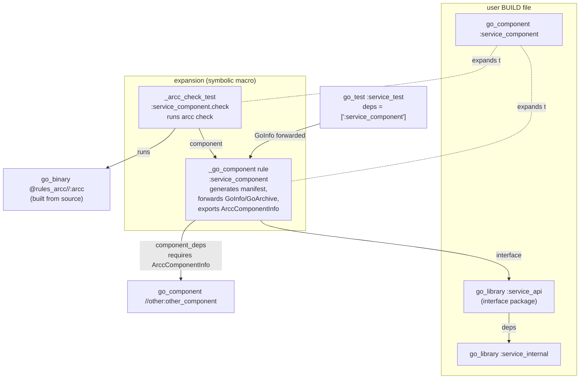
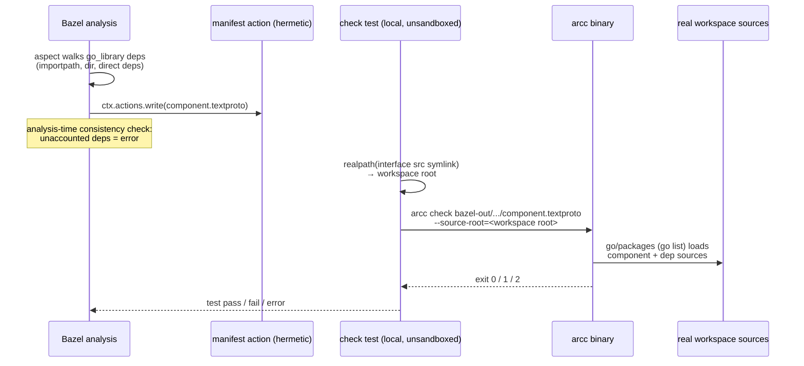

# Detailed Design: arcc as a Bazel Rule (`go_component`)

Status: draft for review — 2026-07-16.

## 1. Overview

This design adds Bazel integration to Architectural Contracts (`arcc`): a `go_component` symbolic macro that attaches an architectural-component declaration to an existing rules_go `go_library`, generates the component's `component.textproto` manifest from Bazel's own dependency graph, and enforces the contract by running `arcc check` as a Bazel test.

Delivery is phased:

- **Phase 1 (trial-ready):** manifest generation is a normal hermetic build action; the `arcc check` test runs **non-hermetically** (`tags = ["local"]`, unsandboxed) against the real source workspace using arcc's existing `go list`-based loading, plus one small arcc change: checking a manifest that is not colocated with the component's sources.
- **Phase 2 (hermetic end state):** arcc gains a package-layout loading mode fed by Bazel-serialized package metadata, making the check a fully sandboxed, cacheable, remote-execution-safe action.

All mechanics load-bearing for this design were validated in a running spike on Bazel 9.2.0 / rules_go 0.61.1 (`../research/spike-findings.md`, runnable workspace in `../research/spike/`).

## 2. Detailed Requirements

Consolidated from `../idea-honing.md` (Q1–Q13):

| # | Requirement | Source |
|---|---|---|
| R1 | Phase 1 ships a non-hermetic local check test first (quick trial in a real project); Phase 2 commits to a hermetic package-layout loading mode. | Q1 |
| R2 | The component rule **references** an existing user-written `go_library` (does not generate libraries). | Q2 |
| R3 | `interface` takes **exactly one** `go_library`; its entire package is the public surface. The manifest keeps file-level `interface_files` (all srcs of the interface library are emitted); arcc core semantics are unchanged. | Q3, Q13 |
| R4 | Phase 1 adds a component-root override to arcc (non-colocated manifests); directory-based membership (FR1) is retained in Phase 1. Explicit membership arrives with Phase 2. | Q4 |
| R5 | Absorbed dependencies: **explicit direct, derived transitive** (provisional — see §7.3 alternative). Explicitly listed absorbed deps may carry reasons; unaccounted-for dependencies are an analysis-time error. | Q5 |
| R6 | `contract` files are Bazel-only metadata (declared inputs, carried in the provider); the manifest schema and FR10 (contracts are doc-comment prose) are untouched. | Q6 |
| R7 | Enforcement is a test target, factored so the same check action can later be exposed as a validation action. | Q7 |
| R8 | `declared_authority` uses Starlark constants (`authority.bzl`) for load-time typo safety; rendered as strings into the manifest (arcc still validates at parse time). | Q8 |
| R9 | The macro is named `go_component`; the component target forwards `GoInfo`/`GoArchive` so `deps = [":my_component"]` "just works" in any rules_go rule. | Q9, spike A |
| R10 | Rules live in this repo under top-level `bazel_rules/`; the repo becomes a bzlmod module. | Q10 |
| R11 | A bazelified variant of the csvtool examples demonstrates the rules end to end. | Q10 |
| R12 | Consumers obtain the arcc binary built **from source** via rules_go through the bzlmod dependency. | Q11 |
| R13 | Target Bazel 8+ using symbolic macros (validated on 9.2). | Q12 |

## 3. Architecture Overview

### 3.1 Target and provider graph



### 3.2 Phase 1 check data flow



### 3.3 Phase roadmap

- **Phase 1:** `bazel_rules/` (macro, rule, aspect, check test, authority constants) + arcc `--source-root` / `component_root` support + bazelified csvtool examples + repo bzlmod-ification.
- **Phase 2:** package-layout emission from the rule + arcc in-process `GOPACKAGESDRIVER` (or equivalent) loading mode + flip the check test to sandboxed/hermetic (drop `local` tag) + explicit membership in the manifest.

## 4. Components and Interfaces

### 4.1 Repository / module layout

The repo root gains a `MODULE.bazel` (module name **`rules_arcc`**) so external workspaces can `bazel_dep` on it. New top-level directory:

```
bazel_rules/
  BUILD.bazel
  defs.bzl            # public: go_component (symbolic macro)
  authority.bzl       # public: FILES, NETWORK, ... constants + ALL list
  providers.bzl       # public: ArccComponentInfo (for rule authors/aspects)
  private/
    component.bzl     # _go_component rule + _arcc_deps aspect
    check.bzl         # _arcc_check_test rule
  examples/           # bazelified csvtool (see §8)
```

Load surface for consumers (note: `//bazel_rules`, not the sketch's `//go`, because `go/` is the Go module directory — flagged for review):

```python
load("@rules_arcc//bazel_rules:defs.bzl", "go_component")
load("@rules_arcc//bazel_rules:authority.bzl", "FILES")
```

Supporting pieces:

- `MODULE.bazel`: `bazel_dep` on `rules_go`; `go_deps` extension over `go/go.mod` so arcc's own dependencies (capslock, x/tools, protobuf) resolve for consumers (R12).
- Gazelle-generated `BUILD.bazel` files for `go/` so `//go/cmd/arcc` builds as a `go_binary`. An alias target `@rules_arcc//:arcc` is the stable name the check rule uses.
- The existing non-Bazel flow (`just ci`, plain `go build`) is untouched; BUILD files are additive.

### 4.2 `go_component` symbolic macro (public API)

```python
go_component(
    name = "service_component",
    interface = ":service_api",              # exactly ONE go_library (R3)
    component_deps = [                       # targets providing ArccComponentInfo
        "//path/to/other:other_component",
    ],
    absorbed_deps = {                        # label → reason (R5)
        "//third_party/csvparse": "impl detail: CSV parsing",
        "@org_golang_x_crypto//sha3": "hashing impl detail",
    },
    contract = ["component-contract.md"],    # Bazel-only metadata (R6)
    declared_authority = [FILES],            # authority.bzl constants (R8)
    visibility = ["//visibility:public"],
)
```

Expansion (validated in spike, question C):

| Target | Kind | Purpose |
|---|---|---|
| `name` | `_go_component` | generates manifest; forwards `GoInfo` + `GoArchive` from `interface`; exports `ArccComponentInfo` |
| `name + ".check"` | `_arcc_check_test` | runs `arcc check` on the generated manifest; `size = "small"`; Phase 1: `tags = ["local", "external"]` |

Macro attrs are typed (`configurable = False` where selects make no sense). `interface` is `attr.label` (single, mandatory); passing a list is a load-time error — this enforces R3 structurally.

### 4.3 `_arcc_deps` aspect

`GoArchiveData` does not expose per-package direct-dependency edges, so a small aspect propagates along `deps` (and `embed`) of `go_library` targets reachable from `interface`, `component_deps`, and `absorbed_deps` keys, collecting one struct per package:

```python
ArccPackageInfo = provider(fields = {
    "packages": "depset of struct(label, importpath, dir, srcs, deps)",
})  # deps = tuple of direct-dependency importpaths
```

This gives analysis-time access to the full closure **with edges**, enabling membership classification (§5.3), the consistency check (§6.1), and Phase 2 layout emission (§4.6). Stdlib does not appear (spike, question B) — stdlib authority remains entirely arcc's concern.

### 4.4 `_go_component` rule

Implementation steps (all at analysis time; the only action is one `ctx.actions.write`):

1. **Component root** := the directory of the BUILD package that declares the `go_component` target (i.e. `ctx.label.package`). Rationale: predictable, matches "manifest at the component root" mental model, and works with Q4's retained directory-based membership. Validation: every member package's `dir` must be under this root, and no component dep's root may be under it (roots disjoint, mirroring arcc's existing rule). Violations are analysis-time errors.
2. **Membership classification** (§5.3) over the aspect-collected closure; run the **consistency check** (§6.1).
3. **Manifest generation:** write `name.component.textproto` (schema §5.1) with all paths relativized from workspace-relative `short_path`s to component-root-relative ones (spike note 1); `component_dependencies.manifest` entries point at dep components' *generated* manifests, path-relativized against this manifest's output directory (both live in the same output tree, so relative paths are well-defined).
4. **Providers returned:** `ArccComponentInfo` (§5.2), the interface library's `GoInfo` and `GoArchive` verbatim (R9), and `DefaultInfo(files = [manifest])`.

### 4.5 `_arcc_check_test` (Phase 1)

A test rule whose action writes a small launcher script:

1. Recover the real workspace root: `realpath` of the interface library's first source file in runfiles, minus its known workspace-relative path (spike, question D).
2. Exec `arcc check <runfiles path of manifest> --source-root=<workspace root> --format=json` (JSON kept for future tooling; human output passes through for the test log).
3. Exit-code mapping is arcc's own: 0 pass, 1 violation (test failure), 2 tool error (also test failure, distinguishable in the log).

Runfiles: the arcc binary (`@rules_arcc//:arcc`), the transitive manifest depset, the interface srcs (for root recovery). Tags: `local` (no sandbox — needs real workspace + `go list`), `external` (results may depend on state outside declared inputs, e.g. `go.mod`/module cache; prevents stale cache hits). Phase 1 constraint, documented: **the consuming workspace must also be a working Go module** (`go.mod` present, module cache populated) — standard for Gazelle-managed repos.

Factoring for R7: the command construction lives in a helper shared between the test rule and a future `_arcc_validation` action so the validation-action variant (Phase 2+, once hermetic) reuses it unchanged.

### 4.6 arcc CLI & Phase 2 loading mode

**Phase 1 arcc changes (small):**

- New flag `arcc check <manifest> --source-root=<dir>`.
- New optional manifest field `component_root` (§5.1). When present, the component root is `<source-root>/<component_root>` instead of the manifest's directory; all `interface_files` and membership resolution are relative to that root. Applies recursively: a `component_dependencies.manifest` reference whose resolved manifest also carries `component_root` resolves against the same `--source-root`. Colocated manifests (no field) behave exactly as today, flag present or not.

**Phase 2 (committed direction, implementation deferred):**

- The rule additionally emits a `package layout` JSON (§5.4) enumerating every package in the closure (importpath, srcs, direct deps) plus the Go SDK stdlib source root (from the rules_go toolchain).
- arcc gains an in-process **`GOPACKAGESDRIVER` self-exec mode**: `arcc check --package-layout=layout.json` sets `GOPACKAGESDRIVER` to the arcc binary itself; the driver subcommand answers `go/packages` queries from the layout file. `goanalysis` and `capslockadapter` keep calling `packages.Load` unchanged — `go/packages` parses and type-checks from source in-process once the driver supplies file lists and the import graph. This is the least-invasive path through arcc's architecture and doubles as a general non-`go list` entry point for other build systems.
- Explicit membership lands here: the manifest (or layout) lists member packages, replacing directory-derivation under Bazel (R4).
- The check test drops `local`/`external` and becomes a plain hermetic test; a validation-action variant becomes possible.

## 5. Data Models

### 5.1 Manifest schema change (additive)

```proto
message Component {
  // ... existing fields 1-5 unchanged ...
  // If set, the component root is this path resolved against the checker's
  // --source-root (instead of the manifest file's own directory). Enables
  // manifests generated outside the source tree (e.g. by Bazel).
  optional string component_root = 6;   // workspace-relative, e.g. "path/to/svc"
}
```

Backward compatible: absent field ⇒ today's colocation semantics. `interface_files` remain component-root-relative (C9 unchanged in spirit; the root is just named explicitly).

### 5.2 `ArccComponentInfo` provider

```python
ArccComponentInfo = provider(fields = {
    "component_name":       "string, logical name (= target name)",
    "component_root":       "string, workspace-relative root directory",
    "manifest":             "File, generated component.textproto",
    "transitive_manifests": "depset[File], own + all component deps' manifests",
    "closure":              "depset[struct], this component's member+absorbed packages (for dependents' subtraction)",
    "contracts":            "depset[File], contract docs (Bazel-only, R6)",
})
```

### 5.3 Membership classification (analysis time)

For each package `P` in the interface library's closure (from the aspect), classified in this order:

1. **Component-dep-covered:** `P` is in some `component_deps[i].closure` → excluded from this component; the dep covers it.
2. **Member:** `P.dir` is under the component root → member (Phase 1: must also hold for arcc's directory-derived view, hence the §4.4 validation).
3. **Absorbed:** `P` is a key of `absorbed_deps`, or in the closure of one → emitted as `absorbed_dependencies` (explicit keys keep their reason; derived closure members get `reason: "transitively absorbed via <label>"`).
4. **Unaccounted** → analysis-time error (§6.1).

Diamond rule: coverage (1) wins over absorption (3); explicitly absorbing a package already covered by a listed component dep is an analysis-time error (conflicting declaration). A package covered by two component deps is fine.

### 5.4 Package layout JSON (Phase 2)

```json
{
  "go_sdk_root": "external/rules_go++go_sdk+.../src",
  "packages": [
    {"importpath": "example.com/svc", "srcs": ["svc/api.go"], "deps": ["example.com/svc/internal"]},
    {"importpath": "example.com/svc/internal", "srcs": ["svc/internal/impl.go"], "deps": ["example.com/other"]}
  ]
}
```

(Exact schema finalized with the Phase 2 arcc work; shown here to fix the direction.)

### 5.5 `authority.bzl`

One string constant per capability in arcc's known set (`FILES`, `NETWORK`, `READ_SYSTEM_STATE`, `MODIFY_SYSTEM_STATE`, `OPERATING_SYSTEM`, `SYSTEM_CALLS`, `EXEC`, `RUNTIME`, `ARBITRARY_EXECUTION`, `CGO`, `UNSAFE_POINTER`, `REFLECT`, `UNANALYZED`) plus `ALL_AUTHORITIES` for tooling. The rule validates `declared_authority` values against this set at analysis time (belt) and arcc re-validates at parse time (suspenders). The Go source of truth is the capability list in `go/internal/manifest`; a CI check keeps `authority.bzl` in sync (§8).

## 6. Error Handling

### 6.1 Analysis-time errors (fail fast, in `bazel build`)

| Condition | Message sketch |
|---|---|
| Unaccounted dependency (§5.3 case 4) | `component "svc": package example.com/x (via //x:x) is neither a member, covered by a component_dep, nor absorbed. Add "//x:x" to absorbed_deps (with a reason) or add its component to component_deps.` |
| Member package outside component root | `component "svc": member package example.com/util (dir tools/util) lies outside component root path/to/svc. Move it, or declare it as its own component.` |
| Component roots nested | `component "svc": component_dep "other" has root path/to/svc/other, nested inside this component's root.` |
| Absorb/covered conflict (§5.3 diamond rule) | `component "svc": //third_party/x is already covered by component_dep "other"; remove it from absorbed_deps.` |
| Unknown authority string | `unknown declared_authority "FILE"; known: FILES, NETWORK, ...` (unreachable when constants are used) |
| `interface` target lacks `GoInfo` | standard Bazel providers error via `attr.label(providers = [GoInfo, GoArchive])` |

### 6.2 Check-time errors (in `bazel test`)

- arcc exit 1 (violations): test failure; arcc's human-readable violation report (call paths, evidence) is the test log.
- arcc exit 2 (tool error — manifest syntax, Go build failure, missing files): test failure with the arcc error verbatim, prefixed by the launcher with context (`arcc check failed to run; is this workspace a Go module? (Phase 1 requires go.mod)`).
- Workspace-root recovery failure (runfiles not symlinks — e.g. someone strips `local`): explicit launcher error naming the requirement rather than a confusing arcc failure.

### 6.3 Failure containment

Manifest generation is hermetic and cheap; only the check test is non-hermetic in Phase 1. A broken Go module context therefore breaks `bazel test` of `.check` targets but never `bazel build //...`.

## 7. Key Decisions and Alternatives

### 7.1 Component root = BUILD package directory
Simple, predictable, and compatible with Phase 1's directory-based membership. Alternative (rejected for now): common-prefix computation over member dirs — cleverer but surprising, and Phase 2's explicit membership removes the need.

### 7.2 Self-exec `GOPACKAGESDRIVER` for Phase 2
Keeps `goanalysis`/`capslockadapter` on the unmodified `packages.Load` path. Alternatives: hand-built `packages.Package` graphs (invasive in arcc), or synthesized module trees in the sandbox (rejected in research: fragile reverse-engineering of module layout).

### 7.3 ALTERNATIVE UNDER CONSIDERATION — fully derived absorption (Q5)
The design specifies explicit-direct absorption (R5). The alternative: **everything not component-dep-covered is silently absorbed** (`absorbed_deps` attr optional, reasons optional, no unaccounted-dependency error). Effects: zero BUILD friction when adding deps; loses the deliberate-absorption declaration and per-dep reasons; the §6.1 "unaccounted" error class disappears (arcc still catches authority violations — but only authority, not undeclared-structure drift). Switch cost is small and localized (§5.3 case 4 becomes "absorbed with generated reason"; one attr becomes optional), so this decision can be flipped at review or even post-trial. **To be settled by the user at design review.**

### 7.4 Load path `@rules_arcc//bazel_rules:defs.bzl`
The sketch's `@rules_arcc//go:def.bzl` collides with the `go/` Go-module directory in this repo (R10 keeps rules in-repo). If the ergonomics matter, a later split into a dedicated `rules_arcc` repo restores the conventional path; alternatively a top-level `go_component.bzl` re-export could shorten it. **Flagged for user review.**

## 8. Testing Strategy

1. **Starlark unit tests** (`rules_testing`): membership classification, path relativization, diamond/conflict errors, authority validation — table-driven over synthetic `go_library` graphs under `bazel_rules/tests/`.
2. **Bazelified csvtool examples as integration tests (R11):** BUILD files for `go/examples/csvtool/{toprow,csvfile,app}` declaring `go_component`s mirroring their existing manifests (toprow: no authority; csvfile: `[FILES]`; app: component deps prune authority). `bazel test //go/examples/...` must pass; the generated manifests are additionally golden-compared against the semantics of the checked-in colocated manifests (same interface files, deps, authority — modulo `component_root`).
3. **Negative tests:** an `absorbapp`-style violating component whose `.check` is asserted to fail (wrapped in a script test expecting exit≠0), plus one analysis-failure test per §6.1 error class (`rules_testing` failure tests).
4. **arcc Go tests:** unit/integration coverage for `--source-root` + `component_root` resolution (including dep-manifest chains), reusing the existing integration-test harness.
5. **Consistency check in CI:** `authority.bzl` vs. the Go capability set; `just ci` extended with (or accompanied by) `bazel test //bazel_rules/... //go/examples/...` where Bazel is available.
6. **Dogfood (stretch, Phase 1.5):** `go_component` declarations for arcc's own components, converging `just selfcheck` and the Bazel checks.

## 9. Integration with Existing System

- **arcc core:** two additive changes in Phase 1 — the `component_root` proto field (regenerate `go/internal/manifest/gen`) and `--source-root` flag threading through `cli` → `manifest` → `goanalysis`. The checker/facts/report/capanalyzer components are untouched. Phase 2 adds the driver subcommand as a new leaf in `cli` plus a loading seam in `goanalysis`/`capslockadapter` (env-var setup only).
- **Repo:** gains `MODULE.bazel`, Gazelle-managed BUILD files under `go/`, and `bazel_rules/`. `proto/` schema change is additive. The `structured-spec-to-code` / `just ci` workflow is unchanged; Bazel checks are an additional CI leg.
- **Self-hosting story:** unchanged in Phase 1 (`just selfcheck` keeps using colocated manifests); §8.6 sketches convergence.

## 10. Adherence to Established Conventions

- FR1 (directory-based membership) retained in Phase 1 per Q4; explicitly superseded under Bazel in Phase 2 (documented departure, motivated by Bazel's explicit-enumeration model).
- FR10 (no contract field in the manifest) upheld — `contract` never reaches the manifest (R6).
- C9 (root-relative paths) generalized, not broken: `component_root` names the root explicitly; path semantics below the root are unchanged.
- C12 (dep manifest `name` match) unchanged — the rule emits dep names from `ArccComponentInfo.component_name`, so matches hold by construction.
- Proto changes follow the existing style (field comments documenting semantics and constraint references).

## 11. Migration Strategy / Backward Compatibility

- All arcc changes are additive: colocated manifests without `component_root` behave identically; `--source-root` is optional; exit codes and output formats unchanged. No existing manifest, example, or selfcheck needs modification in Phase 1.
- Bazel adoption is incremental by design (R2): a repo can componentize one library at a time; non-componentized dependents keep working, and can even depend on component targets directly (R9).
- Phase 1 → Phase 2 migration is transparent to BUILD files: same `go_component` API; the check test silently becomes hermetic. The only behavioural change is stricter membership (explicit list vs. directory) — flagged violations at that point are real declarations drifting from reality.

## Appendix A: Research Summary

See `../research/` for full notes; key findings:

- **`go/packages` cannot run in a Bazel sandbox** (shells out to `go list`; rules_go#1996). This forced the phasing and the Phase 2 driver design.
- **`go_proto_library` precedent** proves provider forwarding; spike-confirmed with a passing `go_test` depending on a component target.
- **`GoArchive.transitive`** provides the package closure (importpaths + srcs) at analysis time, excluding stdlib; per-package *edges* require the `_arcc_deps` aspect.
- **`tags=["local"]` tests** see runfiles as symlinks into the real workspace — the Phase 1 keystone.
- **No prior art** for Capslock-under-Bazel; validation actions and rules_lint surveyed for the enforcement-point decision.
- Spike environment note: rules_go needs `--@rules_go//go/config:pure` (or a CC toolchain) — worth a line in consumer docs.

## Appendix B: Technology Choices

| Choice | Rationale | Alternatives rejected |
|---|---|---|
| Symbolic macros (Bazel 8+) | typed attrs, clean `name`/`name.check` namespacing | legacy macros (wider compat, less hygiene) |
| Test-target enforcement | matches CI norms, cacheable, sketch-compatible | validation action day-one (blunter, more Phase-1 work) — kept as future option |
| Starlark authority constants | load-time typo safety, zero target boilerplate | label marker targets (boilerplate), bare strings (late errors) |
| arcc from source via rules_go | version-matched, hermetic, trivially patchable | prebuilt SLSA release binaries (skew risk) — possible later toolchain option |
| In-repo `bazel_rules/` | co-versioned with the moving manifest format | separate `rules_arcc` repo (ecosystem-standard, later) |
