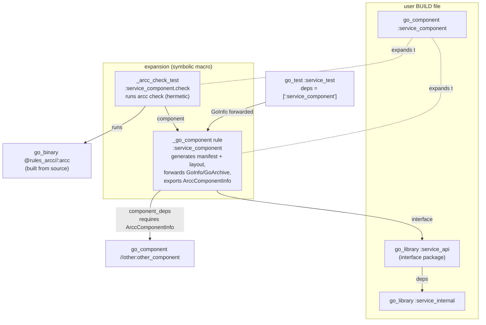

# Detailed Design: arcc as a Bazel Rule (`go_component`)

Status: draft for review — 2026-07-16; revised hermetic-only — 2026-07-20.

## 1. Overview

This design adds Bazel integration to Architectural Contracts (`arcc`): a `go_component` symbolic macro that attaches an architectural-component declaration to an existing rules_go `go_library`, generates the component's `component.textproto` manifest and a `package-layout.json` from Bazel's own dependency graph, and enforces the contract by running `arcc check` as a **hermetic** Bazel test.

The check is a fully sandboxed, cacheable, remote-execution-safe action: arcc loads Go packages from the Bazel-emitted package layout through a self-exec `GOPACKAGESDRIVER` mode, with **no `go list` and no `go.mod`** in the consuming workspace. arcc's existing `go/packages`-based loaders (`goanalysis`, `capslockadapter`) run through the driver unchanged.

Three spikes validate the load-bearing mechanics:

- **Provider forwarding, closure enumeration, and the macro** — validated on Bazel 9.2.0 / rules_go 0.61.1 (`../research/spike-findings.md`, runnable workspace in `../research/spike/`).
- **The `_arcc_deps` aspect (producer)** — the closure-with-edges reconstruction, including `embed` merge, diamond dedup, stdlib exclusion, and SDK-sourced stdlib set/source/`go_sdk_root`: validated on the same toolchain (`../research/spike-aspect-findings.md`, runnable workspace in `../research/spike-aspect/`).
- **Hermetic driver loading (consumer)** — the self-exec `GOPACKAGESDRIVER` seam that makes the whole design hermetic: validated end to end (Capslock capability analysis from a Bazel-style layout with no `go.mod`), see `../research/spike-driver-findings.md` and `../research/spike-driver/`.

An earlier draft phased delivery through a non-hermetic interim mode (`go list` against the real workspace). That mode is dropped: it requires the consuming workspace to also be a working Go module (`go.mod` present, module cache populated), which is not assumable for Bazel-only workspaces, and arcc is a pre-deployment PoC with no users needing an interim path. With the driver seam validated, the hermetic design is the whole design.

## 2. Detailed Requirements

Consolidated from `../idea-honing.md` (Q1–Q13); three answers were revisited at design review (noted inline):

| # | Requirement | Source |
|---|---|---|
| R1 | Enforcement uses a **hermetic** package-layout loading mode; the `arcc check` runs as a sandboxed, cacheable Bazel test. (Revised from Q1's phased plan — the non-hermetic interim mode is dropped.) | Q1 |
| R2 | The component rule **references** an existing user-written `go_library` (does not generate libraries). | Q2 |
| R3 | `interface` takes **exactly one** `go_library`; its entire package is the public surface. The manifest keeps file-level `interface_files` (all srcs of the interface library are emitted); arcc core semantics are unchanged. | Q3, Q13 |
| R4 | Membership is **explicit**, derived by the rule from the aspect closure and carried in the package layout; directory-based membership (FR1) is superseded under Bazel. (Revised from Q4, which retained directory membership for the dropped interim mode.) | Q4 |
| R5 | Absorbed dependencies: **explicit direct label list, derived transitive**; no per-dep reasons; unaccounted-for dependencies are an analysis-time error. (Revised from Q5's dict-with-reasons; see §7.3.) | Q5 |
| R6 | `contract` files are Bazel-only metadata (declared inputs, carried in the provider); the manifest schema and FR10 (contracts are doc-comment prose) are untouched. | Q6 |
| R7 | Enforcement is a test target, factored so the same check action can later be exposed as a validation action. | Q7 |
| R8 | `declared_authority` uses Starlark constants (`authority.bzl`) for load-time typo safety; rendered as strings into the manifest (arcc still validates at parse time). | Q8 |
| R9 | The macro is named `go_component`; the component target forwards `GoInfo`/`GoArchive` so `deps = [":my_component"]` "just works" in any rules_go rule. | Q9, spike A |
| R10 | Rules live in this repo under top-level `bazel_rules/` (language-neutral pieces at `bazel_rules/`, Go rules under `bazel_rules/go/`); the repo becomes a bzlmod module. | Q10 |
| R11 | A bazelified variant of the csvtool examples demonstrates the rules end to end. | Q10 |
| R12 | Consumers obtain the arcc binary built **from source** via rules_go through the bzlmod dependency. | Q11 |
| R13 | Target Bazel 8+ using symbolic macros (validated on 9.2). | Q12 |

## 3. Architecture Overview

### 3.1 Target and provider graph



### 3.2 Hermetic check data flow

```mermaid
sequenceDiagram
    participant BA as Bazel analysis
    participant MG as manifest + layout actions (hermetic)
    participant CT as check test (sandboxed)
    participant ARCC as arcc (+ self-exec driver)

    BA->>BA: aspect walks go_library deps<br/>(importpath, dir, srcs, direct deps)
    BA->>MG: ctx.actions.write(component.textproto)<br/>+ ctx.actions.write(package-layout.json)
    Note over BA: analysis-time consistency check:<br/>unaccounted deps = error
    CT->>ARCC: arcc check <manifest> --package-layout=<layout.json>
    ARCC->>ARCC: set GOPACKAGESDRIVER=self;<br/>packages.Load answers from layout
    Note over ARCC: no go list, no go.mod;<br/>stdlib source from the rules_go SDK
    ARCC-->>CT: exit 0 / 1 / 2
    CT-->>BA: test pass / fail / error
```

### 3.3 Delivery

A single hermetic delivery:

- `bazel_rules/` (macro, rule, aspect, check test, authority constants, providers) with the layout **and** manifest emitted from the rule.
- arcc gains one loading seam: a self-exec `GOPACKAGESDRIVER` mode (`arcc check --package-layout=...`) plus explicit-membership handling; the checker/facts/report/capanalyzer components are untouched.
- Bazelified csvtool examples; repo bzlmod-ification.

## 4. Components and Interfaces

### 4.1 Repository / module layout

The repo root gains a `MODULE.bazel` (module name **`rules_arcc`**) so external workspaces can `bazel_dep` on it. New top-level directory, split so language-neutral pieces sit at `bazel_rules/` and Go-specific rules sit under `bazel_rules/go/` (mirroring the repo's own `go/` Go-module directory), leaving room for `bazel_rules/rust/` etc. later:

```
bazel_rules/
  BUILD.bazel
  authority.bzl       # public, language-neutral: FILES, NETWORK, ... + ALL_AUTHORITIES
  providers.bzl       # public, language-neutral: ArccComponentInfo (cross-language component contract)
  go/
    BUILD.bazel
    defs.bzl          # public: go_component (symbolic macro); re-exports authority constants for one-load ergonomics
    providers.bzl     # public: ArccPackageInfo (Go-specific: importpath, srcs, deps)
    private/
      aspect.bzl      # _arcc_deps aspect + the by-importpath closure merge
      component.bzl   # _go_component rule
      check.bzl       # _arcc_check_test rule
    tests/            # Starlark unit tests (§8)
```

The bazelified csvtool lives with the existing Go examples at `go/examples/csvtool/` (BUILD files added in place; §8), not under `bazel_rules/`.

Load surface for consumers — Go rules from `bazel_rules/go/`, shared authority taxonomy from `bazel_rules/`:

```python
load("@rules_arcc//bazel_rules/go:defs.bzl", "go_component", "FILES")   # FILES re-exported for one-load convenience
# equivalently, straight from the shared, language-neutral location:
load("@rules_arcc//bazel_rules:authority.bzl", "FILES")
```

`go_component` is inherently Go-specific, but the authority taxonomy and the `ArccComponentInfo` contract are arcc-level and language-independent, so a future `rust_component` reuses them unchanged. `defs.bzl` re-exports the authority constants so a pure-Go consumer can load everything from one path.

Supporting pieces:

- `MODULE.bazel`: `bazel_dep` on `rules_go`; `go_deps` extension over `go/go.mod` so arcc's own dependencies (capslock, x/tools, protobuf) resolve for consumers (R12).
- Gazelle-generated `BUILD.bazel` files for `go/` so `//go/cmd/arcc` builds as a `go_binary`. An alias target `@rules_arcc//:arcc` is the stable name the check rule uses.
- The existing non-Bazel flow (`just ci`, plain `go build`) is untouched; BUILD files are additive.

### 4.2 `go_component` symbolic macro (public API)

```python
go_component(
    name = "service_component",
    interface = ":service_api",              # exactly ONE go_library (R3)
    component_deps = [                       # targets providing ArccComponentInfo
        "//path/to/other:other_component",
    ],
    absorbed_deps = [                        # plain label list (R5); no reasons
        "//third_party/csvparse",            # (a BUILD comment suffices to note why)
        "@org_golang_x_crypto//sha3",
    ],
    contract = ["component-contract.md"],    # Bazel-only metadata (R6)
    declared_authority = [FILES],            # authority.bzl constants (R8)
    visibility = ["//visibility:public"],
)
```

Expansion (validated in spike, question C):

| Target | Kind | Purpose |
|---|---|---|
| `name` | `_go_component` | generates manifest + package layout; forwards `GoInfo` + `GoArchive` from `interface`; exports `ArccComponentInfo` |
| `name + ".check"` | `_arcc_check_test` | runs `arcc check` on the generated manifest; `size = "small"`; hermetic (no special tags) |

Macro attrs are typed (`configurable = False` where selects make no sense). `interface` is `attr.label` (single, mandatory); passing a list is a load-time error — this enforces R3 structurally. `absorbed_deps` is `attr.label_list` (R5).

### 4.3 `_arcc_deps` aspect

`GoArchiveData` does not expose per-package direct-dependency edges (its only edge data is the private, label-based `_dep_labels`), so a small aspect propagates along `deps` **and** `embed` of `go_library` targets reachable from `interface`, `component_deps`, and `absorbed_deps`, collecting one struct per package:

```python
ArccPackageInfo = provider(fields = {
    "packages": "depset of struct(importpath, dir, srcs, deps)",
})  # deps = tuple of direct-dependency importpaths
```

Per node: `srcs = GoInfo.srcs` (rules_go has already merged embedded libs' sources in), `dir = srcs[0].dirname`, and `deps = sorted(a.data.importpath for a in GoArchive.direct if a.data.importpath != self)` — `GoArchive.direct` already excludes stdlib and the same-importpath embedded lib. This gives analysis-time access to the full closure **with edges**, enabling membership classification (§5.3), the consistency check (§6.1), and package-layout emission (§4.6). Stdlib does not appear in the aspect closure (spike, question B); the layout adds the SDK stdlib separately (§4.6) — stdlib authority remains entirely arcc's concern.

**`embed` handling (the one non-obvious correctness rule; validated in `../research/spike-aspect-findings.md`).** The aspect must traverse `embed`, because an embed-only transitive dependency is otherwise never visited and its sources would be missing from the layout. But traversing `embed` also visits the embedded library as its own node carrying the **same import path** as its embedder. The rule therefore folds nodes **by import path**, unioning srcs and deps — a naïve last-write-wins map is an order-dependent bug. The union is safe because rules_go makes the embedder's `GoInfo.srcs`/`GoArchive.direct` a superset of the embedded lib's. Non-Go and no-importpath (`main`) nodes are guarded out; every projection is `sorted()` for deterministic, cache-stable output.

### 4.4 `_go_component` rule

Implementation steps (all at analysis time; the actions are two `ctx.actions.write`s — manifest and layout):

1. **Component root** := the directory of the BUILD package that declares the `go_component` target (`ctx.label.package`). With explicit membership this is only the manifest's logical home and the anchor for the component-dependency disjointness check (no component dep's root may be under it, mirroring arcc's existing rule); it is **not** a membership boundary. Violations are analysis-time errors.
2. **Membership classification** (§5.3) over the aspect-collected closure; run the **consistency check** (§6.1).
3. **Manifest generation:** write `name.component.textproto` (schema §5.1); `component_dependencies.manifest` entries point at dep components' *generated* manifests, path-relativized against this manifest's output directory (both live in the same output tree, so relative paths are well-defined).
4. **Layout generation:** write `name.package-layout.json` (§5.4) enumerating every member and absorbed package (importpath, srcs, direct deps) and marking the component's member packages as the load roots, plus the Go SDK stdlib source root (from the rules_go toolchain).
5. **Providers returned:** `ArccComponentInfo` (§5.2), the interface library's `GoInfo` and `GoArchive` verbatim (R9), and `DefaultInfo(files = [manifest, layout])`.

### 4.5 `_arcc_check_test`

A test rule whose action writes a small launcher script that execs:

```
arcc check <runfiles manifest> --package-layout=<runfiles layout> --format=json
```

- Exit-code mapping is arcc's own: 0 pass, 1 violation (test failure), 2 tool error (also test failure, distinguishable in the log). JSON kept for future tooling; human output passes through for the test log.
- Runfiles: the arcc binary (`@rules_arcc//:arcc`), the transitive manifest depset, the transitive layout depset, and the member/absorbed package srcs referenced by the layout. The rules_go Go SDK provides the stdlib source (its files are named by the layout).
- **Hermetic:** no `local` tag, no workspace-root recovery, no `go.mod` requirement — the test is sandboxed and cacheable, and remote-execution-safe once the SDK stdlib and cgo-preprocessed sources are declared inputs (§4.6).

Factoring for R7: command construction lives in a helper shared between the test rule and a future `_arcc_validation` action, so the validation-action variant (failing `bazel build`) reuses it unchanged.

### 4.6 arcc CLI & loading mode

arcc gains one new loading mode (additive; colocated non-Bazel manifests keep working exactly as today):

- **CLI:** `arcc check <manifest> --package-layout=<layout.json>`.
- **Self-exec `GOPACKAGESDRIVER`:** when `--package-layout` is set, arcc points `GOPACKAGESDRIVER` at the arcc binary itself and a driver subcommand answers `go/packages` queries from the layout file. `goanalysis` and `capslockadapter` keep calling `packages.Load` unchanged — `go/packages` parses and type-checks from source in-process once the driver supplies file lists and the import graph. This is the least-invasive path through arcc's architecture (§7.2) and doubles as a general non-`go list` entry point for other build systems.
- **Path resolution:** under `--package-layout`, `interface_files` and all package srcs are workspace-relative and resolved via the layout (not relative to the manifest's own directory), so the manifest need not be colocated with sources.
- **Explicit membership:** the layout's designated load roots are the component's member packages, replacing directory-derivation under Bazel (R4).

Constraints surfaced and validated by the driver spike (`../research/spike-driver-findings.md`), load-bearing for the layout emission:

1. **The driver must serve the `"std"` meta-pattern.** Capslock issues its own `packages.Load(nil, "std")` deep in analysis, so the layout must enumerate the full standard library (from the SDK), and the driver must resolve `"std"` to it — not only the closure's imports. The full stdlib import-path set is the rules_go toolchain's `sdk.package_list` file (`../research/spike-aspect-findings.md`, finding 4).
2. **Stdlib source is read at check time from the SDK's `GOROOT/src`,** declared as a rules_go toolchain input; hermetically satisfiable, but it must be wired into the check's inputs. Concretely: `sdk.srcs` (the `GOROOT/src` `File`s) as declared inputs, and `go_sdk_root = sdk.root_file.dirname + "/src"` in the layout.
3. **cgo is the hermeticity risk.** cgo packages' `CompiledGoFiles` are preprocessed sources that `go list` leaves in the build cache; the layout emission must obtain them as declared Bazel outputs (rules_go produces them) rather than referencing the cache. Pure-Go closures are unaffected.

## 5. Data Models

### 5.1 Manifest schema

No proto change is required for the hermetic mode; the existing `Component` message (`name`, `interface_files`, `component_dependencies`, `absorbed_dependencies`, `declared_authority`) is emitted as today. The differences are semantic, not schematic:

- `interface_files` are workspace-relative and resolved via the layout (§4.6) rather than relative to the manifest's directory. arcc is a pre-deployment PoC with no compatibility constraints, so this generalization needs no versioning gymnastics; colocated non-Bazel manifests keep their existing directory-relative semantics when `--package-layout` is absent.
- Membership is not encoded in the manifest — it is the layout's load roots (§5.4). The manifest remains the human-facing contract (interface, dependencies, declared authority); the layout is the machine-facing load graph.

`absorbed_dependencies` continue to carry the (already `optional`) `reason` field in the proto, but the rule never populates it (R5): absorbed deps are an implementation detail the component takes responsibility for and need not justify to consumers.

### 5.2 `ArccComponentInfo` provider

```python
ArccComponentInfo = provider(fields = {
    "component_name":       "string, logical name (= target name)",
    "component_root":       "string, workspace-relative root directory (manifest's logical home)",
    "manifest":             "File, generated component.textproto",
    "layout":               "File, generated package-layout.json",
    "transitive_manifests": "depset[File], own + all component deps' manifests",
    "transitive_layouts":   "depset[File], own + all component deps' layouts",
    "closure":              "depset[struct], this component's member+absorbed packages (for dependents' subtraction)",
    "contracts":            "depset[File], contract docs (Bazel-only, R6)",
})
```

### 5.3 Membership classification (analysis time)

For each package `P` in the interface library's closure (from the aspect), classified in this order:

1. **Component-dep-covered:** `P` is in some `component_deps[i].closure` → excluded from this component; the dep covers it.
2. **Absorbed:** `P` is a listed `absorbed_deps` label, or in the closure of one → emitted as `absorbed_dependencies` (no reason recorded, R5).
3. **Member:** otherwise `P` is a member of this component (explicit — the aspect closure minus coverage and absorption); emitted as a load root in the layout.

Diamond rule: coverage (1) wins over absorption (2); explicitly absorbing a package already covered by a listed component dep is an analysis-time error (conflicting declaration). A package covered by two component deps is fine.

Note the ordering change from the earlier directory-based scheme: with explicit membership there is no "member vs. absorbed by directory" test and no "unaccounted" fall-through by geography — every closure package is covered, absorbed, or a member by construction. The one remaining analysis-time error is the diamond conflict (§6.1).

### 5.4 Package layout JSON

```json
{
  "go_sdk_root": "external/rules_go++go_sdk+.../src",
  "roots": ["example.com/svc"],
  "packages": [
    {"importpath": "example.com/svc", "srcs": ["svc/api.go"], "deps": ["example.com/svc/internal"]},
    {"importpath": "example.com/svc/internal", "srcs": ["svc/internal/impl.go"], "deps": ["example.com/other"]}
  ]
}
```

`roots` are the component's member packages (§5.3). The driver serves both exact-importpath queries and the `"std"` meta-pattern (§4.6, finding 1); `go_sdk_root` supplies the stdlib source tree. The member/absorbed `packages` come from the `_arcc_deps` aspect (§4.3); the stdlib set (for `"std"`), the stdlib source, and `go_sdk_root` come from the rules_go toolchain's `sdk.package_list`, `sdk.srcs`, and `sdk.root_file` respectively (`../research/spike-aspect-findings.md`, finding 4). Producer emission is validated in `../research/spike-aspect/`; the consumer-side round-trip through `go/packages`' own driver JSON form in `../research/spike-driver/`; the exact wire encoding is finalized where the two meet (the arcc loading-mode implementation).

### 5.5 `authority.bzl`

One string constant per capability in arcc's known set (`FILES`, `NETWORK`, `READ_SYSTEM_STATE`, `MODIFY_SYSTEM_STATE`, `OPERATING_SYSTEM`, `SYSTEM_CALLS`, `EXEC`, `RUNTIME`, `ARBITRARY_EXECUTION`, `CGO`, `UNSAFE_POINTER`, `REFLECT`, `UNANALYZED`) plus `ALL_AUTHORITIES` for tooling. The rule validates `declared_authority` values against this set at analysis time (belt) and arcc re-validates at parse time (suspenders). The Go source of truth is the capability list in `go/internal/manifest`; a CI check keeps `authority.bzl` in sync (§8). It lives at `bazel_rules/authority.bzl` (language-neutral) and is re-exported from `bazel_rules/go/defs.bzl`.

## 6. Error Handling

### 6.1 Analysis-time errors (fail fast, in `bazel build`)

| Condition | Message sketch |
|---|---|
| Component roots nested | `component "svc": component_dep "other" has root path/to/svc/other, nested inside this component's root.` |
| Absorb/covered conflict (§5.3 diamond rule) | `component "svc": //third_party/x is already covered by component_dep "other"; remove it from absorbed_deps.` |
| Unknown authority string | `unknown declared_authority "FILE"; known: FILES, NETWORK, ...` (unreachable when constants are used) |
| `interface` target lacks `GoInfo` | standard Bazel providers error via `attr.label(providers = [GoInfo, GoArchive])` |

(The earlier "unaccounted dependency" and "member outside component root" errors are gone: explicit membership makes every closure package a member by construction unless covered or absorbed.)

### 6.2 Check-time errors (in `bazel test`)

- arcc exit 1 (violations): test failure; arcc's human-readable violation report (call paths, evidence) is the test log.
- arcc exit 2 (tool error — manifest syntax, layout inconsistency, missing source files): test failure with the arcc error verbatim.
- Layout/driver errors (e.g. a package src named by the layout is not in runfiles) surface as a clear arcc tool error rather than a confusing `go/packages` failure.

### 6.3 Failure containment

Manifest and layout generation are hermetic and cheap; the check test is a normal sandboxed test. `bazel build //...` is never affected by check outcomes, and `bazel test` of `.check` targets is cacheable and reproducible.

## 7. Key Decisions and Alternatives

### 7.1 Component root = BUILD package directory (anchor, not boundary)
With explicit membership, the component root is just the manifest's logical home and the anchor for the component-dependency disjointness check. It no longer constrains where member packages live, which removes the earlier "member outside root" machinery. Alternative (rejected): common-prefix computation over member dirs — unnecessary once membership is explicit.

### 7.2 Self-exec `GOPACKAGESDRIVER` for hermetic loading
Keeps `goanalysis`/`capslockadapter` on the unmodified `packages.Load` path; validated end to end (`../research/spike-driver-findings.md`). Alternatives: hand-built `packages.Package` graphs (invasive in arcc), or synthesized module trees in the sandbox (rejected in research: fragile reverse-engineering of module layout).

### 7.3 Absorbed dependencies: explicit label list, no reasons (Q5, settled)
`absorbed_deps` is a plain label list; unaccounted structural drift is caught because every closure package must be covered, absorbed, or a member. Per-dep reasons are dropped: absorbed deps are an implementation detail the component takes responsibility for (and whose ambient authority it accounts for), so they need not justify themselves to consumers — a BUILD comment suffices where a note is wanted. The manifest's `AbsorbedDependency.reason` is already `optional`, so this is a BUILD-attr-only decision. Rejected alternatives: **dict with required reasons** (the earlier draft — needless friction); **fully derived / silently absorbed** (drops the deliberate-absorption declaration and the drift signal, leaving only arcc's authority check).

### 7.4 Rule layout: `bazel_rules/` (shared) + `bazel_rules/go/` (Go) (Q10, settled)
Go-specific rules load from `@rules_arcc//bazel_rules/go:defs.bzl`; the language-neutral authority taxonomy and `ArccComponentInfo` contract sit at `bazel_rules/`, ready for a future `bazel_rules/rust/`. This resolves the earlier `//bazel_rules` vs `//go` collision (the sketch's `@rules_arcc//go:def.bzl` clashed with the `go/` Go-module directory) and mirrors the repo's own `go/` layout. A later split into a dedicated `rules_arcc` repo remains possible if adoption warrants.

## 8. Testing Strategy

1. **Starlark unit tests** (`rules_testing`, under `bazel_rules/go/tests/`): membership classification, layout emission, diamond/conflict errors, authority validation — table-driven over synthetic `go_library` graphs.
2. **Bazelified csvtool examples as integration tests (R11):** BUILD files for `go/examples/csvtool/{toprow,csvfile,app}` declaring `go_component`s mirroring their existing manifests (toprow: no authority; csvfile: `[FILES]`; app: component deps prune authority). `bazel test //go/examples/...` must pass; the generated manifests are additionally golden-compared against the checked-in colocated manifests (same interface files, deps, authority).
3. **Negative tests:** an `absorbapp`-style violating component whose `.check` is asserted to fail (script test expecting exit≠0), plus one analysis-failure test per §6.1 error class (`rules_testing` failure tests).
4. **arcc Go tests:** unit/integration coverage for `--package-layout` loading (driver `std` handling, cgo `CompiledGoFiles`, stdlib-from-SDK resolution, explicit-membership roots), reusing the existing integration-test harness. The `../research/spike-driver/` spike is the seed for these.
5. **Consistency check in CI:** `authority.bzl` vs. the Go capability set; **`just ci` extended to run `bazel build //...` and `bazel test //bazel_rules/... //go/examples/...`**, guarded on Bazel being available in the environment (the plain `go build` / `just ci` path stays green where Bazel is not provisioned).
6. **Dogfood (stretch):** `go_component` declarations for arcc's own components, converging `just selfcheck` and the Bazel checks.

## 9. Integration with Existing System

- **arcc core:** one additive change — the `--package-layout` loading mode: a self-exec driver subcommand in `cli`, and a loading seam in `goanalysis`/`capslockadapter` that is env-var setup only (`packages.Load` calls unchanged) plus workspace-relative path resolution for `interface_files`. The checker/facts/report/capanalyzer components are untouched. No proto change (§5.1).
- **Repo:** gains `MODULE.bazel`, Gazelle-managed BUILD files under `go/`, and `bazel_rules/`. The `structured-spec-to-code` / `just ci` workflow gains a Bazel leg (guarded).
- **Self-hosting story:** unchanged (`just selfcheck` keeps using colocated manifests via the existing `go list` path); §8.6 sketches convergence.

## 10. Adherence to Established Conventions

- FR1 (directory-based membership) retained for colocated non-Bazel manifests; explicitly superseded under Bazel by explicit membership (documented departure, motivated by Bazel's explicit-enumeration model).
- FR10 (no contract field in the manifest) upheld — `contract` never reaches the manifest (R6).
- C9 (root-relative paths): under `--package-layout`, `interface_files` are workspace-relative and layout-resolved; colocated-manifest semantics are unchanged.
- C12 (dep manifest `name` match) unchanged — the rule emits dep names from `ArccComponentInfo.component_name`, so matches hold by construction.

## 11. Migration / Backward Compatibility

arcc is a pre-deployment PoC with no external users, so backward compatibility is not a hard constraint — but the design happens to be additive anyway:

- The `--package-layout` mode is additive; colocated manifests without it behave exactly as today, so no existing manifest, example, or selfcheck changes.
- Bazel adoption is incremental (R2): a repo can componentize one library at a time; non-componentized dependents keep working and can depend on component targets directly (R9).

## Appendix A: Research Summary

See `../research/` for full notes; key findings:

- **`go/packages` cannot run in a Bazel sandbox** via its default `go list` driver (shells out to `go list`; rules_go#1996). This motivated the self-exec `GOPACKAGESDRIVER` design.
- **Hermetic driver loading works end to end** (`spike-driver-findings.md`): Capslock capability analysis from a Bazel-style package layout, with no `go.mod` and no `go list`; negative control (driver off) fails as expected; only `GOROOT/src` is referenced (no build/module cache). Surfaced the `"std"`-pattern and cgo constraints (§4.6).
- **`go_proto_library` precedent** proves provider forwarding; spike-confirmed with a passing `go_test` depending on a component target.
- **`GoArchive.transitive`** provides the package closure (importpaths + srcs) at analysis time, excluding stdlib; per-package *edges* require the `_arcc_deps` aspect.
- **No prior art** for Capslock-under-Bazel; validation actions and rules_lint surveyed for the enforcement-point decision.
- Spike environment note: rules_go needs `--@rules_go//go/config:pure` (or a CC toolchain) — worth a line in consumer docs.

## Appendix B: Technology Choices

| Choice | Rationale | Alternatives rejected |
|---|---|---|
| Symbolic macros (Bazel 8+) | typed attrs, clean `name`/`name.check` namespacing | legacy macros (wider compat, less hygiene) |
| Test-target enforcement | `arcc check` is heavy static analysis; kept off the build critical path and run as a cacheable test that presubmits/CI are relied on to execute | validation action day-one (blunter, adds build latency) — kept as future option (R7) |
| Self-exec `GOPACKAGESDRIVER` loading | hermetic, sandboxable, cacheable; keeps arcc's `packages.Load` calls unchanged; validated by spike | non-hermetic `go list` against the real workspace (needs a `go.mod`, not sandboxable) |
| Starlark authority constants | load-time typo safety, zero target boilerplate | label marker targets (boilerplate), bare strings (late errors) |
| arcc from source via rules_go | version-matched, hermetic, trivially patchable | prebuilt SLSA release binaries (skew risk) — possible later toolchain option |
| In-repo `bazel_rules/` | co-versioned with the moving manifest format | separate `rules_arcc` repo (ecosystem-standard, later) |
