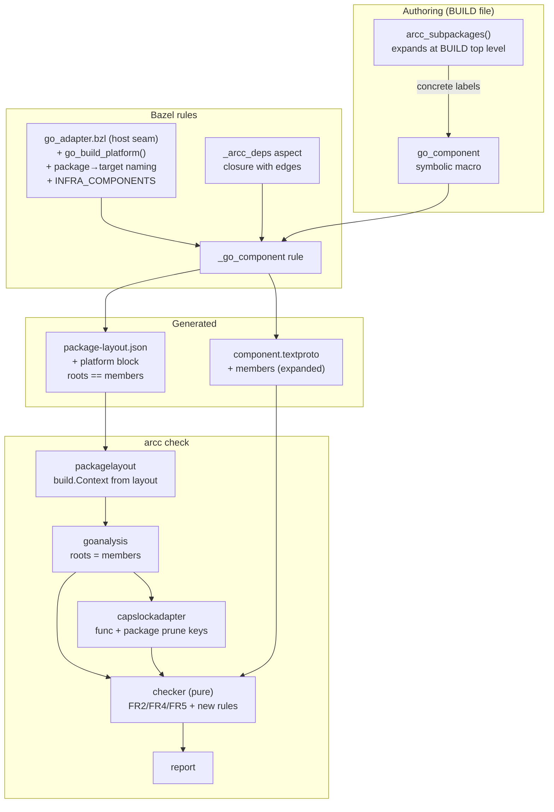
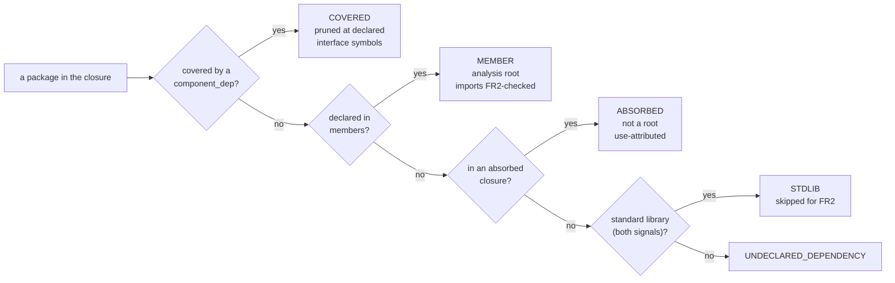

# Component membership and authority attribution — detailed design

**Date:** 2026-07-25
**Status:** design complete, not implemented
**Supersedes in part:** `.agents/planning/2026-07-16-bazel-arcc-rules/design/detailed-design.md`
R4 and §5.3 (membership derivation)
**Source note:** `.agents/planning/2026-07-24-callback-authority-attribution/callback-authority-attribution.md`

## 1. Overview

Three coupled changes to how a component says **what it is responsible for**, and
how arcc **attributes ambient authority** to it.

1. **Membership becomes declared, not derived.** Today a Bazel component's
   membership is whatever falls out of the aspect closure after coverage and
   absorption are subtracted, with `absorbed_deps` pulling in each label's entire
   transitive tree. A component's real membership is therefore implicit and
   shifts as `component_deps` are edited. This design makes membership an
   explicit declaration in the manifest, expanded literally by emitters.
2. **Attribution follows ownership.** Member packages become analysis roots, so a
   component's own code is analyzed in full regardless of who calls it. This
   closes the callback-escape fail-open of the source note's Part 1 for owned
   code. The residual — a function value whose body lives in *absorbed* code —
   becomes a warning rather than silence.
3. **The analysis is made trustworthy enough to rest on.** Attribution is only
   as good as the package set and the platform it was computed for. The build
   platform becomes declared data rather than an ambient property of the arcc
   binary; standard-library classification stops failing open; the
   canonicalization contract that hosts depend on becomes enforced.

Two supporting pieces fall out: **implicit infra components**, which let
toolchain-injected runtimes be pruned without the authority simply vanishing;
and a **bazelified self-check**, so arcc's own dogfooding runs under Bazel.

### 1.1 What this is a reaction to

arcc was taken into a large Bazel monorepo whose Go rules differ from rules_go
(commits `nnnnztsx..ulluq`, recorded in
`.agents/planning/2026-07-23-host-portability-seams/` and
`.agents/planning/2026-07-24-layout-completeness/`). Running it on real code
surfaced the membership and attribution problems above. A review of that same
work surfaced the trustworthiness problems in group 3.

## 2. Detailed Requirements

Consolidated from `../idea-honing.md`. Each requirement cites the question that
settled it.

### Membership

| ID | Requirement | From |
|---|---|---|
| **M1** | A component's members are declared in the manifest, in a repeated `members` field of import-path patterns and exact paths. | Q2, Q3a |
| **M2** | Members may name packages **anywhere**, including outside the component root. | Q2 |
| **M3** | `members` is optional. Absent, membership is FR1: every package under the component root. Hand-written manifests are unaffected. | Q11 |
| **M4** | Emitters write the **fully expanded literal list**; patterns are an authoring convenience, not a runtime indirection. | Q3a |
| **M5** | The interface package is implicitly a member and is not listed in `members`. A pattern that matches it is not an error. | Q8a |
| **M6** | The layout's `roots` must equal the manifest's members. A mismatch is a hard error. | Q2 |
| **M7** | Membership overlap is checked locally: a member that is also covered by a resolved `component_dep` or listed in `absorbed_dependencies` is an error. Overlap with an unrelated component is a documented limitation. | Q3b |

### Attribution

| ID | Requirement | From |
|---|---|---|
| **A1** | Member packages are analysis roots: every function in them is a capability start point, and their import edges are FR2-checked. | Q2, Q4 |
| **A2** | `INIT_OUTSIDE_INTERFACE` applies only to the interface package(s). Member implementation packages may declare ordinary `func init()`. | Q1 |
| **A3** | `METHOD_OUTSIDE_INTERFACE` is unchanged — it is already interface-scoped. | Q1 |
| **A4** | `absorbed_dependencies` keeps transitive-closure semantics and use-attribution (not roots). | Q4, Q8b |
| **A5** | A new warning fires when member code references an absorbed package's function **as a value** rather than calling it. It replaces `HIGHER_ORDER_BOUNDARY_CALL`. | Q5 |
| **A6** | Toolchain-injected runtimes are handled by **implicit infra components**: real components, checked like any other, pruned at package granularity, with relaxed well-formedness. | Q9, Q10a |
| **A7** | Infra components are attached by the emitter only where the component's closure actually contains one of their packages. The registry of them is a host-replaceable seam. | Q9, Q10b |

### Trustworthiness

| ID | Requirement | From |
|---|---|---|
| **T1** | The layout declares the analysis platform (GOOS, GOARCH, build tags, cgo); the loader builds a `build.Context` from it instead of using `build.Default`. | Q6a |
| **T2** | Extraction of the platform from the host's Go rules lives in the adapter seam. | Q6a |
| **T3** | Build-constraint-excluded interface files are reported as warnings naming file and constraint; an interface with no surviving files is an error. | Q6b |
| **T4** | A package is standard library only when module metadata **and** the host path policy agree. | Q7a |
| **T5** | `hostpolicy.CanonicalizePath` must be identity on loader-reported paths; this is stated in the contract and asserted at load time, failing closed. | Q7b |
| **T6** | Four smaller fixes: `canonicalizeSymbol` occurrence handling; `vendor/` relaxation restricted to stdlib; facts stdlib representation cleaned up; `ResolveDependencyInterface` local facts canonicalized. | Q7c |
| **T7** | The report's success wording changes from "conforms / ambient-authority-free" to declared-authority terms. | Q12 |

### Tooling

| ID | Requirement | From |
|---|---|---|
| **B1** | `members` is authored via a helper called at the BUILD call site (`arcc_subpackages()`), expanding to concrete labels before the symbolic macro runs. | Q13 |
| **B2** | The package→target naming convention is a hook in the adapter. | Q13 |
| **B3** | arcc's own components get `go_component` targets so `bazel test //...` runs the self-checks. | Q14 |

## 3. Architecture Overview

Nothing moves between components; the changes are additive to existing seams.
What changes is **which packages are roots**, **what the manifest carries**, and
**what the layout describes**.



### 3.1 The three classification buckets, after



The `E` branch is the note's "remainder becomes an error". **It needs no new
checker rule** — `checker.go` already reports `UNDECLARED_DEPENDENCY` for exactly
this case. It stays quiet today only because the Bazel rule emits blanket
absorbed entries covering each label's whole transitive tree. Once `members`
carries owned code and `absorbed_dependencies` is narrow, the existing rule
surfaces the note's three silently-absorbed utility packages.

## 4. Components and Interfaces

### 4.1 `proto/archcontracts/v1/component.proto`

```protobuf
message Component {
  string name = 1;
  repeated string interface_files = 2;
  repeated ComponentDependency component_dependencies = 3;
  repeated AbsorbedDependency  absorbed_dependencies  = 4;
  repeated string declared_authority = 5;

  // Member packages: the code this component is responsible for and analyzes
  // as roots. Entries are import paths or import-path patterns (the same
  // pattern idiom absorbed_dependencies uses). The interface package is
  // implicitly a member and need not be listed; a pattern matching it is not
  // an error (M5).
  //
  // Empty means FR1: every package under the component root (M3). Emitters
  // write the fully expanded literal list rather than patterns (M4).
  repeated string members = 6;

  // Implicit infra component (A6): this component wraps infrastructure a host
  // build injects (a generated-proto runtime, say) rather than code an author
  // depends on explicitly. Three consequences, all local to this component:
  //   - it prunes at PACKAGE granularity rather than at declared interface
  //     symbols, so interface_files may be empty;
  //   - FR4 placement rules (init, exported method) do not apply to it;
  //   - a depender never gets an UNUSED_DEPENDENCY warning for it.
  // Its own check still runs and still surfaces its authority — that is the
  // point of certifying it rather than trusting a list (Q9).
  bool implicit = 7;
}
```

`declared_authority` semantics, the `ComponentDependency` and
`AbsorbedDependency` messages, and FR10 (contracts are doc-comment prose) are
untouched.

### 4.2 `go/internal/manifest`

- Parse and validate `members`: reject duplicates, reject an entry that is also
  an `absorbed_dependencies` import path (M7 contradiction), reject a malformed
  pattern.
- Parse `implicit`; when set, permit empty `interface_files` (today that is a
  validation error).

### 4.3 `go/internal/checker` (pure)

| Change | Requirement |
|---|---|
| Membership comes from `Manifest.Members` when non-empty, else FR1 as today. | M1, M3 |
| Interface package forced into the member set. | M5 |
| `INIT_OUTSIDE_INTERFACE` restricted to packages containing at least one interface file. | A2 |
| New violation `MEMBER_OVERLAP` when a member is covered by a resolved `component_dep` or listed as absorbed. | M7 |
| New warning `ABSORBED_FUNC_VALUE_ESCAPE`, from a new fact (§4.5). | A5 |
| `HIGHER_ORDER_BOUNDARY_CALL` removed, along with the `PassesFuncValue` branch. | A5 |
| Stdlib skip consults `Facts.StdlibImports`, now produced by the AND rule. | T4 |
| A dependency marked `implicit` never produces `UNUSED_DEPENDENCY`. | A6 |

The checker stays pure: every new input arrives as a fact or as manifest data.

### 4.4 `go/internal/packagelayout`

- `Layout` gains a `platform` block; `ValidateAndResolve` builds a
  `build.Context` from it and uses it for `filterByBuildConstraints` and
  `FileMatchesBuildConstraints` instead of `build.Default` (T1). Absent block →
  `build.Default`, preserving today's behavior for hand-written layouts.
- Error when constraint filtering leaves a package with **no** `.go` files, which
  today silently produces an empty package (T6, review finding 6).
- Restrict the `vendor/`+path relaxation in phase 3 to standard-library packages
  (T6).
- Assert `hostpolicy.CanonicalizePath` is identity on every loader-reported
  package path; fail closed with a message naming the offending path (T5).

### 4.5 `go/internal/goanalysis`

- Roots are the manifest's members (M1); `LoadPackageFacts` filters facts to
  members as it does today for layout roots.
- New fact production: for each member package, scan SSA instruction operands for
  `*ssa.Function` values whose defining package is absorbed, excluding the static
  callee position of a call, and excluding functions the call graph already
  reaches from member code. Emits `facts.FuncValueEscape{Symbol, Package, File,
  Line}` (A5). Mechanics and caveats in
  `../research/capability-analysis-mechanics.md` §3.
- Stdlib classification becomes the AND of module metadata and
  `hostpolicy.IsStdlibPath` (T4).
- `canonicalizeSymbol` rewrites the package path in every position, including
  generic type arguments (T6).
- `ResolveDependencyInterface`'s local `factsPkgs` canonicalizes `ImportPath` and
  `Imports` (T6).
- `ValidateInterfaceFiles` returns the set of build-constraint-excluded files
  instead of silently skipping, and errors when nothing survives (T3).

### 4.6 `go/internal/capslockadapter`

Gains package-granularity pruning: `buildClassifier` emits
`package <import/path> CAPABILITY_SAFE` lines for the packages of any dependency
whose manifest is `implicit`, alongside today's `func` keys for ordinary
dependencies. Capslock resolves per-function keys first and falls back to the
package category, so the two forms coexist without interference
(`../research/capability-analysis-mechanics.md` §2).

`capanalyzer.AnalyzeRequest` gains `PruneAtPackages []string` beside `PruneAt`,
keeping the port explicit about which granularity is in play.

### 4.7 `bazel_rules/go/private/go_adapter.bzl` (host seam)

Three additions, all host-swappable:

```python
def go_build_platform(target):
    """GOOS/GOARCH/tags/cgo for the analysis (T2). Under rules_go this reads
    GoInfo.mode; NOT GoSDK.goos, which is the exec platform."""

def go_member_label(package_path):
    """Package path → the label of the Go library in it (B2). Upstream uses the
    Gazelle basename convention."""

INFRA_COMPONENTS = []  # labels of implicit infra components (A7)
```

### 4.8 `bazel_rules/go/private/component.bzl` and the macro

- `members = attr.label_list(providers = GO_PROVIDERS, aspects = [arcc_deps_aspect])`
  — concrete labels, pulled into the closure by the aspect so that owned code the
  interface does not import is still analyzed.
- Classification order becomes: covered → member → absorbed → error (§3.1).
- Emits the expanded member import paths into the manifest (M4) and the same set
  as the layout's `roots` (M6).
- Emits the platform block from `go_build_platform` (T1).
- Attaches an `INFRA_COMPONENTS` entry as a `component_dep` iff the closure
  contains one of its packages (A7).

### 4.9 `bazel_rules/go/defs.bzl` — the members helper (B1)

```python
def arcc_subpackages(exclude = []):
    """Expands to the labels of Go libraries in all transitive subpackages.

    MUST be called at BUILD top level: native.subpackages() is rejected inside a
    symbolic macro (../research/members-glob-expansion.md, finding 3).
    """
```

## 5. Data Models

### 5.1 Layout JSON — the platform block

```json
{
  "go_sdk_root": "rules_go++go_sdk+.../src",
  "platform": {
    "goos": "linux",
    "goarch": "amd64",
    "build_tags": ["purego"],
    "cgo_enabled": false
  },
  "roots": ["example.com/svc", "example.com/svc/impl"],
  "packages": [ /* unchanged: go/packages driver "flat" form */ ]
}
```

`platform` is optional; absent means `build.Default`, so existing hand-written
layouts and the native path are unaffected.

### 5.2 `facts` package

```go
type PackageFacts struct {
    Packages   []PackageFact
    CallEdges  []CallEdge
    StdlibImports []string        // loader-authoritative, canonical (T4)
    FuncValueEscapes []FuncValueEscape  // A5
}

// FuncValueEscape records member code taking the value of a function defined in
// an absorbed package. The body is not analyzed by anyone: the component does not
// call it, and whoever does is behind a boundary.
type FuncValueEscape struct {
    Symbol  string // the absorbed function, canonical form
    Package string // the member package that referenced it
    File    string
    Line    int
}
```

`PackageFact.IsStdlib` is **removed** — it has no consumer, and `StdlibImports`
is the one representation (T6). `StdlibImports` stops encoding policy in
nil-ness: the AND rule is applied in the loader and the field is always
populated.

### 5.3 Report kinds

| Kind | Level | Status |
|---|---|---|
| `MEMBER_OVERLAP` | violation | new (M7) |
| `ABSORBED_FUNC_VALUE_ESCAPE` | warning | new (A5) |
| `INTERFACE_FILE_EXCLUDED` | warning | new (T3) |
| `HIGHER_ORDER_BOUNDARY_CALL` | warning | **removed** (A5) |
| `INIT_OUTSIDE_INTERFACE` | violation | scope narrowed (A2) |
| all others | — | unchanged |

Success wording changes to "Component %q conforms; does not exceed declared
authority" (T7).

## 6. Error Handling

**Analysis-time (Bazel, before arcc runs).** A `members` label with no import
path; a member that is also an `absorbed_dep` label; a member covered by a
`component_dep`; a cgo package in the closure (existing). All `fail()` with the
component name and the offending label.

**Load-time (arcc, fail closed).** A layout whose `roots` differ from the
manifest's members (M6); a non-identity canonicalization of a loader-reported
path (T5); a package left with no `.go` files after constraint filtering; an
interface with no surviving files (T3). Each is an error naming what disagreed —
not a warning, because every one of them silently degrades analysis if allowed
through.

**Check-time.** Violations and warnings per §5.3. The existing exit-code contract
is unchanged: violations → 1, tool errors → 2.

## 7. Testing Strategy

### 7.1 Regression fixtures the source note asks for

1. **Callback escape, owned code** — the Part 1 example with `backend` as a
   *member*: must report `UNDECLARED_AUTHORITY` for FILES, where today it passes.
2. **Callback escape, absorbed code** — the same example with `backend` absorbed:
   must report `ABSORBED_FUNC_VALUE_ESCAPE`, and must *not* report it when the
   func value's body is a member (the plugin-struct pattern).
3. **Members glob reaching outside** — a member importing a package that is
   neither member, covered, absorbed nor stdlib: `UNDECLARED_DEPENDENCY`.

### 7.2 Unit

- `manifest`: members parsing, pattern validation, `implicit` permitting empty
  interface files.
- `checker`: init rule fires in the interface package and not in a member;
  `MEMBER_OVERLAP`; `implicit` suppressing `UNUSED_DEPENDENCY`.
- `packagelayout`: `build.Context` honors declared tags (a `//go:build purego`
  file kept when `build_tags` says so, dropped when it does not) — this is the
  test that would have caught the current unsoundness; empty-package error;
  vendor relaxation no longer applying to non-stdlib.
- `goanalysis`: canonicalization identity assertion; `canonicalizeSymbol` on a
  generic receiver with a type argument from another package.
- `capslockadapter`: `package` prune key emitted for an implicit dependency, and
  a per-function key still overriding it.

### 7.3 Bazel

- Analysis tests for member classification, the expansion helper, infra
  attachment happening only when the closure contains the runtime.
- **The bazelified self-check (B3):** `go_component` targets for arcc's own eight
  components, so `bazel test //...` runs their checks. `cli` (spanning `cmd/arcc`
  and `app`) is the multi-package case that exercises `members`. Follow the
  existing `manifest_parity_test` precedent from the csvtool example so the
  hand-written manifest and the generated one cannot drift.

## 8. Integration with Existing System

**What this supersedes.** The Bazel design's **R4** ("membership is explicit,
derived by the rule from the aspect closure … directory-based membership (FR1) is
superseded under Bazel") and **§5.3**'s classification order. Membership is still
explicit, but *declared* rather than derived, and FR1 survives as the native-mode
default (M3) rather than being superseded. **§4.7**'s "membership is not encoded
in the manifest" is reversed. Those sections must be rewritten, not merely
amended.

**What it leaves alone.** The layout schema's package encoding, the self-exec
`GOPACKAGESDRIVER` seam, the runfiles-relative path frame, the pruning model for
`component_dep`s, and FR10.

**What it repairs from the port.** The `go_target_info` srcs contract and the
loader-side constraint filtering introduced in `pvnlmlpswpnt` are correct but
under-specified; T1/T2 complete them by making the platform explicit rather than
ambient.

## 9. Adherence to Established Conventions

- **Functional core / imperative shell.** Every new input to the checker arrives
  as a fact or as manifest data. The SSA scan for func-value escapes lives in
  `goanalysis` (shell), not in `checker`.
- **Host seams as single files.** The platform extraction, the package→target
  naming convention and the infra registry all go into `go_adapter.bzl`,
  extending the pattern that commit `kurlqozzqunl` established, rather than
  adding new override points elsewhere.
- **Package-level `var` seams** (`hostpolicy`, `osStat`) are not extended; T5
  tightens the existing contract instead of adding another hook.
- **Deliberate departure:** implicit infra components prune at package
  granularity, where every other prune point is at *declared* interface symbols.
  This is the relaxation Q10a chose knowingly, and it is confined to components
  that opt in via `implicit`.

## 10. Migration Strategy

The project is experimental, unpublished and single-user (Q2), so no
compatibility shims are needed. Ordering that keeps every step green:

1. **Schema and native mode first.** Add `members` and `implicit` to the proto;
   `members` absent ⇒ FR1, so all eight hand-written manifests and both example
   components keep passing untouched.
2. **Trustworthiness fixes (T1–T7).** Independent of membership, and they make
   the later steps' test results meaningful.
3. **Roots and the init rule (A1–A3).** Behavior change with no schema change.
4. **Bazel rules (M1–M7, B1–B2).** Emit `members`, enforce `roots == members`,
   migrate the csvtool example components off blanket absorption.
5. **Infra components (A6–A7)** and **the func-value warning (A5)**.
6. **Bazelified self-check (B3)** last, so it exercises the finished model.

## Appendix A — Research findings

Full notes in `../research/`.

- **`members-glob-expansion.md`** — `native.subpackages()` is rejected inside a
  symbolic macro and returns packages rather than targets. Forces expansion to
  the BUILD call site (B1) and a naming hook (B2).
- **`capability-analysis-mechanics.md`** — Capslock attributes by *backwards*
  BFS from capability nodes, so the analyzed-package set is the entire criterion;
  and its classifier supports `package <path> CAPABILITY_SAFE`, which is what
  makes A6 cheap and complete.
- **`build-platform-and-tags.md`** — `GoInfo.mode` carries goos/goarch/tags/pure
  with no new rule attributes; `GoSDK.goos` is the exec platform and would have
  reproduced the bug.

## Appendix B — Alternatives considered

| Alternative | Why not |
|---|---|
| **Option B from the note** — add functions whose *value* is reachable to the roots | Not expressible: `AnalyzeRequest` takes package paths, and Capslock's unit is the package. Would require changing the port and the adapter. |
| **Collapse `absorbed` into `members`** | Fail-closed and conceptually clean, but charges a vendored library's dead code to its absorber and cascades FR2 declaration onto the whole tree. Loses the cheap "draw a boundary around existing code, refine later" adoption path (Q4). |
| **Unify membership on location; constrain the glob to the component subtree** | Rejected by the requirement that members may live anywhere (M2). |
| **Bare trusted-infrastructure list** | Asserts "trust this" without enumerating *what* is trusted; the authority is never verified and silently grows. Certifying the runtime as a checked component keeps the claim maintained (Q9). |
| **Emitter declares injected runtimes as absorbed** | Does not prune, so proto plumbing's authority lands on every component that uses protos, making pure components impossible. |
| **Reclassify runtime reflection as capability use** | Legitimate, following the `fileHandleUseMethods` precedent, and complementary rather than exclusive — but it needs per-runtime curation and only applies where the designated-values claim holds. Not taken now. |
| **`go_component` as a legacy macro** so it can expand globs internally | Gives up symbolic-macro attribute typing and `configurable = False`, and moves against Bazel's direction. |
| **Keep `build.Default`, only fail loudly** | Cheaper, but leaves the platform unrecorded and host build tags unexpressible — the actual cause of the unsoundness. |

## Appendix C — Known limitations, stated deliberately

1. **One platform per check.** `declared_authority` is platform-agnostic while
   verification covers a single platform, so authority in a `_windows.go` file is
   invisible on a Linux check (Q6a, deferred).
2. **Cross-component membership overlap** is undetected outside a component's own
   declared dependencies until the repo-wide uniqueness check exists (M7).
3. **Absorbed code remains use-attributed**, so authority in absorbed code that
   nothing owned reaches is not charged. A5 warns where that is most likely to
   matter; it does not close it.
4. **Package-granularity pruning for infra components** is coarser than symbol
   pruning and will hide authority reached through a runtime's unexported entry
   points. Accepted knowingly (Q10a).
