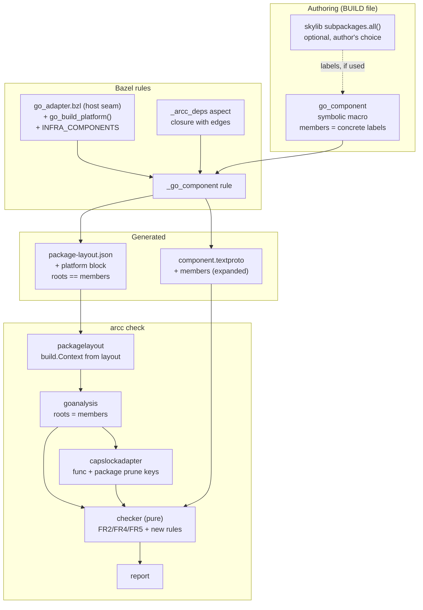
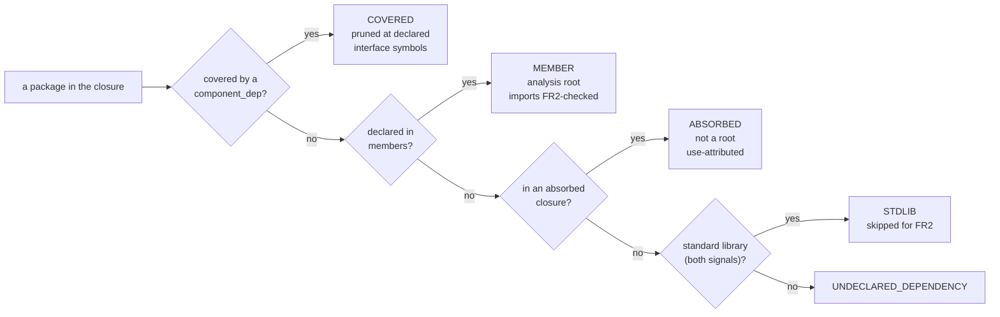

# Component membership and authority attribution — detailed design

**Date:** 2026-07-25
**Status:** design complete, not implemented
**Supersedes in part:** `.agents/planning/2026-07-16-bazel-arcc-rules/design/detailed-design.md`
R4 and §5.3 (membership derivation)
**Source note:** `.agents/planning/2026-07-24-callback-authority-attribution/callback-authority-attribution.md`

## 1. Overview

Three coupled changes to how a component says **what it is responsible for**, and
how arcc **attributes ambient authority** to it.

1. **Membership becomes declared, not derived.** Today a Bazel component's
   membership is whatever falls out of the aspect closure after coverage and
   absorption are subtracted, with `absorbed_deps` pulling in each label's entire
   transitive tree. A component's real membership is therefore implicit and
   shifts as `component_deps` are edited. This design makes membership an
   explicit declaration in the manifest, expanded literally by emitters.
2. **Attribution follows ownership.** Member packages become analysis roots, so a
   component's own code is analyzed in full regardless of who calls it. This
   closes the callback-escape fail-open of the source note's Part 1 for owned
   code. The residual — a function value whose body lives in *absorbed* code —
   becomes a warning rather than silence.
3. **The analysis is made trustworthy enough to rest on.** Attribution is only
   as good as the package set and the platform it was computed for. The build
   platform becomes declared data rather than an ambient property of the arcc
   binary; standard-library classification stops failing open; the
   canonicalization contract that hosts depend on becomes enforced.

Two supporting pieces fall out: **package-surface components**, which let code
with no architecturally declared interface — a toolchain-injected runtime, or an
existing library an author wraps to draw a boundary around it — be pruned without
the authority simply vanishing; and a **bazelified self-check**, so arcc's own
dogfooding runs under Bazel.

### 1.1 What this is a reaction to

arcc was taken into a large Bazel monorepo whose Go rules differ from rules_go
(commits `nnnnztsx..ulluq`, recorded in
`.agents/planning/2026-07-23-host-portability-seams/` and
`.agents/planning/2026-07-24-layout-completeness/`). Running it on real code
surfaced the membership and attribution problems above. A review of that same
work surfaced the trustworthiness problems in group 3.

## 2. Detailed Requirements

Consolidated from `../idea-honing.md`. Each requirement cites the question that
settled it.

### Membership

| ID | Requirement | From |
|---|---|---|
| **M1** | A component's members are declared in the manifest, in a repeated `members` field of import-path patterns and exact paths. | Q2, Q3a |
| **M2** | Members may name packages **anywhere**, including outside the component root. | Q2 |
| **M3** | `members` is optional. Absent, membership is FR1: every package under the component root. Hand-written manifests are unaffected. | Q11 |
| **M4** | Emitters write the **fully expanded literal list** — for *declared-style* components. Patterns are an authoring convenience there, not a runtime indirection. Relaxed for `PACKAGE_SURFACE` (M8). | Q3a, Q18 |
| **M5** | The interface package is implicitly a member and is not listed in `members`. A pattern that matches it is not an error. Vacuous under `PACKAGE_SURFACE`, which has no interface package. | Q8a, Q17 |
| **M6** | The layout's `roots` must equal the manifest's members. A mismatch is a hard error. Applies only where the component is loaded as a root; a pattern-membership component (M8) has no layout and no roots to compare. | Q2, Q18 |
| **M7** | Membership overlap is checked locally: a member that is also covered by a resolved `component_dep` or listed in `absorbed_dependencies` is an error. Overlap with an unrelated component is a documented limitation. | Q3b |
| **M8** | A `PACKAGE_SURFACE` component's membership may be **import-path patterns** rather than labels, unexpanded. Its membership derives prune keys and an exported-surface set only, so M4's reviewability rationale does not apply. | Q18 |
| **M9** | Layout-generation inputs derive from the **union of the interface (if any) and the members**, never from a single distinguished target. Any host keyed on one target must generalize to a set — required by M2 generally, not by `PACKAGE_SURFACE` specifically. | Q18 |
| **M10** | Members are **source-loaded** packages. The loader errors when a declared member has no source files, naming it: the contract is checkable from the layout, not merely stated. | Q18 |

### Attribution

| ID | Requirement | From |
|---|---|---|
| **A1** | Member packages are analysis roots: every function in them is a capability start point, and their import edges are FR2-checked. | Q2, Q4 |
| **A2** | `INIT_OUTSIDE_INTERFACE` is **removed entirely** — kind, checker branch, tests and FR4 prose. The `init CAPABILITY_SAFE` prune mechanism is untouched. | Q1, Q15 |
| **A3** | `METHOD_OUTSIDE_INTERFACE` is unchanged — it is already interface-scoped. | Q1 |
| **A4** | `absorbed_dependencies` keeps transitive-closure semantics and use-attribution (not roots). | Q4, Q8b |
| **A5** | A new warning fires when member code references an absorbed package's function **as a value** rather than calling it. It replaces `HIGHER_ORDER_BOUNDARY_CALL`. | Q5 |
| **A6** | A component whose wrapped code has no architecturally declared interface uses `interface_style = PACKAGE_SURFACE`: the interface is every exported symbol of every member, pruning is at package granularity, `interface_files` is empty and FR4 placement rules do not apply. Toolchain-injected runtimes and author-written library wrappers are the **same kind**. | Q9, Q10a, Q17 |
| **A7** | Exemption from `UNUSED_DEPENDENCY` is a property of the *dependency edge*, not of the depended-on component: a `component_dependency` marked `auto_attached` never warns. The emitter marks the edges it injects. **Attachment is a host seam**: unconditional attachment is conforming, because pruning at a package is a no-op unless that package is reached. The registry accepts patterns as well as labels (M8), and an injected edge appears in the emitted manifest even when unconditional. | Q9, Q10b, Q17, Q18 |
| **A8** | The report's dependency listing annotates each pruned boundary as **certified** (the dependency's own check runs) or **asserted** (it does not), carrying an out-of-band certification reference where one is recorded. This is an annotation, not a finding — the depending component is not at fault. Repo-wide enforcement is deferred. | Q18 |
| **A9** | An absorbed package with no bodies available is reported as `ANALYSIS_LIMITATION` naming the package, so a report cannot look clean where authority was simply unanalyzable. | Q18 |

### Trustworthiness

| ID | Requirement | From |
|---|---|---|
| **T1** | The layout declares the analysis platform (GOOS, GOARCH, build tags, cgo); the loader builds a `build.Context` from it instead of using `build.Default`. | Q6a |
| **T2** | Extraction of the platform from the host's Go rules lives in the adapter seam. The seam returns the target platform, **or a fixed constant where the host's rules expose no platform metadata** — the constant is a conforming implementation, not a degradation. | Q6a, Q18 |
| **T3** | Build-constraint-excluded interface files are reported as warnings naming file and constraint; an interface with no surviving files is an error. | Q6b |
| **T4** | Standard-library classification takes its verdict from **provenance**, validated against the host path policy. SDK-discovered packages are standard library structurally. Emitter-listed packages carry a declared `is_stdlib` bit; disagreement with `hostpolicy.IsStdlibPath` is a load error naming the path and both verdicts. Native mode keeps module metadata, ANDed with the path policy, including the nil-`Module` fix. | Q7a, Q18 |
| **T4a** | The declared bit must be derived from **build-graph provenance** — SDK/toolchain versus enumerated target — and **not** by re-evaluating a path heuristic in the emitter. Stated in the layout schema next to the field, because the cheap wrong implementation is the obvious one. | Q18 |
| **T5** | `hostpolicy.CanonicalizePath` must be identity on loader-reported paths; this is stated in the contract and asserted at load time, failing closed. | Q7b |
| **T6** | Four smaller fixes: `canonicalizeSymbol` occurrence handling; `vendor/` relaxation restricted to stdlib; facts stdlib representation cleaned up; `ResolveDependencyInterface` local facts canonicalized. | Q7c |
| **T7** | The report's success wording changes from "conforms / ambient-authority-free" to declared-authority terms. | Q12 |
| **T8** | The platform block governs **emitters as well as the loader**. A layout's package data must be consistent with the platform it declares, in one of two conforming shapes; the loader validates this rather than trusting it. | Q18 |

### Tooling

| ID | Requirement | From |
|---|---|---|
| **B1** | `members` takes **concrete labels only**. rules_arcc ships no expansion helper; an author who wants a subtree calls `subpackages.all()` from bazel-skylib at BUILD top level, or lists labels. | Q13, Q16 |
| **B2** | *Deferred.* A package→target naming hook is unnecessary while no expansion helper exists — nothing in rules_arcc maps a package path to a target. | Q13, Q16 |
| **B3** | arcc's own components get `go_component` targets so `bazel test //...` runs the self-checks. | Q14 |

## 3. Architecture Overview

Nothing moves between components; the changes are additive to existing seams.
What changes is **which packages are roots**, **what the manifest carries**, and
**what the layout describes**.



### 3.1 The three classification buckets, after



The `E` branch is the note's "remainder becomes an error". **It needs no new
checker rule** — `checker.go` already reports `UNDECLARED_DEPENDENCY` for exactly
this case. It stays quiet today only because the Bazel rule emits blanket
absorbed entries covering each label's whole transitive tree. Once `members`
carries owned code and `absorbed_dependencies` is narrow, the existing rule
surfaces the note's three silently-absorbed utility packages.

## 4. Components and Interfaces

### 4.1 `proto/archcontracts/v1/component.proto`

```protobuf
message Component {
  string name = 1;
  repeated string interface_files = 2;
  repeated ComponentDependency component_dependencies = 3;
  repeated AbsorbedDependency  absorbed_dependencies  = 4;
  repeated string declared_authority = 5;

  // Member packages: the code this component is responsible for and analyzes
  // as roots. Entries are import paths or import-path patterns (the same
  // pattern idiom absorbed_dependencies uses). The interface package is
  // implicitly a member and need not be listed; a pattern matching it is not
  // an error (M5).
  //
  // Empty means FR1: every package under the component root (M3). Emitters
  // write the fully expanded literal list rather than patterns (M4).
  repeated string members = 6;

  // How this component's exposed interface is determined (A6).
  InterfaceStyle interface_style = 7;
}

// InterfaceStyle distinguishes a component that declares its surface from one
// that wraps code never written to have an architectural interface — a
// toolchain-injected runtime, or an existing library an author is drawing a
// boundary around (Q17).
enum InterfaceStyle {
  // interface_files enumerate the surface. Today's behavior, and the default.
  INTERFACE_STYLE_UNSPECIFIED = 0;

  // The interface is every exported symbol of every member package. Three
  // consequences, all local to this component:
  //   - it prunes at PACKAGE granularity rather than at declared interface
  //     symbols;
  //   - interface_files must be empty, and FR4 placement rules do not apply;
  //   - CALLS_UNDECLARED_INTERFACE is vacuous for a depender — which is the
  //     honest reading of "the whole surface is the interface".
  // Its own check still runs and still surfaces its authority: that is the
  // point of certifying such a component rather than trusting a list (Q9).
  INTERFACE_STYLE_PACKAGE_SURFACE = 1;
}

message ComponentDependency {
  // ... existing fields ...

  // The emitter injected this edge rather than an author writing it, so an
  // unused edge is not the author's mistake: no UNUSED_DEPENDENCY (A7).
  // Deliberately on the edge, not on the depended-on component — the checker
  // then needs no cross-manifest lookup to decide whether to warn, and a
  // well-structured injected component may still declare interface_files.
  bool auto_attached = N;
}
```

Two more fields on `Component`, for A8. Both are **self-declarations at the same
trust level as `declared_authority`** — reviewable, not proven — and their comments
must say so, or the first reader will assume the tool verified them. The
dependency's own emitter is the only party that knows whether a check target
exists; a depender cannot infer it, because the case that needs it is exactly the
case where dependencies are not build targets.

```protobuf
  // Whether this component's own conformance check runs as part of the build.
  // False for a pattern-membership component (M8), whose packages cannot be
  // named as targets. A self-declaration, not verified by arcc.
  bool own_check_runs = 8;

  // Where this component's conformance is established when own_check_runs is
  // false — a scheduled job, a run record, a document. Free-form and
  // unverified; its purpose is to make an asserted boundary reviewable and
  // greppable rather than invisible.
  string certification_reference = 9;
```

**Why two fields rather than one enum with three values.** The infra case and the
library-wrapper case differ on exactly one axis — who created the dependency edge
— and agree on everything about the component itself (package-surface interface,
package-granularity pruning, empty `interface_files`, FR4 not applying, own check
still running). Interface style is a property of the component; auto-attachment is
a property of the edge. Splitting them also permits the combination a three-value
enum would forbid: an injected component that *does* declare real interface files.

`declared_authority` semantics, the `AbsorbedDependency` message, and FR10
(contracts are doc-comment prose) are untouched; `ComponentDependency` gains only
the one flag above.

### 4.2 `go/internal/manifest`

- Parse and validate `members`: reject duplicates, reject an entry that is also
  an `absorbed_dependencies` import path (M7 contradiction), reject a malformed
  pattern.
- Parse `interface_style`. Under `PACKAGE_SURFACE`: `members` is **mandatory** and
  `interface_files` must be **empty** — both directions are errors, so the surface
  has exactly one source of truth. Under the default style, `interface_files`
  stays mandatory as today.
- Accept unexpanded **patterns** in `members` for a `PACKAGE_SURFACE` component
  (M8); require literal paths for a declared-style one (M4).

### 4.3 `go/internal/checker` (pure)

| Change | Requirement |
|---|---|
| Membership comes from `Manifest.Members` when non-empty, else FR1 as today. | M1, M3 |
| Interface package forced into the member set. | M5 |
| `INIT_OUTSIDE_INTERFACE` removed: the kind, the `sym.Kind == "init"` branch, and its tests. | A2 |
| New violation `MEMBER_OVERLAP` when a member is covered by a resolved `component_dep` or listed as absorbed. | M7 |
| New warning `ABSORBED_FUNC_VALUE_ESCAPE`, from a new fact (§4.5). | A5 |
| `HIGHER_ORDER_BOUNDARY_CALL` removed, along with the `PassesFuncValue` branch. | A5 |
| Stdlib skip consults `Facts.StdlibImports`, now produced by the AND rule. | T4 |
| A `component_dependency` marked `auto_attached` never produces `UNUSED_DEPENDENCY`. Read straight off the depender's own manifest — no dep-manifest lookup. | A7 |
| For a `PACKAGE_SURFACE` dependency, `CALLS_UNDECLARED_INTERFACE` is skipped; `UNUSED_DEPENDENCY` still applies and is computed against the full exported surface (§4.5). | A6 |
| Each pruned boundary is annotated **certified** or **asserted** in the report's dependency listing, with the certification reference where recorded. Not a finding. | A8 |
| An absorbed package the layout shows as bodiless yields `ANALYSIS_LIMITATION` naming it. | A9 |

The checker stays pure: every new input arrives as a fact or as manifest data.

**Why `INIT_OUTSIDE_INTERFACE` goes rather than shrinking.** Review A2 gave the
rule two jobs. The *soundness* job — preventing import-time authority from
re-absorbing with no prune point — is done by A2's other half, emitting
`func <B-pkg>.init CAPABILITY_SAFE` when pruning dependency B, which is
independent of file placement and stays. Once members are analysis roots, an
init's authority is charged to the component whatever file it sits in, so only the
*documentation* job remained. Scoped to the interface package it would fire in
exactly one situation — an explicit `init` in an undeclared file of a package that
has at least one declared file — while an init in a member implementation package,
equally import-time-live through the interface's imports, goes unmentioned. That
is not a principled scope; it is the residue of a rule whose reason is gone.
Conceptually an `init` is an implementation detail: no signature, not callable,
not referenceable, and what it changes is behavior, which arcc does not check. The
style concern ("a surprising init") is `gochecknoinits` territory.

A side effect: with the init rule gone, `METHOD_OUTSIDE_INTERFACE` is already
vacuous when `interface_files` is empty (it is conditional on the receiver's type
being declared in an interface file), so "FR4 placement rules do not apply" under
`PACKAGE_SURFACE` needs no special-casing in the checker at all — only the
manifest-validation relaxation in §4.2.

### 4.4 `go/internal/packagelayout`

- `Layout` gains a `platform` block; `ValidateAndResolve` builds a
  `build.Context` from it and uses it for `filterByBuildConstraints` and
  `FileMatchesBuildConstraints` instead of `build.Default` (T1). Absent block →
  `build.Default`, preserving today's behavior for hand-written layouts.
- Error when constraint filtering leaves a package with **no** `.go` files, which
  today silently produces an empty package (T6, review finding 6).
- Restrict the `vendor/`+path relaxation in phase 3 to standard-library packages
  (T6).
- Assert `hostpolicy.CanonicalizePath` is identity on every loader-reported
  package path; fail closed with a message naming the offending path (T5).
- Standard-library classification per T4: SDK-discovered packages (from
  `discoverStdlib` over `GoSDKRoot`) are stdlib structurally; emitter-listed
  packages take the declared `is_stdlib` bit, and a disagreement with
  `hostpolicy.IsStdlibPath` is a load error naming the path and both verdicts.
- Validate the platform block against the package data (T8, §5.1).
- Error when a declared member has no source files (M10) — checkable because the
  layout distinguishes a bodiless package on its face.

### 4.5 `go/internal/goanalysis`

- Roots are the manifest's members (M1); `LoadPackageFacts` filters facts to
  members as it does today for layout roots.
- New fact production: for each member package, scan SSA instruction operands for
  `*ssa.Function` values whose defining package is absorbed, excluding the static
  callee position of a call, and excluding functions the call graph already
  reaches from member code. Emits `facts.FuncValueEscape{Symbol, Package, File,
  Line}` (A5). Mechanics and caveats in
  `../research/capability-analysis-mechanics.md` §3.
- Stdlib classification per T4. In **native** mode: module metadata ANDed with
  `hostpolicy.IsStdlibPath`, with `isStdlibPackage`'s `p.Module == nil ⇒ true`
  branch flipped so a driver-loaded dependency with no module is not silently
  skipped. In **layout** mode the verdict comes from the layout (§4.4), not from
  `stdlibClassifier`'s current path-policy-only branch.

  Worth stating plainly, because the first framing of T4 got it wrong: **the two
  signals are not peers.** Provenance is authoritative; the path policy is a
  heuristic. The agreement check exists because `hostpolicy.IsStdlibPath` is
  consulted by other code paths (`packagelayout.IsStdlib`, the checker's
  nil-facts fallback), so a path policy that is wrong for some path corrupts
  those too. The check validates the heuristic against ground truth and fails
  closed — it is not a vote.
- `canonicalizeSymbol` rewrites the package path in every position, including
  generic type arguments (T6).
- `ResolveDependencyInterface` gains a `PACKAGE_SURFACE` branch: the dependency's
  interface symbol set is **every exported symbol of every member package**,
  taken from the facts already loaded, rather than the symbols declared in
  `interface_files`. This is what lets `UNUSED_DEPENDENCY` stay meaningful for a
  wrapped library — a member's `logger.Info(...)` resolves to a used symbol — while
  `CALLS_UNDECLARED_INTERFACE` becomes vacuous (A6).
- For a **pattern-membership** dependency (M8) there is no dependency layout to
  load from, so the surface resolves from the **depender's own** layout, whose
  closure contains those packages by construction — that being why the depender
  needs the boundary. This requires `extractSymbols` on closure packages that are
  not members.

  **How narrow this actually is.** The surface is needed for exactly one thing:
  detecting a call edge into the dependency, for `UNUSED_DEPENDENCY`. Prune keys
  need only package paths. And an `auto_attached` edge is exempt from
  `UNUSED_DEPENDENCY` by definition. So the pattern-membership case that needs
  local symbol extraction is *pattern membership without auto-attachment* — an
  author-declared wrapper whose packages cannot be named as targets, which is
  rare, since a library you are wrapping deliberately is usually one you can name.
  Injected runtimes, the motivating case for M8, need package paths only.
- `ResolveDependencyInterface`'s local `factsPkgs` canonicalizes `ImportPath` and
  `Imports` (T6).
- `ValidateInterfaceFiles` returns the set of build-constraint-excluded files
  instead of silently skipping, and errors when nothing survives (T3).

### 4.6 `go/internal/capslockadapter`

Gains package-granularity pruning: `buildClassifier` emits
`package <import/path> CAPABILITY_SAFE` lines for the packages of any dependency
whose manifest declares `interface_style = PACKAGE_SURFACE`, alongside today's
`func` keys for ordinary dependencies. Capslock resolves per-function keys first and falls back to the
package category, so the two forms coexist without interference
(`../research/capability-analysis-mechanics.md` §2).

`capanalyzer.AnalyzeRequest` gains `PruneAtPackages []string` beside `PruneAt`,
keeping the port explicit about which granularity is in play.

### 4.7 `bazel_rules/go/private/go_adapter.bzl` (host seam)

Three additions, all host-swappable:

```python
def go_build_platform(target):
    """GOOS/GOARCH/tags/cgo for the analysis (T2).

    Returns the *target* platform, or a fixed constant where the host's Go rules
    expose no platform metadata — a constant is conforming, not a degradation
    (`../research/host-portability-findings.md` F2). Under rules_go this reads
    GoInfo.mode; NOT GoSDK.goos, which is the exec platform.
    """

def go_attach_infra(target, infra):
    """Whether to attach `infra` to `target` (A7).

    Returning True unconditionally is conforming: pruning at a package is a no-op
    unless that package is reached, and a component's own authority is charged
    regardless because its packages are roots. A host whose analysis-phase closure
    omits toolchain-injected packages cannot evaluate a closure test at all
    (`../research/host-portability-findings.md` F3).
    """

# Injected infra components (A7). Labels *or* import-path patterns (M8): the
# packages that most need this are disproportionately the visibility-gated ones.
# An empty registry is a placeholder, not a steady state — on a real host every
# Go target's closure already carries toolchain-injected packages
# (`../research/host-portability-findings.md` F5).
INFRA_COMPONENTS = []
```

### 4.8 `bazel_rules/go/private/component.bzl` and the macro

- `members = attr.label_list(providers = GO_PROVIDERS, aspects = [arcc_deps_aspect])`
  — concrete labels, pulled into the closure by the aspect so that owned code the
  interface does not import is still analyzed.
- Classification order becomes: covered → member → absorbed → error (§3.1).
- Emits the expanded member import paths into the manifest (M4) and the same set
  as the layout's `roots` (M6).
- Emits the platform block from `go_build_platform` (T1).
- Attaches an `INFRA_COMPONENTS` entry as a `component_dep` per
  `go_attach_infra`, marking that edge `auto_attached` (A7). The edge **appears in
  the emitted manifest even when attachment is unconditional** — the legibility
  argument for `auto_attached` over a hidden allowlist is that a reader can see
  which boundaries were injected, and an emitter that skips the entry because "it
  is always there" hands the trust list back.
- Derives layout-generation inputs from the union of the interface and the members
  (M9), never from the interface target alone.

New `interface_style` attribute, and a shape rule enforced in the macro
implementation:

| `interface_style` | `interface` | `members` |
|---|---|---|
| unset (declared) | mandatory, as today | optional |
| `PACKAGE_SURFACE` | **rejected** — `fail()` naming the component | **mandatory** |

Under `PACKAGE_SURFACE` all four of `interface`'s jobs are covered elsewhere:
`interface_files` is not used, `members` are already the aspect roots, FR1 is moot
because membership is explicit, and Go-provider forwarding — the one remaining job
— is near-useless for exactly this case, since callers of a library you do not own
already depend on it directly and you cannot edit their BUILD files to point at
your component target. An author who does want the component target usable in
`deps` writes an `alias`. So the minimal form is:

```python
go_component(
    name = "logger_component",
    interface_style = PACKAGE_SURFACE,
    members = ["//common/logger", "//common/logger/impl/backends"],
    absorbed_deps = ["//common/logger/impl:network_logger"],
    declared_authority = [FILES, NETWORK],
)
```

### 4.9 No `members` expansion helper (B1)

`members` takes concrete labels. rules_arcc ships **no** wildcard helper, for the
reason in `../research/members-glob-expansion.md`: `native.subpackages()` — and
bazel-skylib's `subpackages.all()` wrapper over it — returns only the *frontier*
of nearest descendant packages and cannot see past a package boundary at all, so a
helper named after subtrees would not deliver subtrees. An author who wants the
frontier calls skylib directly at BUILD top level (`native.subpackages()` is
rejected inside a symbolic macro, so it cannot move into `go_component`); everyone
else lists labels.

This leaves the goal that motivated the helper unmet, and it is recorded as such
in Appendix C.4 rather than papered over.

## 5. Data Models

### 5.1 Layout JSON — the platform block

```json
{
  "go_sdk_root": "rules_go++go_sdk+.../src",
  "platform": {
    "goos": "linux",
    "goarch": "amd64",
    "build_tags": ["purego"],
    "cgo_enabled": false
  },
  "roots": ["example.com/svc", "example.com/svc/impl"],
  "packages": [
    {
      /* unchanged: go/packages driver "flat" form, plus: */
      "is_stdlib": false
    }
  ]
}
```

`platform` is optional; absent means `build.Default`, so existing hand-written
layouts and the native path are unaffected.

### 5.1a `is_stdlib` — provenance, not a heuristic (T4, T4a)

The field must record **where the package came from in the build graph**: the SDK
or toolchain, versus a target the emitter enumerated. It must **not** be computed
by re-evaluating an import-path heuristic in the emitter.

This is the single most important sentence in the layout schema doc, because the
wrong implementation is the obvious one and it is silently self-defeating. An
emitter that copies the host path policy produces a bit that is a *copy of the
signal it is meant to check*: the two can never disagree, the load error can never
fire, and layout mode remains single-signal with ceremony that makes it look
otherwise. This is not hypothetical — a host emitter was found already carrying
such a copy, with a comment explaining that it is deliberately kept in sync with
the loader's (`../research/host-portability-findings.md` F6).

Provenance is information the path policy does not have and cannot reconstruct,
which is exactly what makes it a second signal.

### 5.1b Platform consistency — two conforming shapes (T8)

A host whose rules expose no platform at emit time cannot filter, and should not
have to. Two shapes conform:

1. **Filtered.** The emitter declares files *and* imports for the declared
   platform.
2. **Unfiltered, imports omitted.** The emitter declares the full source set and
   **no** imports; the loader, which has the platform block, recovers them from the
   files that survive filtering.

What does not conform is the accidental middle — an unfiltered file set with
imports derived from it — which is what a naive emitter produces and what was
observed in practice (`../research/host-portability-findings.md` F1).

**The loader validates rather than trusts.** It already parses sources for import
recovery, so after filtering it compares declared imports against the imports of
the surviving files and errors on a mismatch **in either direction**: a declared
import no surviving file contributes (the unfiltered-union case), or an import a
surviving file contributes that was never declared (an edge FR2 would never see).
Equality is easier to specify than a one-sided rule and catches the more dangerous
direction too.

### 5.2 `facts` package

```go
type PackageFacts struct {
    Packages   []PackageFact
    CallEdges  []CallEdge
    StdlibImports []string        // loader-authoritative, canonical (T4)
    FuncValueEscapes []FuncValueEscape  // A5
}

// FuncValueEscape records member code taking the value of a function defined in
// an absorbed package. The body is not analyzed by anyone: the component does not
// call it, and whoever does is behind a boundary.
type FuncValueEscape struct {
    Symbol  string // the absorbed function, canonical form
    Package string // the member package that referenced it
    File    string
    Line    int
}
```

`PackageFact.IsStdlib` is **removed** — it has no consumer, and `StdlibImports`
is the one representation (T6). `StdlibImports` stops encoding policy in
nil-ness: the AND rule is applied in the loader and the field is always
populated.

### 5.3 Report kinds

| Kind | Level | Status |
|---|---|---|
| `MEMBER_OVERLAP` | violation | new (M7) |
| `ABSORBED_FUNC_VALUE_ESCAPE` | warning | new (A5) |
| `INTERFACE_FILE_EXCLUDED` | warning | new (T3) |
| `HIGHER_ORDER_BOUNDARY_CALL` | warning | **removed** (A5) |
| `INIT_OUTSIDE_INTERFACE` | violation | **removed** (A2) |
| `ANALYSIS_LIMITATION` | warning | existing kind, new producer: a bodiless absorbed package (A9) |
| all others | — | unchanged |

**No new kind for an uncertified boundary (A8).** The report's *dependency
listing* gains a certified/asserted annotation instead. Three reasons a finding
would be wrong here:

1. **It is not a defect in the component being checked.** The depending component
   did nothing wrong by pruning at a boundary someone else failed to certify.
2. **It would fire with a 100% hit rate.** Where a runtime is injected everywhere,
   every component in the repository prunes at the same uncertified component,
   identically, forever. A warning that always fires gets suppressed wholesale in
   CI, and the suppression then hides the interesting instances too — worse than
   absent.
3. **The subject is wrong.** "This component is not certified" is a property of
   *that* component, not of the many that depend on it. Reporting it N times is the
   noise; reporting it once is the fix — and the natural home for once is a
   **repo-wide check** ("every `PACKAGE_SURFACE` dependency is certified or carries
   a reference"), the same shape as the deferred repo-wide membership-uniqueness
   check. That is where enforcement belongs, and it is deferred with it.

So: always visible in the dependency listing, never suppressible, no severity, and
enforced once at repo level when that check lands.

**Why `A9` reuses `ANALYSIS_LIMITATION` rather than the `UNANALYZED` authority.**
Reporting a bodiless package under the existing `UNANALYZED` *authority* constant
is tempting — the word is right — but the constant is taken and its handling is
load-bearing. `UNANALYZED` is a Capslock capability that the adapter deliberately
**excludes** from the classifier: with it visible, functions like `io.ReadAll`
become capability leaves and mask the real `FILES` flow behind them (the original
spike finding, `.agents/planning/2026-07-06-arch-contracts-go-mvp/research/spike/`).
Giving the constant a second meaning would entangle a report concept with a
classifier setting whose whole purpose is to stay suppressed. `ANALYSIS_LIMITATION`
already means "the analysis could not see through this", which is exactly the
claim.

Success wording changes to "Component %q conforms; does not exceed declared
authority" (T7).

## 6. Error Handling

**Analysis-time (Bazel, before arcc runs).** A `members` label with no import
path; a member that is also an `absorbed_dep` label; a member covered by a
`component_dep`; `interface` set together with `interface_style =
PACKAGE_SURFACE`, or `members` empty under it (§4.8); a cgo package in the closure
(existing). All `fail()` with the component name and the offending label.

**Load-time (arcc, fail closed).** A layout whose `roots` differ from the
manifest's members (M6); a non-identity canonicalization of a loader-reported
path (T5); a package left with no `.go` files after constraint filtering; an
interface with no surviving files (T3); a declared `is_stdlib` bit disagreeing
with the host path policy (T4); declared imports not equal to the imports of the
post-filter source set (T8); a declared member with no source files (M10). Each is
an error naming what disagreed — not a warning, because every one of them silently
degrades analysis if allowed through.

Three of these will look like regressions on first run and are not:

- A hand-written layout that *lists* an SDK package explicitly now needs the
  `is_stdlib` bit.
- A fixture whose synthetic module path has a dotless first segment starts failing
  the agreement check — the path policy calls it stdlib, the absent bit does not.
- A layout in the unfiltered-with-imports shape starts failing T8 validation.

**Check-time.** Violations and warnings per §5.3. The existing exit-code contract
is unchanged: violations → 1, tool errors → 2.

## 7. Testing Strategy

### 7.1 Regression fixtures the source note asks for

1. **Callback escape, owned code** — the Part 1 example with `backend` as a
   *member*: must report `UNDECLARED_AUTHORITY` for FILES, where today it passes.
2. **Callback escape, absorbed code** — the same example with `backend` absorbed:
   must report `ABSORBED_FUNC_VALUE_ESCAPE`, and must *not* report it when the
   func value's body is a member (the plugin-struct pattern).
3. **Members glob reaching outside** — a member importing a package that is
   neither member, covered, absorbed nor stdlib: `UNDECLARED_DEPENDENCY`.

### 7.2 Unit

- `manifest`: members parsing, pattern validation; `PACKAGE_SURFACE` requiring
  non-empty `members` and rejecting non-empty `interface_files`, in both
  directions.
- `checker`: `MEMBER_OVERLAP`; `auto_attached` suppressing `UNUSED_DEPENDENCY`
  while an unmarked unused edge still warns; a `PACKAGE_SURFACE` dependency
  skipping `CALLS_UNDECLARED_INTERFACE` but still reporting `UNUSED_DEPENDENCY`
  when nothing calls into it; no `INIT_OUTSIDE_INTERFACE` kind survives (the
  removal is pinned by the golden renders).
- `goanalysis`: `ResolveDependencyInterface` returning the full exported surface
  for a `PACKAGE_SURFACE` dependency, and resolving it from the depender's own
  layout for a pattern-membership dependency; the layout-mode stdlib verdict coming
  from the layout rather than the path policy alone.
- `packagelayout`: `build.Context` honors declared tags (a `//go:build purego`
  file kept when `build_tags` says so, dropped when it does not) — this is the
  test that would have caught the current unsoundness; empty-package error;
  vendor relaxation no longer applying to non-stdlib; the T4 agreement error; T8
  validation failing on an unfiltered-with-imports layout and passing on both
  conforming shapes; M10's bodiless-member error.
- `goanalysis`: canonicalization identity assertion; `canonicalizeSymbol` on a
  generic receiver with a type argument from another package.
- `capslockadapter`: `package` prune key emitted for a `PACKAGE_SURFACE`
  dependency, and a per-function key still overriding it.

### 7.3 Bazel

- Analysis tests for member classification, the `interface`/`members` shape rule
  under each `interface_style`, and infra attachment happening only when the
  closure contains the runtime (with the injected edge marked `auto_attached`).
- **The bazelified self-check (B3):** `go_component` targets for arcc's own eight
  components, so `bazel test //...` runs their checks. `cli` (spanning `cmd/arcc`
  and `app`) is the multi-package case that exercises `members`. Follow the
  existing `manifest_parity_test` precedent from the csvtool example so the
  hand-written manifest and the generated one cannot drift.

## 8. Integration with Existing System

**What this supersedes.** The Bazel design's **R4** ("membership is explicit,
derived by the rule from the aspect closure … directory-based membership (FR1) is
superseded under Bazel") and **§5.3**'s classification order. Membership is still
explicit, but *declared* rather than derived, and FR1 survives as the native-mode
default (M3) rather than being superseded. **§4.7**'s "membership is not encoded
in the manifest" is reversed. Those sections must be rewritten, not merely
amended.

**What it also removes.** `_check_component_roots`
(`bazel_rules/go/private/component.bzl:181-192`), the FR1-era rule that a
`component_dep` may not be rooted inside the consumer. It is not dead code so much
as **inputless**: it reads `dep[ArccComponentInfo].component_root`, and a
`PACKAGE_SURFACE` component has no interface target and therefore no meaningful
root. Nor does it have a job left — M7 states the real constraint (a member may not
also be covered) over package sets, and directory nesting stops meaning anything
once M2 lets members live anywhere. Deleting it also unblocks co-locating a wrapper
component with the library it wraps, which is the ergonomics case that started Q17.

**What it leaves alone.** The layout schema's package encoding, the self-exec
`GOPACKAGESDRIVER` seam, the runfiles-relative path frame, the pruning model for
`component_dep`s, and FR10.

**What it repairs from the port.** The `go_target_info` srcs contract and the
loader-side constraint filtering introduced in `pvnlmlpswpnt` are correct but
under-specified; T1/T2 complete them by making the platform explicit rather than
ambient.

## 9. Adherence to Established Conventions

- **Functional core / imperative shell.** Every new input to the checker arrives
  as a fact or as manifest data. The SSA scan for func-value escapes lives in
  `goanalysis` (shell), not in `checker`.
- **Host seams as single files.** The platform extraction and the infra registry
  both go into `go_adapter.bzl`, extending the pattern that commit `kurlqozzqunl`
  established, rather than adding new override points elsewhere.
- **Package-level `var` seams** (`hostpolicy`, `osStat`) are not extended; T5
  tightens the existing contract instead of adding another hook.
- **Deliberate departure:** `PACKAGE_SURFACE` components prune at package
  granularity, where every other prune point is at *declared* interface symbols.
  This is the relaxation Q10a chose knowingly. It is confined to components that
  opt in — but note that opting in is now an ordinary authoring choice, not just
  something the toolchain does to injected runtimes (Appendix C.5).
- **Existing vocabulary before new vocabulary.** A9 reuses `ANALYSIS_LIMITATION`
  and A8 adds no kind at all, in both cases because the existing concept already
  says the thing. The report kind set grows only where a genuinely new class of
  defect appears.
- **Removing a report kind** is a departure from the additive habit of the other
  changes. It is justified because `INIT_OUTSIDE_INTERFACE` would otherwise
  survive as a rule whose stated rationale no longer holds — a worse outcome than
  a breaking change in an unpublished, single-user project.

## 10. Migration Strategy

The project is experimental, unpublished and single-user (Q2), so no
compatibility shims are needed. Ordering that keeps every step green:

1. **Schema and native mode first.** Add `members` and `interface_style` to the
   proto; `members` absent ⇒ FR1, so all eight hand-written manifests and both
   example components keep passing untouched.
2. **Trustworthiness fixes (T1–T7).** Independent of membership, and they make
   the later steps' test results meaningful.
3. **Roots, and removing the init rule (A1–A3).** Behavior change with no schema
   change. Deleting `INIT_OUTSIDE_INTERFACE` is the one non-additive edit; it
   touches the golden renders, so it lands with the roots change that makes it
   necessary rather than drifting into a later step.
4. **Bazel rules (M1–M7, B1).** Emit `members`, enforce `roots == members`,
   migrate the csvtool example components off blanket absorption.
5. **`PACKAGE_SURFACE` and `auto_attached` (A6–A7)** and **the func-value warning
   (A5)**.
6. **Bazelified self-check (B3)** last, so it exercises the finished model.

## Appendix A — Research findings

Full notes in `../research/`.

- **`members-glob-expansion.md`** — `native.subpackages()` is rejected inside a
  symbolic macro, returns packages rather than targets, and — decisively — returns
  only the *frontier* of nearest descendant packages, unable to address anything
  past a package boundary (`include = ["a/deep"]` → `[]` for an existing
  `//comp/a/deep`). bazel-skylib's `subpackages.all()` is a thin wrapper with the
  same limit. Together these rule out a subtree helper (B1) and make the naming
  hook moot (B2).
- **`capability-analysis-mechanics.md`** — Capslock attributes by *backwards*
  BFS from capability nodes, so the analyzed-package set is the entire criterion;
  and its classifier supports `package <path> CAPABILITY_SAFE`, which is what
  makes A6 cheap and complete.
- **`build-platform-and-tags.md`** — `GoInfo.mode` carries goos/goarch/tags/pure
  with no new rule attributes; `GoSDK.goos` is the exec platform and would have
  reproduced the bug.
- **`host-portability-findings.md`** — the design evaluated against a second host
  whose Go rules differ. Seven findings, four of which changed a requirement:
  layouts can carry several platforms' files at once (T8), a host's Go providers can
  be field-less placeholders (T2), toolchain-injected packages can be
  layout-visible but Starlark-invisible (A7) and visibility-gated (M8), injected
  packages are ubiquitous rather than exotic (A7), an emitter asked for a stdlib bit
  will re-implement the path policy (T4a), and the symbolic-macro constraints
  reproduce on an independent implementation (B1, B2).

## Appendix B — Alternatives considered

| Alternative | Why not |
|---|---|
| **Option B from the note** — add functions whose *value* is reachable to the roots | Not expressible: `AnalyzeRequest` takes package paths, and Capslock's unit is the package. Would require changing the port and the adapter. |
| **Collapse `absorbed` into `members`** | Fail-closed and conceptually clean, but charges a vendored library's dead code to its absorber and cascades FR2 declaration onto the whole tree. Loses the cheap "draw a boundary around existing code, refine later" adoption path (Q4). |
| **Unify membership on location; constrain the glob to the component subtree** | Rejected by the requirement that members may live anywhere (M2). |
| **Bare trusted-infrastructure list** | Asserts "trust this" without enumerating *what* is trusted; the authority is never verified and silently grows. Certifying the runtime as a checked component keeps the claim maintained (Q9). |
| **Emitter declares injected runtimes as absorbed** | Does not prune, so proto plumbing's authority lands on every component that uses protos, making pure components impossible. |
| **Reclassify runtime reflection as capability use** | Legitimate, following the `fileHandleUseMethods` precedent, and complementary rather than exclusive — but it needs per-runtime curation and only applies where the designated-values claim holds. Not taken now. |
| **`go_component` as a legacy macro** so it can expand globs internally | Gives up symbolic-macro attribute typing and `configurable = False`, moves against Bazel's direction — and would not even work, since `subpackages()` cannot see past a package boundary from any context. |
| **Ship `arcc_subpackages()` over the skylib frontier anyway** | It would be named for a subtree and deliver a frontier. Authors would read `members = arcc_subpackages()` as "everything below here" and be wrong the moment a nested BUILD file appears. Better to have no helper than a misleading one; skylib is one load statement away for anyone who wants the frontier knowingly. |
| **An aggregate target per intermediate package** (`arcc_members(srcs = [":impl"] + subpackages.all())`, parent lists `//pkg/impl:members`) | Genuinely complete — recursion works because each package expands its own frontier — and it keeps the *component's* BUILD file stable, which is the goal in C.4. Rejected for now because it needs a BUILD edit in every subpackage, defeating the wrap-a-library-you-do-not-own case, and because no use has yet demanded it (Q16). The most likely eventual answer to C.4. |
| **One enum with three values** (`DECLARED` / `PACKAGE_SURFACE` / `INFRA`) | Conflates the component's interface style with how its dependency edge was created, and forbids an injected component that declares real interface files. Two orthogonal fields cost one more field and mean one thing each (Q17). |
| **T4 as "AND where module metadata exists"** | Restores correctness after the nil-`Module` flip, but leaves layout mode single-signal — the actual weakness, since a host path policy that gets one path wrong has nothing checking it. A provenance-derived layout bit gives two real signals in both modes (Q18). |
| **`UNCERTIFIED_PRUNE` as a per-component warning** | Fires with a 100% hit rate wherever a runtime is injected everywhere, so it gets suppressed wholesale and takes the interesting instances with it. It also blames the wrong subject: the depending component did nothing wrong. A dependency-listing annotation plus deferred repo-wide enforcement puts the signal where it can be acted on once (Q18). |
| **Reporting bodiless absorbed packages as `UNANALYZED` authority** | The word is right but the constant is taken: `UNANALYZED` is a Capslock capability the adapter deliberately excludes, because keeping it visible turns functions like `io.ReadAll` into capability leaves and masks the real flow behind them. `ANALYSIS_LIMITATION` already means what A9 needs (Q18). |
| **Keeping `interface` under `PACKAGE_SURFACE` as a pure plumbing handle** | Defers the n-target work a host needs anyway for M9 while making one attribute mean two different things. The plumbing generalization is required by members-the-interface-does-not-import regardless of style (Q18). |
| **Keep `build.Default`, only fail loudly** | Cheaper, but leaves the platform unrecorded and host build tags unexpressible — the actual cause of the unsoundness. |

## Appendix C — Known limitations, stated deliberately

1. **One platform per check.** `declared_authority` is platform-agnostic while
   verification covers a single platform, so authority in a `_windows.go` file is
   invisible on a Linux check (Q6a, deferred).
2. **Cross-component membership overlap** is undetected outside a component's own
   declared dependencies until the repo-wide uniqueness check exists (M7).
3. **Absorbed code remains use-attributed**, so authority in absorbed code that
   nothing owned reaches is not charged. A5 warns where that is most likely to
   matter; it does not close it.
4. **A component's BUILD file changes when its internal package structure
   changes.** `members` is explicit labels, so adding, removing or restructuring
   an internal package edits the component declaration. This works against a goal
   the component model is meant to serve — implementation changes reviewable with
   little or no human attention, precisely *because* interface changes are the
   ones that surface — since an internal-only refactor now shows up as a diff to
   the component declaration. Bazel offers no mechanism that closes this: a
   package cannot enumerate packages below its immediate children (Appendix A), so
   "everything under here" is not expressible in one place. Tabled deliberately
   (Q16); the aggregate-target pattern in Appendix B is the likeliest answer, and
   in the meantime whoever edits the implementation edits the BUILD files.

   Partly mitigated: a *missed* member that is actually imported is fail-closed —
   it lands in the closure, matches no bucket, and becomes
   `UNDECLARED_DEPENDENCY` naming the package to add. The residual silent case is
   a nested package nothing in the closure imports, i.e. dead code, which stays
   unowned.
5. **Package-granularity pruning for `PACKAGE_SURFACE` components** is coarser
   than symbol pruning and will hide authority reached through unexported entry
   points. Accepted knowingly (Q10a) — but note the blast radius widened with
   Q17: this was scoped to toolchain-injected runtimes and now applies wherever an
   author writes `interface_style = PACKAGE_SURFACE`, which will be common when
   drawing boundaries around existing libraries.
6. **An asserted boundary is not a verified one.** A pattern-membership component
   (M8) has no check of its own, so its `declared_authority` is a reviewable
   assertion rather than a maintained claim — the Q9 trust hole, reopened for the
   case where the packages cannot be named as targets. A8 makes it visible in every
   report that depends on it rather than closing it; repo-wide enforcement is
   deferred with the membership-uniqueness check.
7. **Bodiless packages are an unanalyzable authority category.** A package whose
   bodies are unavailable cannot be a member (M10), and absorbing it attributes
   nothing. A9 makes the gap visible as `ANALYSIS_LIMITATION` instead of letting
   silence look like cleanliness, but nothing in this batch analyzes such a package
   or forces its authority to be declared.
8. **A `PACKAGE_SURFACE` component can launder authority.** Wrapping a large
   library and declaring the union of what it needs stops charging that authority
   to every caller — which is the whole value of drawing the boundary, and also
   the risk. The safeguard is that the wrapper's own check reports its actual
   authority; nothing prevents an author from declaring it and moving on. Review of
   `declared_authority` is the control, as it is for any component.
