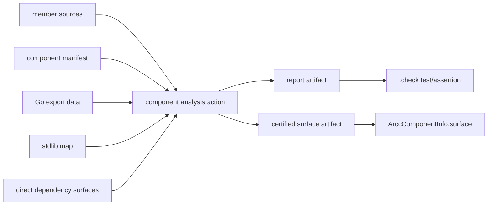
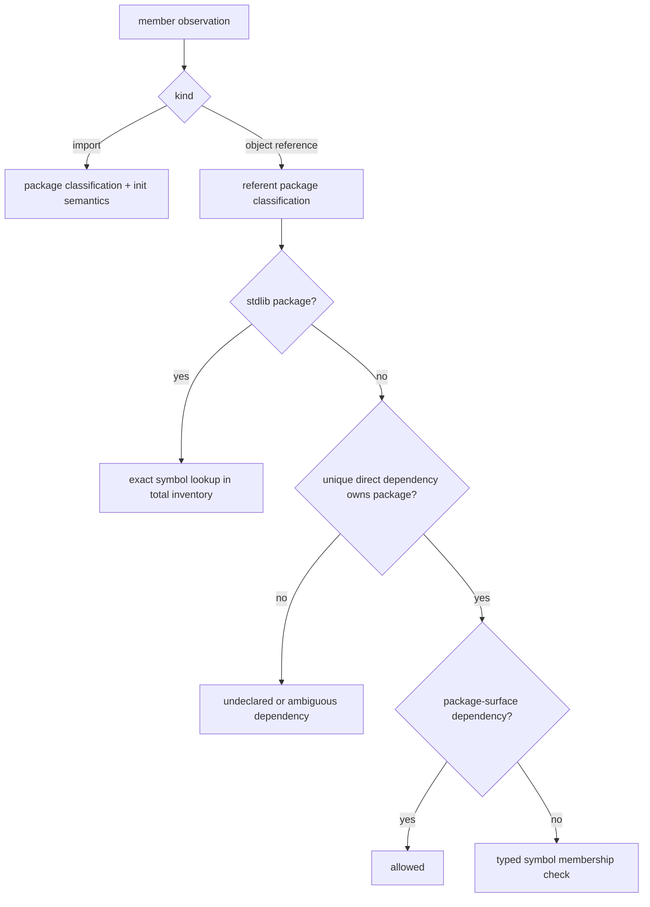

# Design review — compositional component analysis

**Review date:** 2026-09-02  
**Reviewed artifacts:** [`design/detailed-design.md`](design/detailed-design.md),
[`implementation/plan.md`](implementation/plan.md),
[`idea-honing.md`](idea-honing.md), and the two research notes under
[`research/`](research/)  
**Design baseline:** `dev-exp-go-bazel-mvp` at `5011b726`  
**Repository state reviewed:** `cca66212` plus an empty working-copy change  
**Disposition:** The semantic direction is promising, but the design and especially the
implementation plan are not ready to turn into code tasks. Several claimed properties do
not yet have an implementable mechanism, and a few parts of the plan contradict each other
or the current Bazel/package-loading architecture.

This report is intentionally self-contained. It records the relevant current-system facts,
the reasoning behind each finding, likely consequences, decisions that must be made, and a
suggested way to repair the design and plan. A follow-on agent should not need access to the
conversation that produced this review.

---

## 1. Executive summary

The governing idea is sound and valuable: once all component members are analysis roots and
authority is deliberately stopped at declared component boundaries, component-local checks
should not need to rebuild a whole-program call graph. Replacing check-time SSA/VTA with a
typed source-reference scan, moving standard-library authority analysis into a reusable SDK
artifact, and publishing dependency surfaces are all directionally appropriate.

The present documents do not yet close the loop between that semantic model and the actual
build/package-loading system. The most important blockers are:

1. A Bazel test action cannot publish the surface artifact that another component's action
   consumes. The current `.check` target only creates a test launcher; the design needs a new
   ordinary action/provider topology.
2. A `types.Info` scan still needs complete Go type information for imports. Dependency
   surface manifests do not replace Go export data, and the plan does not describe how export
   data enters the hermetic package driver or check action.
3. Native staleness detection requires reading the very dependency sources that Step 6 says
   may be unreadable. The proposed input hash is also too narrow to certify a check result.
4. “Scan every reference” expands the boundary rule beyond calls, but the surface-symbol
   model still reflects the old call-only implementation. Interface methods, fields,
   variables, constants, type references, promoted methods, and import-only edges are not
   coherently specified.
5. The standard-library map fails open at symbol granularity: an absent symbol means “pure,”
   but the design has no total symbol inventory or proof that every referencable symbol was
   analyzed. Exported variables and package init are not ordinary call-graph roots.
6. `authority: UNKNOWN` is simultaneously described as producing no check action and as
   producing the check output that establishes provenance. Its “poisoning” test requires an
   authority-bound computation that the design explicitly places out of scope.
7. Step 4 consumes the SDK map before Step 8 makes it a pinned Bazel artifact. A filesystem
   cache cannot be shared hermetically between Bazel test sandboxes.

The plan should be repaired before it is decomposed into implementation tasks. In particular,
the build artifact graph, type-loading strategy, persisted schemas, reference semantics, and
stdlib generator all need small explicit designs or feasibility spikes.

---

## 2. Review basis and current-system facts

### 2.1 Revision check

The implementation has not moved since the design's `5011b726` baseline. The intervening
revisions are documentation changes (`9d85b647`, `7d787ddf`, and `cca66212`). Therefore, the
code references in the design remain representative, even where later documentation caused
line numbers to drift slightly.

### 2.2 Current check topology

The current `arcc check` pipeline is:

1. Open and parse a component manifest.
2. Load member and closure package facts using `go/packages`.
3. Validate interface files.
4. Resolve every direct dependency by opening its component manifest and loading its source.
5. Build Capslock boundary-pruning sets.
6. Run Capslock over the component packages.
7. Pass facts, resolved dependency interfaces, and capability findings to the pure checker.
8. Render a report to stdout and return exit 0, 1, or 2.

The wiring is visible in
[`go/cmd/arcc/app/app.go`](../../../go/cmd/arcc/app/app.go), especially `runCheck` around
lines 134–290. The pure checker inputs are defined in
[`go/internal/checker/checker.go`](../../../go/internal/checker/checker.go) around lines
26–33.

### 2.3 Current Bazel topology

`go_component` currently performs only analysis-time file writes for the component manifest
and package-layout JSON. `ArccComponentInfo` carries the manifest, layout, transitive
manifests/layouts, coverage closure, and contracts. It does not carry a check result or
surface artifact.

The generated `<name>.check` target is a Bazel test rule. Its rule implementation declares a
shell launcher and returns that launcher as the test executable. The actual `arcc check`
process runs later as the test action. The rule declares no output containing a surface
manifest. Relevant files:

- [`bazel_rules/go/private/component.bzl`](../../../bazel_rules/go/private/component.bzl),
  particularly lines 340–438 and 440–492.
- [`bazel_rules/go/private/check.bzl`](../../../bazel_rules/go/private/check.bzl),
  particularly lines 60–110.
- [`bazel_rules/providers.bzl`](../../../bazel_rules/providers.bzl), lines 9–21.

The current component layout and runfiles also retain the entire root closure's source:
`closure_srcs` is built from every package in `merged`, and component default runfiles merge
transitive manifests, layouts, and dependency runfiles. See `component.bzl` around lines
385–411.

### 2.4 Current package-loading requirements

`LoadPackageFacts` requests `NeedDeps`, `NeedSyntax`, `NeedTypes`, and `NeedTypesInfo` together.
In layout mode the custom `GOPACKAGESDRIVER` supplies package metadata and source paths for the
closure; it does not currently supply compiled export files. See
[`go/internal/goanalysis/goanalysis.go`](../../../go/internal/goanalysis/goanalysis.go),
lines 62–217, and
[`go/internal/packagelayout/packagelayout.go`](../../../go/internal/packagelayout/packagelayout.go),
especially `HandleDriverRequest` and the layout validation code.

This matters because removing SSA is not sufficient to make source inputs or type-checking
closure-independent. A typed member scan still needs an importer capable of supplying types
for every imported package.

### 2.5 Current surface-symbol behavior

`extractSymbols` records:

- exported top-level functions;
- exported declared methods represented by `ast.FuncDecl`;
- exported top-level types, variables, and constants;
- synthetic package init symbols.

It does not enumerate fields or method specifications nested inside an interface type. See
`extractSymbols` in `goanalysis.go`, around lines 594–711. The current VTA workaround later
adds concrete methods implementing declared interfaces, which is why some interface-dispatch
cases happen to pass today. Deleting that workaround exposes a missing syntactic surface
definition; it does not by itself establish the correct replacement.

### 2.6 Severity terminology used below

- **Blocking:** The stated design cannot be implemented or a MUST-level property cannot be
  met without resolving the issue.
- **High:** Implementation could proceed, but would likely be unsound, non-hermetic, or force
  substantial rework.
- **Medium:** A significant ambiguity, plan discrepancy, or missing acceptance criterion that
  should be resolved before task generation.

---

## 3. Findings

### DR-01 — No implementable producer/consumer topology for surface manifests

**Severity:** Blocking

#### Statement

R8 requires a surface manifest to be an output of the check action so that its existence is
evidence that the check ran. Step 5 says to emit this output, and Step 6 says dependent checks
consume it. The current Bazel `.check` target is a test action with no declared surface output.
The plan does not introduce the ordinary build action and provider edge needed to connect a
producer component to a dependent component.

#### Evidence

- Design R7/R8: `design/detailed-design.md`, lines 81–85.
- Proposed `SurfaceManifest` and `ProducedByCheck`: design lines 225–247.
- Plan Steps 5–6: `implementation/plan.md`, lines 173–232.
- Current `.check` rule: `bazel_rules/go/private/check.bzl`, lines 60–110.
- Current provider: `bazel_rules/providers.bzl`, lines 9–21.
- Current component-dependency schema only names a component manifest:
  `proto/archcontracts/v1/component.proto`, lines 68–80.

#### Why this matters

Bazel actions consume declared outputs of other actions. A downstream action cannot depend on
an incidental file written while a test executable runs. Tests also run only when requested;
building a dependent component does not imply executing a dependency's test target.

There is a second semantic issue: merely running a check is not enough. A surface should be
available as certified input only if the check completed successfully. An action that writes
the surface and then exits 1 may leave a file in native mode, while Bazel will treat any output
of a failed action as unavailable. The documents currently define “certified” as “produced by
a check action,” not “produced by a successful conformance action.”

#### Decisions required

1. Is the primary producer an ordinary action owned by `go_component`, a separate
   `arcc_component_analysis` rule, or something else?
2. Does that action produce both a report and a surface, with the `.check` target merely
   asserting the action succeeded?
3. Is the surface published only on exit 0, or can a violating component publish a explicitly
   non-certified diagnostic surface?
4. How does an `UNKNOWN` component produce its surface when it deliberately has no conformance
   action?
5. How does native mode name the surface output? The CLI currently has no output flag.

#### Recommended direction

Use an ordinary action/provider split:



The analysis action should exit nonzero without publishing a consumable certified surface when
the component violates its contract. `UNKNOWN` should use a distinct unchecked-surface action
whose provider marks its trust state structurally rather than placing an easily forged boolean
inside the artifact.

#### Plan impact

This work must precede present Steps 5 and 6 and should probably precede the Step 4 cutover.
It affects `component.bzl`, `check.bzl`, `defs.bzl`, `providers.bzl`, the CLI, runfiles, and
tests. The current plan only mentions Go-side emission/consumption.

---

### DR-02 — Dependency surfaces do not supply the Go type data required by `types.Info`

**Severity:** Blocking

#### Statement

N2 describes a check action whose inputs are component sources, direct dependency surfaces,
and the stdlib map. That is not enough to type-check member source. The scan needs types for
imported packages, which must arrive through compiled Go export data, dependency source, or a
different complete type-summary format. A component surface is deliberately only an
architectural allowlist and cannot replace compiler type information.

#### Evidence

- Design N1/N2: design lines 95–101.
- Architecture diagram's unexplained “deps from export data”: design lines 134–139.
- Appendix choice “Export data rather than source”: design near lines 540–545.
- Current loader mode: `goanalysis.go`, lines 104–108.
- Current layout contains source paths, not `ExportFile` data:
  `component.bzl`, lines 121–162.
- Step 6 only deletes the separate dependency resolver load: plan lines 203–210.
- Current check runfiles stage closure sources: `component.bzl`, lines 385–411.

#### Why this matters

Even if dependency interface checking reads a surface manifest, `types.Info.Uses` and
`Selections` cannot be populated for member code without resolving imports. In the current
layout path, the custom package driver causes dependency syntax to be available because the
whole source closure is staged. Removing those files without supplying export data makes the
load fail. Leaving them in place means the action inputs and package load still scale with the
closure, contrary to N1/N2 and the Step 6 demo.

The design's strongest claim—cost “stops scaling with the dependency closure at all”—is likely
unachievable literally. At minimum, the type importer must read information proportional to
the imported type graph. Build caching can make that much cheaper than parsing and SSA, but it
does not make the dependency graph nonexistent.

#### Decisions required

1. Which rules_go/host-provider field supplies export archives or export files?
2. Does the custom `GOPACKAGESDRIVER` populate `ExportFile` and omit dependency syntax?
3. Does `go/packages` still satisfy `NeedTypesInfo` only for roots, or is a custom type-checking
   path needed to avoid requesting it for dependencies?
4. Which direct or transitive export artifacts must be action inputs?
5. How will native mode locate build-cache export data without depending on stale or
   environment-specific compiler state?
6. Does stdlib type information come from compiled stdlib export data, a source importer, or a
   separate SDK type bundle?

#### Recommended direction

Create a focused feasibility spike before the main implementation:

- extend a test layout with `ExportFile` for dependency and stdlib packages;
- stage syntax only for member roots;
- prove `types.Info.Uses`/`Selections` are complete for members;
- prove dependency source files can be absent;
- record which export artifacts appear in the action's declared inputs;
- benchmark load cost against synthetic closures of increasing depth.

Then revise N1/N2 to measurable language such as:

> A check MUST parse and scan only member source. It MUST NOT load dependency source or build
> SSA/call graphs. Dependency type data MAY be consumed from compiled export artifacts. The
> number and size of non-member action inputs must be measured and documented.

#### Plan impact

This is not a small part of Step 6. It requires coordinated changes to the Bazel aspect,
adapter, provider/layout schema, package-layout driver, loader mode, runfiles, and native
adapter. It should be a distinct early step with its own acceptance tests.

---

### DR-03 — Native staleness detection conflicts with source-independent consumption

**Severity:** Blocking

#### Statement

Step 5 defines an `InputHash` over a dependency's sources and manifest. Step 6 expects a
consumer to detect that hash becoming stale after a dependency source is touched, while also
demonstrating that dependency source is unreadable. A consumer cannot recompute a source hash
without reading the source or receiving a trusted current digest from another system.

#### Evidence

- Design provenance model: design lines 243–247.
- Stale behavior: design lines 344–350.
- Step 5 hash: plan lines 178–193.
- Step 6 stale test and unreadable-source demo: plan lines 219–232.

#### Why this matters

The plan simultaneously requires:

- no dependency-source input;
- comparison with current dependency source state;
- no action graph in native mode.

Only two of these can hold without an external trusted freshness service or producer-owned
stamp. If the consumer reads dependency files to check the hash, N1/N2 and the demo are false.
If it does not, it cannot know that a cached file is stale.

The proposed hash also binds too few semantic inputs. Certification of a passing check depends
on dependency surfaces, SDK map and key, target build configuration, canonicalizer, analyzer
version, and format semantics—not only own source and manifest.

#### Decisions required

1. Is native mode merely `asserted` unless the user invokes a command that regenerates the
   surface immediately before use?
2. Can native dependency declarations include an external current-source digest supplied by a
   package manager or build system?
3. Is staleness a producer-side status rather than something an arbitrary consumer computes?
4. Which complete set of inputs does a certification digest cover?

#### Recommended direction

For Bazel, rely on the action graph and omit source-hash staleness from semantic status; Bazel
already rebuilds when declared inputs change. Include an action/input digest only for audit and
diagnostics.

For native mode, choose one explicit contract:

- regenerate dependency surfaces as part of the same command, which sacrifices compositional
  speed but gives freshness; or
- consume cached surfaces as `asserted`, with optional best-effort freshness when source roots
  are deliberately supplied; or
- integrate with a trusted producer/package-manager digest.

Do not claim that a standalone cached file proves current-source freshness.

---

### DR-04 — “All references” and the dependency surface are not defined in the same language

**Severity:** Blocking

#### Statement

R1 and Step 4 say to scan every external reference via `types.Info.Uses` and `Selections`.
R4 and existing FR5 semantics are call-oriented. The proposed `SurfaceManifest.Symbols` simply
reuses `InterfaceSymbol`, whose current normalization contract is for function/method keys.
The design does not define how non-call references are authorized.

#### Concrete failing cases

1. **Interface method call.** For `var g dep.Greeter; g.Greet()`, go/types resolves the
   selection to the method declared inside the `Greeter` interface. The existing extractor
   records `dep.Greeter` but not a `(dep.Greeter).Greet` entry because interface method specs
   are not `ast.FuncDecl`s. The design explicitly requires this case to pass after deleting
   the concrete-implements workaround, but does not add the missing syntactic surface rule.
2. **Exported struct field.** `cfg.Path` references a field whose declaring package is the
   dependency. If all references are checked, a surface containing only the `Config` type does
   not say whether `Path` is allowed.
3. **Package variable or constant.** `dep.DefaultClient` or `dep.Mode` is a reference but not a
   call. It may be part of the declared surface because its declaration is in an interface
   file, but symbol-key and authority behavior are unspecified.
4. **Promoted methods and fields.** Source writes a selection on an outer type while the
   selected object belongs to an embedded type. “As written” could mean the selected declared
   object or the apparent receiver path; these produce different keys.
5. **Generic instantiation.** The current code strips generic brackets for call-edge
   comparison, but a persisted cross-version format needs a precise origin/instantiation rule.
6. **Import-only edge.** A blank import has a package and source position but no symbol.

#### Evidence

- Requirements: design lines 69–76.
- `ScanReferences` signature: design lines 250–260.
- Required interface-dispatch fixture: design lines 374–386.
- Plan Step 4: plan lines 137–169.
- Plan's “exactly the declared interface” statement: plan lines 173–193.
- Current extractor: `goanalysis.go`, lines 594–711.
- Current `InterfaceSymbol` contract:
  [`go/internal/capanalyzer/capanalyzer.go`](../../../go/internal/capanalyzer/capanalyzer.go),
  lines 38–47.

#### Decisions required

1. Does FR5 expand from calls/function values to all externally declared objects?
2. If yes, what is the complete persisted symbol grammar for packages, types, functions,
   methods, fields, variables, constants, and init?
3. Is access to any exported member of a type allowed when that type declaration is in an
   interface file, or must every field/method be separately enumerated?
4. How are embedded and promoted members represented?
5. Does a type alias expose the aliased type's full surface?
6. Which source location and caller context are kept for findings and evidence?

#### Recommended direction

Define a typed edge and typed surface entry instead of using one unstructured string for all
cases. For example:

```go
type ReferenceKind int // Import, Func, Method, Type, Field, Var, Const

type ReferenceEdge struct {
    Kind            ReferenceKind
    FromPackage     string
    ReferentPackage string
    Referent        SymbolID // absent only for Import
    File            string
    Line            int
}
```

Define `SymbolID` from go/types objects and origins, including a versioned textual encoding for
serialization. Add table-driven tests for every symbol kind, aliases, embedding, promotion,
generics, pointer/value receiver selections, and duplicate Uses/Selections observations.

If the intended policy remains call-oriented, narrow R1 to callable references plus imports
and explicitly leave fields/types/variables out of scope. Either choice can be coherent; the
current mixture is not.

---

### DR-05 — The standard-library map fails open at symbol granularity

**Severity:** Blocking

#### Statement

The design makes package enumeration total but permits the symbol map to be sparse, with an
absent symbol interpreted as empty authority. This is only sound if the generator is proven to
have considered every referencable symbol. No total symbol inventory or coverage marker is
specified, so an extraction bug silently turns an authority-bearing symbol into a pure one.

#### Evidence

- R6 and package-totality invariant: design lines 77–80 and 105–111.
- Lookup semantics: design lines 203–214.
- Map model: design lines 307–322.
- Generator plan and tests: plan lines 104–133.
- Current Capslock API use: `capslockadapter.go`, lines 153–233.

#### Specific gaps

1. **Exported variables are not call-graph roots.** A package variable can expose ambient
   state or a pre-minted handle. Examples in the SDK include file handles, process state, and
   default clients/transports. The minting-site rule does not cover a handle obtained from a
   global variable unless variable references have their own authority entries.
2. **Package init is not an exported-symbol root.** The map has a separate `inits` table, but
   “run Capslock with every exported symbol as a root” does not explain how init findings are
   isolated and attributed.
3. **Root attribution is unspecified.** The current adapter asks Capslock to analyze every
   function in queried packages and returns capability paths. It does not expose a demonstrated
   API that requests one exported root at a time or reliably groups findings by the root frame.
4. **Assembly, intrinsics, cgo, and linkname.** SDK implementations commonly cross bodies
   Capslock cannot analyze. The generator must make these conservative or prove the built-in
   classifier covers them.
5. **Evidence cardinality is wrong.** `evidence: symbol -> [frame]` cannot distinguish the
   evidence path for FILES from the evidence path for NETWORK when one symbol reaches both.
   Init evidence also has no explicit key.
6. **The totality test is circular.** Verifying that every package returned by the chosen
   enumeration is in the map does not verify that enumeration against an independent SDK
   definition such as the target toolchain's `go list std` equivalent.

#### Decisions required

1. What exact set of externally referencable stdlib objects is inventoried?
2. Does every inventoried symbol carry one of `PURE`, `CAPABILITIES`, or `UNKNOWN`, so absence
   is an error rather than purity?
3. How are variables, constants, types, methods, and init analyzed or conservatively labeled?
4. What is the independent oracle for complete package enumeration?
5. How are findings keyed by `(symbol, capability, class)` with evidence?

#### Recommended direction

Use a total symbol inventory inside every enumerated package. Sparse serialization is still
possible if the artifact also carries a deterministic inventory digest/count and generation
validates that every inventory item reached a terminal classification. Lookup of an unknown
symbol in a known package should fail closed, not return empty.

Run a generator feasibility spike over at least `os`, `net/http`, `reflect`, `runtime`,
`syscall`, `unsafe`, an init-bearing fixture, and a synthetic exported-variable fixture before
the reference-scan cutover.

---

### DR-06 — `authority: UNKNOWN` has contradictory production and propagation semantics

**Severity:** Blocking

#### Statement

An `UNKNOWN` component is described as not analyzed, running no check action, and still
contributing a surface manifest. R8 says all surfaces are check outputs. R11 says unknown
poisons any bound, while transitive/whole-tree bounds are explicitly out of scope. The plan's
acceptance test and demo therefore require a computation no step introduces.

#### Evidence

- R8/R10/R11: design lines 81–90.
- Authority lattice: design lines 283–305.
- Out-of-scope bounds: design lines 113–116.
- Boundary vocabulary: design lines 361–368.
- Step 10: plan lines 312–339.

#### Additional ambiguity

The purported four-way boundary vocabulary is not a set of mutually exclusive states:

- `certified` versus `asserted` describes provenance;
- `stale` describes freshness;
- `untrusted` describes authority knowledge.

An unknown native surface may be asserted, stale, and untrusted simultaneously. A checked
surface may be certified and stale in a copied native context. One label cannot preserve these
facts without a precedence rule that hides information.

The existing manifest also has `own_check_runs` and `certification_reference`. The plan adds an
`authority` field but does not say whether those fields remain, become derived, or are invalid
in certain combinations. The repository already has a capability named `UNANALYZED`, so the
distinction between an analysis-defeating finding and the new authority-knowledge axis must be
made explicit.

#### Decisions required

1. What separate action emits an unchecked surface?
2. Is `UNKNOWN` allowed with declared-interface style or only `PACKAGE_SURFACE` initially?
3. Must `declared_authority` be empty when authority is unknown?
4. Are `own_check_runs` and `certification_reference` removed, retained, or derived?
5. What concrete bound is being computed and where does it appear in the report/API?
6. If bounds remain out of scope, what observable behavior beyond an `untrusted` annotation
   satisfies R11?

#### Recommended direction

Model three orthogonal axes:

| Axis | Example values |
| --- | --- |
| Conformance provenance | `CHECKED_PASS`, `UNCHECKED_ASSERTION` |
| Freshness | `BUILD_GRAPH_CURRENT`, `NATIVE_CURRENT`, `UNKNOWN_OR_STALE` |
| Authority knowledge | `DECLARED(set)`, `UNKNOWN` |

Keep the lattice type in the schema if future bounds need it, but do not claim poisoning is
implemented until a consumer actually joins authority declarations. Alternatively, add a
small direct/transitive bound computation now and remove it from the out-of-scope list.

---

### DR-07 — The plan consumes the map before it has a hermetic Bazel artifact

**Severity:** High

#### Statement

Step 3 creates an on-demand generate-and-cache implementation. Step 4 changes every check to
require it. Step 8 later introduces pinned Bazel distribution. A Bazel test sandbox cannot
share an undeclared native cache with other check actions, so Steps 4–7 are either expensive,
non-hermetic, or nonfunctional in Bazel.

#### Evidence

- Step 3 cache: plan lines 104–129.
- Step 4 consumption: plan lines 137–169.
- Step 8 distribution: plan lines 263–286.
- Current hermetic test contract: `check.bzl`, lines 1–10 and 60–83.

#### Consequences

- Generating the entire SDK map inside each sandbox defeats the expected speedup.
- Writing a shared cache outside declared outputs violates hermeticity and remote execution.
- The current check environment deliberately needs no `go` binary; generator assumptions may
  not hold there.
- `just ci` includes Bazel checks, so this is not merely an unshipped intermediate state.

#### Recommended direction

Move keyed Bazel map generation/distribution before the Step 4 cutover. Keep on-demand
generation solely as the native-mode implementation of the lookup port. Step 4 should consume
the same logical port in both modes but receive a declared artifact in Bazel mode.

---

### DR-08 — The canonical namespace has no defined identity

**Severity:** High

#### Statement

The surface records `Namespace string`, and `IsCanonicalPath` is proposed to make
canonicalization idempotent. A fixed-point predicate does not identify the canonicalization
function. Two hosts can each emit different fixed-point spellings and both claim they are
canonical.

#### Evidence

- Namespace section: design lines 328–338.
- Plan Step 6: plan lines 203–217.
- Current host seam:
  [`go/internal/hostpolicy/hostpolicy.go`](../../../go/internal/hostpolicy/hostpolicy.go),
  particularly the `CanonicalizePath` contract.

#### Decisions required

1. Who assigns namespace IDs?
2. Is the ID a stable name/version, a digest of rewrite rules, a repository identity, or an
   adapter-supplied constant?
3. Must SDK map symbols use the same namespace, or are SDK paths always upstream-standard?
4. How are namespace migrations handled for caches and checked-in native surfaces?

#### Recommended direction

Make the namespace an explicit adapter contract with a stable ID/version, and include it in
surface provenance and any digest. Test two distinct canonicalizers that each produce
idempotent output and prove a cross-namespace surface is rejected.

---

### DR-09 — `SDKKey` is incomplete and target-versus-host semantics are ambiguous

**Severity:** High

#### Statement

The key is `(go_version, GOOS, GOARCH, build_tags, classifier_hash)`. It omits at least cgo
mode, although cgo affects source selection and the current package layout records
`cgo_enabled`. Other toolchain experiments or architecture feature settings may affect the
implementation analyzed. “Active toolchain” is also ambiguous under cross-compilation.

#### Evidence

- SDK key: design lines 307–322.
- Step 8: plan lines 263–281.
- Current target platform model: `component.bzl`, lines 146–157, and
  [`bazel_rules/go/private/go_adapter.bzl`](../../../bazel_rules/go/private/go_adapter.bzl),
  lines 49–67.

#### Required clarification

The map key must describe the SDK and target build configuration used to compile the member
code, not the execution host of the `arcc` binary or map generator. At minimum, audit:

- exact Go toolchain identity, including patch/toolchain build;
- target `GOOS` and `GOARCH`;
- cgo enabled/disabled;
- user and release build tags;
- relevant `GOEXPERIMENT` and architecture feature variables;
- classifier semantic version/hash;
- map format version.

Replace the Step 8 test “two hosts with different GOOS” with two target configurations under
one host, including a cross-compile case.

---

### DR-10 — Import edges do not fit the edge-classification state machine

**Severity:** High

#### Statement

The edge-classification diagram applies one dispatch to both references and imports. A blank or
side-effect import of a declared-interface dependency has a package but no symbol. It reaches
the “symbol in declared interface?” branch with nothing to compare and no specified result.

#### Evidence

- Imports are mandatory edges: design R3, lines 72–75.
- Classification diagram: design lines 145–166.
- Plan Step 4: plan lines 137–158.

#### Recommended explicit rules

1. **Intra-component import:** ignore as a boundary edge; the imported member package's init is
   scanned because every member is a root.
2. **Stdlib import:** require an exact package entry and add `PackageInitAuthority`; do not run a
   symbol-interface check.
3. **Declared component import:** accept crossing the declared component boundary without a
   symbol check; init authority remains owned by the dependency.
4. **Auto-attached component import:** same as a declared component import, with edge provenance
   recorded for unused-dependency behavior.
5. **Other import:** `UNDECLARED_DEPENDENCY`.
6. **Unresolved import:** classify by the written import path first. If it is declared or stdlib
   but type data is missing, return a tool/analysis error rather than falsely calling it an
   undeclared dependency.

Add separate import-edge tests for blank imports in all five categories.

---

### DR-11 — Analysis-defeating constructs have contradictory severity

**Severity:** High

#### Statement

The error table says `go:linkname`, assembly, and cgo emit an `AnalysisLimitation` warning, then
says to classify them as `AnalysisDefeating`. In the existing policy model,
analysis-defeating capabilities are ordinary undeclared-authority violations unless explicitly
allowed or downgraded. Turning bypasses into unconditional warnings would let a component pass
without declaring the gap.

#### Evidence

- Error table: design lines 342–354.
- Current capability classes and policy:
  `go/internal/capanalyzer/capanalyzer.go`, lines 10–16 and 71–117.
- Current checker handling: `go/internal/checker/checker.go`, lines 310–344.

#### Recommended direction

Choose one rule and state it consistently. The fail-closed choice is:

- emit an analysis-defeating capability finding;
- make it a violation by default;
- permit explicit policy declaration/downgrade where the project consciously accepts it;
- use `AnalysisLimitation` as the report kind only after such an explicit downgrade.

Also distinguish constructs in member code from constructs encountered while generating the
stdlib map; map-generation gaps should normally invalidate the map rather than become a
component-local warning.

---

### DR-12 — Direct dependency package overlap remains order-dependent

**Severity:** High

#### Statement

The decision record acknowledges that two dependency surfaces may claim the same package and
make the applicable authority/interface declaration depend on lookup order. The issue is
deferred as a tree-level concern, but direct dependency classification already needs a unique
answer.

#### Evidence

- Idea-honing Q11: `idea-honing.md`, lines 264–287.
- Current checker builds maps with last assignment winning:
  `go/internal/checker/checker.go`, lines 64–69 and 207–227.

#### Why this matters

Persisted surfaces make the ambiguity more visible, not less. If dependency A and dependency B
both publish package `p`, an edge to `p.X` could be accepted under one interface and rejected
under the other. Sorting or iteration changes could alter the verdict.

#### Recommended direction

Keep repository-wide overlap checking out of scope if necessary, but fail the current component
check when two direct dependency surfaces claim the same concrete package unless their identity
is explicitly aliased as the same component. Do this before building any package-to-dependency
lookup map.

---

### DR-13 — I1's “approved” condition is not implemented

**Severity:** High

#### Statement

The soundness argument for removing absorption depends on every component being either checked
or explicitly marked unanalyzed **and approved**. Step 10 adds an `UNKNOWN` marker and an
`untrusted` report annotation but no approval/allowlist mechanism. The governance predicate
suggested in Q7 is deferred with tree-level predicates.

#### Evidence

- I1: design lines 105–111.
- Q7 governance discussion: `idea-honing.md`, around lines 166–194.
- Step 10 claims to complete I1: plan lines 312–339.
- Tree predicates remain absent: plan lines 372–378.

#### Consequence

“Explicitly marked” and “approved” are different properties. Without an approval control, any
author can convert an inconvenient wrapper to `UNKNOWN`, and the build remains green. The
system is transparent about the trust hole but does not establish the invariant used in the
soundness proof.

#### Recommended direction

Either:

- weaken I1 to an external governance assumption and stop claiming Step 10 completes it; or
- add a minimal build/repository policy input containing approved unknown component IDs and
  make unapproved `UNKNOWN` a violation/tool error.

The approval identity should be stable and namespace-aware; package-name string matching should
not return through another route.

---

### DR-14 — The SDK source hook contradicts the post-redesign architecture

**Severity:** Medium

#### Statement

The design says check actions need stdlib type information from export data and only map
generation needs SDK source. Step 11 nevertheless merges `GO_SDK_SRCS_ATTRS` into three check
rules.

#### Evidence

- Design host adapter contract: design lines 438–450.
- Research explanation: `research/host-import-friction.md`, lines 35–53.
- Plan Step 11: plan lines 343–359.

#### Recommended direction

Move SDK source attributes to the map-generation rule. Define separate adapter hooks for:

- SDK source enumeration used by map generation;
- SDK export/type data used by component checks;
- target platform/key discovery.

Do not preserve a check-rule source hook merely because it was useful to the pre-redesign
loader.

---

### DR-15 — Persisted map and surface formats are not actually designed

**Severity:** High

#### Statement

Both artifacts cross process/action/cache boundaries, but the design supplies only illustrative
Go structs and pseudodata. There is no wire format or compatibility contract.

#### Missing decisions

- protobuf, JSON, textproto, or another encoding;
- format/version fields and minimum reader behavior;
- unknown-field and unknown-enum handling;
- canonical byte serialization for reproducibility;
- stable symbol encoding and namespace version;
- capability plus `TrueAuthority`/`AnalysisDefeating` representation;
- per-capability evidence representation;
- hash algorithm and exactly which bytes/semantic inputs are hashed;
- size limits and malformed-artifact behavior;
- atomic writes and partial/corrupt cache recovery;
- protobuf field-number reservation after removing `absorbed_dependencies`;
- whether a component dependency points directly to a surface or derives a sibling filename.

#### Evidence

- Surface struct: design lines 225–247.
- Map pseudodata: design lines 307–326.
- Current component schema: `proto/archcontracts/v1/component.proto`.
- Step 5 merely says “deterministic serialisation”: plan lines 173–193.

#### Recommended direction

Add explicit versioned schemas before implementation. If protobuf is used, reserve deleted field
numbers and names. Define canonical ordering before byte hashing; ordinary protobuf map
serialization is not by itself a stable byte contract unless deterministic marshaling and field
choices are prescribed.

---

### DR-16 — Surface package membership is underspecified, especially for patterns

**Severity:** High

#### Statement

`SurfaceManifest.Packages` is used both to identify ownership and, for `PACKAGE_SURFACE`, to
mean “everything exported by these packages.” It is not specified whether entries are resolved
literal paths or membership patterns. This becomes problematic for pattern-membership wrappers,
which are currently resolved in the context of the depender's closure and cannot be checked
directly as standalone components.

#### Evidence

- Surface struct comment: design lines 225–241.
- Current direct-load rejection of pattern members: `goanalysis.go`, lines 64–79.
- Current dependency-side pattern resolution: `goanalysis.go`, around lines 1792–1878.
- Step 5 says package-surface components record “member packages,” without pattern semantics:
  plan lines 173–193.

#### Decisions required

1. Are surface packages always concrete paths?
2. If so, how can an `UNKNOWN` pattern wrapper produce them without inspecting an arbitrary
   depender closure?
3. If patterns are persisted, how are package overlaps, namespaces, malformed patterns, and
   matching order handled?
4. Is pattern membership being removed in favor of explicit literal packages under the new
   model?

#### Recommended direction

Prefer concrete package paths in persisted surfaces. If contextual pattern matching remains a
required host feature, model it as a distinct asserted coverage rule rather than pretending it
is a precomputed component surface. Add an explicit migration decision to the design.

---

### DR-17 — Map evidence and component findings do not preserve the advertised explanation model

**Severity:** Medium

#### Statement

The design correctly says evidence must not disappear, but it only stores a canned stdlib path.
It does not specify how that path is joined to the member reference location, how multiple
references are deduplicated, or which location appears in verdict goldens.

#### Evidence

- Evidence requirement: design lines 320–326.
- Golden example expects a member source location: design lines 393–400.
- Current Capslock evidence rendering: `go/internal/checker/checker.go`, lines 313–325.

#### Recommended direction

For each component finding, preserve:

1. the member source edge and its exact file/line;
2. the canonical referenced stdlib symbol;
3. capability/class;
4. a generator-produced SDK evidence path for that `(symbol, capability, class)`;
5. SDK map key/version.

Define deterministic deduplication: likely one finding per capability plus a stable best
reference/evidence path, or one finding per distinct source reference if source precision is
more important. The choice affects report compatibility and golden structure.

---

### DR-18 — The plan's performance and soundness acceptance tests are too weak

**Severity:** Medium

#### Statement

N1 and I3 are central, but the plan mostly relies on demos and self-referential checks. There is
no regression test that inspects action inputs, no synthetic scaling benchmark, and no
independent completeness oracle for the SDK enumeration.

#### Evidence

- N1/I3: design lines 95–111.
- Step 3 “totality” test: plan lines 121–127.
- Step 6 performance claim appears only under Integration/Demo: plan lines 226–232.

#### Recommended acceptance coverage

- An analysis test proving a component check's runfiles/action inputs contain member source but
  no dependency source.
- A hermetic integration test where dependency sources are absent but required export data and
  surfaces are present.
- A synthetic benchmark with fixed member size and increasing dependency depth/size, recording
  package-load, scan, and total time.
- A separate benchmark with increasing direct imported type-surface size, to establish the
  residual scaling that cannot be eliminated.
- SDK package enumeration compared with an independent target-toolchain oracle.
- Symbol inventory coverage tests that fail lookup for an inventoried package's unknown symbol.
- Remote/sandbox execution proving no undeclared cache is used.

---

### DR-19 — Smaller plan discrepancies and omissions

**Severity:** Medium

1. Step 1 says it will land “three orthogonal fixes” but lists only the aspect-provider fix and
   golden normalization. Profiling is an investigation, not the third fix. Identify the missing
   item or correct the objective.
2. Step 5's hash test says the hash changes when a member source changes “and not otherwise,”
   while the guidance says the manifest is also hashed. The test wording should enumerate all
   included and excluded inputs.
3. Step 6 says `ResolveDependencyInterface` will read a surface but does not change
   `ComponentDependency.manifest`, add a surface field, or define an artifact lookup rule.
4. The design says `manifest`, `report`, `hostpolicy`, and `packagelayout` keep their roles, but
   the plan requires significant schema, report-kind/status, namespace, and loader changes.
   “Roles unchanged” is defensible; “report kinds unchanged” is not, because `UnusedAuthority`
   and new boundary states are additions.
5. Map generation and surface emission lack corruption, concurrent-cache-write, and atomic-file
   tests.
6. Step 2 removes absorption before the `UNKNOWN` alternative and approval mechanism exist.
   That may be acceptable because this repository has no production absorbed manifests and the
   host will not re-import mid-series, but the plan should state that intermediate commits do
   not satisfy I1 and must not be released independently.

---

## 4. Cross-document discrepancies

| Topic | Design/decision claim | Plan/current-system conflict |
| --- | --- | --- |
| Surface provenance | Surface is a check-action output and therefore structurally certified | Current `.check` is a test launcher with no output; `UNKNOWN` runs no check but still emits a surface |
| Closure independence | Inputs are own sources, dep surfaces, map | Typed scan still requires dependency/stdlib export data; current layout stages closure source |
| Native freshness | Surface input hash detects staleness | Consumer cannot recompute it when dependency source is absent/unreadable |
| Reference scope | Every external reference is classified | Surface/symbol grammar remains primarily call-oriented |
| Interface dispatch | Interface-typed method call must pass syntactically | Existing symbol extraction omits interface method specs; plan removes the compensating closure |
| Stdlib safety | Missing symbol entry means empty authority | No total symbol inventory proves a missing entry was analyzed and pure |
| Unknown propagation | Unknown poisons every bound | Bound computation is explicitly out of scope and absent from the plan |
| Boundary vocabulary | Four-way vocabulary | Provenance, freshness, and trust states overlap rather than form one enum |
| Map availability | Checks fail closed without the correct map | Steps 4–7 rely on an on-demand cache before Bazel distribution lands |
| SDK inputs | Checks need export data; generator needs sources | Step 11 adds SDK source attrs to check rules |
| Approval invariant | Unanalyzed components are marked and approved | Only marking/reporting is planned; approval is external and unspecified |

---

## 5. Proposed target model

This section is not a replacement design. It is a concrete starting point that resolves the
largest contradictions while preserving the intended semantics.

### 5.1 Separate artifacts and statuses

Use two surface production paths:

1. **Checked surface:** produced only by a successful ordinary component-analysis action. The
   build provider, not an artifact boolean, establishes checked provenance.
2. **Asserted surface:** produced by a distinct unchecked-surface action for `UNKNOWN`
   components. Its provider marks it as asserted/untrusted.

The serialized surface should carry audit metadata, but consumers in Bazel should derive trust
from the provider/action edge. Native consumers cannot authenticate a boolean inside a file and
should default to asserted unless they just ran the producer themselves.

Represent boundary status as fields rather than a single label:

```text
provenance: CHECKED_PASS | ASSERTED
freshness:  BUILD_GRAPH_CURRENT | NATIVE_VERIFIED | UNKNOWN
authority:  DECLARED{...} | UNKNOWN
```

The text report may summarize common combinations as `certified`, `asserted`, `stale`, and
`untrusted`, but JSON should retain all axes.

### 5.2 Separate architectural surface from compiler type input

A dependency edge should provide two different artifacts:

- **Architectural surface:** packages/symbols/authority/provenance used by arcc policy.
- **Compiler export data:** Go type information used only to type-check member source.

Do not put full compiler type data into the architecture surface. Do not treat the architecture
surface as an importer.

### 5.3 Make absence fail closed

For both surface and SDK artifacts:

- unknown format version: tool error;
- known package plus unknown referenced symbol: tool error or explicit `UNKNOWN`, not pure;
- namespace mismatch: tool error;
- SDK key mismatch: tool error;
- incomplete generation: producer failure;
- corrupt cache: discard/regenerate in native mode, action failure in hermetic mode.

### 5.4 Clarify edge types

Classify imports and object references separately:



### 5.5 Treat performance as a measurable contract

The primary guaranteed win should be removal of:

- whole-closure SSA construction;
- VTA;
- the second Capslock package load;
- per-dependent dependency-source parsing for architectural surfaces;
- per-check stdlib source analysis.

Do not promise zero dependence on imported type information. Instead, benchmark and cap the
remaining cost.

---

## 6. Recommended plan restructuring

The current eleven-step sequence should be revised roughly as follows. Step names are
illustrative; the important part is the dependency ordering.

### Proposed Step 0 — Resolve design blockers

- Define versioned surface and SDK-map schemas.
- Define typed reference/symbol semantics.
- Define provenance/freshness/authority axes.
- Decide native freshness contract and unknown approval policy.
- Revise N1/N2 to measurable requirements.

**Exit criterion:** No blocking question in DR-01 through DR-06 remains unanswered.

### Proposed Step 1 — Feasibility spikes and measurement

- Profile the existing phases as already planned.
- Prove member-only syntax plus dependency export-data loading in native and layout modes.
- Prove per-symbol and init attribution from Capslock, including an exported-variable strategy.
- Record artifact sizes and scaling.

**Exit criterion:** Tested prototypes demonstrate both critical mechanisms on representative
packages.

### Proposed Step 2 — Low-risk groundwork

- Aspect empty-provider fix.
- Golden normalization fix, after specifying how a host canonicalizer is applied to both sides.
- SDK-root failure hardening if that is the missing third Step 1 fix.

### Proposed Step 3 — Build action/provider topology

- Add ordinary component-analysis action.
- Add checked/asserted surface providers.
- Make `.check` validate the analysis action rather than own the only execution.
- Add CLI output plumbing and atomic writes.

### Proposed Step 4 — SDK map schema, generator, and both adapters

- Implement total package and symbol inventory.
- Implement keyed Bazel artifact generation/distribution now, not later.
- Implement native on-demand cache behind the same reader interface.
- Add target-platform keying and fail-closed lookup.

### Proposed Step 5 — Typed reference facts while retaining current verdict path

- Add typed edges and comprehensive Go-language fixtures.
- Initially compare them with existing call-edge behavior where overlap exists.
- Do not delete VTA until interface-method and non-call semantics are pinned.

### Proposed Step 6 — Replace check-time Capslock/SSA/VTA

- Resolve stdlib authority from the pinned map.
- Switch FR5 to the typed syntactic edge model.
- Delete the implements-closure workaround only after the interface-dispatch fixture passes via
  the new explicit surface semantics.

### Proposed Step 7 — Member-only source loading and surface consumption

- Switch layouts/importer to export data.
- Remove dependency source from action inputs/runfiles.
- Consume direct dependency surfaces.
- Reject direct dependency package overlap.
- Prove the action-input and unreadable-source acceptance tests.

### Proposed Step 8 — Absorption migration/removal

- Introduce checked wrappers and the explicit unknown path first.
- Define release boundaries if intermediate commits do not satisfy I1.
- Remove the schema field and implementation only after replacement mechanisms exist.

This reverses the current “remove first” preference in favor of maintaining the design's own
soundness invariant. If the repository intentionally keeps removal early because no consumer
will see intermediate revisions, record that as a release constraint.

### Proposed Step 9 — Unknown authority, approval, and reporting

- Implement schema validation and separate status axes.
- Add approval behavior or explicitly document it as an external assumption.
- Implement an actual authority-bound consumer if poisoning remains a requirement.

### Proposed Step 10 — Unused authority, golden restructure, and host hooks

- Add `UnusedAuthority` after exercised-authority facts are stable.
- Restructure verdict/layout/surface goldens.
- Add runtime-injection and the correctly shaped SDK source/export hooks.
- Run scaling, hermeticity, self-check, manifest parity, and next-host-import acceptance suites.

---

## 7. Required acceptance matrix

Before the design can be considered implemented, the following behaviors should be traceable to
tests. This matrix fills gaps in the current Testing Strategy.

| Area | Required acceptance behavior |
| --- | --- |
| Build graph | Building/checking a dependent schedules the dependency analysis artifact; it does not rely on the dependency's test having run previously |
| Failed dependency | A dependency whose check violates cannot publish a certified surface consumed downstream |
| Unknown dependency | An asserted surface is produced without a check and is visibly untrusted |
| Action inputs | Dependency source files are absent from the dependent check action; required export artifacts are present |
| Typed scan | Interface methods, concrete methods, fields, variables, constants, types, aliases, embedding, promotion, generics, and function values have pinned outcomes |
| Imports | Blank stdlib, component, auto-attached, intra-component, and undeclared imports have pinned init/boundary behavior |
| Stdlib map | Every target SDK package and referencable symbol has an explicit terminal classification |
| Stdlib globals | An authority-bearing exported variable fixture cannot be silently classified pure |
| Map evidence | Findings preserve member location and capability-specific SDK evidence |
| Map key | Cross-compiled target selects the target map; cgo/tag changes select distinct keys where semantics differ |
| Namespace | Two different idempotent canonicalizers produce an explicit mismatch |
| Freshness | Bazel freshness is structural; native behavior matches the chosen asserted/verified contract without secretly reading sources |
| Dependency overlap | Two direct surfaces claiming one package fail deterministically |
| Analysis defeating | cgo/assembly/linkname behavior is fail-closed unless explicitly accepted by policy |
| Performance | Fixed member source with deeper/larger dependency closures shows no dependency-source parsing, SSA, VTA, or Capslock growth |
| Hermeticity | Bazel checks succeed in a clean sandbox/remote-style environment with no shared native cache and no undeclared Go binary |
| Determinism | Maps, surfaces, reports, and action keys are stable for identical complete inputs |

---

## 8. Open questions checklist

A design-repair pass should answer each question explicitly rather than leave it to an
implementer:

- [ ] What Bazel rule/action produces a checked surface?
- [ ] How is a failing check prevented from publishing a certified surface?
- [ ] What distinct producer emits an `UNKNOWN` surface?
- [ ] What provider field carries direct dependency surfaces?
- [ ] Does the component manifest point to a surface explicitly, or does the build rule inject
      paths without serializing them in the authored manifest?
- [ ] What Go export artifacts are needed to populate member `types.Info`?
- [ ] Can the custom package driver omit dependency syntax while retaining complete root type
      information?
- [ ] What exactly does N1 measure and permit?
- [ ] What is the native freshness contract?
- [ ] What complete inputs are bound into provenance?
- [ ] Is certification based on provider provenance, artifact contents, signatures, or some
      combination?
- [ ] Does FR5 cover all object references or only callable references plus imports?
- [ ] What is the versioned symbol grammar?
- [ ] How are interface method specs represented?
- [ ] How are fields, aliases, embedding, promoted selections, and generics represented?
- [ ] What is the rule for a blank import of a declared-interface dependency?
- [ ] What is the independent oracle for total SDK package enumeration?
- [ ] What is the total referencable-symbol inventory per SDK package?
- [ ] How are exported variables and init authority analyzed?
- [ ] What happens on a known-package/unknown-symbol lookup?
- [ ] How are evidence paths keyed when one symbol reaches multiple capabilities?
- [ ] Which target/toolchain settings belong in `SDKKey`?
- [ ] What stable identity names a canonical namespace?
- [ ] Are boundary provenance, freshness, and authority knowledge separate fields?
- [ ] What bound receives the `UNKNOWN` lattice value?
- [ ] Where is approval of unknown components enforced?
- [ ] Are pattern package surfaces retained, concretized, or removed?
- [ ] How are direct dependency package overlaps rejected?
- [ ] What is the default severity of analysis-defeating constructs?
- [ ] Which rule receives SDK sources, and which receives SDK export data?
- [ ] What are the wire formats, versions, limits, and atomic-write rules for both artifacts?

---

## 9. What should remain unchanged

The review does not challenge these central decisions:

- Component boundaries deliberately stop ambient-authority attribution; this is the security
  model, not merely a performance approximation.
- Every member function/body being a root means intra-component transitive reachability need not
  be recomputed by a call graph.
- Function values must be captured even when no call expression exists.
- Package imports must account for init-time behavior.
- Cross-boundary API policy should follow source-level intent rather than VTA-selected concrete
  implementations.
- Standard-library semantic authority should be computed once per exact SDK configuration, not
  once per component check.
- Dependency surfaces should be small, deterministic, versioned artifacts.
- `UNKNOWN` must not be representable as an empty known authority set.
- The pure checker should continue to consume injected facts and remain ambient-authority-free.
- Determinism, self-check, manifest parity, and fail-closed tool errors are appropriate
  integration constraints.

The necessary repair is therefore architectural plumbing and semantic precision, not a return
to whole-program analysis.

---

## 10. Final recommendation

Do not generate implementation tasks from the current plan yet. First perform a targeted design
revision covering DR-01 through DR-06, accompanied by two feasibility spikes:

1. member-only syntax with dependency/stdlib export-data type loading in the hermetic package
   driver; and
2. total per-symbol/per-init stdlib authority generation with conservative handling of variables
   and unanalyzable implementations.

Once those succeed, restructure the plan so the ordinary Bazel analysis action, pinned map
artifact, and export-data path exist before the reference-scan cutover. This preserves the
design's strongest insight while avoiding an implementation series that becomes non-hermetic or
unsound halfway through.
