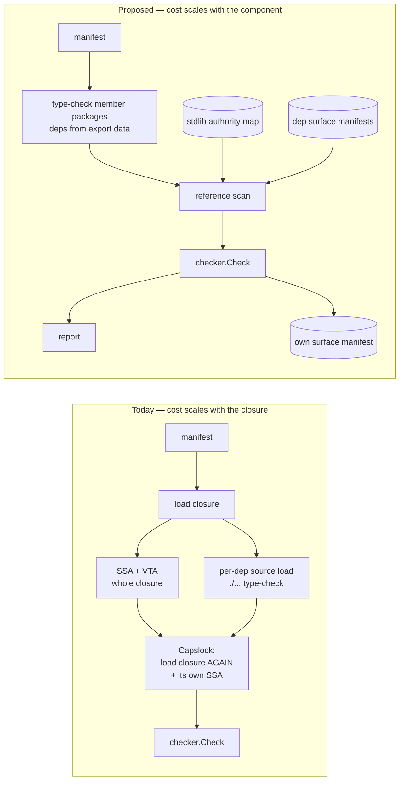
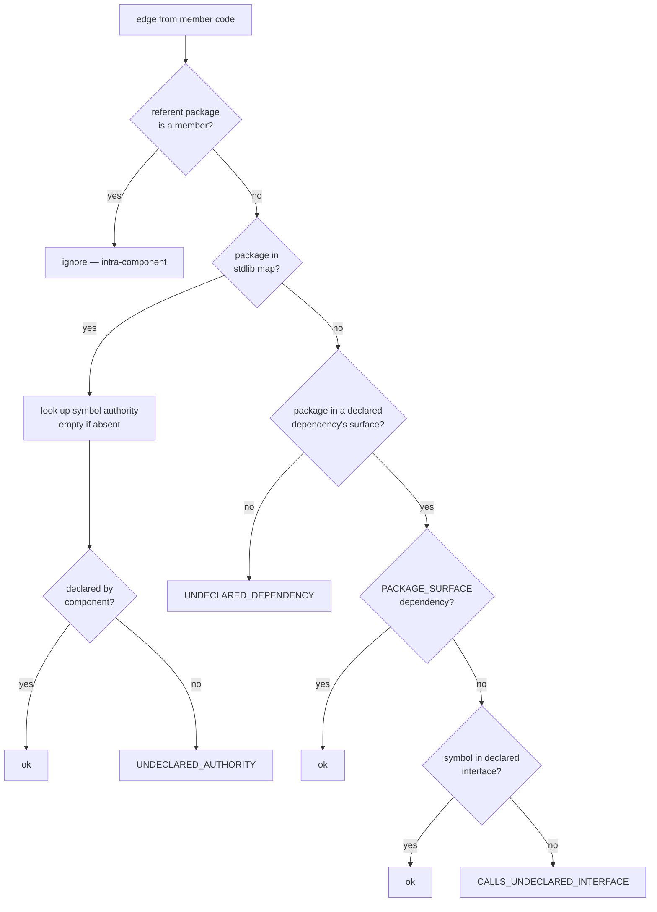
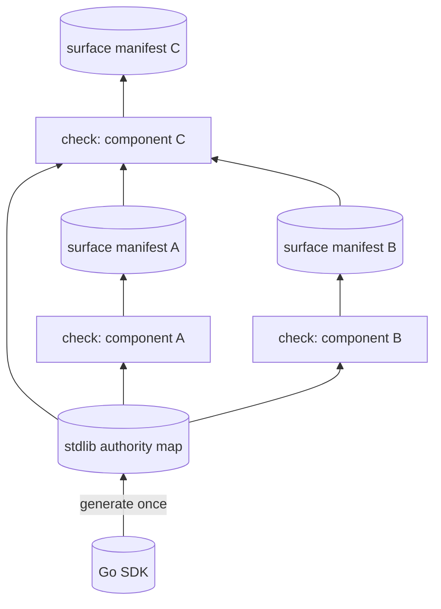

# Detailed design — compositional component analysis

**Date:** 2026-08-04
**Status:** design complete; implementation not started.
**Baseline:** `dev-exp-go-bazel-mvp` @ `5011b726`
**Inputs:** [`../rough-idea.md`](../rough-idea.md), [`../idea-honing.md`](../idea-honing.md),
[`../research/current-analysis-pipeline.md`](../research/current-analysis-pipeline.md),
[`../research/host-import-friction.md`](../research/host-import-friction.md)

---

## Overview

`arcc check` currently answers every question about a component by building a
whole-program call graph. It loads the component's entire transitive dependency
closure, builds SSA over it, runs VTA, and then does it a second time inside Capslock —
while separately type-checking each declared dependency from source. Cost scales with
the closure, not the component: 2.1s for four trivial packages in this repo, ~50s for
some packages in the second monorepo PoC.

Two changes that have already landed make that unnecessary. Membership is explicit and
**every member function is an analysis root**, which collapses intra-component
transitivity. And capability findings are already **pruned at declared dependency
boundaries**, so authority behind a boundary is already not attributed to the caller.

What remains is to classify the edges that *leave* a component. That needs no call
graph. This design replaces the whole-program analysis with three pieces:

1. a **reference scan** over member sources, treating references and imports as edges;
2. a **precomputed standard-library authority map**, generated once per SDK, which
   doubles as the definition of what "standard library" means;
3. a **surface manifest** published by each component's own check action and consumed
   by its dependents in place of their source.

The result is faster, but the reason to do it is that component checks become
**independent, cacheable, and composable** — a check's inputs become its own sources
plus a handful of small files, and cost stops scaling with the dependency closure at
all.

Two further changes fall out. `absorbed_dependencies` is removed, its role taken by
ordinary components under a stated invariant. And an `authority: UNKNOWN` axis is added
so that unowned code can be adopted incrementally without pretending it has been
verified.

### The governing principle

> **The component boundary is where ambient authority becomes designated capability.**
> A parser depending on a logging component does not acquire filesystem authority; it
> acquires the ability to log.

Pruning at a boundary is not an approximation of a transitive analysis. It is the
semantic content of the model. `certified` / `asserted` annotate *the claim that the
boundary is a real abstraction*, not the claim that code was scanned.

A corollary that runs through the whole design: **boundaries are syntactic; authority
is semantic.** Whether source names a symbol outside a declared interface is a question
about what is written. Whether a symbol reaches a syscall is a question about what
executes. Precompute the semantic part once; do the syntactic part per component.

---

## Detailed Requirements

Consolidated from [`../idea-honing.md`](../idea-honing.md); the Q-numbers cite the
decision record.

### Functional

- **R1.** A component check MUST classify every reference from member code to a symbol
  outside the component, and every import from a member package, as one of:
  intra-component, standard library, declared component dependency, or violation. (Q1, Q2)
- **R2.** The scan MUST consider all *references*, not only call expressions, so that
  function values taken but not called are edges. (Q2)
- **R3.** Package imports MUST be edges, so that init-time authority is attributed. (Q2)
- **R4.** Cross-boundary call checking (FR5) MUST be performed against symbols as
  written in source, not against dynamically resolved implementations. (Q3)
- **R5.** Standard-library authority MUST be resolved from a precomputed map rather than
  by analysing stdlib sources at check time. (rough idea, Q13)
- **R6.** The map MUST be total at package granularity; symbol entries MAY be sparse.
  Map membership is the definition of "standard library". (Q12)
- **R7.** Each component MUST publish a surface manifest describing its public surface;
  dependents MUST resolve dependency symbols from it rather than from dependency
  sources. (rough idea, Q16)
- **R8.** The surface manifest MUST be an output of the check action, so that its
  existence is evidence the check ran. (Q16)
- **R9.** `absorbed_dependencies` MUST be removed. (Q4)
- **R10.** A component MUST be able to declare `authority: UNKNOWN`, meaning it is not
  analysed and its authority is unknown rather than empty. (Q7, Q8, Q9)
- **R11.** `UNKNOWN` MUST NOT be representable as an empty authority list, and MUST
  poison any bound it flows into. (Q9)
- **R12.** Authority that is declared but never used MUST be reported. (Q15)
- **R13.** Host-injected runtime packages MUST resolve without the component author
  naming them, defaulting to infra-component attachment. (Q14)

### Non-functional

- **N1.** Check cost MUST NOT scale with the transitive dependency closure.
- **N2.** A check MUST be expressible as a single build action whose declared inputs are
  the component's sources plus its dependencies' surface manifests plus the map.
- **N3.** The check MUST fail closed when the standard-library map for the active
  toolchain is unavailable. (Q13)
- **N4.** All existing determinism guarantees (sorted findings, stable symbol keys) MUST
  be preserved.

### Constraints and invariants

- **I1.** *Every component is either checked against its manifest, or explicitly marked
  unanalyzed and approved.* R9 is sound only under this invariant. (Q4)
- **I2.** The ocap minting-site attribution rule (`capslockadapter.go:32-40`) is
  load-bearing for the soundness of a syntactic scan. Reverting it breaks this design.
- **I3.** The map's package enumeration must be complete or classification is unsound. (Q12)

### Explicitly out of scope

Transitive/whole-tree authority predicates (Q10); a bootstrap CLI for wrapper components
(Q7); dep-vs-dep declaration divergence checking (Q11).

---

## Architecture Overview

### Before and after



### Edge classification

The whole analysis reduces to one dispatch, applied to every reference and import out of
member code:



Note what this diagram does *not* contain: any notion of reachability, any call graph,
and any stdlib classification predicate. "Is it stdlib" is answered by map membership
(R6), which is why the five existing predicates delete rather than consolidate.

### Composition across components



Each check is a leaf action depending only on its own sources, the map, and its direct
dependencies' surface manifests. Nothing in the graph re-reads a transitive dependency's
source.

---

## Components and Interfaces

### New: `stdlibmap` (shell, generation) and its lookup port

Generation runs Capslock over an SDK with every exported symbol as a root — the only
place a call graph survives.

```go
// Port consumed by the analysis. The bool answers "is this the standard library",
// which is the same question as map membership (R6, Q12).
type StdlibAuthority interface {
    // IsStdlibPackage reports whether pkgPath is in the map's package enumeration.
    // The enumeration is total; a false answer means "not standard library".
    IsStdlibPackage(pkgPath string) bool

    // SymbolAuthority returns the authority a stdlib symbol reaches. A symbol absent
    // from the table has empty authority; callers MUST have established package
    // membership first.
    SymbolAuthority(symbol string) []Capability

    // PackageInitAuthority returns authority exercised by a package's init (R3).
    PackageInitAuthority(pkgPath string) []Capability

    // Key identifies the toolchain this map describes, for the fail-closed check (N3).
    Key() SDKKey
}
```

Splitting generation from lookup is what lets the map land early (Q13): the generator
plus this interface can ship backed by an on-demand cache, with distribution and pinning
following later behind the same interface.

### New: `surface` — surface manifest emission and consumption

```go
// Emitted by the check action (R8). Derived from the component's own manifest and
// loaded package facts; requires no scan.
type SurfaceManifest struct {
    Component      string
    InterfaceStyle manifest.InterfaceStyle
    Authority      AuthorityDeclaration  // DECLARED{set} | UNKNOWN  (R10, R11)

    // Populated for declared-interface style. Empty for PACKAGE_SURFACE, whose
    // surface is "everything exported by Packages".
    Symbols  []capanalyzer.InterfaceSymbol
    Packages []string

    Provenance Provenance
}

type Provenance struct {
    ProducedByCheck bool
    InputHash       string  // native-mode staleness detection (Q16)
    Namespace       string  // canonical path namespace — see Data Models
}
```

### Changed: `goanalysis`

Loses SSA construction, VTA call-graph building, `scanFuncValueEscapes`,
`collectBodilessAbsorbedPackages`, and the implements-closure computation in
`ResolveDependencyInterface` (steps 9–11, `goanalysis.go:1620-1730`). Gains the
reference scan. `ResolveDependencyInterface` collapses to reading a surface manifest.

```go
// Replaces call-graph edge extraction. Operates on AST + types.Info; no SSA.
func ScanReferences(pkgs []*packages.Package, members MemberSet) []facts.Edge
```

### Changed: `capanalyzer` / `capslockadapter`

`capslockadapter` leaves the check path entirely; Capslock is retained only for map
generation. `AnalyzeRequest.PruneAtPackages` and the per-run classifier construction for
boundary pruning are removed — pruning is now structural (an edge either leaves the
component or does not).

### Changed: `checker`

Stays pure and gains no new dependencies. Its `Caps` input becomes authority resolved
from the map rather than Capslock findings; `Facts.CallEdges` becomes `Facts.Edges` from
the scan. Absorbed-dependency handling is deleted.

### Unchanged

`manifest`, `report`, `hostpolicy`, `packagelayout` keep their current roles.
`hostpolicy` gains `IsCanonicalPath` (friction report §7) but loses its role in stdlib
classification.

---

## Data Models

### The authority lattice (R11, Q9)

The single most important representational decision. `UNKNOWN` and empty are distinct:

```
        ⊤ = UNKNOWN          (unanalyzed: could be anything)
       / | \
   FILES NETWORK EXEC ...    (declared, verified)
       \ | /
        ∅ = DECLARED{}       (analyzed, uses nothing)
```

```go
type AuthorityDeclaration struct {
    Known bool          // false ⇒ UNKNOWN; Set must be ignored
    Set   []Capability  // meaningful only when Known
}
```

Encoding `UNKNOWN` as an empty `Set` is forbidden: a subtree containing an unanalyzed
component would compute as pure. Any join involving an unknown operand is unknown.

### The stdlib authority map

```
SDKKey = (go_version, GOOS, GOARCH, build_tags, classifier_hash)

map:
  key:      SDKKey
  packages: [pkgPath]                    # TOTAL — this is the stdlib definition (I3)
  symbols:  {symbol -> [capability]}     # sparse; absent means empty
  inits:    {pkgPath -> [capability]}    # sparse
  evidence: {symbol -> [frame]}          # canned explanation path
```

`classifier_hash` covers the classifier used at generation, including the
`fileHandleUseMethods` reclassification, so generation-time and check-time assumptions
cannot drift silently (I2).

`evidence` preserves the ability to explain *why* `os.ReadFile` is FILES. Today findings
carry a full `CallPath` (`checker.go:317-320`) and the README advertises it; the
replacement is shorter and more readable but must not be evidence-free.

### Canonical namespace (friction report §7)

Surface manifests are persisted artifacts exchanged between components, and their symbol
names embed import paths. A host that rewrites path prefixes plus a manifest produced
under a different namespace is a silent mismatch. Therefore:

- every surface manifest records the namespace it was written in;
- `hostpolicy.CanonicalizePath` must be idempotent, with `IsCanonicalPath` as the
  host-supplied predicate that makes idempotence expressible;
- a consumer reading a manifest from a foreign namespace is an error, not a
  best-effort comparison.

---

## Error Handling

| Condition | Behaviour | Rationale |
| --- | --- | --- |
| No map for the active toolchain | **Fail closed**, exit 2 | Analysing 1.26 sources against a 1.25 map is unsound with no symptom (N3) |
| `classifier_hash` mismatch | **Fail closed**, exit 2 | Silent drift between generation and use (I2) |
| Surface manifest missing | Tool error, exit 2 | Under I1 it should exist; absence is a build-graph fault |
| Surface manifest namespace mismatch | Tool error, exit 2 | Never compare across namespaces |
| Surface manifest input hash stale | `stale` boundary annotation + warning | Native mode cannot prevent it, only detect it (Q16) |
| Reference to unresolvable package | `UNDECLARED_DEPENDENCY` violation | Same as any undeclared edge |
| `//go:linkname`, assembly, cgo in member code | `AnalysisLimitation` warning | Bypasses the map; classify `AnalysisDefeating` |
| Member declares authority it never uses | `UnusedAuthority` warning (R12) | Keeps declarations tight for future bounds |
| Dependency is `authority: UNKNOWN` | `untrusted` boundary annotation | Visible, not silent |

Two behaviours deliberately **not** errors: a call into a `PACKAGE_SURFACE` dependency's
exported symbol (its surface is everything exported), and a reference to an
auto-attached infra component (R13) — the author never wrote that import, so demanding a
declaration is the wrong failure.

### Boundary annotation vocabulary

```
certified  — surface manifest produced by a check action
asserted   — surface manifest present, provenance unverifiable
stale      — input hash does not match the dependency's current sources
untrusted  — dependency is authority: UNKNOWN
```

---

## Testing Strategy

### Regression fixtures pinning the new semantics

1. **Func value without a call.** A member does `f := os.ReadFile` and never calls it.
   MUST be attributed FILES. This is the case a call-site-only scan misses (R2).
2. **Import-only authority.** A member imports a package whose `init` exercises
   authority and never references a symbol from it. MUST be attributed (R3).
3. **Interface dispatch into a dependency.** A member calls `dep.Greeter.Greet()` where
   the concrete implementation is unexported. MUST pass. It passes today too, but for
   the wrong reason — the implements-closure workaround. It must still pass once that
   code is gone (R4).
4. **Direct concrete call.** A member calls a dependency's concrete method directly,
   where that method happens to implement a declared interface. MUST fail. **Today this
   wrongly passes** — this is the behaviour change (R4).
5. **`UNKNOWN` does not read as pure.** A component depending on an
   `authority: UNKNOWN` component MUST NOT compute as having empty authority in any
   bound (R11).
6. **Fail-closed on unknown SDK.** A check against a toolchain with no map MUST exit 2,
   not proceed (N3).

### Golden restructure

Friction report §6(1): separate **verdict assertions** (host-independent — "component X
reports UNDECLARED_AUTHORITY FILES at `foo.go:20`") from **layout-shape assertions**
(host-dependent). Done as part of this work rather than before it, because the redesign
shrinks the layout-shaped half: no SSA over the closure means layouts collapse toward
member packages plus resolved dependencies, and surface manifests become a new
golden-able artifact.

Ship §6(2) — normalizing both sides through `CanonicalizePath` before diffing — early,
since it reduces churn while the restructure is underway.

### Determinism and self-check

- Map generation MUST be reproducible: same SDK and classifier ⇒ byte-identical map.
- The existing self-check (arcc checks its own components) and `manifestparity` remain
  the integration test of record and MUST stay green throughout.
- Surface manifest emission MUST be deterministic (sorted symbols, stable keys) so
  manifests are cache-stable (N2).

---

## Integration with Existing System

### What is deleted

| Surface | Location |
| --- | --- |
| SSA construction, VTA call graph | `goanalysis.go:274-279` |
| Call-edge extraction and filtering | `goanalysis.go:281-326` |
| Implements-closure workaround | `goanalysis.go:1620-1730` |
| `scanFuncValueEscapes`, `collectBodilessAbsorbedPackages` | `goanalysis.go:328-329` |
| Five stdlib predicates | `packagelayout.go:79`, `goanalysis.go:533,550,563`, plus `hostpolicy`'s role |
| Capslock at check time | `capslockadapter.go:154-234` (retained for generation) |
| Boundary prune classifier | `capslockadapter.go:45-122`, `app.go:200-229` |
| `absorbed_dependencies` and its checks | `checker.go:100-112,189-205`, `facts.go:49-58` |

### What is preserved

The pure-core/shell split is unchanged and in fact strengthened: the reference scan is
shell work producing pure facts, and `checker.Check` stays a pure function over injected
inputs. The `capanalyzer.CapabilityAnalyzer` port survives with a narrower
implementation. Report kinds, exit codes, and determinism guarantees are unchanged except
where a fixture above says otherwise.

### Host adapter contract

Two additive hooks from the friction report land alongside, both with empty defaults so
no existing host is affected:

- `runtime_injection_attrs(deps_aspect)` / `extra_runtime_packages(ctx, root_packages)`
  (§3) — makes toolchain-injected packages visible so the **existing** infra
  auto-attachment (`component.bzl:217-230`, `checker.go:289-291`) can claim them. Q14
  resolved this to need no new classification concept: default to infra component,
  with stdlib-map treatment as the escape for a runtime that genuinely leaks authority.
- `GO_SDK_SRCS_ATTRS` (§4) — note that the requirement it serves changes shape here:
  check actions need stdlib *type information* (export data), and only map generation
  needs stdlib *sources*.

---

## Adherence to Established Conventions

No `.agents/summary/coding_style.md` exists in this repo; conventions below are read
from the code and `CLAUDE.md`.

- **Pure core, dependencies point inward.** `facts.go:1-6` states the rule explicitly.
  Honoured: the scan is shell, `checker` stays pure, and the new `StdlibAuthority` port
  is defined core-side and implemented shell-side, mirroring
  `capanalyzer.CapabilityAnalyzer`.
- **Component Contract (FR10) doc blocks** on every package. New packages
  (`stdlibmap`, `surface`) must carry them, including the Ambient Authority line —
  `stdlibmap` generation is a shell component holding FILES/EXEC; `surface` consumption
  is shell, its data model pure.
- **Ports and adapters for anything host-dependent.** The map's SDK enumeration is a new
  host seam and must be expressed as one rather than as a path heuristic — this is the
  point of Q12.
- **Determinism everywhere.** Existing sorting discipline extends to manifests and maps.
- **arcc checks itself.** Self-components and `manifestparity` must be updated in step
  with the schema changes, not after.
- **Deliberate departure:** `hostpolicy` loses `IsStdlibPath`'s role in classification.
  Rationale: a host seam that answers a *predicate* invites disagreement between call
  sites; replaced by a host seam that supplies a *total enumeration*, which cannot
  disagree with itself (Q12).

---

## Migration Strategy / Backward Compatibility

The PoC monorepo import has landed on the current version and **no updated import will
be taken until this work lands** (Q17). This removes the usual pressure for incremental
compatibility and permits a simpler internal path:

- **No incremental delivery obligation.** Work that existed only to bank a speedup before
  the redesign — deduplicating the double load, caching dependency surfaces — is dropped
  as superseded by the redesign itself.
- **No patch-relief obligation.** Friction report §2 is dropped entirely: patching five
  stdlib predicates upstream so they can be deleted two steps later is churn.
- **`absorbed_dependencies` is removed first, not last.** In this repo it appears only in
  test fixtures and an ad-hoc README walkthrough, so removal is pure deletion that shrinks
  every subsequent step.

Compatibility obligations that remain:

- **`authority: UNKNOWN` must exist before the next import**, since it is what replaces
  the host's `manual`-tagging patch.
- **Both adapter hooks must exist before the next import**, since they are what take the
  host's remaining production patches to zero.
- **Manifest schema changes** (`authority`, removal of `absorbed_dependencies`) are
  breaking for any manifest in the wild. Acceptable given the only consumer is the PoC,
  which re-imports wholesale.

Detailed step ordering lives in [`../implementation/plan.md`](../implementation/plan.md).

---

## Appendix A — Technology Choices

**AST + `types.Info` rather than SSA for the scan.** Resolving `f.Read` to
`(*os.File).Read` needs type information, not SSA. Walking `types.Info.Uses` and
`Selections` is cheaper and directly expresses "what does the source name", which is the
question (R4). SSA would also work but reintroduces a build step the design exists to
remove.

**Capslock retained for map generation only.** It already does exactly this job, is
already vendored, and its classifier encodes the ocap decisions (I2). Generation is once
per SDK, so its cost stops mattering.

**Export data rather than source for dependencies.** `go/packages` supplies dependency
types from compiled export data without loading their syntax, which is what removes cost
source #2.

**Total package enumeration rather than a path predicate.** See Q12: a predicate is a
heuristic that can disagree with itself across call sites; an enumeration is data that
cannot.

## Appendix B — Research Findings

Full detail in [`../research/current-analysis-pipeline.md`](../research/current-analysis-pipeline.md)
and [`../research/host-import-friction.md`](../research/host-import-friction.md).

- Measured baseline: 2.1s / 6.4s CPU for four trivial packages; 3.8s / 13.5s for one
  component. The closure, not the component, sets the cost.
- The dependency closure is loaded and SSA-built **twice** per run, and each dependency is
  additionally type-checked from source.
- ~110 lines exist solely to compensate for VTA over-resolving interface calls, and the
  compensation over-corrects.
- Five independent stdlib predicates exist today.
- The ocap minting-site rule is what makes a syntactic scan sound (I2).
- Infra auto-attachment already exists end to end and is the answer to injected runtimes.
- `MEMBER_OVERLAP` is self-vs-dep only; dep-vs-dep overlap is already unchecked.

**Unmeasured and material:** the split of the PoC's ~50s between closure SSA (which this
design eliminates) and member-package type-checking (which it keeps). Step 0 of the plan.

## Appendix C — Alternative Approaches Considered

**Consolidate the stdlib predicates onto the host seam** rather than deleting them.
Rejected: the map makes classification data, so consolidation would be work on code
scheduled for removal (Q12).

**Keep an authority-inheriting boundary** for unowned code — a dependency whose declared
authority the depender inherits — as a replacement for absorption. Rejected: Q7's
`authority: UNKNOWN` covers the unowned case more directly, and invariant I1 makes
inheritance unnecessary for owned code.

**Generate and check in full surface manifests for third-party code.** Rejected by the
user: churns on every upstream API addition, whereas a `PACKAGE_SURFACE` wrapper pins only
members and authority, and `declared_authority` churns exactly when it should (Q5).

**An `absorbed_deps`-style wildcard membership for `PACKAGE_SURFACE`.** Rejected: hides
precisely the change worth reviewing — a newly pulled-in transitive dependency — where
enumeration surfaces it as a diff (Q7).

**`UNANALYZED_PACKAGE_SURFACE` as a third `interface_style`.** Rejected in favour of a
separate `authority` axis; surface computation and verification status are orthogonal, and
the second axis already exists (Q8).

**Relaxing `MEMBER_OVERLAP` for `PACKAGE_SURFACE`.** Rejected: the check is narrower than
it appears and the case it does catch is a genuine contradiction (Q11).

**Building transitive authority bounds now.** Deferred: the property it would restore was
never true for component dependencies, and a component declaring no authority while
depending on components that have it is the intended reading (Q10).
