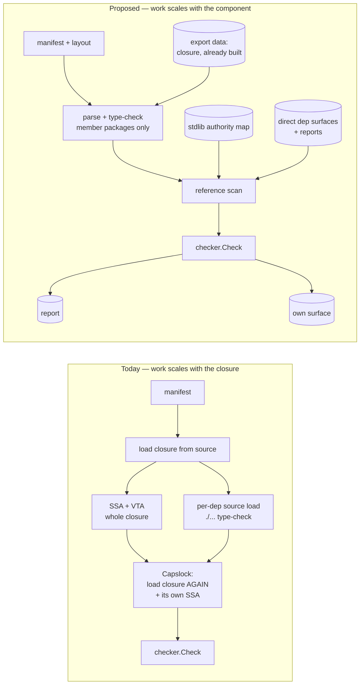
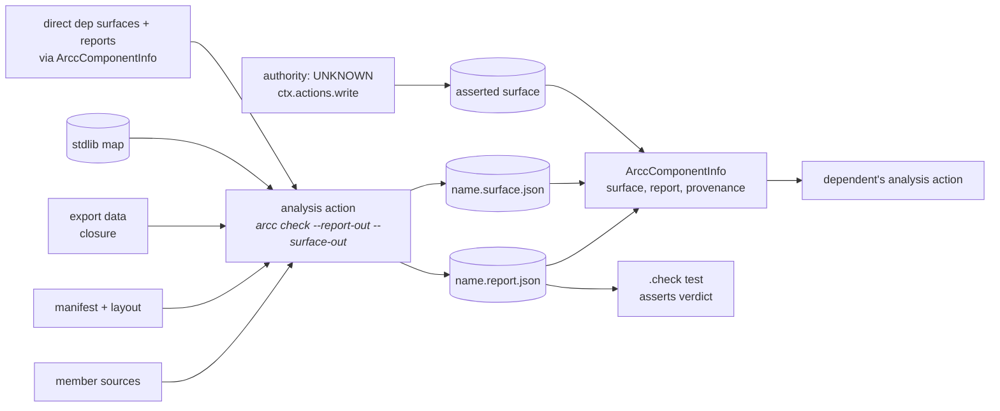
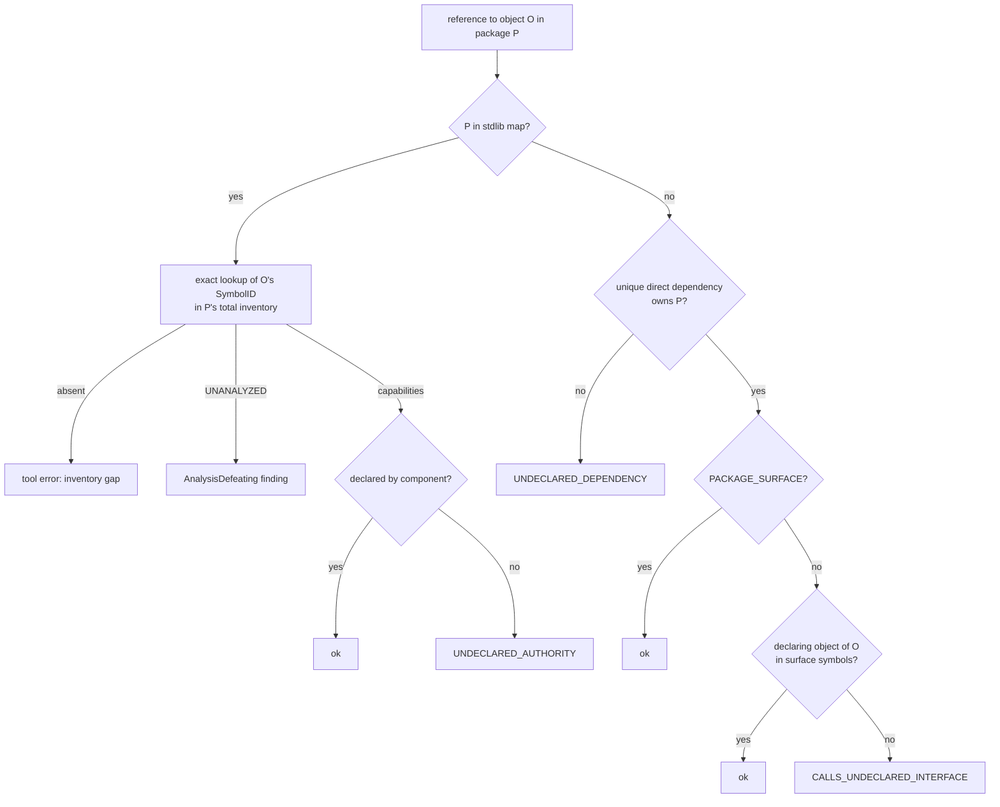
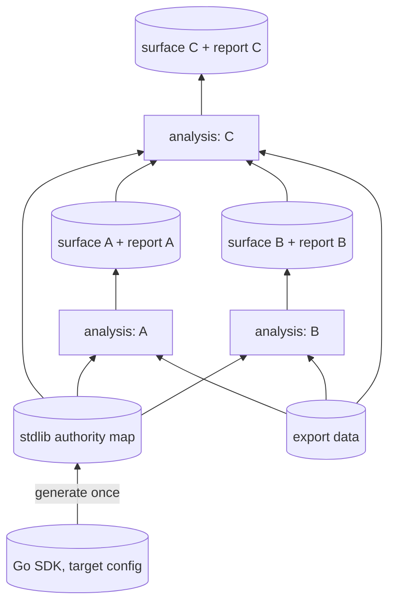

# Detailed design — compositional component analysis

**Date:** 2026-08-04 · **Revised:** 2026-09-02 (post design review)
**Status:** design complete; implementation not started.
**Baseline:** `dev-exp-go-bazel-mvp` @ `5011b726` (code unchanged through `cca66212`)
**Inputs:** [`../rough-idea.md`](../rough-idea.md), [`../idea-honing.md`](../idea-honing.md),
[`../research/current-analysis-pipeline.md`](../research/current-analysis-pipeline.md),
[`../research/host-import-friction.md`](../research/host-import-friction.md),
[`../research/spike-export-data-loading.md`](../research/spike-export-data-loading.md),
[`../research/spike-stdlib-map-generation.md`](../research/spike-stdlib-map-generation.md),
[`../2026-09-02-design-review.md`](../2026-09-02-design-review.md) and
[its response](../2026-09-02-design-review-response.md).

---

## Overview

`arcc check` currently answers every question about a component by building a
whole-program call graph. It loads the component's entire transitive dependency
closure, builds SSA over it, runs VTA, and then does it a second time inside Capslock —
while separately type-checking each declared dependency from source. Cost scales with
the closure, not the component: 2.1s for four trivial packages in this repo, ~50s for
some packages in the second monorepo PoC.

Two changes that have already landed make that unnecessary. Membership is explicit and
**every member function is an analysis root**, which collapses intra-component
transitivity. And capability findings are already **pruned at declared dependency
boundaries**, so authority behind a boundary is already not attributed to the caller.

What remains is to classify the edges that *leave* a component. That needs no call
graph. This design replaces the whole-program analysis with three pieces:

1. a **reference scan** over member sources, treating references and imports as edges;
2. a **precomputed standard-library authority map**, generated once per SDK
   configuration, which doubles as the definition of what "standard library" means;
3. a **surface manifest** published for each component by an ordinary build action and
   consumed by its dependents in place of their source.

The result is faster, but the reason to do it is that component checks become
**independent, cacheable, and composable**: a check parses, type-checks and scans only
its own sources, and everything else it needs is a declared, cached artifact. What is
eliminated is all *work* over the closure — parsing, type-checking, SSA, VTA, Capslock.
What remains proportional to the closure is a set of already-built compiler export files
that the type checker reads (see *Type loading*); this is a measured, capped cost rather
than a claim of zero dependence.

Two further changes fall out. `absorbed_dependencies` (and the pattern-membership
wildcard) are removed, their role taken by ordinary components under a stated
invariant. And an `authority: UNKNOWN` axis is added so that unowned code can be adopted
incrementally without pretending it has been verified.

### The governing principle

> **The component boundary is where ambient authority becomes designated capability.**
> A parser depending on a logging component does not acquire filesystem authority; it
> acquires the ability to log.

Pruning at a boundary is not an approximation of a transitive analysis. It is the
semantic content of the model. A boundary's provenance annotates *the claim that the
boundary is a real abstraction*, not the claim that code was scanned.

A corollary that runs through the whole design: **boundaries are syntactic; authority
is semantic.** Whether source names a symbol outside a declared interface is a question
about what is written. Whether a symbol reaches a syscall is a question about what
executes. Precompute the semantic part once; do the syntactic part per component.

---

## Detailed Requirements

Consolidated from [`../idea-honing.md`](../idea-honing.md) and revised per the review
response; Q-numbers cite the decision record, DR-numbers the review.

### Functional

- **R1.** A component check MUST classify every reference from member code to an object
  declared outside the component, and every import from a member package, as one of:
  intra-component, standard library, declared component dependency, auto-attached infra
  dependency, or violation. Imports and object references are classified by separate
  rules (DR-10). (Q1, Q2)
- **R2.** The scan MUST consider all *references* (`types.Info.Uses` and `Selections`),
  not only call expressions, so that function values taken but not called are edges. (Q2)
- **R3.** Package imports MUST be edges, so that init-time authority is attributed. (Q2)
- **R4.** Cross-boundary interface checking (FR5) MUST be performed against the object
  the source names, as resolved by `go/types`, not against dynamically resolved
  implementations. FR5 covers all externally declared objects — functions, methods,
  types, fields, interface method specs, variables, constants — under the
  **declaring-object rule** in *Reference semantics*. (Q3, DR-04)
- **R5.** Standard-library authority MUST be resolved from a precomputed map rather than
  by analysing stdlib sources at check time. (rough idea, Q13)
- **R6.** The map MUST be total at package granularity **and** at symbol granularity:
  every externally referencable exported object of every enumerated package, plus each
  package's `init`, carries an explicit terminal classification. Lookup of an unknown
  symbol in an enumerated package is a tool error, never "pure". Map package membership
  is the definition of "standard library". (Q12, DR-05)
- **R7.** Each component MUST have a surface manifest describing its public surface;
  dependents MUST resolve dependency symbols from it rather than from dependency
  sources. (rough idea, Q16)
- **R8.** A **checked** surface MUST be an output of an ordinary build action that ran
  the analysis, and its provenance MUST be established by the build graph (provider
  edge plus the accompanying report verdict), not by a flag inside the file. An
  **asserted** surface (for `authority: UNKNOWN`) MUST come from a distinct producer that
  is structurally distinguishable from the checked one. (Q16, DR-01, DR-06)
- **R9.** `absorbed_dependencies` MUST be removed. Pattern (glob) membership MUST be
  removed with it: it can never be checked and Q7 already rejected wildcard membership.
  (Q4, Q7, DR-16)
- **R10.** A component MUST be able to declare `authority: UNKNOWN`, meaning it is not
  analysed and its authority is unknown rather than empty. `declared_authority` MUST be
  empty when authority is unknown. (Q7, Q8, Q9)
- **R11.** `UNKNOWN` MUST NOT be representable as an empty authority list. The
  `AuthorityDeclaration` type and its join MUST propagate `UNKNOWN` structurally, so
  that any future bound computation cannot read an unknown operand as pure. No bound is
  computed in this design (Q10); the consumer of the axis here is the report. (Q9, DR-06)
- **R12.** Authority that is declared but never used MUST be reported. (Q15)
- **R13.** Host-injected runtime packages MUST resolve without the component author
  naming them, defaulting to infra-component attachment. (Q14)
- **R14.** Two direct dependencies (declared or auto-attached) claiming the same package
  MUST be a tool error before any package-to-dependency lookup is built. (DR-12)

### Non-functional

- **N1.** A check MUST parse, type-check and scan only member source. It MUST NOT parse
  or type-check dependency or stdlib source, and MUST NOT build SSA, a call graph, or
  run Capslock. Dependency and stdlib type information MAY be consumed from compiled
  export data. The number and total size of non-member action inputs MUST be measured
  and recorded; the scaling benchmark in *Testing Strategy* is the acceptance test.
  (DR-02)
- **N2.** In Bazel, a check MUST be a single ordinary action whose declared inputs are:
  member sources, the component manifest and layout, export data for the member
  packages' transitive import closure, the direct dependencies' surfaces and reports,
  and the stdlib map for the target SDK key. Nothing else. (DR-01, DR-02)
- **N3.** The check MUST fail closed when the stdlib map for the target SDK key is
  unavailable or mismatched. (Q13)
- **N4.** All existing determinism guarantees (sorted findings, stable symbol keys) MUST
  be preserved and extended to surfaces, maps and reports: identical complete inputs
  produce byte-identical artifacts.

### Constraints and invariants

- **I1 (tool-enforced).** *Every component is either checked against its manifest, or
  explicitly marked `authority: UNKNOWN` and rendered `untrusted` at every boundary that
  rests on it.* R9 is sound only under this invariant.
- **I1′ (governance assumption, not enforced by arcc).** Marking a component `UNKNOWN`
  is a reviewed decision. The Q7 subtree predicate ("no unanalysed components here
  except these approved ones") is the intended enforcement and is deferred with the tree
  predicates (Q10). Until it lands, approval is an ownership/review process. (DR-13)
- **I2.** The ocap minting-site attribution rule (`capslockadapter.go:22-40`) is
  load-bearing for the soundness of a syntactic scan. Reverting it breaks this design.
  It also decides how pre-minted handle variables and interface method specs are
  classified in the map (see *Stdlib map*).
- **I3.** The map's package and symbol inventory must be complete against an
  independent oracle or classification is unsound. (Q12, DR-05)
- **I4.** The map generator MUST use a classifier that preserves `CAPABILITY_UNANALYZED`.
  The check-time adapter's `ClassifierExcludingUnanalyzed` wrapper turns unanalysable
  stdlib bodies into silent purity (spike finding 5) and MUST NOT be reused for
  generation.

### Explicitly out of scope

Transitive/whole-tree authority predicates and the `UNKNOWN` approval predicate (Q10,
Q7); a bootstrap CLI for wrapper components (Q7); dep-vs-dep declaration *divergence*
checking across a tree (Q11 — direct overlap is in scope, R14).

---

## Architecture Overview

### Before and after



### Build topology (Bazel)

The current `.check` target is a test rule that only writes a launcher; tests cannot
publish outputs for other actions to consume. The redesign splits analysis from
assertion (DR-01):



- **The analysis action always exits 0 when analysis ran.** Violations are recorded as
  the report's verdict; tool errors (exit 2 today) still fail the action. This keeps
  `bazel build` semantics unchanged, needs no second action for negative and golden
  tests, and still makes provenance structural: a consumer receives the dependency's
  surface *and* report through the provider and derives `CHECKED_PASS` only when the
  report verdict is pass.
- **`.check`** becomes a test whose runfiles contain the report and which asserts the
  verdict (`pass`, or `fail` when `expect_violation`). Grep and golden tests read the
  same report artifact.
- **Outputs** are carried on `ArccComponentInfo` (`surface`, `report`, `provenance`) and
  in an `arcc` output group; they are not default outputs, so `bazel build //...` does
  not run every analysis unless asked (`--output_groups=+arcc`), while `bazel test`
  of any `.check` builds the transitive analyses it depends on.
- **`authority: UNKNOWN`** components have no analysis action. Their surface is written
  at analysis time from the layout (packages are known) and the provider marks
  `provenance = ASSERTED`. During the transition, a `manual`-tagged component takes the
  same path, preserving the host's current behaviour until the attribute replaces it.
- **Native mode** gets `--report-out` and `--surface-out` on `arcc check`. Dependency
  surfaces are located by convention: `<dependency manifest path>` with its extension
  replaced by `.surface.json`, and the report alongside as `.report.json` if present.
  The authored manifest never names a surface path in either mode.

### Type loading (DR-02)

A typed reference scan needs complete types for every imported package. The spike
proved the mechanism and its cost model:

- Load mode `NeedName|NeedFiles|NeedCompiledGoFiles|NeedImports|NeedTypes|NeedSyntax|NeedTypesInfo`
  — **without `NeedDeps`** — parses and type-checks only the root (member) packages
  and reads every other package from `ExportFile`. `Uses`/`Selections` are complete for
  members; dependency `Syntax`/`TypesInfo` are nil and their source files may be absent.
- `go/packages` requires an `ExportFile` for **every package in the transitive import
  closure**, and requires the driver's `Imports` graph to be transitively complete; an
  incomplete graph panics inside `go/packages`. The layout therefore keeps enumerating the
  full closure (identity and edges), replaces `GoFiles` with `export_file` for every
  non-member package, and is **validated for closure completeness before loading** so a
  bad layout is a tool error rather than a crash.
- In Bazel, export data for dependencies comes from rules_go's `GoArchive.data.export_file`
  collected by the aspect, and for the stdlib from the toolchain's compiled stdlib
  (`GoStdLib`); both are ordinary cached compile outputs, so the *work* eliminated is
  parsing/type-checking/SSA over the closure while the *inputs* still enumerate it.
  Natively, `go list -export` supplies build-cache archives; the `.a`-with-`__.PKGDEF`
  format is accepted verbatim.
- Version skew: `gcexportdata` reads the last two Go releases plus tip. The SDK key
  (below) pins the toolchain; a mismatch between the export data's producer and the
  `x/tools` compiled into `arcc` is a tool error surfaced at load.

### Edge classification

Two dispatches, one for imports and one for object references (DR-10). Neither
contains reachability, a call graph, or a stdlib path predicate: "is it stdlib" is map
membership (R6), which is why the five existing predicates delete rather than
consolidate.

**Imports** (every import declaration in a member package, including blank imports):

| Imported package is … | Result |
| --- | --- |
| a member | ignore as a boundary edge; the member's init is scanned like any member body |
| in the stdlib map | attribute `PackageInitAuthority(pkg)`; no symbol check |
| owned by a declared component dependency's surface | ok; init authority stays behind the boundary |
| owned by an auto-attached infra dependency's surface | ok; edge provenance recorded so the dependency counts as used |
| owned by two direct dependencies | tool error `DEPENDENCY_OVERLAP` (R14) — detected before classification |
| none of the above, with type data present | `UNDECLARED_DEPENDENCY` |
| declared or stdlib by written path, but type data missing | tool error (layout/export-data fault), never a false `UNDECLARED_DEPENDENCY` |

**Object references** (every `Uses`/`Selections` entry whose object's package is not a
member):



### Composition across components



Each analysis is a leaf action depending on its own sources, the map, export data, and
its direct dependencies' surfaces and reports. Nothing re-reads, parses or type-checks a
dependency's source.

---

## Components and Interfaces

### New: `stdlibmap` (shell, generation) and its lookup port

Generation runs Capslock over an SDK with every exported symbol as a root — the only
place a call graph survives. It uses a classifier that preserves `UNANALYZED` (I4),
groups findings by `Path[0]`, and then reconciles against a `go/types` inventory so that
every inventoried symbol receives a terminal classification.

```go
// Port consumed by the analysis. Defined core-side, implemented shell-side.
type StdlibAuthority interface {
    // IsStdlibPackage reports whether pkgPath is in the map's package enumeration.
    // The enumeration is total; a false answer means "not standard library".
    IsStdlibPackage(pkgPath string) bool

    // SymbolAuthority returns the terminal classification of a symbol in an
    // enumerated package. It fails closed: a symbol absent from the package's total
    // inventory is ErrInventoryGap (a tool error), never an empty result.
    SymbolAuthority(id SymbolID) (Classification, error)

    // PackageInitAuthority returns the classification of pkgPath's aggregate init (R3).
    PackageInitAuthority(pkgPath string) (Classification, error)

    // Evidence returns the generator's canned path explaining why id reaches cap.
    Evidence(id SymbolID, cap Capability) []Frame

    // Key identifies the target SDK configuration this map describes (N3).
    Key() SDKKey
}

// Classification is terminal: exactly one of Safe, Capabilities (non-empty, each
// tagged TrueAuthority) or Unanalyzed (rendered as an AnalysisDefeating finding).
type Classification struct {
    Safe         bool
    Capabilities []Capability
    Unanalyzed   bool
}
```

Two implementations sit behind the port: a **pinned artifact reader** (Bazel: the map is
a declared input built by an `arcc_stdlib_map` rule from the pinned SDK; native: a file
on disk) and a **native on-demand generator with cache**, keyed by `SDKKey`. Both are
fail-closed on key mismatch.

### New: `surface` — emission and consumption

```go
// Derived from the component's own manifest, layout and loaded member facts; needs no
// scan. Written by the analysis action (checked) or at Bazel analysis time (asserted).
type SurfaceManifest struct {
    FormatVersion  int
    Component      string
    InterfaceStyle manifest.InterfaceStyle
    Authority      AuthorityDeclaration    // DECLARED{set} | UNKNOWN (R10, R11)
    Packages       []string                // concrete import paths, sorted; never patterns
    Symbols        []SymbolID              // declared-interface style only; sorted
    Namespace      string                  // hostpolicy.NamespaceID at emission
    SDKKey         SDKKey
    ProducerVersion string
    Digest         string                  // audit + native freshness; see Provenance
}
```

Consumption returns a `facts.DependencyInterface` extended with the three status axes
(below). The consumer verifies `FormatVersion`, `Namespace` and `SDKKey` before use;
each mismatch is a distinct tool error.

### New: `schema` and the protobuf-runtime boundary

The `schema` package-surface component owns the generated persisted-artifact types and
the shared capability-name vocabulary. `manifest` consumes that component for parsing
and validation, while the artifact-I/O shell consumes it for artifact messages and
capability validation. `artifactio` therefore depends inward on `schema` and `symbol`;
it does not declare an unused dependency on `manifest` merely because the capability
vocabulary once lived there.

The final ownership model gives the protobuf runtime one in-tree
`PACKAGE_SURFACE` wrapper component, with the exact foreign package set enumerated as
members. Hand-authored imports such as `protojson`, `proto`, or `prototext` use an
explicit component dependency. Generated or host-injected runtime edges may point to
the same component with `auto_attached: true` once the host-adapter hooks land; the
component is shared, while edge provenance reflects who introduced the dependency.

There is one deliberate migration interval. The legacy native
`ResolveDependencyInterface` loads `./...` beneath a dependency manifest and therefore
cannot consume an in-tree wrapper whose members are foreign import paths. Through Steps
5 and 6, self-hosting consumers temporarily retain their protobuf-runtime packages as
members. Step 7 removes that source-loading path in favour of persisted surfaces; after
that cutover, and before dependency-overlap enforcement is accepted, it introduces the
protobuf-runtime component and removes those packages from consumers. This duplicated
runtime membership is transitional, not the final component model.

### Changed: `goanalysis`

Loses SSA construction, VTA, `scanFuncValueEscapes`, `collectBodilessAbsorbedPackages`,
pattern-membership resolution, and the implements-closure computation in
`ResolveDependencyInterface` (steps 9–11, `goanalysis.go:1619-1714`). Gains the
reference scan and the layout closure validation. `ResolveDependencyInterface` collapses
to reading a surface and report. Load mode drops `NeedDeps`.

```go
// Replaces call-graph edge extraction. Operates on AST + types.Info; no SSA.
func ScanReferences(pkgs []*packages.Package, members MemberSet) ([]facts.ReferenceEdge, []facts.ImportEdge)
```

`extractSymbols` is replaced by a `SymbolID`-producing extractor that implements the
declaring-object rule (aliases expand to their same-package target's members).

### Changed: `capanalyzer` / `capslockadapter`

`capslockadapter` leaves the check path entirely; Capslock is retained for map
generation, behind a **separate** classifier constructor from the (now generation-only)
one that preserves `UNANALYZED` (I4). `AnalyzeRequest.PruneAt`/`PruneAtPackages` and
the boundary-prune classifier are removed — pruning is structural. `InterfaceSymbol`'s
dual pointer/value key contract is replaced by `SymbolID`.

### Changed: `checker`

Stays pure and gains no new dependencies. Its `Caps` input becomes classifications
resolved from the map; `Facts.CallEdges` becomes `Facts.References` and
`Facts.Imports`; absorbed-dependency and pattern handling are deleted; it gains
`DEPENDENCY_OVERLAP`, `DEPENDENCY_CHECK_FAILED`, `UNUSED_AUTHORITY`, and the status
axes on `DependencyBoundary`.

### Changed: Bazel rules and CLI

`go_component` gains the analysis action and asserted-surface write; `ArccComponentInfo`
gains `surface`, `report`, `provenance` (`"checked"`/`"asserted"`); `check.bzl`'s three
test rules assert over the report artifact; a new `arcc_stdlib_map` rule builds the map
from the pinned SDK sources and toolchain; the aspect collects `export_file` per package.
The CLI gains `--report-out`, `--surface-out`, and `--report-verdict-only` (exit 0 when
analysis ran, for the Bazel action). `arcc stdlibmap generate|inspect` is added.

### Unchanged in role

`manifest`, `report`, `hostpolicy`, `packagelayout` keep their roles. Their *schemas*
change: `manifest` loses three fields and consumes the schema-owned capability
vocabulary; `report` gains kinds and status axes;
`hostpolicy` gains `NamespaceID` and `IsCanonicalPath` and loses `IsStdlibPath`'s
classification role; `packagelayout` gains `export_file`, `goexperiment`, dependency
surface/report paths and closure validation.

---

## Data Models

### The authority lattice (R11, Q9)

```
        ⊤ = UNKNOWN          (unanalysed: could be anything)
       / | \
   FILES NETWORK EXEC ...    (declared, verified)
       \ | /
        ∅ = DECLARED{}       (analysed, uses nothing)
```

```go
type AuthorityDeclaration struct {
    Known bool          // false ⇒ UNKNOWN; Set must be empty and is ignored
    Set   []Capability  // meaningful only when Known; sorted
}

// Join is the only way to combine declarations. Unknown absorbs.
func Join(a, b AuthorityDeclaration) AuthorityDeclaration
```

Encoding `UNKNOWN` as an empty `Set` is forbidden and rejected at parse. `Join` is
unit-tested as the structural guarantee behind R11; no consumer computes a bound in this
design.

### Reference semantics and the symbol grammar (DR-04)

**Declaring-object rule.** A reference from member code is authorised by the top-level
declaration that owns the object `go/types` resolves it to:

| Resolved object | Persisted key | Authorised when |
| --- | --- | --- |
| package-level func | `pkg.F` | key listed |
| method declared by `FuncDecl` (incl. on generic types; instantiations resolve to `Origin()`) | `(pkg.T).M` — receiver base name, no `*`, no type args | key listed |
| interface method spec | none | declaring interface type `pkg.I` listed |
| struct field | none | declaring struct type `pkg.T` listed |
| package-level var / const | `pkg.V` | key listed |
| named type | `pkg.T` | key listed |
| alias `type A = B` | `pkg.A` | `pkg.A` listed; if `B` is in the same package the extractor also emits `B`'s key so `A`'s members resolve |
| promoted field/method through embedding | resolved via `Selection.Obj()` to its declaring type/method | that declaring entry's rule |
| package init | `pkg.init` | not a reference; import rule applies |

For `PACKAGE_SURFACE` dependencies every exported object is authorised, so the rule is
only evaluated for declared-interface dependencies. For the stdlib map the same
`SymbolID` grammar is the inventory key; fields and interface method specs are `SAFE`
by construction (capability use, I2) and vars carry their own classification.

`SymbolID` has one versioned textual encoding shared by surfaces, the map and reports.
Capslock's `(*os.File).Read` normalises to `(os.File).Read`. Generic brackets are never
persisted.

Each reference edge records `Kind` (Import, Func, Method, Type, Field, Var, Const),
`FromPackage`, `ReferentPackage`, `Referent SymbolID` (absent for Import), `File`, `Line`.
Duplicate observations of the same edge at the same site collapse to one.

### The surface manifest

Packages are always concrete import paths in the emitter's namespace. For
`PACKAGE_SURFACE` the surface is "everything exported by `Packages`"; for
declared-interface style `Symbols` is the exact declared set with no implements-closure
injection. An asserted surface differs from a checked one only in how it was produced
and what provenance the consumer derives; the file schema is the same.

### Provenance, freshness and authority (DR-03, DR-06)

Three orthogonal axes, all present in JSON output and on `report.DependencyBoundary`:

| Axis | Values | Bazel | Native |
| --- | --- | --- | --- |
| provenance | `CHECKED_PASS`, `CHECKED_FAIL`, `ASSERTED` | from provider edge + report verdict | always `ASSERTED` unless the same invocation produced it |
| freshness | `BUILD_GRAPH`, `VERIFIED`, `STALE`, `UNKNOWN` | always `BUILD_GRAPH` | `VERIFIED`/`STALE` by hashing dependency source *bytes* (no parse) when readable; else `UNKNOWN` |
| authority | `DECLARED{set}`, `UNKNOWN` | from surface | from surface |

The text report summarises: `certified` (CHECKED_PASS ∧ ¬STALE), `asserted`,
`check failed`, `stale`, `untrusted` (authority UNKNOWN); combinations render all
applicable words.

`Digest` = SHA-256 over member source bytes (sorted by path), manifest bytes, format
version, namespace, SDK key and producer version. In Bazel it is audit-only. Natively the
consumer recomputes only the source-and-manifest part when the dependency root is
readable; the native freshness check is explicitly best-effort and documented as such.

### The stdlib authority map (DR-05, DR-09)

```
SDKKey = (toolchain_version, GOOS, GOARCH, cgo_enabled, build_tags[], goexperiment,
          classifier_hash, map_format_version)          # describes the TARGET config

map:
  format_version: 1
  key:      SDKKey
  packages: [ {path, importable} ]                     # TOTAL over `go list std` (I3)
  symbols:  [ {id, class: SAFE|CAPS|UNANALYZED, caps[]} ]   # TOTAL per importable package
  inits:    [ {pkg, class, caps[]} ]                   # one per package, keyed pkg.init
  evidence: [ {id, cap, frames[]} ]                    # keyed (symbol, capability)
```

Inventory and classification rules (validated by the spike):

- **Inventory** is computed with `go/types` independently of Capslock: every exported
  package-level object and every exported method of every exported (named or alias)
  type, plus `init`. Generation fails if any inventoried symbol lacks a terminal
  classification.
- **Funcs and methods:** Capslock `GranularityFunction` over all importable packages in
  one batch, grouped by `Path[0]`; unexported helpers and closures are dropped. A root
  with no findings is `SAFE` explicitly. `UNANALYZED` survives (I4) and is stored as such.
- **Consts and plain types:** `SAFE`. **Interface method specs:** `SAFE` (I2 — calling
  through an interface value is capability use).
- **Vars:** union of the pointer-dereferenced static type's method classifications under
  the map's own classifier, **plus the minting authority of a handle type** — a type that
  owns any use-method reclassified `SAFE` by the minting-site rule inherits the
  capability that reclassification moved to the minting site (FILES for `*os.File`).
  Hence `os.Stdin` is FILES (and CHDIR via `(*os.File).Chdir`), `http.DefaultClient` is
  NETWORK, `io.EOF` is `SAFE`. Vars of interface type are `SAFE` (capability use).
- **`init`:** keyed on the compiler-synthesised aggregate `pkg.init`, which already
  unions every `init#N`.
- **Compiler builtins:** `unsafe.*` are `*types.Builtin`, never SSA; hardcoded
  `UNANALYZED`.
- **Curated `CAPABILITY_SAFE`** from Capslock (`os.Exit`, `runtime.*`) records
  `provenance: capslock-curated` per entry so the trust boundary is visible.
- **Oracle:** natively `go list std` for the target toolchain; in Bazel the toolchain's
  stdlib package list. `internal/…` packages are enumerated with `importable: false`
  and no symbol inventory.

`classifier_hash` covers the generation classifier text (Capslock builtins plus the
minting-site reclassification and the var/handle rule), so generation-time and
check-time assumptions cannot drift silently (I2). Cost: the full non-internal stdlib
generates in ~2 s and ~1.4 GB; the map is regenerated per SDK bump, never incrementally.

### Canonical namespace (DR-08)

Surface symbols embed import paths; a host that rewrites path prefixes plus a surface
produced under another rewrite is a silent mismatch. Therefore:

- `hostpolicy.NamespaceID` is a stable string the host sets once (default `"upstream"`)
  alongside `CanonicalizePath`; every surface records it; a consumer reading a surface
  with a different ID fails with a tool error, never a best-effort comparison.
- `CanonicalizePath` is idempotent, with `IsCanonicalPath` as the host-supplied
  predicate that makes idempotence expressible and testable.
- The stdlib map is namespace-free: hosts MUST NOT rewrite stdlib paths and
  `CanonicalizePath` MUST be the identity on every map package (tested).

### Persisted formats (DR-15)

- Schemas: `proto/archcontracts/v1/surface.proto` and `stdlibmap.proto`. Component
  manifests stay textproto; `component.proto` gains `authority` and reserves field
  numbers 4, 8, 9 and names `absorbed_dependencies`, `own_check_runs`,
  `certification_reference`; `AbsorbedDependency` is deleted.
- Encoding for surfaces, reports and maps: `protojson` followed by canonicalisation
  (compact then indent with `encoding/json`) so bytes are stable across `protojson`
  versions. No proto `map` fields; repeated entries sorted by key. `format_version` is
  the first field; readers reject unknown major versions and ignore unknown fields.
- Hash: SHA-256 over the canonical bytes. Writes: temp file in the target directory
  then rename. Native cache corruption (parse failure, hash mismatch) is discarded and
  regenerated; a corrupt Bazel input fails the action. Size cap: a surface over 16 MiB
  or a map over 64 MiB is a tool error (guards against runaway inventories).

---

## Error Handling

| Condition | Behaviour | Rationale |
| --- | --- | --- |
| No map for the target SDK key | **Fail closed**, exit 2 | Analysing 1.26 sources against a 1.25 map is unsound with no symptom (N3) |
| `classifier_hash` / format version mismatch | **Fail closed**, exit 2 | Silent drift between generation and use (I2) |
| Inventoried package, symbol absent | Tool error, exit 2 | Inventory gap, never purity (R6) |
| Symbol classified `UNANALYZED` | `AnalysisDefeating` finding → violation unless policy allows/warns | Fail closed; same as today's policy model (DR-11) |
| Surface missing | Tool error, exit 2 | Under I1 it should exist; absence is a build-graph fault |
| Surface namespace / SDK key / format mismatch | Tool error, exit 2 | Never compare across namespaces or configurations |
| Layout import graph not transitively closed, or export data missing | Tool error, exit 2 before load | Converts a `go/packages` panic into a diagnosable failure |
| Dependency report verdict is fail | `DEPENDENCY_CHECK_FAILED` warning; provenance `CHECKED_FAIL` | The dependency's own test fails; dependents should not fail twice |
| Native freshness digest mismatch | `STALE` + warning | Native mode can detect, not prevent (Q16) |
| Two direct dependencies claim one package | Tool error `DEPENDENCY_OVERLAP`, exit 2 | Order-dependent verdicts otherwise (R14) |
| Reference to an unowned package with type data present | `UNDECLARED_DEPENDENCY` violation | Same as any undeclared edge |
| `//go:linkname`, assembly, cgo in member code | `AnalysisDefeating` capability finding → violation by default; `ANALYSIS_LIMITATION` only after explicit policy downgrade | Bypasses the map; must be consciously accepted (DR-11) |
| Member declares authority it never uses | `UNUSED_AUTHORITY` warning (R12) | Keeps declarations tight for future bounds |
| Dependency is `authority: UNKNOWN` | `untrusted` boundary annotation | Visible, not silent |
| Manifest carries `absorbed_dependencies`, pattern members, `own_check_runs`, or `UNKNOWN` with non-empty `declared_authority` | Parse error, exit 2 | Removed or contradictory fields must not be silently ignored |

Two behaviours deliberately **not** errors: a reference into a `PACKAGE_SURFACE`
dependency's exported object, and a reference to an auto-attached infra component (R13).

### Findings and evidence (DR-17)

One authority finding per `(capability, class)` per component. It carries every member
source site (file, line, referenced `SymbolID`) sorted; the text report prints the first
site and the site count; JSON carries all sites, the map's evidence frames for
`(first site's symbol, capability)`, the map's `SDKKey`, and the class. Boundary findings
(`CALLS_UNDECLARED_INTERFACE`, `UNDECLARED_DEPENDENCY`) are one per distinct
`(referent, site)` as today.

---

## Testing Strategy

### Regression fixtures pinning the new semantics

1. **Func value without a call.** `f := os.ReadFile`, never called → FILES (R2).
2. **Import-only authority.** Blank import of a package whose `init` exercises authority
   → attributed (R3).
3. **Interface dispatch into a dependency.** `dep.Greeter.Greet()` with an unexported
   implementation → passes, because `Greeter` is listed (declaring-object rule), not
   because of the deleted workaround (R4).
4. **Direct concrete call.** Calling `(*dep.impl).Greet` directly where `impl`'s method
   is unlisted → fails. **Today this wrongly passes** (R4).
5. **Reference-kind table.** Field, var, const, type, alias, embedded/promoted member,
   generic instantiation, pointer vs value selection, duplicate `Uses`/`Selections` —
   each with a pinned outcome for declared-interface and `PACKAGE_SURFACE` deps.
6. **Import table.** Blank import in each of the seven import rows.
7. **`UNKNOWN` does not read as pure.** `Join(UNKNOWN, ∅) = UNKNOWN`; parse rejects
   `UNKNOWN` with a non-empty set; the surface round-trips `UNKNOWN`.
8. **Fail-closed on unknown SDK.** No map for the target key → exit 2, no analysis (N3).
9. **Stdlib globals.** `os.Stdin` cannot be classified `SAFE`; `io.EOF` is `SAFE`.
10. **Inventory gap.** A map with one symbol deleted fails lookup with a tool error.
11. **Direct overlap.** Two direct surfaces claiming one package → `DEPENDENCY_OVERLAP`.
12. **Namespace.** Two distinct idempotent canonicalisers produce surfaces the other
    rejects.

### Acceptance matrix (DR-18)

| Area | Required behaviour | Plan step |
| --- | --- | --- |
| Build graph | Testing a dependent's `.check` builds the dependency's analysis action; it never relies on the dependency's test having run | 5 |
| Failed dependency | A dependency whose verdict is fail yields `CHECKED_FAIL` downstream, never `certified` | 7 |
| Unknown dependency | An asserted surface is produced without an analysis action and renders `untrusted` | 11 |
| Action inputs | A Bazel analysis test proves the dependent's action inputs contain member sources, export data and surfaces but no dependency `.go` file | 8 |
| Hermetic load | Integration test with dependency sources absent and export data present succeeds | 8 |
| Typed scan | Fixture 5 table | 6 |
| Imports | Fixture 6 table | 6 |
| Stdlib map | Every `go list std` package and every inventoried symbol has a terminal classification; generation fails on a gap | 4 |
| Map key | Two target configurations under one host, including a cross-compile, select distinct maps; cgo/tag changes change the key | 4 |
| Freshness | Bazel is `BUILD_GRAPH`; native is `VERIFIED`/`STALE` when readable and `UNKNOWN` when not, without parsing | 7 |
| Analysis defeating | linkname/asm/cgo fixture is a violation by default and a warning only with policy | 6 |
| Performance | Fixed member source with dependency depth 1, 4, 16: no dependency parse/type-check/SSA; export-data input count and load time recorded | 13 |
| Hermeticity | Bazel checks pass in a clean sandbox with no native cache and no `go` binary | 4, 13 |
| Determinism | Maps, surfaces, reports byte-identical for identical inputs; corrupt and concurrent cache writes recover | 3, 4 |

### Golden restructure

Friction report §6(1): separate **verdict assertions** (host-independent) from
**layout-shape assertions** (host-dependent), done after layouts reach their final shape
(post export-data). Ship §6(2) — normalising both sides through `CanonicalizePath` before
diffing — first.

### Determinism and self-check

The existing self-check (arcc checks its own components) and `manifestparity` remain the
integration test of record and MUST stay green throughout.

---

## Integration with Existing System

### What is deleted

| Surface | Location |
| --- | --- |
| SSA construction, VTA call graph | `goanalysis.go:274-279` |
| Call-edge extraction and filtering | `goanalysis.go:281-326` |
| Implements-closure workaround | `goanalysis.go:1619-1714` |
| `scanFuncValueEscapes`, `collectBodilessAbsorbedPackages` | `goanalysis.go:328-329` |
| Pattern membership | `goanalysis.go:64-80`, `1748-1879`, `facts.MatchesMember` |
| Five stdlib predicates | `hostpolicy.go:56`, `packagelayout.go:79`, `goanalysis.go:533,550,563` |
| Capslock at check time | `capslockadapter.go:153-234` (retained for generation with its own classifier) |
| Boundary prune classifier | `capslockadapter.go:42-122`, `app.go:200-229` |
| `absorbed_dependencies` and its checks | `checker.go:100-112,189-205`, `facts.go:49-58`, proto field 4 |
| `own_check_runs`, `certification_reference` | proto fields 8, 9; `facts.go:107-114`; `defs.bzl:124`; `report.go:135-144` |
| `NeedDeps` in the load mode | `goanalysis.go:104-109`, `1441-1446`, `1460-1465` |
| Closure sources in component runfiles | `component.bzl:385-409` |

### What is preserved

The pure-core/shell split is unchanged and strengthened: the scan is shell work producing
pure facts, and `checker.Check` stays a pure function over injected inputs. The
`capanalyzer.CapabilityAnalyzer` port survives with a generation-only implementation.
Exit codes are unchanged (with `--report-verdict-only` as an explicit opt-in). Report
kinds are preserved and extended by `UNUSED_AUTHORITY`, `DEPENDENCY_CHECK_FAILED`,
`DEPENDENCY_OVERLAP`, and the three boundary axes.

### Host adapter contract

Hooks land with empty defaults so no existing host is affected (DR-14 shapes them):

- `runtime_injection_attrs(deps_aspect)` / `extra_runtime_packages(ctx, root_packages)`
  (§3) — makes toolchain-injected packages visible so the **existing** infra
  auto-attachment (`component.bzl:217-230`, `checker.go:288-291`) can claim them.
- **SDK source enumeration** — used only by `arcc_stdlib_map` (today's `go_sdk_srcs`).
- **SDK export-data enumeration** — used by the analysis action for stdlib types
  (rules_go `GoStdLib` upstream).
- **Target platform and key discovery** — supplies `SDKKey` fields from the toolchain
  (today's `go_build_platform`, plus GOEXPERIMENT and the exact toolchain version).
- **Namespace** — `NamespaceID` and `IsCanonicalPath` beside `CanonicalizePath`.

---

## Adherence to Established Conventions

No `.agents/summary/coding_style.md` exists; conventions are read from the code and
`CLAUDE.md`.

- **Pure core, dependencies point inward.** The scan is shell, `checker` stays pure, and
  the `StdlibAuthority` port is defined core-side and implemented shell-side, mirroring
  `capanalyzer.CapabilityAnalyzer`.
- **Component Contract (FR10) doc blocks** on every package. `stdlibmap` generation is a
  shell component holding FILES/EXEC; `surface` consumption is shell, its data model pure.
- **Ports and adapters for anything host-dependent.** SDK enumeration, export-data
  enumeration, platform key and namespace are seams, not heuristics (Q12).
- **Determinism everywhere.** Extends to surfaces, maps and reports (N4).
- **arcc checks itself.** Self-components and `manifestparity` update in step with the
  schema changes.
- **Deliberate departure:** `hostpolicy` loses `IsStdlibPath`'s classification role; a
  predicate invites disagreement between call sites, an enumeration cannot disagree
  with itself (Q12).

---

## Migration Strategy / Backward Compatibility

The PoC monorepo import has landed on the current version and **no updated import will
be taken until this work lands** (Q17). This permits a simpler internal path:

- **No incremental delivery obligation.** Load deduplication and dependency-surface
  caching are superseded.
- **No patch-relief obligation.** Friction report §2 is dropped.
- **`absorbed_dependencies` and pattern membership are removed first.** Pure deletion.
- **Release constraint (DR-19.6).** Between the deletion step and the step that lands
  `authority: UNKNOWN`, no revision satisfies I1; none of them is tagged, released, or
  imported. The series is consumed only at its end.

Compatibility obligations that remain:

- **`authority: UNKNOWN` must exist before the next import** (replaces the host's
  `manual`-tagging patch; the transitional `manual → asserted` path bridges until then).
- **All adapter hooks must exist before the next import.**
- **Manifest schema changes** (`authority` added; fields 4, 8, 9 removed) are breaking
  for any manifest in the wild. Acceptable: the only consumer re-imports wholesale.

Detailed step ordering lives in [`../implementation/plan.md`](../implementation/plan.md).

---

## Appendix A — Technology Choices

**AST + `types.Info` rather than SSA for the scan.** Resolving `f.Read` to
`(*os.File).Read` needs type information, not SSA. `Uses`/`Selections` directly express
"what does the source name" (R4).

**Export data rather than source for dependencies, with the full closure.** Spike-verified:
dropping `NeedDeps` and supplying `ExportFile` makes dependency syntax unnecessary, but
`go/packages` v0.48 needs export data for every reachable package and a complete import
graph. The design accepts this: those files are cached compile outputs, and what is
removed is all work over them. A future `x/tools` may relax the requirement
(`packages.go:1084` TODO); the layout validation isolates us from either outcome.

**Capslock retained for map generation only,** with a generation classifier that preserves
`UNANALYZED` (I4). Generation over the whole stdlib is ~2 s, so its cost stops mattering.

**Total inventory rather than a path predicate or sparse table.** A predicate can
disagree with itself; a sparse table conflates not-a-root, curated-safe, analysed-pure and
unanalysable (spike finding 2). Only a total inventory makes absence an error.

**Always-green analysis action with verdict in the report.** Keeps `bazel build`
semantics, avoids a second action for negative tests, and still makes provenance
structural via the provider edge.

**JSON-over-protobuf for persisted artifacts.** Reviewable and golden-able, schema-typed,
and made byte-stable by canonicalisation; textproto stays for hand-authored manifests.

## Appendix B — Research Findings

- Measured baseline: 2.1s / 6.4s CPU for four trivial packages; 3.8s / 13.5s for one
  component. The closure sets the cost.
- The closure is loaded and SSA-built twice per run; each dependency is type-checked
  from source a third time.
- ~110 lines compensate for VTA over-resolving interface calls, and over-correct.
- Five independent stdlib predicates exist today.
- The ocap minting-site rule makes a syntactic scan sound (I2) and dictates the
  handle-var rule.
- Infra auto-attachment exists end to end and answers injected runtimes.
- `MEMBER_OVERLAP` is self-vs-dep only; dependency lookup maps are last-wins (R14).
- Export-data loading works without `NeedDeps` but needs the full closure's export
  files and a complete import graph (spike 1).
- Capslock attributes per root; "absent" has four causes; the adapter classifier
  launders 1078 `UNANALYZED` stdlib roots; `unsafe.*` are builtins; full-stdlib
  generation costs ~2 s (spike 2).

**Unmeasured and material:** the split of the PoC's ~50s between closure SSA (eliminated)
and member-package type-checking (kept). Plan Step 1.

## Appendix C — Alternative Approaches Considered

**Consolidate the stdlib predicates** rather than delete them. Rejected (Q12).

**Keep an authority-inheriting boundary** for unowned code. Rejected (Q7, I1).

**Generate and check in full surface manifests for third-party code.** Rejected by the
user (Q5).

**`absorbed_deps`-style wildcard membership for `PACKAGE_SURFACE`.** Rejected (Q7); the
existing pattern membership is removed for the same reason (DR-16).

**`UNANALYZED_PACKAGE_SURFACE` as a third `interface_style`.** Rejected (Q8).

**Relaxing `MEMBER_OVERLAP`.** Rejected (Q11).

**Building transitive authority bounds now.** Deferred (Q10).

**Failing the analysis action on violation.** Rejected: it would make `bazel build` of a
dependent fail on a leaf's violation and require a second action for negative tests;
verdict-in-report gives the same structural provenance (DR-01).

**Keeping VTA alive beside typed edges during the cutover.** Rejected: two verdict paths;
the reference table is pinned against the new scanner before the cutover instead.

**An approval allowlist for `UNKNOWN` components now.** Deferred with the Q7 predicate;
I1 split into enforced and governance halves (DR-13).

**Sparse symbol table with an inventory digest.** Rejected: the inventory is small enough
to persist in full, and full persistence is the simpler guarantee (DR-05).
