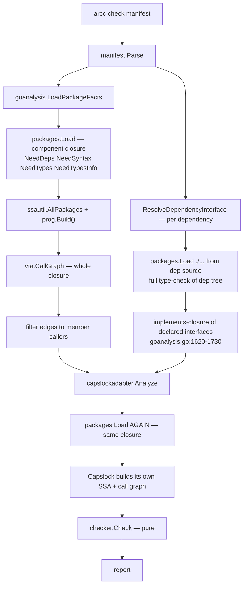

# Research — the current analysis pipeline and where its time goes

**Date:** 2026-08-04
**Method:** direct reading of the implementation at `dev-exp-go-bazel-mvp` @ `5011b726`,
plus wall/CPU measurement of `arcc check` on two components in this repo.

## What a check does today



The shape to notice: **the component's dependency closure is loaded and SSA-built
twice**, and **every declared dependency is additionally type-checked from source on
every run of every dependent**.

## Measurements

Run against the tree at `5011b726`, `bin/arcc` built from that revision:

```
arcc check examples/csvtool/app       →  2.1s wall,  6.4s CPU   (4 trivial packages)
arcc check internal/goanalysis        →  3.8s wall, 13.5s CPU   (1 component)
```

`examples/csvtool/app` is four small packages with three dependencies and takes 2.1s.
That is almost entirely fixed overhead: the cost tracks the *dependency closure*, not
the component. `internal/goanalysis` is worse because it pulls in `go/packages`,
`go/ssa` and Capslock itself.

The second monorepo PoC reports ~50s for some packages, consistent with the same
scaling on a much larger closure.

**Unresolved.** The split between closure SSA and member-package type-checking has not
been measured. The redesign eliminates the former and keeps the latter, so this
attribution determines how large the win actually is. Recorded as step 0 of the plan.

## The three cost sources

| # | Source | Code | Removed by |
| --- | --- | --- | --- |
| 1 | Double SSA build over the closure | `goanalysis.go:274-279`; `capslockadapter.go:168` | Reference scan + stdlib map |
| 2 | Per-dependency full source type-check | `goanalysis.go:1440-1470` | Surface manifests |
| 3 | Stdlib SSA rebuilt every invocation | inside both loads | Stdlib authority map |

## Findings that shaped the design

### The boundary is already trusted

`cmd/arcc/app/app.go:200-229` builds `PruneAt` from resolved dependency symbols and
`PruneAtPackages` from `PACKAGE_SURFACE` dependencies, then hands them to Capslock as a
`CAPABILITY_SAFE` classifier (`capslockadapter.go:45-122`). Authority behind a declared
dependency is already not attributed to the caller. Publishing surface manifests is
therefore not a new trust assumption.

### The implements-closure workaround

`ResolveDependencyInterface` steps 9–11 (`goanalysis.go:1620-1730`) compute
`types.Implements` over every declared interface type and every concrete named type in
the dependency, then add the implementing methods to the allowed symbol set
(`concreteMethods`, `:1694-1726`). `dep_resolve_test.go:47` documents the intent:
*"should contain declared interface symbols and concrete implementation methods of
interface type"*.

This exists to stop VTA from producing false `CALLS_UNDECLARED_INTERFACE` findings, and
it over-corrects — the whitelisted concrete methods are accepted even when source names
them directly.

### Five stdlib predicates

- `hostpolicy.IsStdlibPath` (the host seam)
- `packagelayout.Layout.IsStdlibPackage` (`packagelayout.go:79`)
- `goanalysis.isStdlibPackage` (`goanalysis.go:533`)
- `goanalysis.classifyStdlibPackage` (`goanalysis.go:550`)
- `goanalysis.stdlibClassifier` (`goanalysis.go:563`)

Tolerable while the answer only suppresses diagnostics and skips imports
(`checker.go:60`). Not tolerable once the answer decides violations. Resolved by
deleting them in favour of map membership — see idea-honing Q12.

### The ocap attribution rule is load-bearing

`capslockadapter.go:32-40` reclassifies 22 `(*os.File)` handle-use methods as
`CAPABILITY_SAFE`, attributing filesystem authority to the *minting* site
(`os.Open`, `os.ReadFile`) rather than to handle use. `(*os.File).Chdir` is deliberately
excluded because it mutates process-global cwd.

This is why a syntactic scan is sound without resolving dynamic dispatch: minting sites
are essentially always statically resolved package-level functions, so `w.Write(...)`
through an `io.Writer` needs no resolution. If handle-use methods were ever
reclassified back to capability-bearing, the design would break.

### Infra auto-attachment already exists

`component.bzl:217-230` resolves `infra_deps` against the package closure and attaches
matching infra components automatically; `checker.go:289-291` exempts `AutoAttached`
dependencies from the unused-dependency warning. This is the mechanism host-injected
runtimes need (idea-honing Q14) — no new concept required, only visibility of the
injected packages.

### `MEMBER_OVERLAP` is self-vs-dep only

`checker.go:173-187` intersects the analyzed component's own members against each
resolved dependency's packages. Two *different* dependencies overlapping each other is
not checked. See idea-honing Q11.

### Absorbed-specific surface to be deleted

`facts.FuncValueEscapes` and `facts.BodilessAbsorbedPackages` (`facts.go:49-58`),
`capanalyzer.AnalyzeRequest.PruneAtPackages`, the absorbed-overlap check
(`checker.go:189-205`), the absorbed branch of the import sweep
(`checker.go:100-112`), `goanalysis.scanFuncValueEscapes` and
`collectBodilessAbsorbedPackages` (`goanalysis.go:328-329`), and the testdata under
`goanalysis/testdata/escapes/`. The README walkthrough at `README.md:296-340` teaches
absorption as its `UNDECLARED_AUTHORITY` example.
