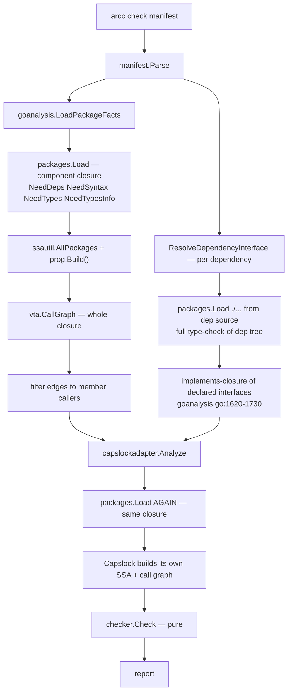

# Research — the current analysis pipeline and where its time goes

**Date:** 2026-08-04
**Method:** direct reading of the implementation at `dev-exp-go-bazel-mvp` @ `5011b726`,
plus wall/CPU measurement of `arcc check` on two components in this repo.

## What a check does today



The shape to notice: **the component's dependency closure is loaded and SSA-built
twice**, and **every declared dependency is additionally type-checked from source on
every run of every dependent**.

## Measurements

Run against the tree at `5011b726`, `bin/arcc` built from that revision:

```
arcc check examples/csvtool/app       →  2.1s wall,  6.4s CPU   (4 trivial packages)
arcc check internal/goanalysis        →  3.8s wall, 13.5s CPU   (1 component)
```

`examples/csvtool/app` is four small packages with three dependencies and takes 2.1s.
That is almost entirely fixed overhead: the cost tracks the *dependency closure*, not
the component. `internal/goanalysis` is worse because it pulls in `go/packages`,
`go/ssa` and Capslock itself.

The second monorepo PoC reports ~50s for some packages, consistent with the same
scaling on a much larger closure.

## Measured attribution

Measured at repository revision `48027ed8` (task step 1; code unchanged from
`5011b726` in the check path), Linux/amd64, 16 cores, Go 1.26.4 toolchain,
`x/tools v0.48.0`, `capslock v0.3.2`. Component: `internal/goanalysis`
(1 member package, ~2.1k lines) whose declared dependency closure is 196 packages.
Baseline comparison runs were also taken on `examples/csvtool/app`.

**Procedure.** `bin/arcc` built once with `just build` (compilation excluded from all
timings). One discarded warm-up run, then five timed runs of
`bin/arcc check go/internal/goanalysis/component.textproto`. Units: seconds of wall
clock and seconds of CPU (user+sys, sum over all threads). Attribution used two
temporary, env-guarded instrumentation points that were removed after collection:

1. **Phase wall timers** around the five boundaries: the closure `packages.Load`
   (`goanalysis.go`, `loadPackages`), SSA construction (`ssautil.AllPackages` +
   `prog.Build()`), VTA (`vta.CallGraph`), the per-dependency source loads
   (`ResolveDependencyInterface`), Capslock (`capslockadapter.Analyze`), and
   `checker.Check`. The `checker` phase measured ~0.2 ms and is reported as ~0.
2. **Per-phase CPU profiles** (`runtime/pprof` started/stopped around each phase,
   one profile per phase per run) attributed via `go tool pprof` sample totals.

The closure was counted with a `packages.Visit` over the load graph: 1 member,
196 non-member packages. To separate member from closure cost directly, a separate
one-off harness (not committed) loaded *only* the member package with `NeedDeps`
dropped and dependency types served from export data (`go list -export`, warm
build cache): **53–59 ms wall / 0.40–0.47 s user + 0.10–0.18 s sys ≈ 0.53–0.57 s
CPU per invocation** across five runs (whole harness process, including the
`go list -export` driver subprocess and process start). That is the same load mode
the redesign will use, so it doubles as a preview of the post-redesign member cost.
Inside the *current* pipeline the member package is type-checked as part of the one
closure `packages.Load`, where its share cannot be separated by the profiler; the
profile's parse+type-check flat share (~0.38 s across 196 packages ≈ 2 ms/package)
bounds it at roughly 2–3 ms — an estimate, not an in-phase measurement.

### Observations (goanalysis component, mean of 5 runs, warm)

**Wall clock** — total 3.62 s (runs 3.56–3.68 s):

| Phase | Wall | Share of total |
| --- | --- | --- |
| `loadfacts` (closure load + SSA + VTA) | 1.21 s | 33% |
| — of which `packages.Load` (closure, incl. member parse/type-check) | 0.41 s | 11% |
| — of which SSA build | 0.18 s | 5% |
| — of which VTA | 0.41 s | 11% |
| — remainder of `loadfacts` (visit, error collection, membership) | 0.21 s | 6% |
| `depresolve` (per-dependency source load + implements closure) | 0.66 s | 18% |
| Capslock (its own closure load + SSA + call graph + analysis) | 1.65 s | 46% |
| `checker.Check` | ~0.0002 s | ~0% |

**CPU** — whole-process user+sys 13.4 s (runs 13.0–13.8 s); per-phase profile
totals (mean of 5). All CPU shares below use the **whole-process CPU total
(13.4 s)** as the single denominator:

| Phase | CPU | Share of whole-process CPU |
| --- | --- | --- |
| Closure `packages.Load` | 2.01 s | 15% |
| SSA build | 1.52 s | 11% |
| VTA | 0.73 s | 5% |
| `depresolve` (dependency source type-checking) | 2.14 s | 16% |
| Capslock load + analysis | 5.57 s | 42% |
| Phase sum | 11.97 s | 89% |
| Unprofiled remainder (process start, non-phase windows, report rendering) | ~1.4 s | ~11% |

CPU exceeds wall by ~3.7× because the Go runtime spreads the work (especially GC)
across threads; within each phase profile, roughly 55–60% of flat samples land
in runtime/GC frames driven by that phase's allocations, so the *flat* function
breakdown is not itself a clean attribution — the per-phase totals above are the
measured quantity, with GC charged to the phase whose allocations caused it.

### The five requested categories

Percentages in the table use the **whole-process CPU total (13.4 s)** and the
**whole-process wall total (3.62 s)** as denominators, matching the tables above.

| # | Category | Wall (measured) | CPU (measured) | Note |
| --- | --- | --- | --- | --- |
| (a) | Member `packages.Load` + type-checking | 0.17 s harness wall; ≈0.003 s inside the current load | 0.55 s harness CPU (incl. driver subprocess); ≈0.002–0.003 s inside the current load (estimate) | The harness (future load mode) measures 53–59 ms wall / ≈0.55 s CPU per whole invocation, including the `go list -export` subprocess and process start. Inside the *current* closure load the member share is inseparable and bounded at ≈2–3 ms by the profile's per-package parse/type-check flat rate — an estimate, marked as such. In both readings category (a) is <1% of the totals. |
| (b) | Closure type-checking beyond members | ~1.07 s (30%) | ~4.15 s (31%) | Closure load phase (2.01 s CPU — `go/parser`/`go/types` over the 195 non-member packages plus driver overhead) plus `depresolve` (2.14 s CPU — dependency sources re-type-checked from source plus the implements-closure computation), minus the ≈0.002–0.003 s member share, which is far below measurement noise. The wall figure is the corresponding share of `loadfacts` + `depresolve`. |
| (c) | SSA construction | 0.18 s (5%) | 1.52 s (11%) | `ssautil.AllPackages` + `prog.Build()` over the closure, arcc's own. Capslock builds SSA a second time inside (e). |
| (d) | VTA | 0.41 s (11%) | 0.73 s (5%) | `vta.CallGraph` over the closure (plus edge filtering, included in the remainder). |
| (e) | Capslock's second load + analysis | 1.65 s (46%) | 5.57 s (42%) | Includes Capslock's own `packages.Load` of the same closure, its own SSA build, and its call-graph analysis; the check-relevant classifier work is a small fraction of it. **Largest single measured phase.** |

The categories are disjoint on these numbers: (a) is the member share subtracted
out of (b), and (c)–(e) are separate phases; (b)–(e) sum to ≈11.94 s CPU of the
11.97 s phase sum.

**Aggregation and uncertainty.** (b)–(e) are measured as phase totals; a phase total
includes the runtime/GC cost that the phase's allocations caused (charged to the
phase, not split further). The one boundary the profiler cannot separate is the
member-vs-closure split inside the single `packages.Load` call; category (a)'s
in-pipeline value is therefore an estimate derived from the profile's flat
parse+type-check rate and the standalone harness measurements, not an in-phase
measurement. These figures should be read as accurate to roughly ±10% (run
variance across the five runs) with the stated aggregation rules; the exact
flat-function CPU split inside a phase is *not* claimed.

### Reconciliation with the earlier 2.1 s / 3.8 s figures

The historical figures above were taken at `5011b726` on the same machine class and
are **consistent** with the reruns in this section: `examples/csvtool/app` re-measured
at 1.90 s wall / 6.05 s CPU (historical 2.1 s / 6.4 s) and `internal/goanalysis` at
3.62 s wall / 13.4 s CPU (historical 3.8 s / 13.5 s). Both baselines stand; the small
deltas are machine and run variance, not a behavior change. The 2.1 s csvtool figure
remains the fixed-overhead floor (four trivial packages, 69-package closure) and the
3.8 s goanalysis figure the closure-heavy case (196-package closure); the PoC's ~50 s
packages sit at the same scaling on a much larger closure.

### Conclusion for the redesign

**Capslock's duplicate load and analysis (e) is the largest single measured phase**
(5.57 s CPU, 42% of whole-process CPU; 1.65 s wall, 46% of wall). The four
categories the redesign eliminates — closure type-checking (b) 31%, Capslock (e)
42%, SSA (c) 11%, VTA (d) 5% (all shares of the 13.4 s whole-process CPU total) —
sum to ≈11.94 s CPU, i.e. **89% of whole-process CPU** (100% of the 11.97 s
profiled phase sum minus the ≈0.03 s member share inside it). In wall clock they
sum to ≈3.57 s of the 3.62 s total, i.e. **≈99% of wall**.

The redesign keeps only (a). Measured in its future form (the member-only
export-data harness) that costs ≈0.17 s wall / ≈0.55 s CPU per invocation
including the `go list -export` subprocess and process start; inside the current
pipeline the member share of the closure load is estimated at only 2–3 ms.

Distinguishing observed attribution from projection: the ~1.4 s unprofiled CPU
remainder (process start, non-phase windows, report rendering, GC outside the
phase windows) stays after the redesign, so the projected end-to-end result on
this component is a reduction of **≈88–90% of whole-process CPU** (conservative:
part of that remainder is GC caused by the eliminated phases) and **≈98–99% of
wall clock** — not the ≈99% CPU figure the phase shares alone would suggest. The
PoC's ~50 s packages should shrink proportionally, since their cost is dominated
by the same closure work.

## The three cost sources

| # | Source | Code | Removed by |
| --- | --- | --- | --- |
| 1 | Double SSA build over the closure | `goanalysis.go:274-279`; `capslockadapter.go:168` | Reference scan + stdlib map |
| 2 | Per-dependency full source type-check | `goanalysis.go:1440-1470` | Surface manifests |
| 3 | Stdlib SSA rebuilt every invocation | inside both loads | Stdlib authority map |

## Findings that shaped the design

### The boundary is already trusted

`cmd/arcc/app/app.go:200-229` builds `PruneAt` from resolved dependency symbols and
`PruneAtPackages` from `PACKAGE_SURFACE` dependencies, then hands them to Capslock as a
`CAPABILITY_SAFE` classifier (`capslockadapter.go:45-122`). Authority behind a declared
dependency is already not attributed to the caller. Publishing surface manifests is
therefore not a new trust assumption.

### The implements-closure workaround

`ResolveDependencyInterface` steps 9–11 (`goanalysis.go:1620-1730`) compute
`types.Implements` over every declared interface type and every concrete named type in
the dependency, then add the implementing methods to the allowed symbol set
(`concreteMethods`, `:1694-1726`). `dep_resolve_test.go:47` documents the intent:
*"should contain declared interface symbols and concrete implementation methods of
interface type"*.

This exists to stop VTA from producing false `CALLS_UNDECLARED_INTERFACE` findings, and
it over-corrects — the whitelisted concrete methods are accepted even when source names
them directly.

### Five stdlib predicates

- `hostpolicy.IsStdlibPath` (the host seam)
- `packagelayout.Layout.IsStdlibPackage` (`packagelayout.go:79`)
- `goanalysis.isStdlibPackage` (`goanalysis.go:533`)
- `goanalysis.classifyStdlibPackage` (`goanalysis.go:550`)
- `goanalysis.stdlibClassifier` (`goanalysis.go:563`)

Tolerable while the answer only suppresses diagnostics and skips imports
(`checker.go:60`). Not tolerable once the answer decides violations. Resolved by
deleting them in favour of map membership — see idea-honing Q12.

### The ocap attribution rule is load-bearing

`capslockadapter.go:32-40` reclassifies 22 `(*os.File)` handle-use methods as
`CAPABILITY_SAFE`, attributing filesystem authority to the *minting* site
(`os.Open`, `os.ReadFile`) rather than to handle use. `(*os.File).Chdir` is deliberately
excluded because it mutates process-global cwd.

This is why a syntactic scan is sound without resolving dynamic dispatch: minting sites
are essentially always statically resolved package-level functions, so `w.Write(...)`
through an `io.Writer` needs no resolution. If handle-use methods were ever
reclassified back to capability-bearing, the design would break.

### Infra auto-attachment already exists

`component.bzl:217-230` resolves `infra_deps` against the package closure and attaches
matching infra components automatically; `checker.go:289-291` exempts `AutoAttached`
dependencies from the unused-dependency warning. This is the mechanism host-injected
runtimes need (idea-honing Q14) — no new concept required, only visibility of the
injected packages.

### `MEMBER_OVERLAP` is self-vs-dep only

`checker.go:173-187` intersects the analyzed component's own members against each
resolved dependency's packages. Two *different* dependencies overlapping each other is
not checked. See idea-honing Q11.

### Absorbed-specific surface to be deleted

`facts.FuncValueEscapes` and `facts.BodilessAbsorbedPackages` (`facts.go:49-58`),
`capanalyzer.AnalyzeRequest.PruneAtPackages`, the absorbed-overlap check
(`checker.go:189-205`), the absorbed branch of the import sweep
(`checker.go:100-112`), `goanalysis.scanFuncValueEscapes` and
`collectBodilessAbsorbedPackages` (`goanalysis.go:328-329`), and the testdata under
`goanalysis/testdata/escapes/`. The README walkthrough at `README.md:296-340` teaches
absorption as its `UNDECLARED_AUTHORITY` example.
