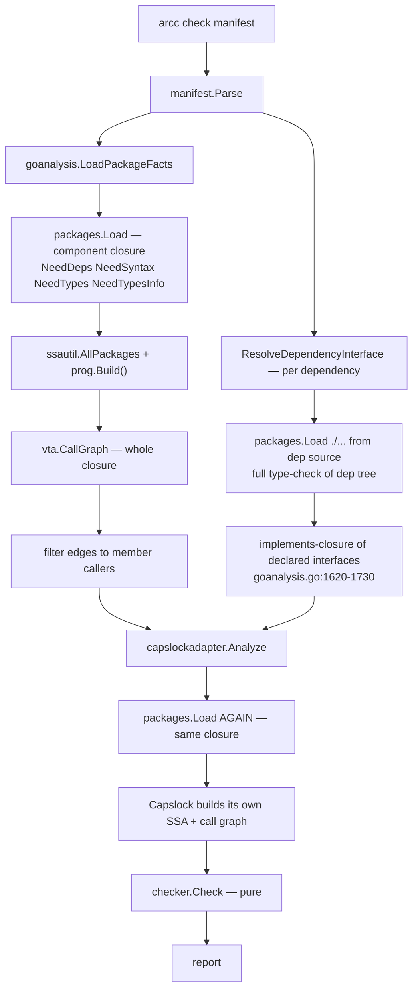

# Research — the current analysis pipeline and where its time goes

**Date:** 2026-08-04
**Method:** direct reading of the implementation at `dev-exp-go-bazel-mvp` @ `5011b726`,
plus wall/CPU measurement of `arcc check` on two components in this repo.

## What a check does today



The shape to notice: **the component's dependency closure is loaded and SSA-built
twice**, and **every declared dependency is additionally type-checked from source on
every run of every dependent**.

## Measurements

Run against the tree at `5011b726`, `bin/arcc` built from that revision:

```
arcc check examples/csvtool/app       →  2.1s wall,  6.4s CPU   (4 trivial packages)
arcc check internal/goanalysis        →  3.8s wall, 13.5s CPU   (1 component)
```

`examples/csvtool/app` is four small packages with three dependencies and takes 2.1s.
That is almost entirely fixed overhead: the cost tracks the *dependency closure*, not
the component. `internal/goanalysis` is worse because it pulls in `go/packages`,
`go/ssa` and Capslock itself.

The second monorepo PoC reports ~50s for some packages, consistent with the same
scaling on a much larger closure.

## Measured attribution

Measured at repository revision `48027ed8` (task step 1; code unchanged from
`5011b726` in the check path), Linux/amd64, 16 cores, Go 1.26.4 toolchain,
`x/tools v0.48.0`, `capslock v0.3.2`. Component: `internal/goanalysis`
(1 member package, ~2.1k lines) whose declared dependency closure is 196 packages.
Baseline comparison runs were also taken on `examples/csvtool/app`.

**Procedure.** `bin/arcc` built once with `just build` (compilation excluded from all
timings). One discarded warm-up run, then five timed runs of
`bin/arcc check go/internal/goanalysis/component.textproto`. Units: seconds of wall
clock and seconds of CPU (user+sys, sum over all threads). Attribution used two
temporary, env-guarded instrumentation points that were removed after collection:

1. **Phase wall timers** around the five boundaries: the closure `packages.Load`
   (`goanalysis.go`, `loadPackages`), SSA construction (`ssautil.AllPackages` +
   `prog.Build()`), VTA (`vta.CallGraph`), the per-dependency source loads
   (`ResolveDependencyInterface`), Capslock (`capslockadapter.Analyze`), and
   `checker.Check`. The `checker` phase measured ~0.2 ms and is reported as ~0.
2. **Per-phase CPU profiles** (`runtime/pprof` started/stopped around each phase,
   one profile per phase per run) attributed via `go tool pprof` sample totals.

The closure was counted with a `packages.Visit` over the load graph: 1 member,
196 non-member packages. To separate member from closure cost directly, a separate
one-off harness (not committed) loaded *only* the member package with `NeedDeps`
dropped and dependency types served from export data (`go list -export`, warm
build cache). Two distinct readings were recorded across five runs:

- the harness's internal `packages.Load` timer: **53–59 ms per load** (three loads
  per invocation);
- the whole harness process: **0.165–0.171 s wall** and **0.40–0.47 s user +
  0.10–0.18 s sys ≈ 0.53–0.57 s CPU** per invocation, including the
  `go list -export` driver subprocess and process start (raw samples in the task
  scratchpad `work.log`).

That is the same load mode the redesign will use, so it doubles as a preview of the
post-redesign member cost. Inside the *current* pipeline the member package is
type-checked as part of the one closure `packages.Load`, where its share cannot be
separated by the profiler; the profile's parse+type-check flat share (~0.38 s across
196 packages ≈ 2 ms/package) bounds it at roughly 2–3 ms — an estimate, not an
in-phase measurement. Against whole-process totals, the harness invocation is
≈0.17/3.62 ≈ 5% of wall and ≈0.55/13.4 ≈ 4% of CPU (the CPU share overstates the
steady-state member cost because it includes one-off driver and process-start work).

### Observations (goanalysis component, mean of 5 runs, warm)

**Wall clock** — total 3.62 s (runs 3.56–3.68 s):

| Phase | Wall | Share of total |
| --- | --- | --- |
| `loadfacts` (closure load + SSA + VTA) | 1.21 s | 33% |
| — of which `packages.Load` (closure, incl. member parse/type-check) | 0.41 s | 11% |
| — of which SSA build | 0.18 s | 5% |
| — of which VTA | 0.41 s | 11% |
| — remainder of `loadfacts` (visit, error collection, membership) | 0.21 s | 6% |
| `depresolve` (per-dependency source load + implements closure) | 0.66 s | 18% |
| Capslock (its own closure load + SSA + call graph + analysis) | 1.65 s | 46% |
| `checker.Check` | ~0.0002 s | ~0% |

**CPU** — whole-process user+sys 13.4 s (runs 13.0–13.8 s); per-phase profile
totals (mean of 5). All CPU shares below use the **whole-process CPU total
(13.4 s)** as the single denominator:

| Phase | CPU | Share of whole-process CPU |
| --- | --- | --- |
| Closure `packages.Load` | 2.01 s | 15% |
| SSA build | 1.52 s | 11% |
| VTA | 0.73 s | 5% |
| `depresolve` (dependency source type-checking) | 2.14 s | 16% |
| Capslock load + analysis | 5.57 s | 42% |
| Phase sum | 11.97 s | 89% |
| Unprofiled remainder (process start, non-phase windows, report rendering) | ~1.4 s | ~11% |

CPU exceeds wall by ~3.7× because the Go runtime spreads the work (especially GC)
across threads; within each phase profile, roughly 55–60% of flat samples land
in runtime/GC frames driven by that phase's allocations, so the *flat* function
breakdown is not itself a clean attribution — the per-phase totals above are the
measured quantity, with GC charged to the phase whose allocations caused it.

### The five requested categories

Percentages in the table use the **whole-process CPU total (13.4 s)** and the
**whole-process wall total (3.62 s)** as denominators, matching the tables above.

| # | Category | Wall (measured) | CPU (measured) | Note |
| --- | --- | --- | --- | --- |
| (a) | Member `packages.Load` + type-checking | 0.17 s harness wall (5%); ≈0.003 s inside the current load (estimate) | 0.55 s harness CPU incl. driver subprocess (4%); ≈0.002–0.003 s inside the current load (estimate) | Harness values are the whole process (0.165–0.171 s wall, ≈0.53–0.57 s CPU per invocation, including the `go list -export` subprocess and process start); the 53–59 ms figure is only the harness's internal `packages.Load` timer. Inside the *current* closure load the member share is inseparable and bounded at ≈2–3 ms by the profile's per-package parse/type-check flat rate — an estimate, marked as such. |
| (b) | Closure type-checking beyond members | ~1.07 s (30%) | ~4.15 s (31%) | Closure load phase (2.01 s CPU — `go/parser`/`go/types` over the 195 non-member packages plus driver overhead) plus `depresolve` (2.14 s CPU — dependency sources re-type-checked from source plus the implements-closure computation), minus the ≈0.002–0.003 s member share, which is far below measurement noise. The wall figure is the corresponding share of `loadfacts` + `depresolve`. |
| (c) | SSA construction | 0.18 s (5%) | 1.52 s (11%) | `ssautil.AllPackages` + `prog.Build()` over the closure, arcc's own. Capslock builds SSA a second time inside (e). |
| (d) | VTA | 0.41 s (11%) | 0.73 s (5%) | `vta.CallGraph` over the closure (plus edge filtering, included in the remainder). |
| (e) | Capslock's second load + analysis | 1.65 s (46%) | 5.57 s (42%) | Includes Capslock's own `packages.Load` of the same closure, its own SSA build, and its call-graph analysis; the check-relevant classifier work is a small fraction of it. **Largest single measured phase.** |

The categories are disjoint on these numbers: (a) is the member share subtracted
out of (b), and (c)–(e) are separate phases; (b)–(e) sum to ≈11.97 s CPU — the
entire 11.97 s profiled phase sum, since the subtracted member share is three
orders of magnitude below run variance — and ≈3.31 s wall of the 3.62 s wall
total.

**Aggregation and uncertainty.** (b)–(e) are measured as phase totals; a phase total
includes the runtime/GC cost that the phase's allocations caused (charged to the
phase, not split further). The one boundary the profiler cannot separate is the
member-vs-closure split inside the single `packages.Load` call; category (a)'s
in-pipeline value is therefore an estimate derived from the profile's flat
parse+type-check rate and the standalone harness measurements, not an in-phase
measurement. These figures should be read as accurate to roughly ±10% (run
variance across the five runs) with the stated aggregation rules; the exact
flat-function CPU split inside a phase is *not* claimed.

### Reconciliation with the earlier 2.1 s / 3.8 s figures

The historical figures above were taken at `5011b726` on the same machine class and
are **consistent** with the reruns in this section: `examples/csvtool/app` re-measured
at 1.90 s wall / 6.05 s CPU (historical 2.1 s / 6.4 s) and `internal/goanalysis` at
3.62 s wall / 13.4 s CPU (historical 3.8 s / 13.5 s). Both baselines stand; the small
deltas are machine and run variance, not a behavior change. The 2.1 s csvtool figure
remains the fixed-overhead floor (four trivial packages, 69-package closure) and the
3.8 s goanalysis figure the closure-heavy case (196-package closure); the PoC's ~50 s
packages sit at the same scaling on a much larger closure.

### Conclusion for the redesign

**Capslock's duplicate load and analysis (e) is the largest single measured phase**
(5.57 s CPU, 42% of whole-process CPU; 1.65 s wall, 46% of wall). The four
categories the redesign eliminates — closure type-checking (b) 31%, Capslock (e)
42%, SSA (c) 11%, VTA (d) 5% (all shares of the 13.4 s whole-process CPU total) —
sum to ≈11.97 s CPU, i.e. **89% of whole-process CPU** (100% of the 11.97 s
profiled phase sum). In wall clock the measured eliminated categories sum to
≈3.31 s of the 3.62 s total, i.e. **≈91% of wall**.

The redesign keeps only (a). Measured in its future form (the member-only
export-data harness) that costs ≈0.17 s wall / ≈0.55 s CPU per invocation
including the `go list -export` subprocess and process start; inside the current
pipeline the member share of the closure load is estimated at only 2–3 ms.

Distinguishing observed attribution from projection. Two remainders are not
assigned to any category: ~1.4 s unprofiled CPU (process start, non-phase windows,
report rendering, GC outside the phase windows) and ~0.31 s unassigned wall
(the `loadfacts` remainder of ~0.21 s — visit, error collection, membership —
plus ~0.10 s of process/report overhead). Some of that work would also disappear
under the redesign, but it is not attributable from these measurements, so the
conservative projections on this component are a reduction of **≈88–90% of
whole-process CPU** and **≈91–95% of wall clock** — not the ≈99% figures the
phase shares alone would suggest. The PoC's ~50 s packages should shrink
proportionally, since their cost is dominated by the same closure work.

## The three cost sources

| # | Source | Code | Removed by |
| --- | --- | --- | --- |
| 1 | Double SSA build over the closure | `goanalysis.go:274-279`; `capslockadapter.go:168` | Reference scan + stdlib map |
| 2 | Per-dependency full source type-check | `goanalysis.go:1440-1470` | Surface manifests |
| 3 | Stdlib SSA rebuilt every invocation | inside both loads | Stdlib authority map |

## Findings that shaped the design

### The boundary is already trusted

`cmd/arcc/app/app.go:200-229` builds `PruneAt` from resolved dependency symbols and
`PruneAtPackages` from `PACKAGE_SURFACE` dependencies, then hands them to Capslock as a
`CAPABILITY_SAFE` classifier (`capslockadapter.go:45-122`). Authority behind a declared
dependency is already not attributed to the caller. Publishing surface manifests is
therefore not a new trust assumption.

### The implements-closure workaround

`ResolveDependencyInterface` steps 9–11 (`goanalysis.go:1620-1730`) compute
`types.Implements` over every declared interface type and every concrete named type in
the dependency, then add the implementing methods to the allowed symbol set
(`concreteMethods`, `:1694-1726`). `dep_resolve_test.go:47` documents the intent:
*"should contain declared interface symbols and concrete implementation methods of
interface type"*.

This exists to stop VTA from producing false `CALLS_UNDECLARED_INTERFACE` findings, and
it over-corrects — the whitelisted concrete methods are accepted even when source names
them directly.

### Five stdlib predicates

- `hostpolicy.IsStdlibPath` (the host seam)
- `packagelayout.Layout.IsStdlibPackage` (`packagelayout.go:79`)
- `goanalysis.isStdlibPackage` (`goanalysis.go:533`)
- `goanalysis.classifyStdlibPackage` (`goanalysis.go:550`)
- `goanalysis.stdlibClassifier` (`goanalysis.go:563`)

Tolerable while the answer only suppresses diagnostics and skips imports
(`checker.go:60`). Not tolerable once the answer decides violations. Resolved by
deleting them in favour of map membership — see idea-honing Q12.

### The ocap attribution rule is load-bearing

`capslockadapter.go:32-40` reclassifies 22 `(*os.File)` handle-use methods as
`CAPABILITY_SAFE`, attributing filesystem authority to the *minting* site
(`os.Open`, `os.ReadFile`) rather than to handle use. `(*os.File).Chdir` is deliberately
excluded because it mutates process-global cwd.

This is why a syntactic scan is sound without resolving dynamic dispatch: minting sites
are essentially always statically resolved package-level functions, so `w.Write(...)`
through an `io.Writer` needs no resolution. If handle-use methods were ever
reclassified back to capability-bearing, the design would break.

### Infra auto-attachment already exists

`component.bzl:217-230` resolves `infra_deps` against the package closure and attaches
matching infra components automatically; `checker.go:289-291` exempts `AutoAttached`
dependencies from the unused-dependency warning. This is the mechanism host-injected
runtimes need (idea-honing Q14) — no new concept required, only visibility of the
injected packages.

### `MEMBER_OVERLAP` is self-vs-dep only

`checker.go:173-187` intersects the analyzed component's own members against each
resolved dependency's packages. Two *different* dependencies overlapping each other is
not checked. See idea-honing Q11.

### Absorbed-specific surface to be deleted

`facts.FuncValueEscapes` and `facts.BodilessAbsorbedPackages` (`facts.go:49-58`),
`capanalyzer.AnalyzeRequest.PruneAtPackages`, the absorbed-overlap check
(`checker.go:189-205`), the absorbed branch of the import sweep
(`checker.go:100-112`), `goanalysis.scanFuncValueEscapes` and
`collectBodilessAbsorbedPackages` (`goanalysis.go:328-329`), and the testdata under
`goanalysis/testdata/escapes/`. The README walkthrough at `README.md:296-340` teaches
absorption as its `UNDECLARED_AUTHORITY` example.

---

## Step 6 post-cutover measurement (reference-scan check, SSA/VTA and Capslock removed)

**Date:** 2026-09-08, immediately after the Step 6 Task 05 cutover. Same machine,
same toolchain (`go1.26.4 linux/amd64`, 16 cores), `bin/arcc` built once with
`just build`; one discarded warm-up run, then five timed runs of
`bin/arcc check <manifest>` (whole-process user+sys CPU, resource-usage deltas).
The native stdlib map was pre-warmed in the on-demand cache; the ~2m18s one-time
per-SDK generation cost (see below) is excluded from the per-check figures.

| Component | Baseline (Step 1, mean of 5) | Post-cutover (mean of 5) | Delta |
| --- | --- | --- | --- |
| `internal/goanalysis` (196-package closure) | 3.62 s wall / 13.4 s CPU | **1.46 s wall / 6.28 s CPU** (exit 1: the cutover's honest findings on the x/tools member closure; see the self-hosting note below) | −59% wall / −53% CPU |
| `examples/csvtool/app` (4 packages, 69-package closure) | 1.90 s wall / 6.05 s CPU | **0.78 s wall / 2.87 s CPU** (exit 0) | −59% wall / −53% CPU |

**Attribution.** The removed categories (b) closure type-checking *partially*,
(c) SSA 11%, (d) VTA 5%, (e) Capslock 42% of Step 1 CPU, are gone as phases; what
remains is (a) member + closure `packages.Load` (source loading stays until
Steps 7–8), the typed reference scan, the map lookups, and the checker. The
improvement being ~53% rather than the ~88–90% projected from the Step 1 phase
sums is expected and honest: dependency sources are still type-checked from
source — both the closure `packages.Load` (`NeedDeps` retained by design in this
step) and the per-dependency source loads (`ResolveDependencyInterface`) remain.
Steps 7 (surface consumption) and 8 (export-data loading) remove those phases;
their savings are NOT included in these numbers.

**One-time cost moved out of the check:** stdlib authority is now a precomputed
map. Native generation over the full non-internal stdlib (190 importable
packages) with the per-package Capslock batching adopted at the cutover takes
≈2m18s wall / ≈6m37s CPU on this machine, once per SDK configuration (cached,
regenerated on toolchain/classifier change; Bazel builds it as a declared
artifact). This is the Step 1 "Stdlib SSA rebuilt every invocation" cost source,
amortized instead of paid per check.

**Self-hosting note (honest result):** `internal/goanalysis` and
`internal/artifactio` currently report violations — the x/tools and transitional
protobuf member closures reference stdlib symbols the map preserves as
`UNANALYZED` (`sort.Slice`, `sync.Once.Do`, `unsafe.Pointer`, ...) and use
capabilities their manifests do not declare. Under DR-11 these are correct,
fail-closed findings; resolving them (policy downgrades / the Step 7
protobuf-runtime component) is later-step work recorded in the Step 6 task
escalation.

## Step 13 member-only scaling measurement

Measured after the Step 8 member-only loader landed, on Linux/amd64 with Go
1.26.4, `CGO_ENABLED=0`, and `golang.org/x/tools v0.48.0`. The command was
`go test -tags=integration ./internal/goanalysis -run
'^TestMemberAnalysisScaling_(Primary|DirectTypeSurface)$' -count=1 -v`. Each
fixture was generated in a fresh temporary module with `go list -json -deps
-export`; one warm-up load was discarded and three samples were retained for
each case. The test copied every non-member export archive into the temporary
layout, removed every non-member source directory, and then used the production
`LoadPackageFacts` and `ScanReferences` path through `packagelayout.WithDriverEnv`.

The primary member source is one fixed `member/member.go` importing one fixed
`entry` package and returning `entry.Make()`. The entry package blank-imports a
layered graph: for depth `d` and width `w`, there are `d*w` node packages plus
the directly imported entry package, so the expected non-member export-artifact
count is exactly `1 + d*w`. The measured package-load, scan, and total columns
below are milliseconds except scan, which is microseconds; `raw` preserves the
three post-warm-up samples in order and `median` is their robust aggregate.

### Primary depth/width series

| depth | width | package-load raw / median | scan raw / median | total raw / median | unique artifacts | deduplicated bytes |
| ---: | ---: | --- | --- | --- | ---: | ---: |
| 1 | 1 | 1.377, 1.226, 1.620 / 1.377 | 7.264, 10.751, 18.576 / 10.751 | 1.414, 1.264, 1.668 / 1.414 | 2 | 4,728 |
| 1 | 2 | 1.914, 1.753, 1.312 / 1.753 | 9.318, 10.971, 6.412 / 9.318 | 1.958, 1.809, 1.354 / 1.809 | 3 | 5,882 |
| 1 | 4 | 1.453, 1.436, 1.428 / 1.436 | 10.079, 10.920, 10.540 / 10.540 | 1.525, 1.510, 1.499 / 1.510 | 5 | 8,188 |
| 4 | 1 | 1.422, 1.706, 2.064 / 1.706 | 7.915, 5.851, 7.594 / 7.594 | 1.485, 1.767, 2.135 / 1.767 | 5 | 8,660 |
| 4 | 2 | 2.234, 1.921, 1.851 / 1.921 | 13.616, 9.928, 6.973 / 9.928 | 2.332, 2.045, 1.963 / 2.045 | 9 | 15,194 |
| 4 | 4 | 2.832, 2.765, 1.974 / 2.765 | 7.274, 6.081, 4.779 / 6.081 | 2.976, 3.116, 2.108 / 2.976 | 17 | 32,812 |
| 16 | 1 | 2.459, 2.672, 2.104 / 2.459 | 6.953, 9.929, 5.410 / 6.953 | 2.609, 2.955, 2.232 / 2.609 | 17 | 31,496 |
| 16 | 2 | 3.829, 4.152, 3.154 / 3.829 | 8.747, 7.594, 7.554 / 7.594 | 4.315, 4.613, 3.687 / 4.315 | 33 | 81,962 |
| 16 | 4 | 5.620, 5.512, 5.017 / 5.512 | 11.902, 14.758, 11.061 / 11.902 | 6.210, 6.297, 5.607 / 6.210 | 65 | 258,028 |

The exact structural workload was constant in all nine cases: one member
package, one selected source file, one syntax file, one `types.Info`, and the
same `Uses`/`Selections`, import edges, and typed reference edges. Every
non-member had no syntax, no type info, and no source-file role, while every
non-member was export-backed with complete types. Artifact counts and bytes
increased strictly along both the depth axis at each fixed width and the width
axis at each fixed depth. The scan guard is deliberately broad — median scan
must stay below `20*baseline + 20ms` — because the exact member workload is the
strong invariant and microsecond scheduling noise is not a useful threshold.

### Direct type-surface series

The second series fixes depth and width at `(1, 1)` and adds deterministic
exported type/function signature pairs to the directly imported `entry` package.
The member source and its typed references remain unchanged. There are always
exactly two non-member artifacts (entry plus one node); the bytes below are the
validated, deduplicated values from the same diagnostics path.

| exported type/signature pairs | package-load raw / median (ms) | scan raw / median (µs) | total raw / median (ms) | unique artifacts | deduplicated bytes |
| ---: | --- | --- | ---: | ---: | ---: |
| 0 | 1.898, 1.304, 1.402 / 1.402 | 11.652, 5.690, 5.740 / 5.740 | 1.946, 1.330, 1.428 / 1.428 | 2 | 4,748 |
| 8 | 1.655, 1.370, 1.443 / 1.443 | 7.554, 7.675, 5.911 / 7.554 | 1.688, 1.402, 1.472 / 1.472 | 2 | 25,096 |
| 32 | 1.823, 1.632, 1.338 / 1.632 | 5.660, 4.328, 6.692 / 5.660 | 1.848, 1.655, 1.368 / 1.655 | 2 | 85,366 |
| 128 | 1.663, 1.451, 1.753 / 1.663 | 5.310, 4.458, 4.348 / 4.458 | 1.692, 1.472, 1.775 / 1.692 | 2 | 328,702 |

Export bytes grow from 4.7 KiB to 321 KiB while member scanning remains the
same bounded workload and stays within the same noise-tolerant guard. The
package-load and total phases are therefore the honest residual cost of decoding
larger directly imported export data; this suite makes no constant-export-load
claim. Timings are machine-dependent observations emitted only through test
logs, never fields in reports, surfaces, facts, or layout artifacts.

The integration test also audits `go list -deps ./internal/goanalysis`: the
member-only check path links none of `golang.org/x/tools/go/ssa`,
`golang.org/x/tools/go/callgraph/vta`, or `github.com/google/capslock`. The
phase observer is package-private and nil by default, so production checks retain
the same artifact and API contract while the test can attribute package loading,
reference scanning, and complete `LoadPackageFacts` independently.

Routine validation on this Linux/amd64 host also ran `just ci` with the warm
Bazel cache after the suite was added. It passed in 15.049 seconds of wall time
(`real 0m15.049s`, `user 0m35.525s`, `sys 0m5.969s`); this is an observed CI
feedback result, not a timing assertion in the test.

## Step 13 complete Bazel producer-chain measurement

Measured after the producer-chain fixture and driver landed, on the same pinned
Linux/amd64 configuration: Bazel 9.2.0, Go 1.26.4, `CGO_ENABLED=0`,
`GOEXPERIMENT` empty, and `rules_go`'s default pure target configuration. The
integration entry point was
`go test -tags=integration ./internal/goanalysis -run
'^TestBazelProducerChainScaling_Integration$' -count=1 -v`. It builds all
thirteen bounded variants in one fresh `--output_base`, requests the `arcc`
output group, and collects Bazel's newline-delimited
`--execution_log_json_file` plus its compressed JSON trace `--profile`.

The rows below use the same order and parameters as the Task 1 member-only
series above: nine primary depth/width cases followed by the four direct
type-surface cases. The `projection_*` and `export_*` columns are reported for
both the measured root and its checked graph dependency. Both checked
subchains expose the same ordinary closure: counts are `1 + depth*width`
(entry plus nodes). The dependency's fixed wrapper member is excluded from
those ordinary counts, while entry remains directly imported by the wrapper
and by the measured member. `projection_us`, `layout_us`, and `check_total_us`
are the measured root action execution-wall times from the execution log.
`check_loader_us`/`member_scan_us` and their dependency-prefixed counterparts
are medians of three post-warm-up observations from every checked component's
production member-only loader and scanner, using Task 1's package-private
no-op-by-default phase observer. Workload tokens use the stable order
`packages:sources:syntax:types_info:uses:selections:imports:references`.
`producer_chain_us` is the sum of the root and checked dependency's six
producer-action times; it excludes the shared stdlib-map generation so that the
one-time producer is not charged once to every row. Timings are observations
only and are not persisted in reports, surfaces, maps, facts, or layouts.

| variant | depth | width | type surface | import graph actions | layout actions | check actions | root projection source files | root projection source bytes | dependency projection source files | dependency projection source bytes | projection µs | layout µs | root check loader µs | root member scan µs | dependency check loader µs | dependency member scan µs | check total µs | producer chain µs | root export artifacts | root export bytes | dependency export artifacts | dependency export bytes | root member workload | dependency member workload |
| --- | ---: | ---: | ---: | ---: | ---: | ---: | ---: | ---: | ---: | ---: | ---: | ---: | ---: | ---: | ---: | ---: | ---: | ---: | ---: | ---: | ---: | ---: | --- | --- |
| d01w01 | 1 | 1 | 0 | 1 | 1 | 1 | 2 | 181 | 2 | 181 | 14000 | 10000 | 12188 | 12 | 13896 | 13 | 223000 | 511000 | 2 | 1118 | 2 | 1118 | 1:1:1:1:4:0:1:2 | 1:1:1:1:4:0:1:2 |
| d01w02 | 1 | 2 | 0 | 1 | 1 | 1 | 3 | 250 | 3 | 250 | 10000 | 12000 | 13353 | 11 | 14584 | 15 | 242000 | 562000 | 3 | 1536 | 3 | 1536 | 1:1:1:1:4:0:1:2 | 1:1:1:1:4:0:1:2 |
| d01w04 | 1 | 4 | 0 | 1 | 1 | 1 | 5 | 388 | 5 | 388 | 10000 | 15000 | 13260 | 24 | 14215 | 12 | 237000 | 570000 | 5 | 2374 | 5 | 2374 | 1:1:1:1:4:0:1:2 | 1:1:1:1:4:0:1:2 |
| d04w01 | 4 | 1 | 0 | 1 | 1 | 1 | 5 | 427 | 5 | 427 | 16000 | 12000 | 13538 | 13 | 14188 | 14 | 228000 | 534000 | 5 | 2786 | 5 | 2786 | 1:1:1:1:4:0:1:2 | 1:1:1:1:4:0:1:2 |
| d04w02 | 4 | 2 | 0 | 1 | 1 | 1 | 9 | 1084 | 9 | 1084 | 16000 | 13000 | 13626 | 23 | 13807 | 23 | 235000 | 562000 | 9 | 5838 | 9 | 5838 | 1:1:1:1:4:0:1:2 | 1:1:1:1:4:0:1:2 |
| d04w04 | 4 | 4 | 0 | 1 | 1 | 1 | 17 | 3424 | 17 | 3424 | 6000 | 12000 | 15400 | 13 | 13565 | 22 | 228000 | 569000 | 17 | 15034 | 17 | 15034 | 1:1:1:1:4:0:1:2 | 1:1:1:1:4:0:1:2 |
| d16w01 | 16 | 1 | 0 | 1 | 1 | 1 | 17 | 1411 | 17 | 1411 | 8000 | 11000 | 13159 | 12 | 14632 | 14 | 232000 | 581000 | 17 | 15938 | 17 | 15938 | 1:1:1:1:4:0:1:2 | 1:1:1:1:4:0:1:2 |
| d16w02 | 16 | 2 | 0 | 1 | 1 | 1 | 33 | 4420 | 33 | 4420 | 13000 | 14000 | 13941 | 13 | 14096 | 13 | 253000 | 612000 | 33 | 50046 | 33 | 50046 | 1:1:1:1:4:0:1:2 | 1:1:1:1:4:0:1:2 |
| d16w04 | 16 | 4 | 0 | 1 | 1 | 1 | 65 | 15568 | 65 | 15568 | 12000 | 13000 | 16497 | 12 | 17519 | 12 | 209000 | 700000 | 65 | 182314 | 65 | 182314 | 1:1:1:1:4:0:1:2 | 1:1:1:1:4:0:1:2 |
| s0000 | 1 | 1 | 0 | 1 | 1 | 1 | 2 | 180 | 2 | 180 | 10000 | 9000 | 12245 | 11 | 13430 | 13 | 251000 | 511000 | 2 | 1114 | 2 | 1114 | 1:1:1:1:4:0:1:2 | 1:1:1:1:4:0:1:2 |
| s0008 | 1 | 1 | 8 | 1 | 1 | 1 | 2 | 1108 | 2 | 1108 | 6000 | 9000 | 13813 | 12 | 12553 | 13 | 257000 | 496000 | 2 | 3104 | 2 | 3104 | 1:1:1:1:4:0:1:2 | 1:1:1:1:4:0:1:2 |
| s0032 | 1 | 1 | 32 | 1 | 1 | 1 | 2 | 3892 | 2 | 3892 | 6000 | 11000 | 12897 | 12 | 12499 | 12 | 218000 | 539000 | 2 | 9042 | 2 | 9042 | 1:1:1:1:4:0:1:2 | 1:1:1:1:4:0:1:2 |
| s0128 | 1 | 1 | 128 | 1 | 1 | 1 | 2 | 15028 | 2 | 15028 | 17000 | 8000 | 13531 | 12 | 12618 | 13 | 236000 | 489000 | 2 | 34488 | 2 | 34488 | 1:1:1:1:4:0:1:2 | 1:1:1:1:4:0:1:2 |

The fixture deliberately preserves Task 1's primary topology: the directly
imported `entry` package imports every level-0 node, each node imports all
nodes at the next level, and the direct type/signature pairs are declared in
`entry`. A separate fixed `dependency_member` wrapper lets the checked graph
dependency retain a constant typed workload without moving those declarations
or changing the measured member-to-entry edge.

Every row has exactly one `ArccImportGraph`, one `ArccLayout`, and one
`ArccCheck` for the measured component, and the checked graph dependency also
has exactly one of each. Both checked components have one fixed typed member
package, one selected source file, one syntax file, one `types.Info`, and the
same member-workload tokens in every row; all non-members have no source lists,
syntax, or type info and have complete export-backed types. The projection and
export counts grow strictly along both primary depth/width axes for both
checked components, while the direct type-surface series keeps both wrapper
member workloads fixed and grows the directly imported entry package's
source/export volume. The broad scan guard remains noise-tolerant because
these exact role/work counters are the invariant rather than microsecond
timing.

The source asymmetry is intentional. `ArccImportGraph` is the single auxiliary
source-reading exception accepted by N1: pinned `rules_go` does not expose the
exact ordinary import graph, so this hermetic cached action lexically scans the
target-selected ordinary non-member files and emits a descriptor. `ArccLayout`
consumes only the base layout and that descriptor. `ArccCheck` receives the
final layout, member source, ordinary export artifacts, dependency
surface/report, stdlib export trees, and map, with no ordinary non-member `.go`
input. Thus projection and export decoding are visible residual closure costs,
not evidence that typed member work or the corrected N1/N2 leaf allowlist
scales with the closure.

The same run counted one default-configuration `ArccStdlibMap` action. The
driver invokes Bazel only, so native whole-SDK generation is absent by
construction rather than represented as a pseudo-counter. A second build in
the same isolated output root reused the action cache and produced byte-identical
map, surface, and report outputs. These checks keep the routine series within
the one-generation N5 bound while making the complete producer-chain residuals
reviewable.
