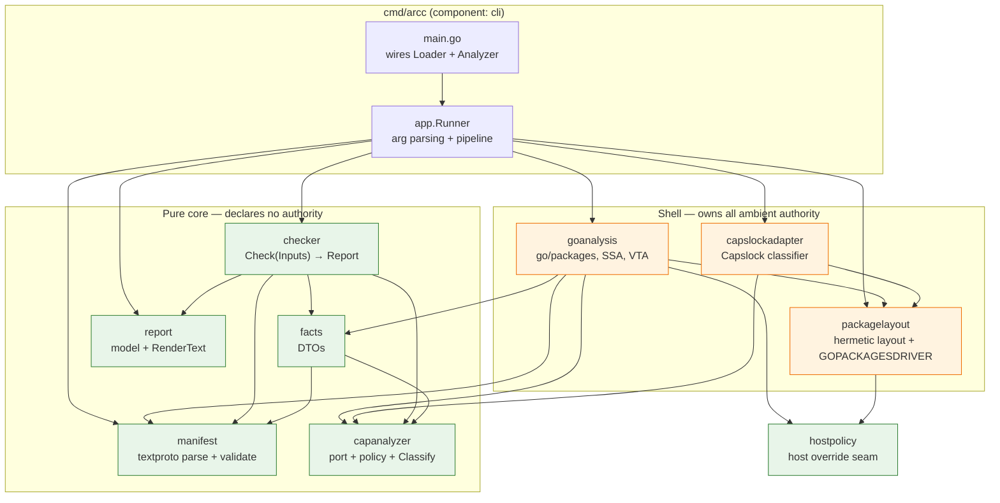
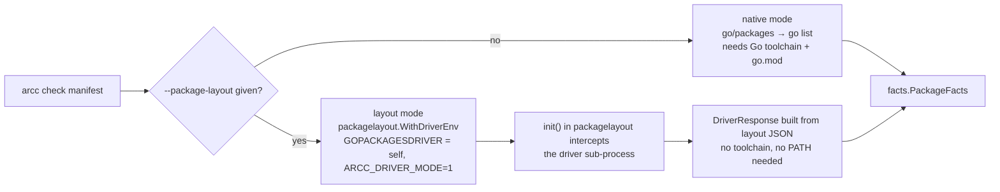
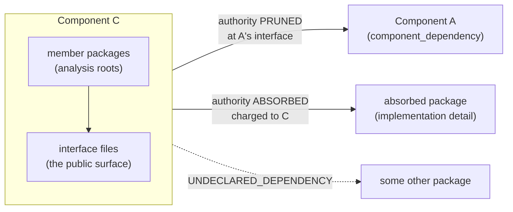
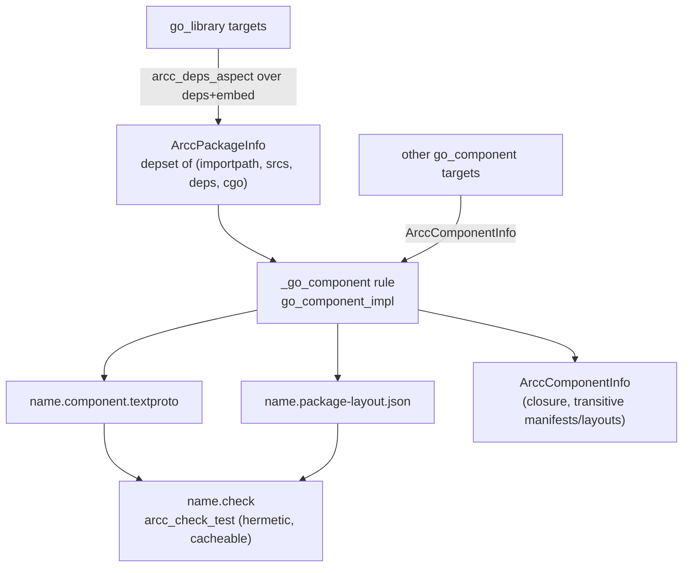

# Architecture

## 1. The shape of the system

`arcc` is a **static analysis pipeline wrapped in a ports-and-adapters core**. Its central
architectural commitment — and the property it verifies about itself — is that the
*decision core is ambient-authority-free*: it cannot touch the filesystem, the network, or
the process environment. Everything that can is pushed into named shell packages that
translate the messy outside world into plain Go value types.

The dependency graph is acyclic and one-directional: shell → core, never the reverse. The
core's only knowledge of Capslock is the `capanalyzer.CapabilityAnalyzer` interface.

## 2. The core/shell split, and why it is load-bearing

| Package | Kind | Declared authority |
|---|---|---|
| `checker`, `facts`, `report`, `capanalyzer` | pure core | **none** |
| `manifest` | core (parses via protobuf) | reflection/runtime via protobuf internals |
| `hostpolicy` | pure seam | none |
| `goanalysis` | shell | seven capability kinds |
| `capslockadapter` | shell | eight capability kinds |
| `packagelayout` | shell | filesystem, environment |

`just selfcheck` runs arcc against its own manifests in **two groups**, and the justfile is
explicit that conflating them would overclaim:

- The **authority-free core** (`checker`, `facts`, `report`, `capanalyzer`) declares no
  ambient authority at all — the check proves the pure core *is* authority-free.
- The **remaining components** (`manifest`, `goanalysis`, `capslockadapter`, `cli`) declare
  authority — their checks prove only that each *does not exceed* its declaration.

## 3. Two loading modes

`arcc check` obtains its package graph one of two ways. The mode is selected by the presence
of `--package-layout`.

Layout mode is what makes the Bazel `.check` targets **hermetic and cacheable**: the
`go_component` rule emits a `<name>.package-layout.json` describing the whole closure at
analysis time, and the check runs in a sandbox with no Go toolchain present. The integration
tests prove this by stripping `PATH` before invoking the binary (`runArccHermetic`).

The self-exec driver dispatch is the trickiest mechanism in the codebase: `WithDriverEnv`
points `GOPACKAGESDRIVER` at `os.Executable()`, so `go/packages` re-invokes arcc itself as a
driver sub-process. Because in tests that executable is the `go test` binary — whose `main`
belongs to the testing framework — the interception has to happen in `packagelayout`'s
`init()`, gated on the private `ARCC_DRIVER_MODE=1` marker so it can never be reached from a
user-facing subcommand.

## 4. The component model

A **component** is: a set of member packages, a declared interface, declared dependencies on
other components, absorbed implementation-detail packages, and a declared authority set.

Three ways a package outside the component can be reached, with three different meanings:

- **`component_dependencies`** — a first-class boundary. Capability analysis is *pruned* at
  the dependency's declared interface symbols (or, under `PACKAGE_SURFACE`, at package
  granularity). The dependency owns its own authority; it does not bleed upward. This is
  FR5b, and it is what lets `csvtool/app` orchestrate a file-reading component while
  checking as authority-free.
- **`absorbed_dependencies`** — the package is an implementation detail. Its authority is
  charged to the absorbing component wherever owned code reaches it.
- **anything else** — reported as `UNDECLARED_DEPENDENCY`.

**Membership** (FR1 / M-series) is determined two ways: with `members` empty, every Go
package under the manifest's directory is a member; with `members` declared, the listed
import paths are the membership and may name packages anywhere. Generated manifests always
declare `members` explicitly. Members are *analysis roots* — every function in them is a
capability start point — which is why callback bodies defined in member packages attribute
their authority to the component regardless of who calls them.

**Interface styles**: the default declares the surface via `interface_files`;
`INTERFACE_STYLE_PACKAGE_SURFACE` says "the interface is every exported symbol of every
member", for wrapping code never written to have an architectural interface. Under
`PACKAGE_SURFACE`, `interface_files` must be empty, `members` non-empty, pruning is coarser
(package granularity), and `CALLS_UNDECLARED_INTERFACE` and the FR4 placement rules become
vacuous.

## 5. Trust and compositionality

Pruning is only sound if every component's manifest is honest, and arcc checks **one
component at a time**. The design does not paper over this: it makes the trust visible.

- `own_check_runs` and `certification_reference` are **self-declarations at the same trust
  level as `declared_authority`** — arcc does not verify them.
- Every pruned boundary appears in the report's dependency listing annotated `certified`
  (the dependency says its own check runs) or `asserted` (it does not).
- The annotation is explicitly *not a finding*: the depending component did nothing wrong by
  pruning. It exists so that what is being trusted is visible in every report that rests on it.
- `auto_attached: true` marks an edge injected by an emitter rather than an author; such an
  edge is exempt from `UNUSED_DEPENDENCY`, because an author who never asked for the edge
  should not be told to remove it.

## 6. The Bazel layer

`go_component` is a symbolic macro expanding to two targets: the component (which also
forwards the interface library's Go providers, so it can appear in `deps`) and a `.check`
test. All manifest/layout generation happens **at analysis time** — the only actions are two
`ctx.actions.write` calls. The rule classifies the "FR2 frontier" (each effective member plus
its direct deps) into members and absorbed, and leaves anything else for the checker to
report as `UNDECLARED_DEPENDENCY`.

Portability is concentrated in one file: `bazel_rules/go/private/go_adapter.bzl` is the sole
importer of `@rules_go`. Everything above it is byte-identical across hosts. Three of its
hooks matter to a porter: `go_build_platform` (must read the *target* mode, not the SDK's
execution platform), `INFRA_COMPONENTS` (registry of toolchain-injected components), and
`go_attach_infra` (whether to attach one).

The rule **fails closed on cgo**: a cgo package compiles from preprocessed sources that do
not exist at analysis time, so rather than emit a layout naming files that will not be in the
sandbox, the rule refuses — and the exclusion propagates upward through importers.

## 7. Determinism as a design rule

Reports, generated manifests, and layouts are all explicitly sorted. `checker` sorts findings
by message, then file, then line. `capslockadapter` sorts findings with hand-written frame
comparators rather than reflection-based comparison. `component.bzl` sorts members, deps and
packages before writing. Member *declaration order* is proven irrelevant by a dedicated shell
test (`member_order_test.sh`). This is what makes golden-file testing of the Bazel outputs
viable at all.

## 8. Known architectural limits

The README carries fifteen numbered limitations; the architecturally load-bearing ones:

- **VTA over-approximation** — dynamic dispatch and reflection can produce call paths
  unreachable at runtime, hence occasional false positives.
- **Call-edge-only enforcement** — reading exported fields, types, or package-level variables
  across a boundary is out of scope.
- **Compositional checking** — guarantees hold only if *every* component is independently
  checked and conforms.
- **One platform per check** — `declared_authority` is platform-agnostic, but a check verifies
  exactly one platform. Authority exercised only in a `_windows.go` file is invisible on Linux.
- **`ABSORBED_FUNC_VALUE_ESCAPE`** — taking the value of a function defined in an absorbed
  package and passing it across a boundary without calling it leaves a gap no analysis covers;
  arcc warns rather than claiming the body is safe.
- **Cross-component membership overlap is undetected** — needs a repo-wide uniqueness check
  that does not exist yet.
- **`PACKAGE_SURFACE` can launder authority** — wrapping a large library and declaring the
  union of what it needs stops charging that authority to every caller. Review of
  `declared_authority` is the control.
