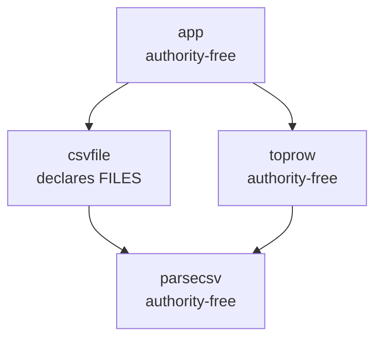

# Components

Each Go package under `go/internal/` (plus `cmd/arcc`) carries a package doc comment with a
**Component Contract (FR10)** block: *what it does / what it requires / what it provides /
ambient authority*. Eight of them are declared components with their own
`component.textproto` and are checked by `just selfcheck`.

## Summary table

| Package | Role | Declared authority | Internal deps | LOC scale |
|---|---|---|---|---|
| `cmd/arcc` + `app` | CLI, argument parsing, pipeline orchestration | yes (`cli`) | app, capslockadapter, goanalysis | small |
| `capanalyzer` | port + policy for capability analysis | **none** | — | small |
| `capslockadapter` | Capslock-backed analyzer implementation | 8 kinds | capanalyzer, packagelayout | medium |
| `checker` | pure conformance decision core | **none** | capanalyzer, facts, manifest, report | medium |
| `facts` | DTOs the shell produces for the core | **none** | capanalyzer, manifest | small |
| `goanalysis` | package loading, SSA, VTA call graph | 7 kinds | capanalyzer, facts, hostpolicy, manifest, packagelayout | ~2,140 lines |
| `hostpolicy` | host override seam | none | — | tiny |
| `manifest` | textproto parse + validation | reflect/runtime (protobuf) | manifest/gen | medium |
| `manifestparity` | test-support: generated vs. checked-in manifests | n/a (not a component) | manifest | small |
| `packagelayout` | hermetic layout + GOPACKAGESDRIVER | fs, env | hostpolicy | ~1,250 lines |
| `report` | report model + text renderer | **none** | — | small |

---

## `cmd/arcc` — the CLI (component `cli`)

`main.go` is nine lines of wiring; all behavior lives in `app.Runner`. The two injected
seams are the whole testability story:

```go
runner := &app.Runner{
    Loader:   goanalysis.LoadPackageFacts,      // type PackageLoader
    Analyzer: capslockadapter.NewAdapter(),     // capanalyzer.CapabilityAnalyzer
}
return runner.Run(args, stdout, stderr)
```

`Runner.Run` hand-rolls argument parsing (no flag library), locks
`packagelayout.CheckMu` for the whole run, and delegates to `runCheck`. `stdout`/`stderr` are
`io.Writer` parameters throughout — nothing in the package references `os.Stdout` directly,
which is what lets `main_test.go` drive the CLI in-process with `bytes.Buffer`.

## `capanalyzer` — the capability port (pure)

Defines the abstraction the pure `checker` depends on so it never imports Capslock:

```go
type CapabilityAnalyzer interface {
    Analyze(req AnalyzeRequest) ([]CapabilityFinding, error)
}
```

Plus the value types that cross that boundary (`AnalyzeRequest`, `CapabilityFinding`,
`Frame`, `InterfaceSymbol`), the policy shape (`CapabilityPolicy`, `StrictPolicy()`), and one
pure decision function `Classify(capability, policy) Decision` with precedence
Allowed > Warn > Violation. A true leaf: zero imports, internal or third-party.

## `capslockadapter` — the Capslock adapter (shell)

The production `CapabilityAnalyzer`. Loads packages with `go/packages`, builds a **custom
Capslock classifier** and maps Capslock's findings into `capanalyzer.CapabilityFinding`.

Two things the classifier does that carry design intent:

1. **Object-capability handling of `(*os.File)`** — 22 file-handle-use methods are
   reclassified `CAPABILITY_SAFE`, because authority belongs to the *minting* call
   (`os.Open`), not to every downstream consumer of the handle. `Chdir` is deliberately
   excluded from that list: it mutates process-global state, not object state.
2. **Boundary pruning** — the `PruneAt` symbols and `PruneAtPackages` from the request are
   marked safe in the classifier, which is mechanically how FR5b pruning happens.

`mapClass` returns an error on an unknown capability name rather than ignoring it (fail
closed). Findings are sorted with hand-written frame comparators for determinism.

## `checker` — the decision core (pure)

One entry point, and note the signature:

```go
func Check(in Inputs) report.ConformanceReport
```

**It returns no error.** Every failure mode is data — a `report.Finding` in `Violations` or
`Warnings`. The rules it implements are annotated inline with their requirement numbers:

| Rule | What it checks | Findings produced |
|---|---|---|
| FR3 | imports against the declared dependency allowlist | `UNDECLARED_DEPENDENCY`, `UNUSED_DEPENDENCY` |
| FR4 | well-formedness / method placement | `METHOD_OUTSIDE_INTERFACE` |
| FR5 | cross-component call boundary | `CALLS_UNDECLARED_INTERFACE` |
| FR6 | policy-aware ambient authority | `UNDECLARED_AUTHORITY`, `ALLOWED_WITH_WARNING` |
| M7 | member vs. covered/absorbed contradiction | `MEMBER_OVERLAP` |

Also exports three pure symbol-normalization helpers used for A4 comparison:
`StripGenericBrackets`, `NormalizeInterfaceSymbol`, `ExtractPackagePath`.

## `facts` — the shell/core data contract (pure)

DTOs only, plus one helper. `PackageFacts` is the single struct the shell hands the core:
packages, call edges, stdlib imports, unresolved imports, function-value escapes, and
bodiless absorbed packages. Field doc comments consistently state *provenance* — whether a
value is declared by the author or derived by the shell, and whether the checker consumes it.

`MatchesMember(entry, packagePath) bool` implements `path.Match` semantics with the rule that
a malformed pattern simply does not match; it is shared with `checker` so membership matching
has one implementation.

## `goanalysis` — package loading and call-graph extraction (shell)

The largest package (~2,140 lines, one file, sectioned by comment banners). Public surface is
deliberately tiny — five symbols:

- `LoadPackageFacts(LoadRequest) (facts.PackageFacts, error)` — the main entry point
- `ValidateInterfaceFiles(root, files, loaded) ([]InterfaceFileExclusion, error)`
- `ResolveDependencyInterface(declaringRoot, analyzedRoot, dep) (facts.DependencyInterface, error)`
- the `LoadRequest` / `InterfaceFileExclusion` types

Internally ~55 unexported functions covering: layout-membership validation, stdlib
classification and provenance, exported-symbol extraction, generic-symbol canonicalization
(including a hand-rolled recursive-descent type parser), build-constraint description,
SSA/VTA call-edge extraction, and the two analysis-limitation detectors
(`scanFuncValueEscapes`, `collectBodilessAbsorbedPackages`).

Two seams worth knowing:

- `var loadPackages = packages.Load` — swapped by integration tests to simulate a rewriting
  host driver.
- A mutex-guarded cache keyed by the `reflect.ValueOf(...).Pointer()` of the returned
  `[]facts.PackageFact` slice header, so `ValidateInterfaceFiles` can recover the source-file
  set a prior `LoadPackageFacts` computed — chosen specifically to avoid adding a field to
  `facts.PackageFacts` and polluting the core DTO.

Every import path passes through `hostpolicy.CanonicalizePath` before being compared or
stored.

## `hostpolicy` — the host override seam (pure)

Two package-level function variables, set once at `init()` by an embedding host:

```go
var CanonicalizePath = func(p string) string { return p }
var IsStdlibPath = func(importPath string) bool { /* first segment has no dot */ }
```

Function vars rather than an interface, deliberately: this is a *host-wide* policy, and the
doc comments specify the contract (total, idempotent, safe for concurrent reads) rather than
the implementation. It exists so the pure checker's plain string-equality logic keeps working
under monorepo path rewriting.

## `manifest` — schema parsing and validation (core)

Parses textproto into the generated `gen.Component` and converts it to a hand-written native
`Manifest`, shielding everything else from protobuf types. `copyStrings` defensively clones
slices so the parsed manifest does not alias protobuf-owned backing arrays.

Validation is **fail-fast** (first violation wins) — the deliberate opposite of
`checker.Check`, which accumulates. It owns `KnownCapabilities`, the 13-entry authority set
that `bazel_rules/authority.bzl` is kept in sync with by a dedicated shell test.

## `manifestparity` — cross-leg drift guard (test support)

A non-`_test.go` package whose entire API takes `testing.TB`, called *from* other packages'
tests. It asserts the Bazel-generated `*_component.component.textproto` files and the
hand-written checked-in ones agree semantically, with documented normalizations (name suffix
stripped, absorbed-dependency `reason` ignored, implicit interface-package membership per M5).
`Run` skips outright when given no files, so plain `go test` without Bazel-injected args is a
no-op.

## `packagelayout` — hermetic loading (shell)

Owns the layout JSON schema (`Layout`, `Platform`, `UnresolvedImport`), its validation and
resolution (path existence, build-constraint filtering, platform validation against Go 1.26's
supported-target list), and the `GOPACKAGESDRIVER` protocol implementation
(`HandleDriverRequest`, `RunDriver`). It also holds the process-wide active-layout state that
`goanalysis` and `capslockadapter` consult to detect layout mode.

Scoped-state helpers `WithTemporaryLayout` / `WithDriverEnv` take a `func() error`, mutate
package-level state and environment under a mutex, and always restore. `CheckMu` is the
global mutex serializing whole check executions in one process.

## `report` — output model and rendering (pure)

Ten `Kind` constants split into five violations and five warnings, plus `Location`,
`Finding`, `DependencyBoundary`, `ConformanceReport`, and `RenderText`. The structs carry
`json:` tags for callers that marshal them, but the package itself does no
JSON marshaling — deliberately, to keep it free of reflection. `Finding.Evidence []string` is
how capability call paths reach the report without `report` knowing about `capanalyzer.Frame`.

## `examples/csvtool` — the worked example

Four components demonstrating FR5b pruning:



`app` calls `csvfile.Read` (which uses `os.ReadFile`) but declares `csvfile` as a
*component dependency*, so analysis prunes at `csvfile`'s interface and `app` checks as
ambient-authority-free. `app/app.go`'s doc comment notes the structure is intentionally
convoluted precisely to exercise that rule. The same fixtures are what the
`integration`-tagged CLI tests check against.

## Bazel rule components

| File | Responsibility |
|---|---|
| `bazel_rules/go/defs.bzl` | the only public load surface: `go_component`, authority constants, `PACKAGE_SURFACE` |
| `private/component.bzl` | `_go_component` rule impl — coverage/absorption validation, FR2 frontier classification, manifest + layout emission |
| `private/aspect.bzl` | `arcc_deps_aspect` — walks `deps` + `embed`, produces `ArccPackageInfo` |
| `private/check.bzl` | `arcc_check_test`, `arcc_check_grep_test`, `arcc_check_report_golden_test` |
| `private/command.bzl` | `arcc_check_argv` — one place that builds the arcc command line |
| `private/go_adapter.bzl` | the single seam onto `@rules_go`; the whole porting surface |
| `private/paths.bzl` | `runfiles_path` + a from-scratch Go `path.Match` glob matcher |
| `authority.bzl` / `providers.bzl` | language-neutral authority taxonomy; `ArccComponentInfo` |
