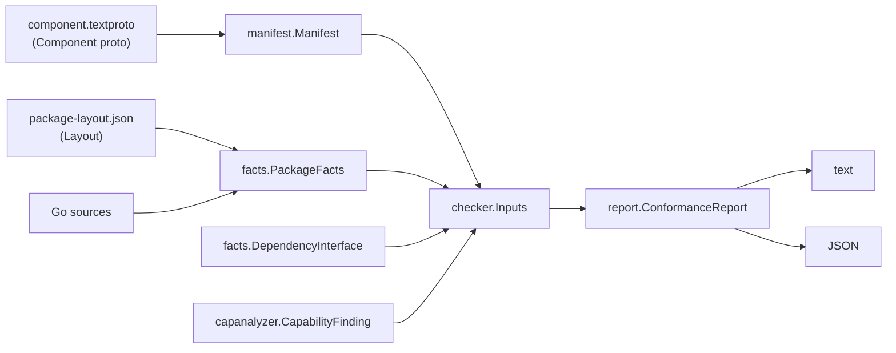

# Data Models

Three schemas matter: the **manifest** (protobuf, authored by humans or emitters), the
**package layout** (JSON, emitted by build systems), and the **report** (Go structs, rendered
as text or JSON). Between them sit the Go DTOs in `facts` and `capanalyzer`.



---

## 1. Manifest schema — `proto/archcontracts/v1/component.proto`

```protobuf
syntax = "proto3";
package archcontracts.v1;
option go_package = ".../go/internal/manifest/gen;gen";
```

The manifest lives at the **component root** as `component.textproto`. There is deliberately
no `contract` field: the informal contract is doc-comment prose in the interface files (FR10).

### `message Component`

| # | Type | Field | Semantics |
|---|---|---|---|
| 1 | `string` | `name` | sibling-unique logical component name |
| 2 | `repeated string` | `interface_files` | `.go` files holding the public surface, **relative to the component root**; multi-package components use subdir paths (`store/api.go`) |
| 3 | `repeated ComponentDependency` | `component_dependencies` | first-class component boundaries; authority is pruned at them |
| 4 | `repeated AbsorbedDependency` | `absorbed_dependencies` | implementation-detail packages whose authority is charged here |
| 5 | `repeated string` | `declared_authority` | capability names, validated at parse time (C11). Empty = ambient-authority-free |
| 6 | `repeated string` | `members` | import paths (or patterns, `PACKAGE_SURFACE` only) of packages this component owns and analyzes as **roots**. The interface package is implicit. Empty = FR1 directory-based membership |
| 7 | `InterfaceStyle` | `interface_style` | how the exposed interface is determined |
| 8 | `bool` | `own_check_runs` | whether this component's own check runs in the build. **A self-declaration; arcc does not verify it** |
| 9 | `string` | `certification_reference` | where conformance is established when `own_check_runs` is false. Also unverified |

### `enum InterfaceStyle`

| Value | # | Meaning |
|---|---|---|
| `INTERFACE_STYLE_UNSPECIFIED` | 0 | the interface is declared by `interface_files` (backward-compatible default) |
| `INTERFACE_STYLE_PACKAGE_SURFACE` | 1 | the interface is every exported symbol of every member package |

### `message ComponentDependency`

| # | Type | Field | Semantics |
|---|---|---|---|
| 1 | `string` | `name` | must match the `name` in the resolved manifest (C12) |
| 2 | `string` | `manifest` | path **relative to the declaring manifest's directory**. The resolved manifest's own directory is the dependency's component root; its interface packages are *derived* from the packages containing its interface files (C10) |
| 3 | `bool` | `auto_attached` | injected by an emitter, not written by an author → exempt from `UNUSED_DEPENDENCY` |

### `message AbsorbedDependency`

| # | Type | Field | Semantics |
|---|---|---|---|
| 1 | `string` | `import_path` | fully qualified path; may be a pattern |
| 2 | `optional string` | `reason` | prose note (generated manifests never write one) |

### Known capabilities (13)

`FILES`, `NETWORK`, `READ_SYSTEM_STATE`, `MODIFY_SYSTEM_STATE`, `OPERATING_SYSTEM`,
`SYSTEM_CALLS`, `EXEC`, `RUNTIME`, `ARBITRARY_EXECUTION`, `CGO`, `UNSAFE_POINTER`, `REFLECT`,
`UNANALYZED`.

Source of truth: `manifest.KnownCapabilities` in Go. Mirrored in
`bazel_rules/authority.bzl` as string constants plus `ALL_AUTHORITIES`;
`//bazel_rules/tests:authority_sync_test` fails if the two drift.

### Example manifest (`go/examples/csvtool/app/component.textproto`)

```textproto
name: "app"
own_check_runs: true
interface_files: "app.go"
members: "github.com/ono-sendai-labs/architectural-contracts/go/examples/csvtool/app"
component_dependencies {
  name: "csvfile"
  manifest: "../csvfile/component.textproto"
}
component_dependencies {
  name: "toprow"
  manifest: "../toprow/component.textproto"
}
```

### Go-side model (`manifest.Manifest`)

```go
type Manifest struct {
    Name                   string
    InterfaceFiles         []string
    ComponentDependencies  []ComponentDependency  // {Name, Manifest, AutoAttached}
    AbsorbedDependencies   []AbsorbedDependency   // {ImportPath, Reason *string}
    DeclaredAuthority      []string
    Members                []string
    InterfaceStyle         InterfaceStyle         // uint8 enum
    OwnCheckRuns           bool
    CertificationReference string
}
```

### Validation invariants (`manifest.validate`, fail-fast)

- non-empty `name`; non-empty `interface_files` unless `PACKAGE_SURFACE`
- `PACKAGE_SURFACE` ⇒ `members` non-empty **and** `interface_files` empty (both directions)
- no duplicate interface files / members / dependency names / absorbed import paths
- every `declared_authority` entry in `KnownCapabilities`
- no member also listed as an absorbed dependency
- member patterns must be valid `path.Match` syntax; patterns are rejected outside `PACKAGE_SURFACE`

---

## 2. Package layout schema — `docs/package-layout-schema.md`

The hermetic stand-in for a live `go/packages` load. Consumed via
`arcc check <manifest> --package-layout=<layout.json>`; emitted by `go_component`.

```json
{
  "go_sdk_root": "external/go_sdk/src",
  "platform": { "goos": "linux", "goarch": "amd64", "build_tags": [], "cgo_enabled": false },
  "roots": ["example.com/svc", "example.com/svc/impl"],
  "packages": [
    { "ID": "…", "Name": "…", "PkgPath": "…",
      "GoFiles": ["…"], "CompiledGoFiles": ["…"], "is_stdlib": false }
  ]
}
```

| Field | Meaning |
|---|---|
| `go_sdk_root` | path to the SDK's `src` dir. arcc enumerates and type-checks the stdlib from here — **emitters must not list stdlib packages** |
| `platform` | target platform for the analysis. Optional; absent means `build.Default` |
| `roots` | the component's member packages. Must equal the manifest's `members` **exactly**, or the load fails |
| `packages` | the whole closure in `go/packages`' flat driver encoding, plus the layout-only `is_stdlib` bit |

**Path frame**: source paths resolve against arcc's working directory (stdlib paths against
`go_sdk_root`); any path containing `..` is rejected.

### The two conforming `Imports` shapes (§3)

1. **Filtered** — the emitter declares files *and* `Imports` consistently for the declared platform.
2. **Unfiltered with `Imports` omitted** — the emitter declares the full unfiltered source set and omits `Imports` entirely; the loader recovers edges by parsing the files that survive filtering. This is what `bazel_rules/` does.

The non-conforming middle is an unfiltered file set with `Imports` derived from it. The
loader *validates* rather than trusts: after filtering it compares declared imports against
the surviving files' actual imports and errors on mismatch in either direction. Equality is
taken only over *resolvable* imports; an import resolving to nothing becomes an
`ANALYSIS_LIMITATION` warning naming package, file, and import path.

Note the distinction: absent/null `Imports` selects shape 2; `"Imports": {}` is shape 1
declaring zero imports.

### `is_stdlib` (§4) — the field with a wrong obvious implementation

It must record **provenance** (came from the SDK/toolchain vs. an enumerated build target) and
must never be recomputed by an import-path heuristic in the emitter. arcc cross-checks the
declared bit against `hostpolicy.IsStdlibPath` and fails on disagreement. For the
`bazel_rules/` emitter every listed package comes from an enumerated target, so the value is
structurally `false` throughout. Omitting the field decodes as `false`.

### cgo (§5)

A cgo package's `CompiledGoFiles` cannot be named honestly from build-graph metadata, so the
Bazel emitter refuses a closure containing cgo. Native mode is unaffected because the go tool
preprocesses cgo before `go/packages` sees it.

### Go-side model

```go
type Layout struct {
    GoSDKRoot         string
    Platform          *Platform
    Roots             []string
    Packages          []*packages.Package
    UnresolvedImports []UnresolvedImport   // json:"-"
}
type Platform struct { GOOS, GOARCH string; BuildTags []string; CgoEnabled bool }
type UnresolvedImport struct { Package, SourceFile, ImportPath string }
```

---

## 3. Facts — what the shell hands the core

```go
type PackageFacts struct {
    Packages                 []PackageFact
    CallEdges                []CallEdge
    StdlibImports            []string
    UnresolvedImports        []UnresolvedImport
    FuncValueEscapes         []FuncValueEscape
    BodilessAbsorbedPackages []string
}

type PackageFact struct {
    ImportPath      string
    Imports         []string
    ExportedSymbols []ExportedSymbol
}

type ExportedSymbol struct {
    Name     string
    File     string
    Kind     string   // "func" | "type" | "var" | "const" | "method" | "init"
    Receiver string
}

type CallEdge struct { Caller, Callee capanalyzer.InterfaceSymbol }

type UnresolvedImport struct { Package, File, ImportPath string }
type FuncValueEscape struct { Symbol, Package, File string; Line int }

type DependencyInterface struct {
    Component              string
    InterfaceStyle         manifest.InterfaceStyle
    OwnCheckRuns           bool
    CertificationReference string
    Packages               []string
    Symbols                []capanalyzer.InterfaceSymbol
}
```

`InterfaceSymbol` is the canonical Capslock/go-types key form:
`example.com/store.Read`, or `(*example.com/store.DB).Get` for a method.
`checker.NormalizeInterfaceSymbol` strips generic brackets and normalizes `(*` → `(` before
comparison (A4).

---

## 4. Capability findings

```go
type Class string          // "TrueAuthority" | "AnalysisDefeating"
type Frame struct { Func, File string; Line int }

type CapabilityFinding struct {
    Package    string
    Capability string
    Class      Class
    CallPath   []Frame
}

type CapabilityPolicy struct {
    Allowed map[string]bool
    Warn    map[string]bool
}
type Decision int          // DecisionViolation | DecisionWarn | DecisionAllowed
func Classify(capability string, policy CapabilityPolicy) Decision
```

`StrictPolicy()` returns the empty policy — the MVP default, where anything not declared is a
violation. Precedence in `Classify`: Allowed > Warn > Violation.

---

## 5. Report model

```go
type Kind string

type Location struct {
    File string `json:"file"`
    Line int    `json:"line"`
}

type Finding struct {
    Kind     Kind
    Message  string
    Location Location
    Evidence []string `json:"evidence,omitempty"`
}

type DependencyBoundary struct {
    Component              string
    OwnCheckRuns           bool
    CertificationReference string `json:"certification_reference,omitempty"`
}

type ConformanceReport struct {
    Component    string
    Dependencies []DependencyBoundary `json:"dependencies,omitempty"`
    Violations   []Finding
    Warnings     []Finding
}
```

### Finding kinds

| Kind | Class | Meaning |
|---|---|---|
| `UNDECLARED_DEPENDENCY` | violation | an import reaches a package that is neither a member, nor covered by a component dependency, nor absorbed |
| `CALLS_UNDECLARED_INTERFACE` | violation | a call crosses into a dependency at a symbol outside its declared interface |
| `UNDECLARED_AUTHORITY` | violation | a capability is reached that `declared_authority` does not cover |
| `METHOD_OUTSIDE_INTERFACE` | violation | an exported method on an interface-declared receiver type is defined outside the interface files (FR4) |
| `MEMBER_OVERLAP` | violation | a member is also covered by a component dependency or absorbed (M7) |
| `ANALYSIS_LIMITATION` | warning | analysis could not cover something (unresolved import, bodiless absorbed package) |
| `ALLOWED_WITH_WARNING` | warning | policy classified the capability as `Warn` |
| `UNUSED_DEPENDENCY` | warning | a declared component dependency is never used (auto-attached edges exempt) |
| `INTERFACE_FILE_EXCLUDED` | warning | an interface file was excluded by a build constraint on the checked platform |
| `ABSORBED_FUNC_VALUE_ESCAPE` | warning | a function value from an absorbed package crossed a boundary uncalled — a residual gap, made visible rather than proven safe |

**Exit-code mapping**: `len(Violations) > 0` → 1, otherwise 0. Warnings never change the exit
code.

`Warnings` are stable-sorted by message then kind; violations by message, then file, then
line — determinism is a hard requirement because Bazel golden tests diff the output.
