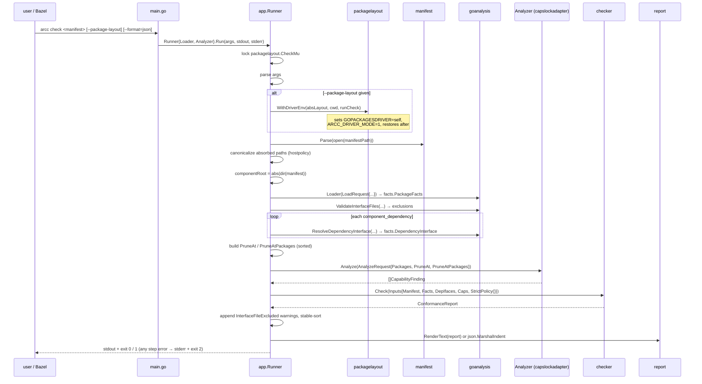
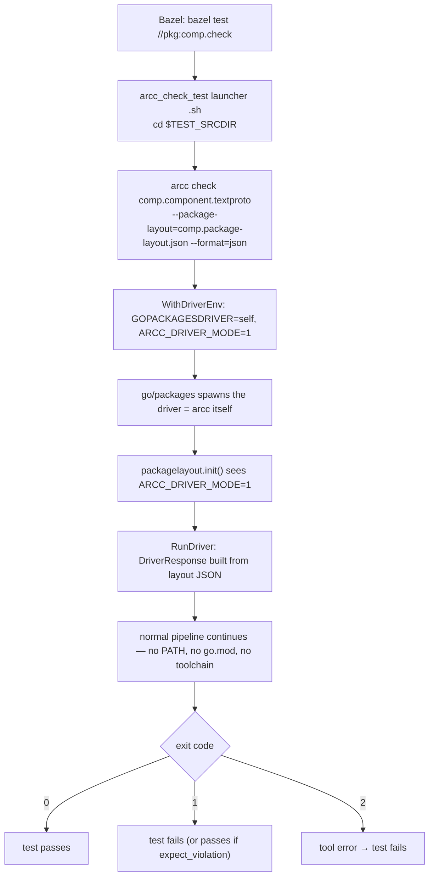
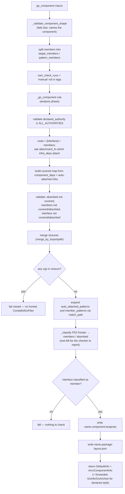
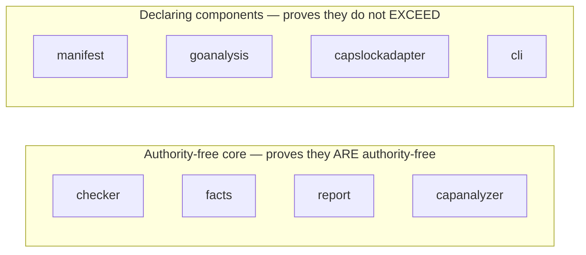

# Workflows

## 1. `arcc check` — the end-to-end pipeline



The eleven numbered steps in `runCheck`, in order:

1. Open and `manifest.Parse` the manifest file.
2. Canonicalize absorbed-dependency import paths via `hostpolicy.CanonicalizePath`.
3. Derive the component root: `abs(dir(clean(manifestPath)))`.
4. Load package facts via the injected `Loader`.
5. Validate interface files against build constraints → `[]InterfaceFileExclusion`.
6. Resolve each declared component dependency into a `facts.DependencyInterface` (opens the
   dependency's own manifest, verifies the `name` matches, derives its interface surface).
7. Build the pruning sets — per-symbol `PruneAt`, and `PruneAtPackages` for `PACKAGE_SURFACE`
   dependencies — sorted for determinism.
8. Run capability analysis via the injected `Analyzer` (skipped when no packages loaded).
9. `checker.Check` — the pure decision. Append exclusion warnings, stable-sort.
10. Render text or JSON.
11. Exit `1` if any violations, else `0`. Any error in steps 1–8 short-circuits to stderr and exit `2`.

## 2. Hermetic (layout-mode) checking



Sandboxed and cacheable: a green `bazel test` means the contract holds with no reliance on
the host Go toolchain. `layout_integration_test.go` proves the property by stripping `PATH`.

## 3. Building a component under Bazel



Shape validation rules enforced at macro time:

| Style | `interface` | `members` |
|---|---|---|
| declared (default) | **required** | literal target labels only — no `*?[]\` |
| `PACKAGE_SURFACE` | **forbidden** | **required**, patterns allowed |

Any other `interface_style` value is a `fail()`.

## 4. Development loop

```bash
just build            # go build ./... + bin/arcc
just test             # go test ./...
just test-integration # go test -tags=integration ./...
just lint             # go vet ./... && test -z "$(gofmt -l .)"
just fmt              # go fmt ./...
just selfcheck        # build arcc, check its own 8 manifests
just bazel-test       # bazel build //... && bazel test //... && 2 shell tests
just ci               # the pre-commit gate (see below)
```

`just ci` = `gen-is-clean → lint → build → test → test-integration → selfcheck → bazel-test`.

- `gen-is-clean` regenerates the protobuf Go code with `protoc` and asserts `jj diff` over
  `go/internal/manifest/gen/**/*.pb.go` is empty. It is scoped to the protoc outputs because
  `gen/` also holds a Gazelle-generated `BUILD.bazel` that `just gen` does not produce.
- If `protoc`/`protoc-gen-go` are not installed, run
  `just lint build test test-integration selfcheck` instead.
- `bazel-test` runs `members_label_validation_test.sh` and
  `component_shape_validation_test.sh` **outside** `bazel test`, because those scripts
  themselves spawn nested `bazel build` sub-processes. It fails loudly if Bazel is missing
  rather than skipping, so a CI environment meant to have Bazel cannot quietly pass a partial
  `just ci`.
- Regenerate `BUILD.bazel` files after adding or moving packages: `bazel run //:gazelle`.

## 5. Self-hosting verification



`just selfcheck` runs all eight natively. `bazel test //...` runs six of them hermetically:
`capslockadapter` and `cli` are excluded because capslock's closure contains
`golang.org/x/sys/unix` built with cgo, and the Bazel rule fails closed on cgo — one root
cause, two components.

Keeping both legs is deliberate rather than redundant: the native leg derives membership from
directories (FR1) and the Bazel leg from declared `members`, so checking the same components
two ways cross-checks the membership model itself. `self_manifest_parity_test` additionally
asserts the generated and checked-in manifests agree, so the two forms cannot drift.

The workaround of patching a third-party build file to claim a cgo package is not cgo is
deliberately not taken: buying a green check by falsifying build metadata is the exact failure
mode these checks exist to remove.

## 6. Authoring a new component

1. Put `component.textproto` at the component root.
2. Set `name`, and either `interface_files` (declared style) or
   `interface_style: INTERFACE_STYLE_PACKAGE_SURFACE` + `members`.
3. Decide membership: omit `members` for FR1 directory-based ownership, or list literal import
   paths. Component roots must be disjoint — no nesting one inside another.
4. For each package you reach outside the component, choose one:
   - another component → `component_dependencies { name, manifest }` (authority pruned)
   - an implementation detail → `absorbed_dependencies { import_path, reason }` (authority charged to you)
   - neither → you will get `UNDECLARED_DEPENDENCY`
5. List `declared_authority`, or leave it empty to claim ambient-authority-freedom.
6. Set `own_check_runs: true` if the check runs in the build; otherwise point
   `certification_reference` at where conformance is established.
7. Run `arcc check <manifest>` (from the Go module directory, so relative paths resolve).

Under Bazel the manifest is generated instead — write a `go_component` target and the rule
emits both the manifest and the layout.

## 7. Reproducing a violation (from the README)

Create a component that *absorbs* `csvfile` instead of declaring it as a component dependency;
the absorbed authority then bleeds into the absorbing component:

```
Violations:
- [UNDECLARED_AUTHORITY] use of undeclared authority "FILES" in package ".../absorbapp"
  Evidence:
    - .../absorbapp.Run at :0
    - .../csvfile.Read at main.go:10
    - os.ReadFile at csvfile.go:22
```

Exit code 1. This is the clearest single demonstration of what `component_dependencies` buys
you over `absorbed_dependencies`.

## 8. Release

Tag `vX.Y.Z[-suffix]` (or dispatch manually with a `tag` input). The workflow cross-compiles
four binaries on `ubuntu-latest` (`linux`/`darwin` × `amd64`/`arm64`, `-ldflags="-s -w"`),
attests build provenance for non-prerelease tags, and publishes them to a GitHub Release with
generated notes (`--prerelease` when the tag has a `-` suffix).

## 9. Repository conventions for contributors

- **VCS**: Jujutsu (`jj`). Prefer `jj new` + `jj squash` over `jj edit`. Do **not** use raw
  `git` to mutate repo state.
- **Workflow**: the `structured-spec-to-code` skills framework. Planning artifacts, task files
  and scratchpad notes live under `.agents/` (`planning/`, `tasks/`, `runs/`, `scratchpad/`,
  `summary/`).
- **Before every commit**: `just ci`.
- **GitHub**: agents authenticate with a limited-permission bot token
  (`gh-bot-token | gh auth login --with-token`); if operations still fail after a refresh, stop.
